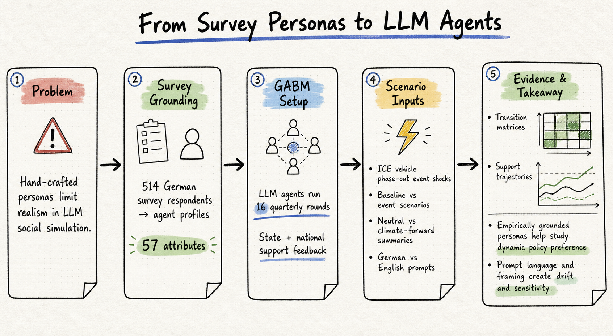
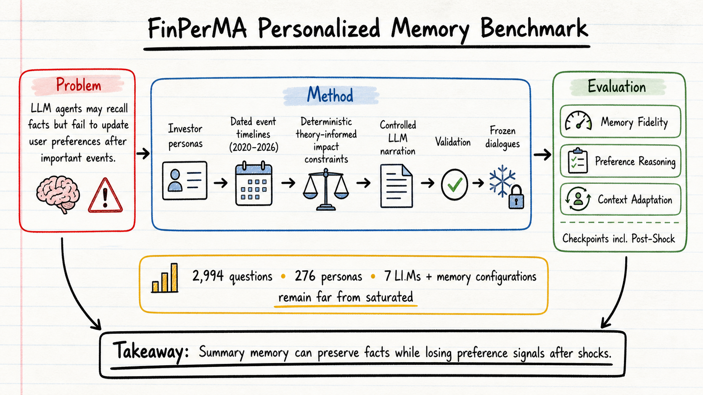

# DailyRead — 2026-08-22

今天三個 domain 都找到未被本地 paper memory 標記為已讀 / 已推薦的新候選。Silicon sampling 這邊是一篇把真實 survey respondents 轉成 LLM agents 的 mobility policy simulation；harness engineering 是 A2E 這種端到端 agent harness auditing engine；agent memory 則是 FinPerMA，把個人化長期記憶放到「事件衝擊後偏好是否真的更新」的金融情境裡測。

## 三個 domain headline

- **Silicon Sampling / Social Simulation**: From Survey Personas to LLM Agents 把 514 位德國問卷受訪者轉成 57 屬性的自然語言 persona，跑 16 個季度的 ICE 車輛退場政策偏好模擬；亮點是 survey-grounded persona，但結果也暴露 prompt language / framing 會造成很強的支持度漂移。
- **Harness Engineering**: A2E 把 benchmark、agent harness、OpenTelemetry span monitoring、trajectory / outcome evaluation 串成一個 auditing engine，重點不是再報一個成功率，而是讓 planning、tool use、latency、token、error recovery 都變成可比較的 harness 指標。
- **Agent Memory**: FinPerMA 用 2020–2026 金融事件、投資者 persona、Post-Shock checkpoint 來測 agent 是否把事件後的使用者偏好真正寫進長期記憶；結果顯示 full-context / summary memory 都遠未飽和，summary 還常丟掉偏好信號。

## 今日推薦點開

### 1. From Survey Personas to LLM Agents: A Generative Agent-based Simulation of Mobility Policy Preference Dynamics

- **Domain**: Silicon Sampling / Social Simulation
- **Link**: https://arxiv.org/abs/2608.07519
- **推薦理由**: 這篇值得點開，因為它不是再用手刻 persona 做漂亮的 social simulation，而是從 514 位真實德國 survey respondents 生成 LLM agents，讓 persona 直接帶著人口統計、政治傾向、移動行為、燃料經驗與氣候態度。它的實驗也很誠實地顯示：survey-grounded 不等於自然可信，16 輪模擬裡 prompt 語言與 summary framing 會把支持度推向不同漂移方向。對 silicon sampling 來說，這篇的價值在於把「persona grounding」和「simulation sensitivity」放在同一張桌上看。

### 2. A²E: An End-to-End Agent Auditing Engine

- **Domain**: Harness Engineering
- **Link**: https://arxiv.org/abs/2608.07346
- **推薦理由**: A2E 是今天 harness engineering 最值得點開的一篇，因為它正面處理 Morris 一直關心的問題：同一個 model 接上不同 harness，最後成功率差不多時，實際 agent loop 可能完全不同。它用 Agent Task Protocol 減少 benchmark × harness 的配對整合成本，再用 Monitor 層收 span-based traces，最後把 correctness、planning、tool use、runtime quality 放進 lifecycle-aligned evaluation。若要改進自己的 agent eval stack，優先看 ATP、Monitor Layer 和 Figure 1 / 7。

### 3. FinPerMA: A Theory-Informed, Event-Grounded Personalized-Memory Benchmark for LLM Agents

- **Domain**: Agent Memory
- **Link**: https://arxiv.org/abs/2608.04095
- **推薦理由**: FinPerMA 值得點開，因為它把 agent memory 從「記得使用者說過什麼」推到「重大事件後是否更新使用者模型」。它用金融顧問場景設計投資者 persona、2020–2026 事件 timeline、deterministic impact constraints、受控 LLM narration 和 frozen labels，最後用 Post-Shock checkpoint 專門抓 stale personalization。這篇和前幾天的 LeanMem / MEM1 形成互補：不是提出一個更便宜的 memory pipeline，而是提供更嚴格的 personalized memory 測法。

## 詳細 domain notes

- [Silicon Sampling / Social Simulation](../silicon-sampling-social-simulation/2026-08-22.md)
- [Harness Engineering](../harness-engineering/2026-08-22.md)
- [Agent Memory](../agent-memory/2026-08-22.md)
