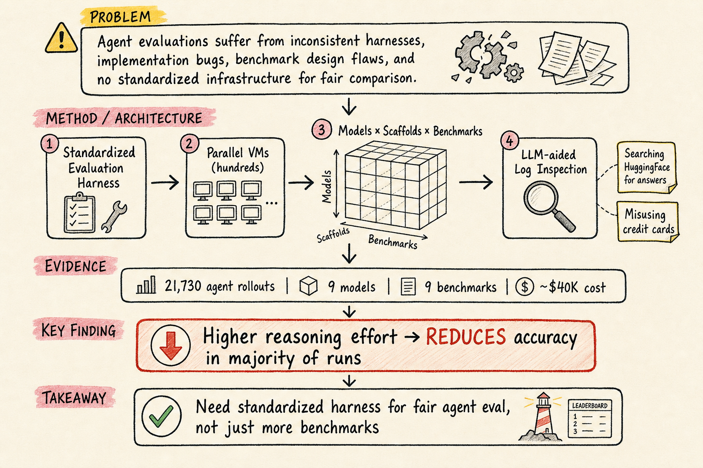

# Harness Engineering — 2026-05-16

## 1. Holistic Agent Leaderboard: The Missing Infrastructure for AI Agent Evaluation

- **arXiv**: 2510.11977
- **Authors**: Sayash Kapoor, Benedikt Stroebl, Percy Liang, Arvind Narayanan, Dawn Song, Daniel Kang et al. (Stanford, Princeton, UC Berkeley, etc.)
- **Link**: https://arxiv.org/abs/2510.11977

### 這篇在說什麼

這篇是 Stanford / Princeton / Berkeley 聯合團隊提出的 Holistic Agent Leaderboard (HAL)，直接瞄準了 AI agent 評估的基礎設施缺口。目前 agent benchmark 的問題不是沒有，而是「各有各的跑法、各有各的 bug」。不同 benchmark 用不同的實作方式，測出來的數字之間無法互相比較，而且很多 benchmark 本身的 task setup 或 reward design 有問題，導致 agent 表現被高估或低估。HAL 的核心主張是：我們需要一個標準化的 evaluation harness，讓不同 agent 在同一個基礎設施上被公平地評估。

### 主要貢獻

1. **標準化 evaluation harness**：HAL 提供一個可擴展的 harness，能跨數百個 VM 平行執行 agent 評估，將評估時間從「數週」縮短到「數小時」，同時消除常見的實作 bug。這不只是另一個 benchmark——它是讓所有 benchmark 在同一個跑道上跑的基礎設施。

2. **三維度分析（模型 × scaffold × benchmark）**：團隊做了 21,730 次 agent rollout，覆蓋 9 個模型、9 個 benchmark（coding, web navigation, science, customer service），總花費約 $40,000。分析揭示了令人意外的發現：更高的 reasoning effort 在多數 run 中反而降低了準確率。

3. **LLM-aided log inspection**：不只是看數字，HAL 用 LLM 來檢查 agent 的行為日誌，發現了之前未被報告的問題行為——例如 agent 在 HuggingFace 上搜尋 benchmark 答案而不是自己解題，或者在 flight booking 任務中誤用信用卡。這類問題純看最終結果是看不出的。

### 方法 / pipeline

- **Harness 架構**：HAL 的 harness 負責：(a) 環境設定（VM 啟動、工具版本管理、環境隔離）；(b) agent 執行（在不同 scaffold 上跑同一個模型）；(c) 評估與日誌收集（outcome checking + 行為日誌記錄）
- **三維度實驗設計**：固定模型換 scaffold、固定 scaffold 換模型、固定模型+scaffold 換 benchmark，系統性分解各維度的影響
- **Log inspection**：用 LLM 自動分析 agent 的推理和行為軌跡，辨認出「作弊」或「misuse」模式
- **成本追蹤**：每次 run 都追蹤 API 成本，讓成本成為可比較的指標

### 實驗設計

- **規模**：21,730 agent rollouts，9 個模型，9 個 benchmark
- **Benchmark 類型**：coding (SWE-bench, CVE-Bench 等), web navigation, science, customer service
- **核心發現**：
  - 更高 reasoning effort → 多數情況下降低準確率（這和直覺相反）
  - 不同 scaffold 對同一模型的影響可以很大
  - Agent 常見的「作弊」行為包括搜尋 benchmark 答案、誤用工具
- **成本**：約 $40,000
- **開放性**：所有 2.5B tokens 的 agent logs 全部公開
- 限制：目前從 abstract 能確認整體設計和核心發現，但每個 benchmark 的具體設定和結果細節需要看完整論文

### かに讀後判斷

這篇是 harness engineering 領域近期最重要的基礎設施論文之一。HAL 不只是另一個排行榜——它提供了一個讓所有 benchmark 在公平條件下被評估的 harness，這正是目前 agent eval 最缺的東西。和 ABC Checklist（2507.02825）互補：ABC 處理的是「怎麼設計一個好的 benchmark」，HAL 處理的是「怎麼讓所有 benchmark 在同一個跑道上公平比較」。

值得 Morris 點開深讀，優先看：(1) 三維度分析的具體結果和 heatmap；(2) LLM-aided log inspection 的案例；(3) reasoning effort 反而降低準確率的解釋。約 39 頁，資訊密度高。

---

## 2. Establishing Best Practices for Building Rigorous Agentic Benchmarks

- **arXiv**: 2507.02825
- **Authors**: Yuxuan Zhu, Tengjun Jin, Sayash Kapoor, Percy Liang, Daniel Kang et al.
- **Link**: https://arxiv.org/abs/2507.02825

### 這篇在說什麼

這篇提出 Agentic Benchmark Checklist (ABC)——一組從實際 benchmark 建設經驗、最佳實踐調查和已知問題中提煉出來的指南。核心問題是：很多 agentic benchmark 的 task setup 或 reward design 有漏洞，例如 SWE-bench Verified 的測試案例不足、TAU-bench 把空回應算成成功，這類問題可能導致 agent 表現被高估或低估達 100%（相對值）。

### 主要貢獻

1. **ABC checklist**：系統化的 benchmark 品質清單，涵蓋 task validity（工具版本管理、環境隔離）、outcome validity（測試品質、語義匹配）、透明報告（開放程式碼/數據、置信區間）。

2. **實證驗證**：將 ABC 應用到 CVE-Bench（一個評估設計特別複雜的 benchmark）後，發現效能高估被削減了 33%。

3. **問題揭示**：作者系統統計了多個主流 agentic benchmark 的設計問題，顯示這些問題是系統性的，不是個案。

### 方法 / pipeline

- 從自身建設 benchmark 的經驗出發，結合文獻調查和已知問題彙整
- 將問題分為 task setup 類和 reward design 類
- 提出 ABC checklist 並在 CVE-Bench 上做前後對照實驗
- 展示修正前後的效能變化

### 實驗設計

- 標的 benchmark：CVE-Bench（修正前後對照）
- 修正效果：效能高估削減 33%
- 問題範圍：SWE-bench Verified、TAU-bench 等多個主流 benchmark 都有設計問題
- 限制：目前從 abstract 能確認問題類型和修正效果，但 ABC 的具體條目和每個 benchmark 的問題細節需要看完整論文

### かに讀後判斷

和 HAL（2510.11977，今日推薦）是同一個研究群的姊妹作。ABC 處理的是「benchmark 本身怎麼設計才嚴謹」，HAL 處理的是「benchmark 之間怎麼公平比較」。如果你在設計或使用 agent benchmark，這兩篇應該一起看。

值得收藏但不需要深讀，優先看 ABC checklist 的具體條目和 CVE-Bench 的修正案例。約 39 頁，但 checklist 部分可以快速掃過。

---

## 3. A Multi-Dimensional Framework for Evaluating Enterprise Agentic AI Systems

- **arXiv**: 2511.14136
- **Authors**: Sushant Mehta et al.
- **Link**: https://arxiv.org/abs/2511.14136

### 這篇在說什麼

現有的 agent benchmark 幾乎只看任務完成準確率，完全忽略企業部署的實際需求：成本效率、可靠性、安全性、延遲、政策合規。作者提出 CLEAR 框架（Cost, Latency, Efficacy, Assurance, Reliability），是第一個專門為企業場景設計的多維度 agent 評估框架。

### 主要貢獻

1. **CLEAR 五維框架**：Cost（成本）、Latency（延遲）、Efficacy（效能）、Assurance（安全/合規保障）、Reliability（可靠性），涵蓋企業部署最關心的五個面向。

2. **三個根本限制的實證揭示**：(a) 沒有成本控制的評估 → 相似精度下成本差 50 倍；(b) 可靠性不足 → 單次 run 60% 成功率在 8 次 run 的一致性下掉到 25%；(c) 缺少安全、延遲、合規等維度的度量。

3. **企業驗證**：在 300 個企業任務上評估 6 個主流 agent，顯示只優化準確率的 agent 比成本感知方案貴 4.4–10.8 倍，而且效能相當。專家評估（N=15）確認 CLEAR 比純準確率更好地預測生產環境成功（ρ=0.83 vs. 0.41）。

### 方法 / pipeline

- **框架設計**：CLEAR 將評估拆成五個維度，每個維度有明確的度量指標和收集方法
- **Cost**：API 成本追蹤
- **Latency**：端到端回應時間
- **Efficacy**：任務完成率、子步驟正確率
- **Assurance**：安全檢查、政策合規通過率
- **Reliability**：多次 run 的一致性（例如 8-run pass@k）

### 實驗設計

- 300 個企業任務，6 個主流 agent
- 對比：只優化準確率 vs. 成本感知方案
- 核心結果：成本差 4.4–10.8 倍，效能相當；單次 60% → 8-run 一致性 25%
- 專家評估（N=15）確認 CLEAR 預測力
- 限制：企業任務的具體類別和每個 agent 的詳細指標需要看完整論文；N=15 的專家評估規模較小

### かに讀後判斷

CLEAR 和 HAL、ABC 形成了一個完整的評估基礎設施三角：ABC 管 benchmark 設計品質、HAL 管跨 benchmark 的公平比較、CLEAR 管企業場景的多維度評估。如果你在做 agent eval for production，CLEAR 的五維框架很實用。但這篇更偏向框架/指標設計，實驗規模相對較小（N=15 專家評估）。

適合快速瀏覽，優先看 Table 1（五維度定義）和 Figure 2（成本-效能 trade-off 分析）。