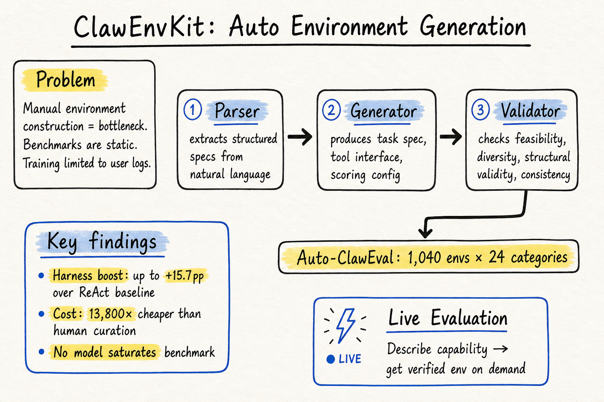

# Harness Engineering — 2026-05-17

## 1. ClawEnvKit: Automatic Environment Generation for Claw-Like Agents

- **arXiv**: 2604.18543
- **Link**: https://arxiv.org/abs/2604.18543
- **Authors**: University of Maryland, Arena, UC Berkeley, UCLA, MBZUAI
- **Date**: v1 2026-04-29, v3 updated

### 這篇在說什麼

這篇直接對準 harness engineering 領域的核心瓶頸：agent 評估環境的建構。目前不管是訓練還是評估 claw-like agent（像 OpenClaw、NanoClaw、IronClaw 這類可以在終端環境中自主執行多步操作的 agent），環境都是手動建的——要嘛從真實使用者行為收集（如 OpenClaw-RL），要嘛花幾百小時人力策展（如 Claw-Eval、SkillsBench）。一旦建成就是靜態的，跟不上 agent 能力的快速演進。ClawEnvKit 的核心主張是：我們需要的不是另一個 dataset，而是一條自動化的 pipeline，可以從自然語言描述按需產生多樣化、經過驗證的環境。

### 主要貢獻

1. **ClawEnvKit Pipeline**：三模組自動化環境生成——Parser（從自然語言提取結構化規格）、Generator（產生 task specification、tool interface、scoring configuration）、Validator（檢查可行性、多樣性、結構有效性和內部一致性）。這把環境建構從人力密集變成自動化。
2. **Auto-ClawEval Benchmark**：用 ClawEnvKit 自動產生 1,040 個環境橫跨 24 個語意類別，是第一個大規模 cross-harness 評估基準。同時有 Auto-ClawEval-Mini（104 task）做品質對照。
3. **Harness Engineering 效能量化**：跨 4 個模型家族和 8 個 agent harness 框架的實驗，發現 harness engineering 可以帶來最高 15.7 個百分點的效能提升。這是目前 harness 領域少見的大規模量化證據。
4. **成本效益**：自動產生的環境在連貫性和清晰度上匹配甚至超越人工策展環境，成本降低 13,800 倍。
5. **Live Evaluation 概念**：使用者用自然語言描述想要評估的能力，系統按需產生驗證過的環境，把評估變成一個持續、使用者驅動的過程。

### 方法 / pipeline

ClawEnvKit 的三模組 pipeline：

1. **Parser**：接收自然語言描述，提取結構化生成參數（環境類型、工具需求、評分標準等）
2. **Generator**：根據結構化參數，產生：
   - Task specification（任務描述、初始狀態）
   - Tool interface（mock 服務的 API 定義）
   - Scoring configuration（自動驗證腳本）
3. **Validator**：四維度檢查——feasibility（可執行）、diversity（與已有環境不同）、structural validity（結構完整）、internal consistency（邏輯自洽）

每個產生的環境都是獨立沙盒，支援 OpenClaw、NanoClaw、IronClaw 等各種 claw-like agent 的 harness。

### 實驗設計

- **環境品質比較**：Auto-ClawEval-Mini（104 task）與 Claw-Eval 人工策展環境一對一比較，自動產生的環境在所有品質維度上匹配或超越
- **Cross-harness 評估**：4 模型家族 × 8 harness 框架，全面測量 harness 的影響
- **關鍵發現**：
  - Harness engineering 帶來 0–15.7pp 效能提升（相較 bare ReAct baseline）
  - Completion（能否完成任務）是主要變異軸，沒有任何模型飽和 benchmark
  - Auto-ClawEval 與 Auto-ClawEval-Mini 的分數差 < 2%，驗證自動產生的品質穩定
- **成本分析**：自動產生環境的成本是人力的 1/13,800

### かに讀後判斷

這篇是 DailyRead 追蹤 harness engineering 以來最直接相關的一篇。它不只是提出了一個 benchmark，而是提出了整個環境生成的方法論——這和之前讀過的 HarnessBench、SkillsBench、Demystifying Evals 等形成了一個完整的故事線：從「為什麼 harness 重要」到「如何系統化地評估 harness」到「如何自動化地產生評估環境」。

值得 Morris 點開：
- Figure 1 的 pipeline 總覽
- Table of harness engineering 效能影響的量化數據
- Section 5 的 cross-harness 實驗結果
- Live evaluation 的設計（Section 6）

這篇和 2026-05-14 的 HarnessBench 有互補關係：HarnessBench 提供了評估 harness 的基準，ClawEnvKit 則把環境生成自動化，兩者結合就是 harness engineering 的完整評估 + 生成迴路。