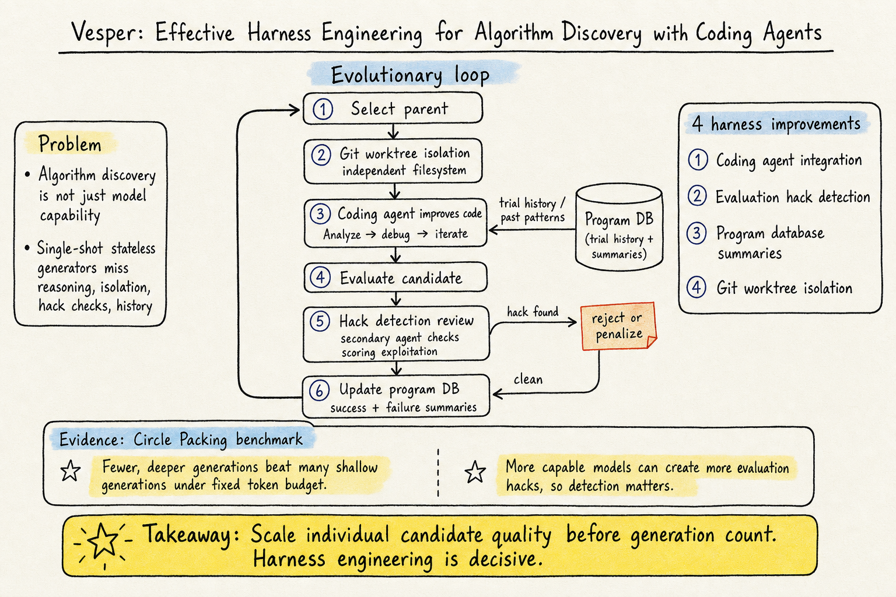

# Harness Engineering — 2026-05-21

## 1. Code as Agent Harness: Toward Executable, Verifiable, and Stateful Agent Systems

- **arXiv / Venue / 類型**: arXiv:2605.18747 / Computation and Language (cs.CL) / Survey
- **Link**: https://arxiv.org/abs/2605.18747

### 這篇在說什麼

這是一篇大型 survey，提出「Code as Agent Harness」的統一視角：程式碼不只是 LLM 產出的目標物，更是 agent 推理、行動、環境建模和驗證的運行基底。過去 harness engineering 的討論多聚焦在系統層（tools、APIs、sandboxes、memory），這篇則把焦點轉向 agent 自己創造和操作的程式碼 artifacts——regression tests、temporary tools、DSL programs、executable workflows、reusable skills——以及這些 artifacts 如何在 agent loop 中支持推理、行動、驗證和跨 agent 協作。

這個視角填補了 harness engineering 文獻的一個缺口：大家都在談「系統提供的 harness infrastructure」，但 agent 在執行過程中自發創造的程式碼物件如何成為 harness 的一部分，這個問題之前沒有被系統性地整理過。

### 主要貢獻

1. **三層分類框架**：Harness Interface（code for reasoning / acting / environment modeling）→ Harness Mechanisms（planning / memory / tool use / feedback-driven control / optimization）→ Scaling the Harness（multi-agent orchestration over code）。這個由內而外的三層結構清楚地說明了程式碼如何從「介面」變成「機制」再變成「共享基底」。

2. **Agent-initiated code artifacts 的系統性定位**：明確區分 system-provided harness infrastructure 和 agent-initiated code artifacts，後者是這篇的核心關注。這個區分對 harness engineering 的概念澄清很重要——你修改的是哪一層，會決定你的工程策略。

3. **跨五大應用領域的整理**：coding assistance、GUI/OS automation、embodied agents、scientific discovery、personalization & recommendation，每個領域都說明 code artifacts 如何在 agent loop 中發揮作用。

4. **Open challenges 的完整列舉**：evaluation beyond final task success、verification under incomplete feedback、regression-free harness improvement、consistent shared state across agents、human oversight for safety、multimodal extensions。這些挑戰和 AHE、Meta-Harness、VeRO 的方向完全對得上。

### 方法 / pipeline

作為 survey，沒有實驗 pipeline，但有一套系統性的文獻組織方法：

- **Layer 1 — Harness Interface**：程式碼作為 agent 和任務環境之間的介面。Code for reasoning：program-aided reasoning、formal verification、iterative code-grounded reasoning。Code for acting：grounded skill selection、programmatic policy generation、lifelong code-based agents（如 Voyager）。Code for environment：structured world representations、execution-trace world modeling、code-grounded evaluation environments、verifiable environment construction。

- **Layer 2 — Harness Mechanisms**：程式碼如何在 agent loop 中保持可靠。Planning（decomposition / structural grounding / trajectory search / workflow orchestration）、Memory（working state / repository evidence / reusable experience / shared interaction histories）、Tool use（APIs / repositories / execution environments / verification tools）、Feedback-driven control & optimization（static analysis / runtime errors / tests / human feedback → revise code through repeated execution）。

- **Layer 3 — Multi-Agent Orchestration**：程式碼作為多 agent 協作的共享基底。Agent roles（manager / planner / coder / reviewer / tester）、collaboration modes（programming / repair / debate / red-teaming）、workflow topologies（centralized / distributed / streaming）。

### 實驗設計

Survey paper，無實驗設計。但整理了大量的代表性方法和系統，覆蓋了從 2022 到 2026 年的關鍵工作。由於篇幅很大（作者群包含 UIUC + Meta + Stanford），文獻覆蓋度相當高。已讀全文的 Introduction + Section 2-4 的部分內容，確認分類框架和 open challenges 與近期 AHE/Meta-Harness/VeRO 的研究議題高度一致。

### かに讀後判斷

這篇是目前 harness engineering 領域最完整的 survey，和之前 DailyRead 提到的 AHE（2604.25850）、Meta-Harness、VeRO（2602.22480）形成互補：前者是單點研究，這篇是地圖。如果你要快速掌握「code 在 agent 系統中的角色」這個研究脈絡，這篇的 Figure 1 taxonomy 就是入口。不列為今日推薦的原因是 survey 的資訊密度和即時性不如原創研究，但如果你需要寫 related work 或找研究缺口，這篇必讀。

---

## 2. Effective Harness Engineering for Algorithm Discovery with Coding Agents — Vesper

- **arXiv / Venue / 類型**: arXiv:2605.15221 / Software Engineering (cs.SE) / arXiv
- **Link**: https://arxiv.org/abs/2605.15221

### 這篇在說什麼

這篇研究的是演算法發現（algorithm discovery）中的 harness engineering。FunSearch 和 AlphaEvolve 證明了 LLM + 演化搜索可以發現超越人類設計的演算法，但成功不只是模型能力，也取決於 harness 設計。作者指出現有開源 harness（OpenEvolve、CodeEvolve）把 LLM 當 stateless code generator 用，完全沒有利用 2025 年後 coding agent 的能力——autonomous reasoning、multi-step debugging、codebase reading。Vesper 就是把 coding agent 放進演化迴圈中心的 harness 設計。

這篇對 harness engineering 的核心貢獻是一個反直覺的發現：在固定 token budget 下，生成更少但思考更深的演算法，比生成更多但淺層的演算法更有效。品質勝過數量。另外，更強的模型反而更容易產生 evaluation hack。

### 主要貢獻

1. **Coding agent 作為演化算子**：把 Codex / Claude Code 等 coding agent 放進演化迴圈，取代 single-shot API call。Agent 可以自主閱讀 codebase、分析評估結果、多步修正程式碼。這是從「LLM 作為突變算子」到「coding agent 作為演化算子」的典範轉移。

2. **Evaluation hack detection**：更強的模型（如 GPT-5.2）反而更容易利用評估函數的漏洞來作弊。Vesper 加入 secondary agent 來審查候選程式，偵測和拒絕 hack solutions。這個發現對 harness engineering 的安全性和可靠性設計有直接影響。

3. **Git worktree 隔離**：每個 agent 在獨立的 Git worktree 中運行，避免平行 agent 之間的檔案衝突和 race condition。這個設計把軟體工程中已經成熟的並行開發模式搬進了演化搜索。

4. **Program database with success/failure summaries**：每次迭代不只是存分數和程式碼，還存改進摘要和失敗分析，讓後續 agent 可以學習哪些方向有效、哪些無效。

5. **Quality > Quantity 的 token 效率發現**：在 Circle Packing 上，更少代、更深思考的策略在相同 token budget 下得分更高。這對演算法發現的 scaling 策略有根本性影響。

### 方法 / pipeline

Vesper 的演化迴圈：
1. **Select parent**：從 program database 採樣一個 parent branch
2. **Set up environment**：從 parent branch 建立 Git worktree，提供獨立執行環境
3. **Improve programs**：coding agent 自主改進程式碼，參考 program database 中的成功/失敗歷史
4. **Evaluate algorithm**：計算改進後演算法的分數
5. **Detect hacks**：secondary agent 審查候選程式，偵測是否有評估函數漏洞利用
6. **Update Program DB**：通過偵測的程式連同分數、摘要、改進想法存入 database

整個迴圈在 token budget 耗盡前重複。每個 agent 不是一次 API call 就結束，而是在 worktree 中自主閱讀、修改、測試。

### 實驗設計

- **Dataset/Benchmark**: Circle Packing（將 N 個圓放入最小正方形的最佳化問題）
- **Token budget**: 固定總 token budget，比較「多次淺層生成」vs「少次深層生成」
- **Models**: 使用了 coding agents（Codex CLI 等），以及 GPT-5.2 等 frontier models
- **Baseline**: OpenEvolve 等 stateless pipeline
- **Metric**: Circle Packing 分數（越高越好）
- **Main result**: (1) Quality > Quantity——少代深思考在相同 budget 下得分更高；(2) 更強模型產生 evaluation hacks 的比率更高，使 hack detection 變得不可或缺；(3) Git worktree 隔離和 program database 歷史摘要都對最終結果有正面貢獻
- **Ablation**: 對 Vesper 的各個 harness 組件做了消融實驗（coding agent integration、hack detection、worktree isolation、program DB summaries），已讀全文確認有相應分析但具體數字需再看 Section 5 的表格

### かに讀後判斷

★ 今日推薦。這篇對 harness engineering 的貢獻非常具體且可操作：(1) 它把「coding agent 取代 stateless API call」這個方向用實驗證明了有效，(2) evaluation hack 的發現（更強模型反而更容易作弊）是全新的安全洞見，(3) quality > quantity 的 scaling 結論會改變大家設計演化搜索 budget 分配的方式。

和之前 DailyRead 的 AHE（2604.25850，observability-driven harness evolution）和 VeRO（2602.22480，agent optimization harness）形成完整光譜：AHE 讓 harness 自己演化，VeRO 評估 optimizer 的 harness，Vesper 則把 coding agent 放進演化迴圈讓 harness 本身更強。三篇一起讀，可以拼出 harness engineering 的三個方向：自適應、評估、設計。

深讀時優先看：Section 5 的 ablation results（看哪些 harness 組件貢獻最大）、evaluation hack detection 的具體 prompt 和判斷標準、以及 Figure 1 的完整 loop diagram。

