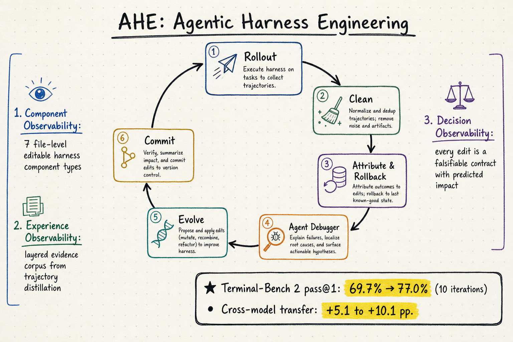

# Harness Engineering — 2026-05-24

## 1. AHE: Agentic Harness Engineering — Observability-Driven Automatic Evolution of Coding-Agent Harnesses

- **arXiv**: 2604.25850
- **Link**: https://arxiv.org/abs/2604.25850
- **Authors**: Jiahang Lin, Shichun Liu, Chengjun Pan, Lizhi Lin, Shihan Dou, Xuanjing Huang, Hang Yan, Zhenhua Han, Tao Gui (Fudan, PKU, Qiji Zhifeng)
- **Code**: https://github.com/china-qijizhifeng/agentic-harness-engineering

### 這篇在說什麼

Coding agent 的表現不只取決於底層模型，harness（系統 prompt、工具、middleware、skill、sub-agent config、長期記憶）的設計影響巨大。但 harness 迭代目前靠人工調校：看軌跡、找失敗模式、手動改 prompt 和工具。這不僅貴且難規模化。AHE 的核心洞察是：harness 演化的瓶頸不是 agent 能力，而是可觀測性（observability）。一旦演化 agent 能看到結構化的行動空間與後果回饋，它就能穩定收斂到更好的 harness 設計。

AHE 把 harness 演化變成一個閉環：由一個 Evolve Agent 自動修改 harness 的七種可編輯元件，每次修改附帶自我預測（「改了什麼、預期效果是什麼」），下一輪用任務結果驗證預測，驗證不通過的自動回滾。三層可觀測性支柱（component / experience / decision）讓整個過程可追溯、可歸因、可回滾。

### 主要貢獻

1. **三層可觀測性框架**：
   - **Component observability**：harness 的七種元件（system prompt, tool description, tool implementation, middleware, skill, sub-agent config, long-term memory）各自是獨立檔案，每次修改對應一個 git commit，失敗模式精確映射到單一元件類別。
   - **Experience observability**：Agent Debugger 把百萬 token 的原始軌跡蒸餾成分層、可 drill-down 的證據語料庫，讓 Evolve Agent 消費結構化根因分析而非原始 log。
   - **Decision observability**：每次修改附帶 change manifest（故障證據、推斷根因、修復方案、預測影響），下一輪用任務層級結果驗證，不兌現的自動回滾。

2. **閉環演化算法**：Rollout → Clean → Attribute（驗證上一輪 manifest）→ Rollback → Agent Debugger（蒸餾軌跡）→ Evolve（修改 harness）→ Commit。每輪 k≥2 rollouts per task，產生穩定的 pass@1 訊號。

3. **轉移性驗證**：在 Terminal-Bench 2上演化的 harness（從 69.7% 到 77.0%），不做進一步演化直接轉移到 SWE-bench-verified（12% fewer tokens, comparable success）和三個不同模型家族（+5.1 到 +10.1 pp），說明演化出的元件編碼的是通用工程經驗而非 benchmark-specific tuning。

4. **元件消融**：Tools、middleware、long-term memory 各自獨立帶來改善；system prompt 單獨反而退步——「事實性 harness 結構可以跨任務和模型轉移，但 prose-level 策略不行」。

### 方法 / pipeline

**NexAU 解耦 harness 基底**：七種元件類型以獨立檔案掛載在固定 mount points，新增 middleware 不需要改 system prompt，新增 skill 不需要改 tool。種子 harness H_0 極簡：單一 shell 工具，無 middleware/skill/sub-agent，迫使每個新增元件都得在 rollouts 中證明自己的價值。

**Agent Debugger**：每個軌跡訊息存成獨立檔案，debugger agent 用 shell 工具在這個檔案環境中探索，產生 per-task 分析報告，再彙整為 benchmark-level overview。支援 progressive disclosure：先看概要，需要時 drill down 到特定訊息。

**Evolve Agent**：讀取 Agent Debugger 的分層報告，決定增刪改哪些元件。兩大約束：
1. 只能寫 harness workspace（不能改 model config 或 verifier），確保每次改善都歸因到 harness。
2. 每次修改必須附帶 manifest entry（故障證據 → 推斷根因 → 修復 → 預測影響），下一輪的 Attribute 階段會核對預測與實際結果，不符的自動回滾。

### 實驗設計

- **主基準**：Terminal-Bench 2（89 tasks，4 easy / 55 medium / 30 hard，1hr timeout）。
- **結果**：10 輪 AHE 把 pass@1 從 69.7%（seed）提升到 77.0%，超越 Codex-CLI（71.9%）和自動化基線 ACE / TF-GRPO。
- **轉移**：
  - SWE-bench-verified：凍結 harness 直接跑，12% 更少 token，成功率可比。
  - 三個不同模型家族：+5.1 到 +10.1 pp，越弱的模型增益越大。
- **消融**：去除 Agent Debugger（只用原始 log）效能掉最多；去除 change manifest（不做預測驗證）次之；去除 component decoupling（合併成一個大 prompt）也顯著下降。

### かに讀後判斷

AHE 是 harness engineering 領域目前最完整的自動化演化框架，和前幾天讀過的 Vesper（Effective Harness Engineering for Algorithm Discovery，mentioned 2026-05-21）及 Code as Agent Harness（mentioned 2026-05-21）形成有趣的對照：

- Vesper 針對單一演算法發現任務，手動設計了 harness 的各個層次（coding agent 整合、evaluation hack 偵測、Git worktree 隔離），是工程技法的集合。
- Code as Agent Harness 把 code 視為 harness 的基本操作基底，提出了分層架構（harness interface / harness mechanisms / scaling），是概念框架。
- AHE 則把整個演化過程自動化，核心創新是三層可觀測性讓 agent 能穩定地、可回溯地改善 harness。

三篇合在一起讀，可以看到 harness engineering 從「手動技藝」→「概念框架」→「自動化演化」的進展。AHE 的元件消融結果特別值得深讀：system prompt 單獨退步，tools/middleware/memory 各自帶增益——這暗示 harness 的結構性元件（工具介面、中介軟體邏輯、記憶管理）比敘事性指令更有轉移價值。

值得 Morris 點開深讀，優先看 Algorithm 1（完整演化迴圈）、Section 4.3（元件消融分析）、Table 2（跨模型轉移結果）。

---

## 2. RoadmapBench: Evaluating Long-Horizon Agentic Software Development Across Version Upgrades

- **arXiv**: 2605.15846
- **Link**: https://arxiv.org/abs/2605.15846

### 這篇在說什麼

現有 coding agent 基準（SWE-bench、HumanEval 等）主要集中在單一 issue 修復，oracle patch 通常只有 33-100 行。但真實軟體開發是長視野、多目標的版本迭代：一個版本升級可能涉及 3700 行、51 個檔案的修改。RoadmapBench 填補這個缺口：115 個任務，來自 17 個真實開源專案的版本升級，每個任務包含多個子目標（中位數 5 個），測試 agent 能否在多目標、跨檔案的長視野開發中協調工作。

### 主要貢獻

1. **長視野、多目標基準**：115 個版本升級任務，17 個 repo、5 種語言，oracle patch 中位數 3700 行 / 51 檔案。
2. **多目標評分**：每個子目標有獨立測試和權重，產生連續的 Completion Score 而非二元 resolved/unresolved，捕捉部分進展。
3. **嚴格品管管線**：Repository mining → Task construction → Static validation → Rollout-based quality control，三層能力梯隊的 agent 測試分離任務缺陷與模型限制。
4. **震撼結果**：最強模型 Claude-Opus-4.7 只解決 39.1%，最弱 5.2%，與 SWE-bench 80%+ 形成鮮明對比。

### 方法 / pipeline

- **任務定義**：給定 source version 的 repo snapshot + 多目標 roadmap instruction（說要做什麼但不說怎麼做），在 Docker 環境中實作 target version 的功能。
- **評分**：每個子目標有自適應權重（反映實作複雜度），Completion Score = 加權子目標通過率。
- **品管**：(1) 靜態驗證（specification 自含、source traceability、test validity）；(2) 三梯隊模型 rollout，分離 task-side defects 與 model-side limitations；(3) 迭代修復確認問題。

### 實驗設計

- 13 個 frontier models（Claude Opus 4.7/4.6, GPT-5.4, Gemini-3.1-Pro, DeepSeek-V4-Pro, GLM-5.1, Kimi-K2.6/K2.5, Mimo-V2.5-Pro, Qwen3.6-Plus, Qwen3.5-397B, MiniMax-M2.7, Seed-2.0-Pro）。
- 兩個 agent scaffold：OpenHands 和 Terminus 2。
- 每個任務 2 小時 wall-clock budget。
- 結果：Resolved rate 5.2%（Seed-2.0-Pro）到 39.1%（Claude-Opus-4.7）。Completion Score 揭示 models 經常完成多個子目標後在整合邊界停滯。
- 語言差異：Python 任務表現最好，Rust 最差。

### かに讀後判斷

RoadmapBench 把 coding agent 評估推向了真實工程規模。和 AHE 的關聯：AHE 的演化結果在 SWE-bench-verified 上驗證轉移性，而 RoadmapBench 指出 SWE-bench 80%+ 的成績其實掩蓋了長視野開發的困難——在最嚴格的長視野基準上，最好的模型也只解決 39%。這意味 harness engineering 的改善空間很大，而 AHE 的方法可能在 RoadmapBench 這種多目標設定下有更大價值（因為 multi-target 正好需要 harness 結構來協調）。

建議 Morris 點開看 Table 1（與現有基準的比較）、Figure 3（任務分佈和 patch size），以及 Appendix 的品管管線細節。

**（全文 HTML 已讀）**