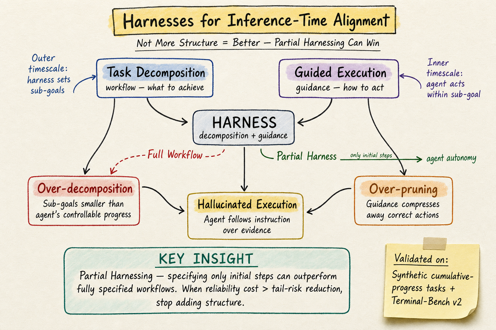

# Harness Engineering — 2026-05-26

## 1. Harnesses for Inference-Time Alignment over Execution Trajectories

- **arXiv**: 2605.21516
- **Link**: https://arxiv.org/abs/2605.21516
- **Authors**: Boyuan Wang, Bochao Li, Minghan Wang, Yuxin Tao, Fang Kong (Southern University of Science and Technology)
- **Submitted**: 2026-05-15

### 這篇在說什麼

Harness engineering 已經成為 LLM agent 的重要推論時技術，但「愈複雜的 harness 愈好」這個直覺是錯的——增加分解或引導有時反而降低最終任務成功率。本文從推論時軌跡對齊（inference-time trajectory alignment）的視角研究 harness 設計，把 harness 拆解為兩個機制：task decomposition（把任務切成子目標）和 guided execution（在執行過程中偏置行動分佈），然後量化分解粒度、重試預算、引導強度如何影響效能極限。

更反直覺的是，本文提出 **Partial Harnessing**——只指定前幾步，剩下的讓 agent 自己完成——實驗顯示 partial harness 可以超越 fully specified workflow。這和 DailyRead 之前追蹤的 harness 論文（2605.12239 Categorical Architecture、2605.18747 Code as Harness、2605.15221 Effective Harness Engineering for Algorithm Discovery）形成一個重要對話：前幾篇在說 harness 應該更完整、更結構化，這篇在說「有時候少即是多」。

### 主要貢獻

1. **Harness 的推論時對齊框架**：將 harness 分解為 workflow（子目標序列）和 guidance（行動分佈偏置），用兩個時間尺度（外層 harness 決定「下一步做什麼」、內層 agent 決定「怎麼做每一步」）來建模 harness 如何影響執行軌跡。這不是純實證觀察，而是有數學形式化的分析。
2. **三種 harness 失敗模式**：over-decomposition（過度分解讓子目標比 agent 可控進度還小）、over-pruning（過強引導壓縮掉正確行動）、hallucinated execution（引導讓 agent 服從指令而非任務證據）。
3. **Partial Harnessing 原則**：當 harness 的可靠性成本超過尾風險降低時，就該停止加結構。形式化為邊際停止規則。實驗在 Terminal-Bench v2 上驗證：只指定前幾步的 partial harness 比 full workflow 有更高通過率。

### 方法 / pipeline

理論建模採用兩時間尺度框架：
- **外層（harness 時間尺度）**：harness 參數 h = (κ, λ, ψ)，其中 κ 控制分解粒度（子目標數量和細度），λ 控制引導強度，ψ 指定局部引導規則。κ 作用於外層，把任務 x 分解為子目標序列 Δ_h(x) = (g₁, ..., g_T)。
- **內層（agent 時間尺度）**：在每個子目標 gₜ 下，agent 生成軌跡 τₜ。引導 ψ 對行動分佈施加偏置，形成 Q_{t,λ}(aₜ,ⱼ | Hₜ,ⱼ)。

效能分析的核心洞察：
- 分解粒度 κ 的最優值取決於 agent 的可控進度尺度（controllable progress scale）。如果子目標比可控進度還小，就會 over-decompose。
- 引導 ψ 只在「偏置方向與任務證據一致」時有幫助。當引導方向偏離證據時，會造成 hallucinated execution——agent 服從指令而非遵循證據。

Partial Harnessing 的實現：只提供前 k 個子目標，後面留給 agent 自由執行。邊際停止條件：當第 k 個子目標的可靠性成本（probability of deviation × cost of deviation）超過其帶來的尾風險降低時，就停止。

### 實驗設計

- **合成實驗**：controlled cumulative-progress tasks，可以精確控制分解粒度和引導強度。
- **真實基準**：Terminal-Bench v2（終端機環境的 agent 基準）。
- **主要發現**：
  - Over-decomposition：過細的分解降低通過率。
  - Over-pruning：過強的引導壓縮掉正確路徑。
  - Hallucinated execution：引導讓 agent 服從指令而非觀察任務證據。
  - Partial Harnessing 在 Terminal-Bench v2 上超越 full workflow。

消融分析控制了 κ 和 λ 的不同組合，顯示效能隨分解粒度呈現倒 U 形曲線。

### かに讀後判斷

這篇是 DailyRead 追蹤的 harness engineering 系列中理論貢獻最強的一篇。之前 2605.12239（Categorical Architecture）提供了分類學框架，2605.13357（AI Harness Engineering）提供了元件清單和 H0-H3 階梯，而這篇提供了效能分析的數學基礎和反直覺的設計原則。Partial Harnessing 是一個重要的工程洞察：在實務上，很多 production harness 其實已經是 partial 的（只定義了開頭幾步），只是沒有人明確說這比 full workflow 更好。

三種失敗模式（over-decomposition、over-pruning、hallucinated execution）也很有用——它們給了 harness designer 具體的診斷語言，而不只是說「harness 很重要」。

值得深讀的部分：Section 3 的理論形式化、Section 4 的合成實驗設計（如何控制可控進度尺度）、Terminal-Bench v2 上的 partial vs. full 比較。**今日推薦點開。**

---

## 2. AI Harness Engineering: A Runtime Substrate for Foundation-Model Software Agents

- **arXiv**: 2605.13357
- **Link**: https://arxiv.org/abs/2605.13357
- **Authors**: Hailin Zhong, Shengxin Zhu (Hong Kong Baptist University / Beijing Normal University)
- **Submitted**: 2026-05-13

### 這篇在說什麼

軟體工程 agent 的不可靠性通常被歸因於模型能力不足，但本文提出不同診斷：軟體工程能力是 model–harness–environment 系統的湧現性質，而非模型單獨的性質。Harness（執行基底）是介於模型和環境之間的運行時層，管理上下文選擇、工具存取、專案記憶、任務狀態、可觀測性、失敗歸因、驗證、權限等。本文將這個運行時層正式化為 AI Harness Engineering，定義其 11 個元件職責、五項設計原則、四級階梯（H0-H3），並提出 trace-based 評估協議。

### 主要貢獻

1. **AI Harness Engineering 作為研究對象**：區別於 agent-computer interface、agent framework、agent OS，harness 是一個獨立的研究對象——管理模型與環境之間的運行時中介層。
2. **11 個元件職責**：task specification、context selection、tool access、project memory、task state、observability、failure attribution、verification、permissions、entropy auditing、intervention recording。
3. **H0-H3 四級階梯**：逐步暴露運行時支援給 agent，讓 harness 的貢獻可從模型貢獻中分離。H0（bare minimum）→ H1（+context and tools）→ H2（+memory and verification）→ H3（full harness with all 11 components）。
4. **Trace-based 評估協議**：將每次 agent run 轉為可審計的 episode package，記錄 8 類執行證據（action、tool、context、verification、failure attribution、intervention、entropy、outcome），以驗證自主性而非任務成功率來評判。

### 方法 / pipeline

本文的核心是概念框架而非演算法。框架的邏輯：

1. **系統能力公式**：C_system = F(C_model, C_harness, C_environment, T)——軟體工程能力是模型、harness、環境、任務分佈的函數。
2. **元件職責清單**：11 個元件是根據「當人類開發者做這些事時，agent 需要什麼運行時支援」推導出來的。
3. **H0-H3 階梯**：不是評分標準，而是受控消融工具——逐步加入運行時支援，觀察效能變化。
4. **Episode package**：每次 run 的完整執行軌跡，包含 8 類證據。不同 harness 級別產生不同結構的 episode package：低級別只有最終 patch，高級別有 reproduction log、failure attribution、requirement-level verification report。

### 實驗設計

- **驗證任務**：受控的軟體工程任務（具體內容需見 PDF），不是大規模基準測試。
- **主要發現**：不同 harness 級別產生結構性不同的 episode package——H0 只有最終 patch，H3 有完整的 reproduction log、failure attribution、需求級驗證報告。
- **目前限制**：驗證是在單一受控任務上進行的，尚未在 SWE-bench 或 Terminal-Bench 等大型基準上測試。

### かに讀後判斷

這篇和 2605.21516（Inference-Time Alignment）是同一週的互補論文：Inference-Time Alignment 用數學分析 harness 的效能極限，AI Harness Engineering 用概念框架列出 harness 的元件職責。兩篇合在一起，harness engineering 就有了「要做什麼」（11 components + H0-H3）和「做多少」（partial harnessing + 失敗模式）的答案。

但這篇目前只從 HTML 前段確認了框架設計和驗證邏輯，大規模實驗結果和與 SWE-bench 的比較需見 PDF。建議作為一般收錄篇，和 2605.21516 搭配閱讀。