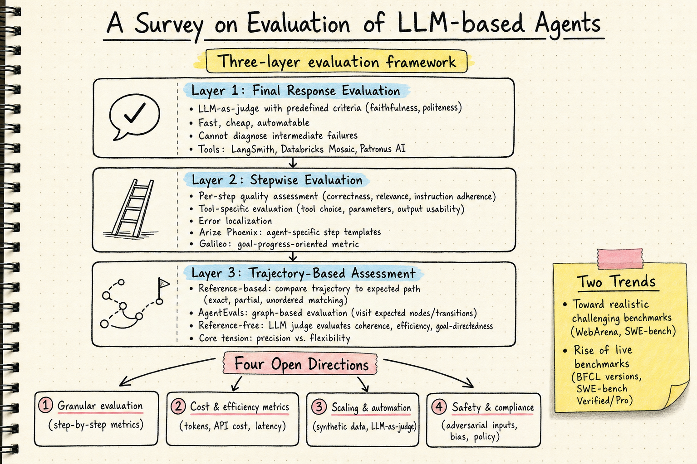

# Harness Engineering — 2026-05-27

## 1. A Survey on Evaluation of LLM-based Agents

- **arXiv**: 2503.16416
- **Link**: https://arxiv.org/abs/2503.16416
- **Authors**: Multiple authors (comprehensive survey)
- **Submitted**: 2026-03-20, v2 updated

### 這篇在說什麼

LLM agent 的評估已經從簡單的 end-to-end success rate 進化到一個多層次、多維度的問題，但缺乏一篇系統性的 survey 把所有評估方法和框架整理清楚。這篇 survey 的核心問題是：我們怎麼知道一個 agent 是否真的「好用」？而這個「好用」不只是「最終答案對不對」，還包括中間步驟是否合理、工具使用是否正確、軌跡是否高效、是否安全合規。

Survey 把 agent 評估分成三個層次：final response evaluation（最終回應評估）、stepwise evaluation（逐步評估）、trajectory-based assessment（軌跡評估），並系統性地分析了每個層次的現有方法、框架和開放挑戰。

### 主要貢獻

1. **三層評估框架**：
   - **Final Response**：評估 agent 的最終輸出品質。快速、便宜、易於自動化，適合大規模監控和回歸測試，但無法診斷中間步驟的問題。
   - **Stepwise**：評估每個 agent step 的品質（LLM 生成、工具呼叫、路由決策）。支持錯誤定位和系統性失敗分析。但假設每個 step 可以獨立評估，忽略了 step 之間的依賴。
   - **Trajectory**：分析 agent 的完整行動軌跡。分為 reference-based（和預期路徑比較）和 reference-free（用 LLM judge 評估軌跡品質）。Galileo 的 goal-progress-oriented metric 測量每個 step 是否向目標推進。

2. **評估框架綜覽**：系統性整理了 LangSmith、Langfuse、Vertex AI、Arize Phoenix、Galileo、Patronus AI、W&B Weave、AgentEvals、Databricks Mosaic AI、Botpress 等框架的功能和限制。

3. **兩大趨勢和四個開放方向**：
   - **趨勢 1：朝更真實和更具挑戰性的評估發展**。從簡化靜態環境到動態真實環境（WebArena、SWE-bench）。
   - **趨勢 2：Live benchmarks 的興起**。靜態基準很快過時和飽和；BFCL 和 SWE-bench 家族的多個版本反映了這個問題。
   - **開放方向 1：細粒度評估**。需要 step-by-step 的詳細評估指標，而不只是 end-to-end success rate。
   - **開放方向 2：成本和效率指標**。需要追蹤 token 使用量、API 費用、推理時間等，而不只是效能。
   - **開放方向 3：擴展和自動化**。需要可擴展的自動評估方法，減少對人工標注的依賴。
   - **開放方向 4：安全和合規**。現有基準缺乏對對抗性輸入、偏見緩解、組織政策的評估。

### 方法 / pipeline

這是 survey，不是提出新方法。但它的評估框架分析對 harness engineering 有直接參考價值：

**Final Response Evaluation**
- LLM-as-judge（預定義標準如忠實度、禮貌性）
- 一些框架有專有 judge 模型（Databricks Mosaic、PatronusAI）
- 大多數框架支援自定義評估指標
- 限制：無法評估中間步驟

**Stepwise Evaluation**
- 每個 step 獨立評估（正確性、相關性、指令遵循）
- 工具專用評估（工具選擇、參數 schema、輸出可用性）
- Arize Phoenix 提供 agent-specific step templates
- Galileo 的 goal-progress metric 測量每個 step 是否向目標推進

**Trajectory-Based Assessment**
- Reference-based：和預期路徑比較（exact、partial、unordered、subset matching）
- AgentEvals 的 graph-based evaluation：對建模為 graph 的 agent，評估是否拜訪預期節點和轉換
- Reference-free：LLM judge 評估軌跡的連貫性、效率、目標導向性
- 核心張力：reference-based 提供精確性和可重現性，但需要預定義行為；reference-free 更靈活但可靠性較低

### 實驗設計

這是 survey，沒有自己的實驗。但系統性整理了：
- 各評估框架的功能比較表格（Table 6）
- 各 agent benchmark 的任務類型、環境、評估指標
- 從 RL 的 OpenAI Gym 到 agent 評估的 gym-like environment 的演進
- WebArena、SWE-bench、BFCL 等 benchmark 的版本演進

### かに讀後判斷

這篇 survey 對 DailyRead 追蹤的 harness engineering 是一篇重要的參考地圖。它把「agent 評估」這個散亂的領域整理成三層框架，和昨天追蹤的 Harnesses for Inference-Time Alignment（2605.21516）形成互補——後者關注的是「怎麼用 harness 引導 agent」，這篇關注的是「怎麼評估 agent 的行為」。

特別值得注意的是四個開放方向都直接對應 DailyRead 追蹤的問題：
- 細粒度評估 → 昨天的 partial harnessing 原則就是一種細粒度評估
- 成本和效率指標 → AgentIR 的 sub-ms latency 就是回應這個需求
- 擴展和自動化 → MAJ-Eval（今天也收錄）用 multi-agent 辯論自動化評估
- 安全和合規 → 前幾天追蹤的 misalignment 相關工作

**今日推薦點開。** 這篇 survey 的評估框架分類和開放挑戰分析值得細讀，特別是 §6 的評估框架比較表格和 §7 的趨勢分析。

---

## 2. MAJ-Eval: Multi-Agent-as-Judge for Multi-Dimensional Human-Aligned Evaluation

- **arXiv**: 2507.21028
- **Link**: https://arxiv.org/abs/2507.21028
- **Authors**: Jiaju Chen, Yuxuan Lu, Xiaojie Wang, Huimin Zeng, Jing Huang, Jiri Gesi, Ying Xu, Bingsheng Yao, Dakuo Wang (Rice, Northeastern, Amazon, UIUC, Harvard)
- **Submitted**: 2026-07-28

### 這篇在說什麼

LLM-as-a-judge 有一個根本問題：真實世界的 NLG 評估需要多維度的人類視角（老師看教育價值、醫生看臨床一致性、家長看適齡性），但現有方法有兩個限制——(1) agent persona 是隨意設計的，不同研究對同一角色關注不同維度，結果不可重現；(2) 評估框架針對特定任務設計，無法泛化到新領域。

MAJ-Eval 的核心洞察是：**從領域相關文獻自動抽取 stakeholder perspectives**，而不是讓研究者手動定義 persona。它從研究論文中識別不同利益相關者（如老師、學生、家長）和他們的關注維度（如教育價值、適齡性、安全性），然後用這些結構化 persona 實例化 LLM agent，讓同一 stakeholder group 的 agents 進行組內辯論（in-group debate），最後由 aggregator agent 綜合所有群體的評分。

### 主要貢獻

1. **自動 persona 構建**：從研究論文自動抽取 stakeholder perspectives 和對應的 persona attributes（domain expertise、psychological traits、social roles），解決了 persona 設計的任意性和不可重現問題。

2. **In-group debate 機制**：同一 stakeholder group 的 agents 先獨立評估，再進行自由辯論，反思和修正初始判斷，最後產生該群體的共識評分。

3. **跨領域泛化**：在兒童故事書 QA 生成和醫學文獻多文檔摘要兩個完全不同的任務上驗證，證明框架不需要為新領域重新設計。

### 方法 / pipeline

**Step 1：Persona Construction**
- 輸入：研究論文（與任務領域相關）
- 從論文中抽取不同 stakeholders 的描述和關注維度
- 轉換為結構化 persona attributes（domain expertise、psychological traits、social roles）
- 例如：在兒童教育 QA 任務中，從論文抽取「老師」（關注教育價值、語法正確性）、「學生」（關注可理解性、參與度）、「家長」（關注安全性和適齡性）

**Step 2：Multi-Agent Debate**
- 每個 stakeholder group 的 agents 先獨立提供初始評估
- Moderator agent 協調組內自由辯論，讓 agents 討論和修正評估
- Aggregator agent 綜合所有群體的評分，產生最終評估

### 實驗設計

- **任務 1**：兒童故事書 QA 生成（Question-Answer Generation for children's storybook reading）
- **任務 2**：醫學文獻多文檔摘要（Multi-document summarization of medical literature）
- **比較對象**：
  - 傳統自動指標：ROUGE-L、BERTScore
  - Single LLM-as-judge：G-Eval
  - 現有 multi-agent 方法：ChatEval
- **主要結果**：
  - MAJ-Eval 在兩個任務上都比傳統自動指標和單一 LLM judge 更接近人類專家評分
  - MAJ-Eval 比 ChatEval（現有 multi-agent 方法）更接近人類評分
  - 自動 persona 構建比手動設計更穩定、更可重現

從全文 HTML 已確認方法細節和主要結果。per-category 分析和消融實驗的細節需要看 PDF 原文。

### かに讀後判斷

MAJ-Eval 對 DailyRead 追蹤的 harness engineering 有兩個直接貢獻：

1. **自動化 persona 構建**解決了 multi-agent evaluation 的可重現性問題——之前的研究者手動設計 persona，不同研究不可比較。MAJ-Eval 從文獻自動抽取，讓評估框架可以泛化到新領域。

2. **In-group debate**機制比單一 LLM judge 更接近人類評分，這和昨天追蹤的 harness inference-time alignment 的「辯論作為 harness」概念一致——讓 agents 在約束框架內辯論，比讓一個 judge 獨自判斷更穩健。

和 Agent Eval Survey（今天也推薦）的關聯：survey 指出「scaling and automating evaluation」是開放方向之一，MAJ-Eval 的自動 persona 構建正是回應這個需求。但 MAJ-Eval 目前只驗證了兩個任務，是否能泛化到更多領域（特別是 agent evaluation 本身，而不只是 NLG evaluation）還需要更多驗證。

值得深讀的部分：persona 自動構建的 prompt 設計、in-group debate 的 moderator 策略、與人類評分的相關性分析、消融實驗（debate vs. no debate、automatic vs. manual persona）。