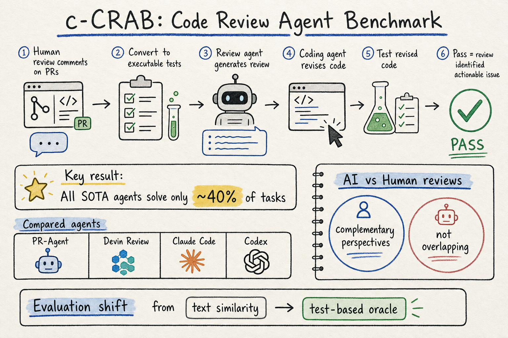

# Harness Engineering — 2026-05-31

## 1. Code Review Agent Benchmark (c-CRAB)

- **arXiv**: 2603.23448
- **Link**: https://arxiv.org/abs/2603.23448
- **Authors**: (多機構，包含 CMU 等研究團隊)
- **全文讀取**: arXiv HTML 全文前段 ✓（方法、benchmark 設計、評估框架均已讀取）

### 這篇在說什麼

隨著 AI coding agents 大量產出程式碼並提交 PR，code review 的品質保證成為瓶頸——人類 reviewer 的能量沒有等比例增長。現有的 code review benchmark 主要問題是用文字相似度（BLEU、ROUGE、embedding overlap）來評估 review 品質，但這些指標測量的是「措辭像不像」而不是「有沒有抓到真正問題」。c-CRAB 的核心洞見是：**把 human review feedback 轉成可執行的測試**——如果 AI reviewer 提出的 review comments 能引導修復程式碼通過這些測試，就代表它確實抓到了人類 reviewer 發現的同一個問題。

這補的洞很明確：現有 code review 評估方法（文字相似度、localization、LLM-as-judge）各有盲點，c-CRAB 是第一個用 test-based oracle 來客觀驗證 review 品質的 benchmark。

### 主要貢獻

1. **Test-based evaluation**：把 human review comments 系統性地轉成可執行測試，作為客觀 oracle。這跳過了文字相似度的問題——不同措辭描述同一個問題也能被抓到。

2. **c-CRAB dataset**：從真實 GitHub PR 的 human review 出發，每個 review comment 被轉成一個或多個測試，形成 PR → review → test 的對應。這讓評估變成「修復後跑測試」而非「比對文字」。

3. **State-of-the-art agent 評估**：評測了 PR-Agent（開源）、Devin Review、Claude Code、Codex。所有系統加起來只解決約 40% 的 c-CRAB tasks。

4. **Human-AI 互補性分析**：AI review 關注的面向和人類 reviewer 不同——這不是「AI 比人差」，而是「AI 和人看的角度互補」，暗示 human-agent collaboration 是未來方向。

### 方法 / pipeline

c-CRAB 的評估流程：

1. **資料收集**：從開源 GitHub PR 中收集 human review comments，每個 comment 對應一個具體的程式碼問題。

2. **Test 生成**：將每個 human review comment 系統性地轉換成可執行測試。這些測試捕獲了 human reviewer 識別的底層問題。

3. **Agent 評估流程**：
   - 給 review agent 一個 PR
   - 收集 agent 產生的 review comments
   - 用另一個 coding agent 根據 agent review comments 修改程式碼
   - 執行修改後的程式碼對 curated tests
   - 如果測試通過，代表 review 成功識別了可操作的問題

4. **Evaluation oracle**：test-based，而非 text similarity。測的是「review 是否導向正確修復」而非「review 文字是否相似」。

### 實驗設計

- **Baseline agents**：PR-Agent（開源）、Devin Review、Claude Code、Codex
- **Main result**：所有系統加起來只解決 ~40% 的 c-CRAB tasks，表示有很大改進空間
- **分析維度**：
  - 不同系統解決的問題集合是否有互補性
  - AI review 和 human review 關注的面向差異
  - Agent-generated tests 作為 held-out test suite 的品質
- **從全文確認**：c-CRAB 的 test-based 評估方法避免了文字相似度的盲點，也避免了 localization 只看位置不看內容的問題

### かに讀後判斷

c-CRAB 在 harness engineering 的位置很清楚：它是 code review agent 的評估 harness，用 test-based oracle 取代文字相似度評估。和之前 DailyRead 收錄的 harness paper（如 Code as Agent Harness、Terminal-Bench）不同的是，c-CRAB 專注在 **review** 這個特定的 agentic task 上，而不是一般的 coding 或 tool-use。

值得深讀的部分：
- Table 1（benchmark comparison）清楚展示了 c-CRAB 和其他 review benchmark 的差異
- Section 3 的 test generation pipeline 是核心方法論
- Human-AI complementarity analysis 對理解 agent review 的定位很重要

**今日推薦點開**。

