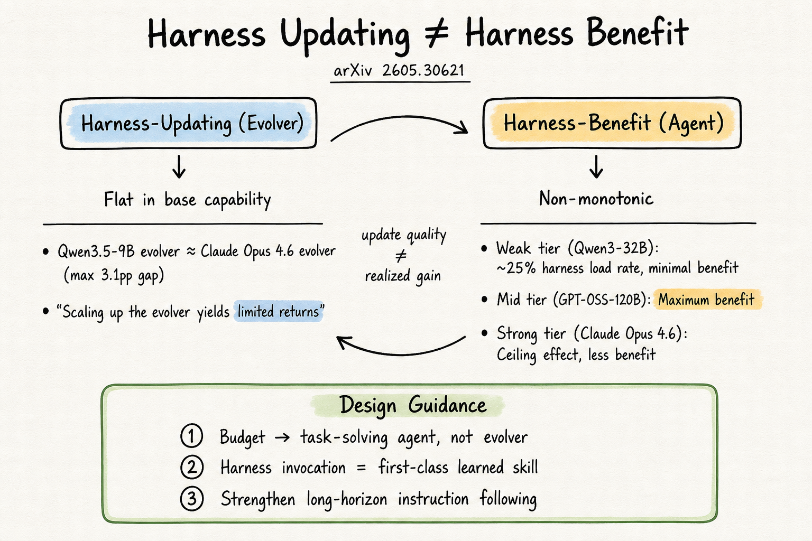

# Harness Engineering — 2026-06-03

## 1. Harness Updating Is Not Harness Benefit: Disentangling Evolution Capabilities in Self-Evolving LLM Agents

- **arXiv**: 2605.30621
- **Link**: https://arxiv.org/abs/2605.30621
- **Authors**: Minhua Lin, Juncheng Wu, Zijun Wang, Zhan Shi, Yisi Sang, Bing He, Zewen Liu, Tianxin Wei, Zongyu Wu, Zhiwei Zhang, Dakuo Wang, Xiang Zhang, Benoit Dumoulin, Cihang Xie, Yuyin Zhou, Suhang Wang, Hanqing Lu (PSU, UCSC, Amazon, Emory, UIUC, Northeastern)
- **領域定位**: Harness engineering / self-evolution / capability decomposition

### 這篇在說什麼

Harness self-evolution（從執行軌跡自動更新 prompt、skill、memory、tools）看起來很美好，但這篇論文問了一個很基本卻被忽略的問題：一個模型擅長更新 harness，是否意味著它也擅長利用更新後的 harness？答案是「不是」。作者把 harness evolution 拆成兩種能力——harness-updating（產生有用 harness 更新的能力）和 harness-benefit（從更新後 harness 獲益的能力）——然後用 7 個 LLM × 3 個 agentic benchmark 的交叉實驗證明兩個反直覺的發現。

### 主要貢獻

1. **Harness-updating is flat in base capability**: 把 task-solving agent 固定、只換 evolver，不同能力等級的模型產生的 harness 更新帶來的增益竟然差不多。Qwen3.5-9B 這個最小的 evolver，其 harness 更新的下游增益和 Claude Opus 4.6 相當。Scaling evolver 的投資回報極低。
2. **Harness-benefit is non-monotonic**: 弱模型（Qwen3-32B）幾乎不受益於更新後的 harness（load rate 只有 ~25%），中階模型（GPT-OSS-120B）受益最大，強模型（Claude Opus 4.6）因為天花板效應受益較少。弱模型的問題不是「更新不好」，而是「用不起來」——25% 的 harness activation rate 和 4x 斜率的 adherence decay。
3. **Design guidance**: 把能力預算花在 task-solving agent 而不是 evolver 上；把 harness invocation 當成 first-class learned skill；強化 long-horizon instruction following。

### 方法 / pipeline

- **Cross-model experiment**: 7 個 LLM（Claude Opus 4.6, Sonnet 4.6, Haiku 4.5, Qwen3-235B-A22B, Qwen3-32B, GPT-OSS-120B, Qwen3.5-9B）作為 agent 和 evolver 的所有組合。
- **Three benchmarks**: SWE-bench Verified（軟體工程）、MCP-Atlas（工具使用）、SkillsBench（跨域 skill-based 執行）。
- **Metrics**: Base capability $M_{\text{base}}(f)$, harness-updating gain $\Delta_{\text{update}}(e)$, harness-benefit gain $\Delta_{\text{benefit}}(f)$。
- **Failure analysis**: 詳細拆解弱模型為何不受益——harness activation failure（不載入 harness）和 harness adherence failure（載入了但不遵守），用 trajectory-level 證據量化。

### 實驗設計

- 固定 agent 換 evolver：evolver 間增益差最大 3.1 percentage points，確認 harness-updating flat。
- 固定 evolver 換 agent：GPT-OSS-120B 受益最大，Qwen3-32B 受益最小，確認 harness-benefit non-monotonic。
- Case study：Qwen3.5-9B 的 harness 更新 vs. Claude Opus 4.6 的 harness 更新，在下游 agent 上增益相當。
- Ablation：harness load rate（Qwen3-32B ~25% vs. strong models ~96%）、adherence decay across trajectory（弱模型衰減 4x 更快）。

### かに讀後判斷

這篇是今天 harness engineering 最重要的一篇。它把一個看似直觀的假設（強模型 = 好的 harness evolver = 好的 harness beneficiary）拆解成兩個獨立能力，然後用實驗證明它們完全不同。對於所有做 self-evolving agent 的人，這篇的 design guidance 非常實用：不要把錢花在大模型當 evolver，而是投資在 task-solving agent 的 harness invocation 和 instruction following 能力。深讀優先看 Section 4.2（harness-benefit non-monotonic 的 failure analysis）和 Figure 3/4 的交叉實驗結果。

---

## 2. Adaptive Auto-Harness: Sustained Self-Improvement for Agentic System Deployment on Open-Ended Task Streams

- **arXiv**: 2606.01770
- **Link**: https://arxiv.org/abs/2606.01770
- **Authors**: Zewen Liu, Zhan Shi, Yisi Sang, Bing He, Minhua Lin, Tianxin Wei, Dakuo Wang, Benoit Dumoulin, Wei Jin, Hanqing Lu (Emory, Amazon, PSU, UIUC, Northeastern)
- **領域定位**: Harness engineering / continual evolution / deployment streams

### 這篇在說什麼

現有 auto-harness 系統（A-Evolve, GEPA, Meta-Harness）都在固定 offline benchmark 上評估，但真正的部署場景是 open-ended task stream：歷史不斷增長、任務類型混雜、分佈持續漂移。這篇指出三個部署維度（unbounded streams, task heterogeneity, distributional non-stationarity）會讓單一 dense harness 在長期部署中衰退。作者提出 Adaptive Auto-Harness，用 analytical framework 把 regret 拆成 evolution loss 和 adaptation loss，並設計了三個對應機制：stateful multi-agent evolver、harness-tree routing、human-in-the-loop steering。

### 主要貢獻

1. **Deployment-regime analysis**: 把 open-ended stream 的挑戰拆成三個維度，用 regret decomposition 證明 evolution loss 和 adaptation loss 是兩個獨立根因。
2. **Multi-agent evolver with cross-cycle memory**: 四階段（Analyze → Research → Build → Verify）multi-agent 流程，加上 persistent cross-cycle workspace（task board, research logs, architecture docs, verification tests）。
3. **Harness-tree routing**: 用 git branch 隔離不同 regime 的 harness，solve-time 由 router agent 選擇最適合的 branch。
4. **Human-in-the-loop hooks**: 歷史經驗不足時觸發 task-board steering 和 research assistance。

### 方法 / pipeline

- **Problem formulation**: Task stream $\{x_t\}$, harness $C = \varphi(\mathcal{H}_t)$, solver policy $\pi(a | x_t, C_t)$, regret decomposition into $L_{\text{evo}} + L_{\text{adapt}}$.
- **Multi-agent evolver**: 四個 phase 各有獨立 context budget，解決 single-agent evolver 的 context window 瓶頸。
- **Harness tree**: 用 git branch 管理 regime-specific prompts/skills/tools，router agent 用 `git show` 讀取每個 branch 的 workspace 然後選擇。
- **HITL hooks**: 兩種觸發條件——task-board steering（需要人類判斷）和 research assistance（需要外部知識）。

### 實驗設計

- 三個 streaming 資料集：Polymarket（預測市場）、CTF-Dojo（安全競賽）、EventForest（事件預測）。
- 比較五個 auto-harness baselines（A-Evolve, GEPA, Meta-Harness, Continual Harness, SkillOS）和多個 ablation。
- Polymarket 上：A-Evolve 的 harness 從 12 條 skill 增長到 34 條、prompt 從 2KB 到 68KB，但 performance 在早期 peak 後下降。
- Adaptive Auto-Harness 在三個 stream 上都優於 baselines；ablation 確認 multi-agent evolver、harness-tree routing、HITL 各自的貢獻。

### かに讀後判斷

這篇和 2605.30621（Harness Updating ≠ Benefit）是同一個研究群的前後作。2605.30621 拆解「誰能更新、誰能受益」，這篇則解決「如何在部署中持續更新和適配」。兩篇一起看會很有收穫。Adaptive Auto-Harness 的 harness-tree + git branch 設計是工程上很務實的做法，值得對照 A-Evolve 的 flat skill 列表。深讀時建議先看 Figure 1（Polymarket 上的 performance decline）和 Section 3.4（harness-tree routing 的具體實現）。

---

## 3. HarnessForge: Joint Harness and Policy Evolution for Adaptive Agent Systems

- **arXiv**: 2606.01779
- **Link**: https://arxiv.org/abs/2606.01779
- **Authors**: Mingju Chen, Can Lv, Guibin Zhang, Heng Chang, Shiji Zhou (Beihang, Tsinghua)
- **領域定位**: Harness engineering / co-evolution / meta-adaptation

### 這篇在說什麼

HarnessForge 的核心觀點是：現有的 harness adaptation 只調外部（prompt/skill/workflow）或只調內部（model policy），但真正的系統適配需要 harness 和 policy 一起演化。作者把 agent 系統定義為 harness–policy pair $(\mathcal{H}, \mathcal{R}_\delta)$，其中 harness 包含 planning $\mathcal{P}$、action $\mathcal{A}$、memory $\mathcal{M}$ 三個 component，policy 是在 harness 下執行的 reasoner。HarnessForge 用 fault-guided harness tailoring + harness-conditioned policy alignment 的迭代 co-evolution 流程，在五個 benchmark 上超過 harness-only 和 policy-only baseline 最多 12%。

### 主要貢獻

1. **Harness–policy pair formulation**: 把系統層級適配從 component-level optimization 提升到 pair-level co-evolution，讓 harness 和 policy 的 compatibility 成為顯式優化目標。
2. **Fault-guided harness tailoring**: 用 meta-agent 診斷執行失敗的 fault 來源（planning / action / memory），然後 archive-guided 改進 harness。
3. **Harness-conditioned policy alignment**: 用 harness-specific trajectory 訓練輕量 adapter，讓 policy 學會在特定 harness 下更好執行。
4. **Pareto-based selection**: 每輪迭代用 multi-objective Pareto front 選擇 harness–policy pair，平衡 performance、cost、latency。

### 方法 / pipeline

- **Agent system**: $\mathcal{G} = (\mathcal{H}, \mathcal{R}_\delta)$，harness $\mathcal{H} = (\mathcal{P}, \mathcal{A}, \mathcal{M})$，policy $\mathcal{R}_\delta = \mathcal{R}_{\theta_0 + \delta}$（輕量 adapter $\delta$）。
- **Evolution round**: harness tailoring → policy alignment → Pareto selection → 下一輪。
- **Harness tailoring**: fault attribution $\mathbb{L}_\omega$ → archive-guided improvement report $\mathbb{R}_\omega$ → candidate generation $\Gamma_\omega$，只編輯 $\mathcal{P}, \mathcal{A}, \mathcal{M}$ 三個 component。
- **Policy alignment**: 從 curated trajectory 訓練 harness-conditioned LoRA adapter。
- **Evaluation**: fitness indicator $\mathbf{J}(\mathcal{G}; B)$ 包含 task quality、negative token cost、negative latency。

### 實驗設計

- 五個 benchmark：ALFWorld, WebShop, SciWorld, BabyAI, TextCraft（跨域）。
- 兩個 backbone：Qwen3-4B 和 Qwen3-8B。
- 比較 harness-only evolution、policy-only evolution、HarnessForge co-evolution。
- HarnessForge 在 Qwen3-4B 上超過最強 baseline 12.0%，在 Qwen3-8B 上超過 3.56%（平均）。
- Rollout-efficiency tradeoff 分析顯示 HarnessForge 在相同 rollout 預算下達到更好 performance。

### かに讀後判斷

HarnessForge 和今天的 2605.30621 / 2606.01770 形成一個很好的對話：2605.30621 說「harness-updating 和 harness-benefit 是兩回事」，2606.01770 說「open-ended stream 需要 harness-tree routing」，HarnessForge 則說「只調 harness 或只調 policy 都不夠，要一起調」。三篇合在一起勾勒出 2026 年中 harness engineering 的研究版圖。深讀建議看 Section 3.2–3.4 的 co-evolution 流程數學定義和 Section 4 的五 benchmark 實驗結果。
