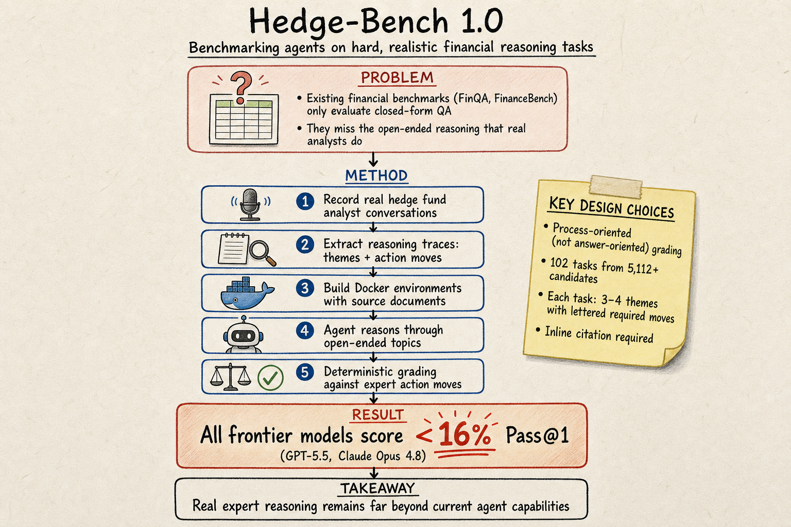

# Harness Engineering — 2026-06-04

## 1. MCP-Persona: Benchmarking LLM Agents on Real-World Personal Applications via Environment Simulation

- **arXiv**: 2606.02470
- **Venue**: ICML 2026
- **Link**: https://arxiv.org/abs/2606.02470

### 這篇在說什麼

這篇提出了 MCP-Persona，第一個專門針對「個人化 MCP 工具使用」的基準測試。MCP（Model Context Protocol）已經成為 LLM 連接外部工具和資料源的標準，但現有的基準測試都聚焦在通用資訊檢索工具上，沒有捕捉到個人化社交應用（Slack、小紅書、Instagram、Lark/飛書、Notion 等）的挑戰——這些工具需要綁定個人帳號、存取私人資料、維護狀態。

核心觀察是：即使是 GPT-5 這種 SOTA agent，在個人化工具使用上仍然表現不佳，主要困難在於獲取隱含在環境中、但沒有明確寫在指令裡的資訊。

### 主要貢獻

1. **Tool-Traverse 方法**：一個「遍歷後模擬」的正規化方法，用真實 MCP server 的功能呼叫軌跡來建構可重現的模擬環境。先手動部署真實 MCP server，用 Self-FC（受 Self-Instruct 啟發）擴充功能呼叫覆蓋率，遍歷所有可能的回應，然後生成模擬工具的 Python 程式碼。

2. **Context-Tree 方法**：把使用者情境（user context）建模為結構化樹狀結構（例如 Lark 的 User→Calendar→Event 層級），從工具文件和功能呼叫種子建構，用真實線上內容填充，隱私敏感欄位用假資料替換。

3. **Persona-Gen 任務生成**：兩階段 pipeline：先用自動化合成從高品質工具鏈生成原型指令，再注入情境樹的豐富資訊並刻意模糊化以模擬真實使用者請求的歧義性，最後由人工標注者驗證。最終產出 173 個人工驗證的個人化任務。

4. **跨越 24 個 MCP server**（12 個個人化 + 12 個資訊檢索），覆蓋社交媒體、企業協作、郵件、內容管理四大場景。

### 方法 / pipeline

- **Tool-Traverse**: 收集真實 MCP server → 手動部署 sandbox 帳號 → Self-FC 擴充功能呼叫 → 遍歷 server 收集回應 → 總結互動模式 → 生成模擬 Python 程式碼
- **Context-Tree**: 工具文件 + FC 種子 → 手動定義層級結構 → 映射工具參數關係 → 填充真實/假資料 → 情境實例供給模擬工具做有狀態操作
- **Persona-Gen**: 工具鏈取樣（依賴、多樣性、真實性約束）→ 自動合成原型指令 → 注入情境 + 模糊化 → 人工驗證
- **Evaluation**: 模擬環境執行 + 功能呼叫準確率 + 任務完成率

### 實驗設計

- **Dataset**: 173 個人工驗證的個人化任務，跨越 24 個 MCP server（12 個個人化、12 個資訊檢索），包含單 server 和跨 server（hybrid）任務
- **Models**: 超過 10 個 SOTA agent（包含 GPT-5 系列）
- **Key findings**: (1) 即使 GPT-5 在某些個人化任務上仍表現不佳，特別是需要從環境中發現隱含資訊的任務；(2) Tool-Traverse 模擬方法用少量人工就能達到高準確率；(3) 針對特定應用的專門 skill 能提升表現，但仍有顯著差距
- 已從全文 HTML 確認完整方法、表格和實驗結果。

### かに讀後判斷

這篇對 harness engineering 的意義在於：它展示了如何系統性地為個人化工具建構可重現的評估環境——Tool-Traverse + Context-Tree + Persona-Gen 三層方法論是一個很好的 harness 設計範例。特別值得注意的是它對 MCP 生態的覆蓋（OpenClaw 也被引用了）。對 Morris 日常使用的 agent 工具鏈有直接相關性。不過 ICML 的 harness 論文通常方法論貢獻大於工程實用性，深讀時可以專注看 Tool-Traverse 的模擬準確率和 Table 1 的基準比較。不推薦為今日推薦點開，但值得收藏。

---

## 2. Hedge-Bench 1.0: Benchmarking Agents on Hard, Realistic Tasks Pertaining to Financial Reasoning

- **arXiv**: 2606.03918
- **Link**: https://arxiv.org/abs/2606.03918

### 這篇在說什麼

Hedge-Bench 是一個針對金融推理的真實、高難度基準測試。作者的核心觀察是：現有金融基準（FinQA、FinanceBench、FAB 等）都聚焦在「有明確答案的問題」（QA、數值計算、事實查找），但真正有價值的金融分析工作是開放式推理——分析師要讀出字裡行間的資訊、做估值判斷、辨識轉折點、在同業中做基準比較、把矛盾數據綜合成一致觀點。

Hedge-Bench 的獨特之處在於：任務來自真實避險基金分析師的對話記錄，評分標準來自兩位分析師共同制定的理由追蹤（reasoning traces），不是對答案而是對推理過程。前線模型（包括 GPT-5.5、Claude Opus 4.7/4.8）的 Pass@1 全部低於 16%。

### 主要貢獻

1. **真實專業推理軌跡**: 任務不是從公開資料構造的，而是來自真實避險基金分析師的匿名對話記錄和推理過程。整個資料收集 pipeline 涉及 9 個月、5112+ 個任務、最終精選 102 個。

2. **過程導向評分**: 不評答案正確性，而是評推理過程是否覆蓋了分析師的關鍵「行動步驟」（action moves）。每個任務分 3-4 個主題，每個主題下 4-5 個子主題代表分析師的推理步驟。用 deterministic grading 而非 model-judged。

3. **開放式但可評分的評估設計**: 結合了開放式推理的挑戰性和確定性評分。分析師的推理軌跡同時提供了：(a) 主題分解、(b) 具體行動步驟、(c) 來源文件引用要求。Agent 必須內聯引用來源文件，否則該推理步驟不計分。

4. **Docker 容器化環境**: 每個任務提供一個包含所有相關文件的 Docker 容器，agent 在容器內操作，反映真實分析師的資訊環境。

### 方法 / pipeline

- **任務生成**: 分析師匿名對話 → 轉錄 → 提取主題和推理步驟 → 兩位分析師共同制定評分標準 → 精選 102 個高品質任務
- **評分**: 每個主題有一組字母標記的 required moves，agent 需要覆蓋足夠多的 moves（τ = max(1, min(n-1, 3))）並提供來源引用。Dense score 在 [0, 4] 區間，Pass@1 是完全正確的比例。
- **Harness**: 使用 Harbor (Terminus 2) 作為 harness，agent 在 Docker 容器中操作
- **模型**: 8 個前線模型，每個跑 8 次，共 6528 次試驗

### 實驗設計

- **Dataset**: 102 個任務，覆蓋 Valuation、Growth & Expansion、M&A、Competitive Positioning、Operational Execution & Strategy、Risk 六大類別
- **Models**: Claude-Opus-4.8, Claude-Opus-4.7, Claude-Sonnet-4.6, Claude-Haiku-4.5, Gemini-3.5-Flash, Gemini-3.1-Pro, GPT-5.5, GPT-5.4-Mini
- **Main result**: 所有前線模型 Pass@1 < 16%，較小模型 < 9%。GPT-5.5 和 Claude Opus 系列在某些任務上表現較好，但整體表現仍遠低於人類分析師。
- **失敗模式分析**: 論文提供了詳細的 taxonomy of failure modes
- 已從全文 HTML 確認完整方法和實驗結果。

### かに讀後判斷

**今日推薦點開**。這篇對 harness engineering 的意義非常大：(1) 它展示了如何把真實專業推理轉化為可評分的基準測試——不是 QA 而是過程評估；(2) Harbor/Terminus 2 的 Docker 容器化 harness 設計是一個值得參考的範例；(3) 102 個任務全部來自真實分析師、用 deterministic grading 而非 model-judged，這在 harness 設計上是一個很好的範例。深讀時優先看 §3 的 task formulation、Figure 3 的評分範例、和 §5 的 failure mode taxonomy。

---

## 3. InfoMem: Training Long-Context Memory Agents with Answer-Conditioned Information Gain

- **arXiv**: 2606.03329
- **Link**: https://arxiv.org/abs/2606.03329

### 這篇在說什麼

InfoMem 提出了一個新角度：不是在推理時改善記憶檢索，而是在訓練時教模型「什麼資訊值得記住」。核心思路是 Answer-Conditioned Information Gain——給模型看一個問題和一段記憶上下文，訓練它預測哪些記憶片段對回答該問題有最大資訊增益。

### 主要貢獻

1. 把「記住什麼」從推理時的檢索問題轉為訓練時的學習問題，用 answer-conditioned information gain 作為訓練信號。
2. 提出了一個可微的記憶選擇機制，讓模型學會根據問題相關性選擇記憶。
3. （目前僅從 HTML 前段確認到核心思路，完整實驗和與其他方法的比較需要看全文。）

### 方法 / pipeline

從 HTML 前段確認到：InfoMem 在訓練階段引入 answer-conditioned information gain 目標，教模型區分哪些記憶片段對特定問題有高資訊增益。具體的 loss 設計和訓練細節需要看全文。

### 實驗設計

目前僅從 abstract 和 HTML 前段能確認到研究方向和基本方法。標記為「僅 abstract + HTML 前段層級快速掃描」。

### かに讀後判斷

概念有趣——把記憶選擇從檢索問題轉為訓練問題，和 xMemory（今天推薦的記憶篇）從不同角度解決同一個問題。但確認深度不夠，暫時不推薦為今日推薦。如果 Morris 對「訓練時記憶選擇」路線感興趣，值得深讀看具體的 loss 設計和實驗結果。