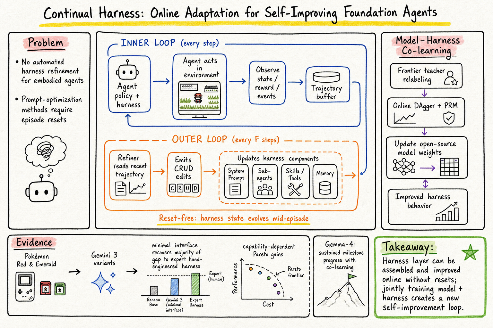

# Harness Engineering — 2026-06-05

## 1. Continual Harness: Online Adaptation for Self-Improving Foundation Agents ★ 今日推薦點開

- **arXiv**: 2605.09998
- **Link**: https://arxiv.org/abs/2605.09998
- **Authors**: Seth Karten, Joel Zhang, Tersoo Upaa Jr, Ruirong Feng, Wenzhe Li, Chengshuai Shi, Chi Jin, Kiran Vodrahalli (Princeton, ARISE Foundation, Google DeepMind)
- **Date**: 2026-05-11

### 這篇在說什麼

目前 coding harness（Claude Code、OpenHands、OpenClaw）讓 foundation model 能在程式碼環境裡長期操作，但沒有等價的 harness 框架給 embodied agent（例如遊戲中的 AI）——embodied agent 面對的是長期、部分可觀察的決策問題，需要連續策略修正而非一次性的 prompt 設計。作者從自己的 Gemini Plays Pokémon (GPP) 計畫出發：他們用 human-in-the-loop harness refinement 讓 Gemini 成為第一個完成多款 Pokémon RPG 的 AI 系統。在後期跑程中，模型本身開始透過 long-context memory 迭代自己的策略——這是一種「emergent continual harness」行為。Continual Harness 將這個過程自動化：一個 reset-free 的框架讓 embodied agent 在單一連續 episode 中交替執行和修正自己的 harness 狀態（system prompt、sub-agents、skills、memory），不需要 episode reset。更進一步，作者提出 model-harness co-learning：用 frontier teacher 的 process reward 來 relabel open-source model 的 rollout，再 soft SFT 更新 model weights——harness 和 model weights 同時在線上更新。

### 主要貢獻

1. **GPP 計畫成果**：首次讓 AI 系統通關多款 Pokémon RPG（Blue、Yellow Legacy hard mode、Crystal 無敗局），透過 harness refinement。這是 harness engineering 在 embodied agent 上的最強 demo。
2. **Continual Harness 框架**：提出 reset-free 的 harness 自動演化機制。每 F 步由 Refiner 讀取近期 trajectory，識別 failure signatures（導航迴圈、工具失敗、目標停滯），然後對 prompt、sub-agents、skills、memory 做 CRUD 編輯。這比 prompt-optimization 方法（如 GEPA）更廣——不只改 prompt，而是改整個 harness 狀態，且不需要 reset。
3. **Pareto 實驗**：在 Pokémon Red 和 Emerald 上，Continual Harness 從最小化介面出發，在不同 Gemini 3 變體上恢復了 expert harness 的大部分效能差距。Pro 變體上嚴格 Pareto 支配；Flash 上高方差；Flash-Lite 低於 capability floor。這證明了 harness gain 隨模型能力縮放。
4. **Model-harness co-learning**：開放模型（Gemma-4）的線上訓練 loop——harness shape trajectories，trajectories surface new failure modes for next refinement，model weights 和 harness state 同時更新。在 Pokémon Red 上展示了持續的 in-game milestone 進展。

### 方法 / pipeline

Continual Harness 的核心是 **雙迴圈架構**：

- **內迴圈（Agent step）**：模型 M 包在當前 harness ℋ_t 中，從環境接收 (observation, text_map)，輸出 button action。
- **外迴圈（Refiner step）**：每 F 步（在 W 步 warm-up 之後），Refiner 讀取 trajectory window τ_{t-F:t}，識別 failure signatures，執行四個 pass：① rewrite system prompt；② create/update/delete sub-agents；③ codify skills / repair broken code；④ add/update/demote memory entries。更新 ℋ_{t+1} = ℋ_t ⊕ Δ 直接進入下一步的 context。

Harness 狀態 ℋ 由四個組件構成：System prompt p、Sub-agents G、Skills K、Memory M。Refiner 和 Agent 共用同一個 model M，只是在不同時間被呼叫。

**Model-harness co-learning**：在 DAgger-style 線上學習中，每次 iteration 跑 π_θ_k 在 live-refining ℋ_t 下 K=256 步。Pairwise PRM 打分，低 reward 窗口由 frontier teacher relabel，soft SFT 更新 θ。Environment state 在 iteration 間持續（reset-free），所以 model 的遊戲進度會累積。

### 實驗設計

- **環境**：Pokémon Red 和 Emerald，使用 PokeAgent Challenge 的 standardized milestone evaluation。主要 metric 是 cumulative button presses to milestone。
- **Harness 條件**：① ℋ_min（最小化介面）；② ℋ_expert（手作 expert harness + A* pathfinding + type chart + damage calculator + curated objectives）；③ ℋ_CH from scratch；④ ℋ_CH bootstrap frozen（load 成功 run，關掉 refinement）；⑤ ℋ_CH bootstrap updating（load 成功 run，繼續 refinement）。
- **模型**：Gemini 3 Pro / Flash / Flash-Lite，至少 3 seeds。Gemma-4 (E2B, E4B, 26B MoE, 31B dense) 用於 co-learning。
- **主要結果**：Continual Harness from scratch 在 Red 上（11-milestone sequence through Thunder Badge）和 Emerald 上（9-milestone sequence through Knuckle Badge）顯著降低 button-press cost，恢復了大部分 ℋ_min → ℋ_expert 的 gap。Pro 變體嚴格 Pareto 支配。Flash-Lite 低於 capability floor。
- **Co-learning 結果**：Gemma-4 在 Pokémon Red 上展現跨 training iteration 的持續 milestone 進展，從 beginning 和 mid-game checkpoint 都能起步。
- **Ablation**：Figure 3 顯示 Yellow Legacy 上 CRUD operations 分佈——updates 集中在少數 navigation 和 battle components，且持續整個 run 而非收斂。Figure 4 顯示 battle_strategist_agent prompt 的結構性演化（growth → simplification → rewrite cycles）。

### かに讀後判斷

這篇是 harness engineering 領域目前最完整的「automated harness lifecycle」工作。相較於之前讀過的 AHE（2604.25850，observability-driven harness evolution）和 Harness-Bench（2605.27922，measuring harness effects），Continual Harness 的獨特之處在於：（1）reset-free，不需要 episode restart；（2）同時演化四個 harness 組件（prompt / sub-agents / skills / memory），而非只調 prompt；（3）model + harness co-learning 是全新方向。跟 Morris 正在用的 OpenClaw harness 設計有直接對話空間——OpenClaw 的 harness 也是 prompt + tools + memory 的組合，Continual Harness 提供了一個自動化 refinement 的路徑。深讀時優先看：Section 3 的 formal definition（harness as four-component tuple）、Figure 3-4 的 CRUD 分佈、Section 4.3 的 Pareto 實驗、Appendix 的 co-learning hyperparameters。

---

## 2. Agent Harness for Large Language Model Agents: A Survey

- **Venue**: Preprints.org (202604.0428), non-peer-reviewed
- **Link**: https://www.preprints.org/manuscript/202604.0428
- **類型**: Survey / preprint

### 這篇在說什麼

這篇 survey 提出 agent harness 是一個獨立的系統層，回顧 2022-2026 年的三次範式轉移：prompt engineering → context engineering → harness engineering。定義 agent harness 為具有六個可控組件（E, T, C, S, L, V）的架構物件，調查超過 110 篇論文、blog 和報告，橫跨 23 個系統。核心論點是：agent 執行 harness，而非 model 本身，是 agent 可靠性的主要決定因素。

### 主要貢獻

1. 提出 ETCLOVG 七層分類法（Execution, Tooling, Context, Lifecycle, Observability, Verification, Governance），試圖把 harness engineering 正式化為獨立學科。
2. 系統性地映射 110+ 篇文獻到 harness 組件，揭示生態系的覆蓋缺口。
3. 指出「2025 是 agents，2026 是 agent harnesses」的趨勢判斷。

### 方法 / pipeline

Survey 類型，無實驗 pipeline。作者對 110+ 來源進行了系統性分類，按 ETCLOVG 分類法映射到各層。由於 PDF 無法有效抽取（Preprints.org 被 Akamai 保護擋住），目前只能從搜尋結果和摘要確認上述資訊。無法確認具體的分類細節、表格、或案例分析的深度。

### 實驗設計

無實驗。Survey 類型。從搜尋結果描述來看，有橫跨 23 個系統的映射，但無法確認映射的品質和深度。缺少正式 benchmark 或定量評估。

### かに讀後判斷

這篇 survey 和之前讀過的 Natural-Language Agent Harnesses (2603.25723)、AHE (2604.25850)、Harness-Bench (2605.27922)、Harness Engineering as Categorical Architecture (2605.12239) 一起構成了 2026 年 harness engineering 的文獻全景。但它是 Preprints.org 上的 non-peer-reviewed preprint，且 PDF 無法讀取，目前只能從搜尋摘要確認框架級資訊。ETCLOVG 分類法和之前的 ETCLOVG / categorical architecture 有重疊但分類稍有不同。如果 Morris 想要一個 harness engineering 領域的「地圖」，這篇可以提供 110+ 來源的索引；但若要看技術深度，Continual Harness 和 AHE 更值得深讀。目前僅標記為一般收錄。

---

*今日 harness engineering 領域的重點是 Continual Harness，它直接回應了「harness 如何自動演化」這個核心問題。其他搜尋結果均為已讀論文或無法取得全文的 preprint。*