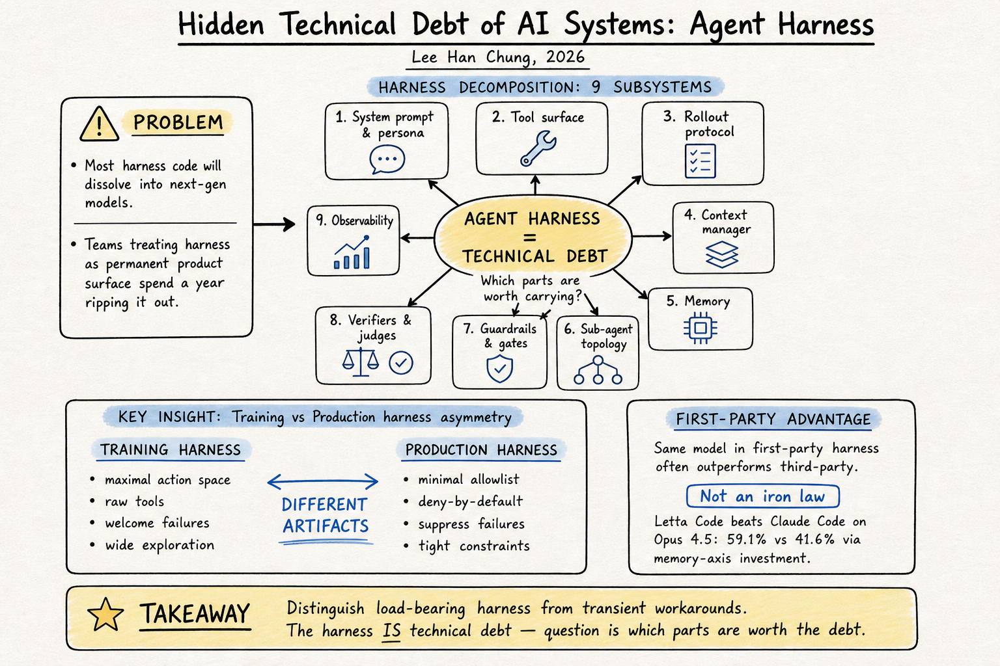

# Harness Engineering — 2026-06-06

## 1. Hidden Technical Debt of AI Systems: Agent Harness

- **Link**: https://leehanchung.github.io/blogs/2026/05/08/hidden-technical-debt-agent-harness/
- **作者**: Lee Han Chung
- **類型**: Blog / engineering article
- **日期**: 2026-05-08

### 這篇在說什麼

這是一篇深入且有系統的技術文章，核心論點是：harness（agent 的編排層）大部分程式碼終將被下一世代模型溶解掉——今天你精心打造的 system prompts、tool wrappers、planner-executor loops、retry policies、context compaction，絕大多數都會被更強的模型吞掉。問題是，很多團隊把 harness 當成永久產品表面在投資，但他們應該預期一年後要大面積拆掉。文章沿著一個清晰的軸線展開：哪些是 load-bearing（結構上不可或缺的），哪些只是 current capability level 的 workarounds（當前能力不足的過渡方案）。

### 主要貢獻

1. **Harness 的精細分解**：把 harness 拆成九個子系統——system prompt & persona、tool surface、rollout protocol、context manager、memory、sub-agent topology、guardrails & gates、verifiers & judges、observability。這比之前 DailyRead 看過的大部分文章都更細緻。

2. **Training harness vs. Production harness 的結構性不對稱**：這是全文最尖銳的觀點。Training harness 是探索面（maximal action space, raw tools, 歡迎失敗作為最佳化信號），production harness 是約束面（minimal allowlist, deny by default, suppress failures）。把 production harness 直接拿來當 training harness 會限制模型能學到什麼；把 training harness 直接部署到 production 會出事。兩者是完全不同的 artifact。

3. **First-party harness advantage 的精確描述**：同一個模型在自家 harness 裡面表現更好，因為模型是在那個 harness 的工具 schema、rollout protocol、context layout、stop conditions 下後訓練的。這解釋了為什麼 Claude in Claude Code ≠ Claude in generic ReAct wrapper。但這不是鐵律——Letta Code 在 Opus 4.5 上打敗 Claude Code（59.1% vs 41.6%），因為 Letta 在 memory 軸上投資了 Claude Code 沒有投資的東西。

4. **Harness 是 technical debt 的觀點**：不是所有 harness 都是 load-bearing 的。有些是「目前模型還不夠好所以需要」，有些是「不管模型多好都需要」。分清楚哪些是哪種，是工程組織最重要的判斷之一。

### 方法 / pipeline

文章定義 harness 為「model 和環境之間的編排層」，包含：

- **System prompt & persona**：跨每個 turn 的 standing instructions
- **Tool surface**：可呼叫的 functions + schemas + descriptions + examples
- **Rollout protocol**：single-turn / multi-turn / ReAct / plan-and-execute / deep-research / multi-agent 的 loop 形狀
- **Context manager**：跨 turn 的 context 保留 / compaction / summary / drop 策略
- **Memory**：短期 scratchpad、中期 progress files、長期 retrievable stores
- **Sub-agent topology**：orchestrator / workers / judges / sub-skills / hand-off protocols
- **Guardrails & gates**：input/output filters、action gates、allowlists、approval tiers
- **Verifiers & judges**：決定 step 是否成功、plan 是否繼續、model 是否該停止
- **Observability**：traces、replay、eval hooks

也討論了 Birgitta Böckeler 的 inner harness（模型廠商出貨的 harness，如 Claude Agent SDK, Cursor Auto）vs. outer harness（使用者在上面疊的 AGENTS.md、MCP servers、custom skills）的區分。

### 實驗設計

這是工程文章而非研究論文，沒有 formal experiments。但有幾個有價值的實證引用：

- Letta Code vs. Claude Code benchmark comparison（Opus 4.5: 59.1% vs 41.6%）
- Microsoft 的 production-scale agent RL instability diagnostic
- Anthropic 的 two-prompt harness for long-running agents（initializer agent + coding agent）
- OpenAI 的 harness-engineering internal practices
- arXiv 2603.08640：first-party vs. third-party harness benchmark gap

文章的核心「實驗」是邏輯論證：如果你接受「模型能力在進步」和「harness 是對當前模型能力的適應」，那 harness 的很大一部分就是 technical debt。

### かに讀後判斷

這篇是 DailyRead harness engineering 系列中最尖銳的觀點文章之一。核心論點——「大部分 harness 程式碼是 technical debt，會被下一世代模型溶解」——是對當前 harness engineering 熱潮的一個重要 counterpoint。

和 DailyRead 過去文獻的關係：
- 直接對話了 2605.26112（From Model Scaling to System Scaling: Scaling the Harness in Agentic AI），那篇的主張是「harness 是可以 scale 的系統工程問題」，這篇說的是「但要分清楚哪些是 load-bearing，哪些是 transient workaround」。
- 和 Birgitta Böckeler 的 Martin Fowler article 互補：Böckeler 區分 inner vs. outer harness，這篇進一步說兩者都在累積不同類型的 debt。
- 和 Addy Osmani 的 Agent Harness Engineering 互補：Osmani 聚焦在「怎麼建好 harness」，這篇聚焦在「怎麼判斷哪些 harness 值得建」。

**建議深讀優先看**：Training vs. Production harness 的對比表格、first-party harness advantage 的討論、以及 Letta Code 打敗 Claude Code 的案例分析。

---

## 2. Building an Evaluation Harness for Production AI Agents: A 12-Metric Framework From 100+ Deployments

- **Link**: https://towardsdatascience.com/building-an-evaluation-harness-for-production-ai-agents-a-12-metric-framework-from-100-deployments/
- **類型**: Blog / engineering article (Towards Data Science)
- **日期**: 2026-05-13

### 這篇在說什麼

這是一篇實務導向的 eval harness 框架文章，來自 100+ 企業 AI agent 部署的經驗總結。出發點是一個醫療合規場景：「你怎麼知道你的 agent 不是在幻覺患者症狀？」——團隊有 unit tests、integration tests、demo 表現很好，但沒有一個 eval harness 能測 hallucination rate、context faithfulness、tool-selection accuracy。六週後他們建出了 12-metric framework，合規團隊簽字，agent 上線。

### 主要貢獻

1. **12-metric 分類框架**：四個 category（Retrieval × 4、Generation × 3、Agent × 3、Production × 2），每個 metric 有明確的 threshold。這是目前看過最完整的 production agent eval metric 清單之一。

2. **三個常見 anti-pattern**：(a) 「MVP 之後再加 eval」→ retrofit 4-6 週；(b) 「accuracy 就夠了」→ 95% accuracy 仍可能有 30% hallucination；(c) 「manual spot-check 就好」→ 10K queries/day 之下不可行。

3. **每個 metric 的 production debugging 經驗法則**：例如 context relevance < 0.75 幾乎總是 index drift / query intent shift / chunking strategy mismatch；faithfulness drop 通常來自 temperature 過高 / context window overflow / prompt template 鼓勵 extrapolation。

### 方法 / pipeline

- **Retrieval Metrics**：Context Relevance (LLM-as-judge per chunk, >0.85)、Context Recall (labeled eval set, >0.90)、Context Precision (MRR, >0.80)、Retrieval Latency (p95 <200ms)
- **Generation Metrics**：Answer Faithfulness (atomic claim extraction + context check, >0.95 regulated / >0.90 general)、Answer Relevance (generate questions from answer + semantic similarity, >0.90)、Hallucination Rate (5% daily sampling + dedicated pipeline, <2% production / <0.5% regulated)
- **Agent Metrics**：Tool Selection Accuracy (labeled query-tool pairs, >0.92 binary / >0.85 5+ tools)、Tool Execution Success (per-call tracking, >0.98)、Multi-Step Coherence (trace-level LLM-as-judge, >0.85 for 4+ steps)
- **Production Metrics**：Cost per Query (<$0.05 typical)、P99 Latency (<3s)

### 實驗設計

這是實務文章，沒有 formal experiments。但提供了大量來自 100+ 部署的經驗數字和 heuristics：
- MRR 從 0.55 跳到 0.92 只要加一個 BGE reranker（latency cost ~50ms）
- Tool selection accuracy 從 95%（3 tools）降到 70%（12 tools）
- 最常見的 faithfulness drop 原因：temperature 過高、context window overflow、prompt 鼓勵 extrapolation
- 最重要的 single metric：faithfulness（尤其在 regulated industry）

### かに讀後判斷

這篇的價值在於它是一個非常可操作的 checklist。如果你今天要幫一個 production agent 建 eval harness，這 12 個 metric 和 threshold 就是一個合理的起點。和之前 DailyRead 看過的 harness engineering 文獻對比：

- 和 Addy Osmani 的 harness engineering 比起來，Osmani 談的是「怎麼建 harness」，這篇談的是「怎麼評估 harness 建得好不好」。
- 和 hidden technical debt 那篇比起來，這篇是「就算 harness 是 technical debt，你在拆它之前也需要這 12 個 metric 來知道它有沒有壞掉」。
- 和 2605.26112（Scaling the Harness）比起來，這篇是 operational metric，那篇是 architecture scaling。

不是今日推薦，但值得收藏為 reference checklist。

（僅 blog 文章層級，已讀完全文）