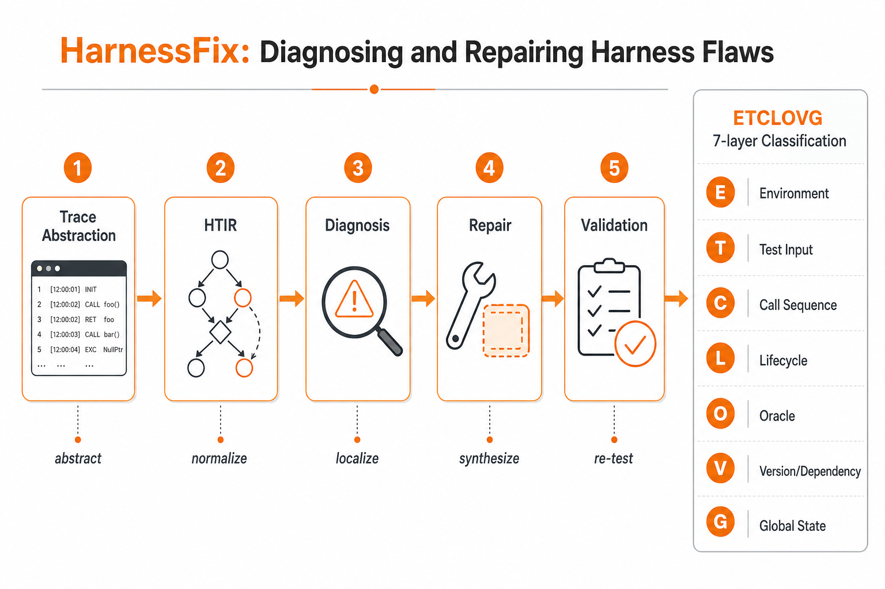
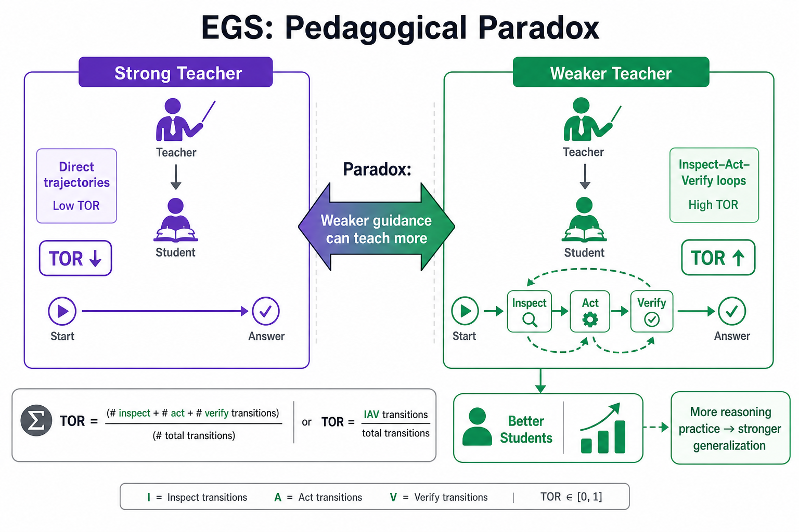

# Harness Engineering — 2026-06-07

## 1. From Failed Trajectories to Reliable LLM Agents: Diagnosing and Repairing Harness Flaws (HarnessFix)

- **arXiv**: 2606.06324
- **Link**: https://arxiv.org/abs/2606.06324
- **Authors**: Mengzhuo Chen, Junjie Wang, Zhe Liu, Yawen Wang, Qing Wang（中國科學院軟體研究所，複雜系統建模與模擬技術重點實驗室）

### 這篇在說什麼

LLM agent 的可靠性不只取決於底層模型，還取決於包圍它的 harness——即提供執行環境、工具介面、上下文管理、生命週期編排、可觀測性、驗證和治理的基礎設施。現有的 self-improving agent 和自動 harness 演化方法大多基於最終結果（成功或失敗）來修改 prompt 或 workflow，但沒有先定位「在軌跡的哪一步出錯」和「是 harness 的哪一層造成的」。HarnessFix 補的就是這個缺口：從失敗軌跡出發，先診斷出問題出在軌跡的哪一步和 harness 的哪一層，再產出有範圍限制的修復 patch。

### 主要貢獻

1. **HarnessFix 框架**：trace-grounded、diagnosis-driven 的 harness 修復框架。不像 outcome-driven prompt evolution 或 free-form self-editing，HarnessFix 明確連接失敗證據到 harness-aware 診斷和 scoped harness 變更。
2. **HTIR（Harness-aware Trace Intermediate Representation）**：將異質的 agent 軌跡正規化為 step-level 的證據結構，包含 input provenance links（這個 request 是從哪些之前的內容和 harness code 組裝而來的）和 control flow links（這個 step 為什麼會被執行）。
3. **跨基準驗證**：在 SWE-Bench Verified、Terminal-Bench 2.0 Verified、GAIA 和 AppWorld 四個基準上，HarnessFix 比初始 harness 提升 15.2%–50.0%，優於 human-designed 和 self-evolution baselines。
4. **ETCLOVG 層級分析**：系統性地揭示了 recurring harness-flaw patterns 跨 Execution、Tooling、Context、Lifecycle、Observability、Verification、Governance 七層的分佈。

### 方法 / pipeline

HarnessFix 的四個協作 LLM agent：

1. **Trace Abstraction Agent**：編譯原始軌跡和 harness code → HTIR。HTIR 包含：
   - TraceSteps：每步的 request、response、input provenance links、control flow links
   - Input provenance links：追蹤 request 中的內容是從之前哪些步驟和 harness code 來的（copied / summarized / transformed / semantically reused）
   - Control flow links：追蹤步驟之間的執行邏輯（continue / retry / delegate / validate / finalize / terminate）
   - Node-local diagnostic evidence：每個 TraceStep 的局部證據視圖

2. **Diagnosis Agent**：消耗 HTIR → 產出 diagnosis records（step-level root cause attribution + implicated harness layers）→ 合併類似診斷為 flaw records（summarizing recurring root causes）

3. **Repair Agent**：將每個 flaw record 映射到 scoped repair operators → 產出 flaw-specific repair specifications → 生成候選 harness patches

4. **Validation Agent**：驗證每個候選 patch 是否在目標 repair scope 內、是否減少目標 flaw、是否不引入不可接受的 regression

### 實驗設計

- **基準**：SWE-Bench Verified、Terminal-Bench 2.0 Verified、GAIA、AppWorld
- **主要結果**：
  - 比初始 harness 提升 15.2%–50.0%（跨四個基準）
  - 優於 human-designed harness（在 SWE-Bench 和 GAIA 上）
  - 優於 self-evolution baseline（AIDE 和 OpenHands）
- **Ablation**：驗證了四個元件的貢獻——prompt-only repair 不如 trace-grounded diagnosis、scoped repair operators、regression-aware acceptance
- **Harness flaw patterns**：最常見的 flaw 類型跨基準不同（SWE-Bench 多在 Context 層，Terminal-Bench 多在 Tooling 層），但整體以 Context 和 Tooling 層為主
- **限制**：HTML 中段被截斷，完整的實驗表格和具體每個基準的分層 flaw 分佈需要看完整全文

### かに讀後判斷

HarnessFix 是 harness engineering 領域目前最完整的「診斷→修復」pipeline。昨天（06-06）的 Hidden Technical Debt of AI Systems 把 harness 定位為 technical debt，這篇則是給了一個具體的自動化修復方案。兩者結合的閱讀策略是：先理解 harness 為什麼是 debt（06-06 的文章），再看如何系統性地診斷和修復這些 debt（本篇）。

ETCLOVG 的七層分類是這篇最有架構性價值的貢獻，它讓 harness flaw 不再是「prompt 有問題」這種模糊描述，而是可以精確定位到「是 Context 層的記憶組裝邏輯有問題」或「是 Tooling 層的工具描述不完整」。這對實際在做 agent 開發的人非常有用。

建議深讀：Section III（HTIR 的設計）和 ETCLOVG flaw 分佈的分析表格。如果你在做 agent eval 或 agent infra，Figure 1 的 overview 和 Table I 的 ETCLOVG 定義是必看的 reference。

---

## 2. What Makes Interaction Trajectories Effective for Training Terminal Agents? (Terminal-Lego / EGS)

- **arXiv**: 2606.03461
- **Link**: https://arxiv.org/abs/2606.03461
- **Authors**: Sidi Yang, Chaofan Tao, Jierun Chen, Tiezheng Yu, Ruoyu Wang, Yuxin Jiang, Yiming Du, Wendong Xu, Jing Xiong, Taiqiang Wu, Lifeng Shang, Xiao-Hui Li, Ngai Wong, Haoli Bai（港大 + 華為）

### 這篇在說什麼

目前 code agent 的 post-training 有一個隱含假設：越強的老師產生的軌跡越好教學生。這篇用實驗推翻了這個假設——Claude Opus 4.6 在 Terminal-Bench 2.0 上得分最高，但用它軌跡 fine-tune 的 Qwen3 學生表現最差；DeepSeek-V3.2 獨立得分最低，但它的軌跡教出最強的學生。作者把這個現象稱為「pedagogical paradox」，並提出 Environment-Grounded Supervision（EGS）作為解釋：軌跡的教學品質取決於它是否明確展現了 inspect-act-verify 的行為模式，而非解題的簡潔程度。

### 主要貢獻

1. **Pedagogical Paradox**：實驗證明 standalone performance ≠ teaching efficacy，推翻了 stronger-is-better 的直覺假設。
2. **Environment-Grounded Supervision（EGS）**：提出可教學軌跡的特徵是明確展現 inspect-act-verify loop——先觀察環境狀態，再行動，再驗證結果——而非直接給出答案。
3. **Targeted Observation Ratio（TOR）**：量化 EGS 的指標，測量行動前有多少比例的行動有相關的先驗觀察支持。TOR 可以在訓練前預測軌跡的教學效用。
4. **Terminal-Lego**：可擴展的 agentic data pipeline，從 StackOverflow 問題構建 Docker-verified 終端任務，跨 90+ 領域。
5. **資料效率**：只用 15.3k Terminal-Lego 軌跡，Qwen3-32B 在 TB 2.0 達到 24.3%，比之前用 30× 資料量達到的 SOTA 還高。

### 方法 / pipeline

- **Terminal-Lego pipeline**：
  1. 從 StackOverflow 收集有 accepted answer 的問題（90+ 領域）
  2. Cascade LLM generation：問題→指令→環境→解法→Dockerfile→測試，每步條件依賴上游產物
  3. Generate-then-review loop 檢查測試品質
  4. Docker round-trip verification：只保留 build → run solution → run tests → 全通過的任務

- **Matched-Task Distillation**：四個老師模型（DeepSeek-V3.2、Claude Opus 4.6、Qwen3.5-Plus、GLM-5）在同一組任務上產出軌跡，只取所有老師都成功的共同子集（8.1k 軌跡），然後用同一個 Terminus-2 harness fine-tune Qwen3-8B 和 Qwen3-32B。

- **EGS 分析**：
  - 排除了軌跡長度和 error recovery 作為解釋因素
  - 定義 TOR = |{有相關先驗觀察支持的行動}| / |所有行動|
  - DeepSeek-V3.2 的 TOR 最高（頻繁在行動前觀察環境），Claude Opus 4.6 的 TOR 最低（傾向直接行動）
  - Masking 掉觀察監督後，學生表現顯著下降

### 實驗設計

- **基準**：Terminal-Bench 2.0
- **核心實驗**：Table 1——四個老師軌跡在 matched-task 設定下的學生表現。DeepSeek-V3.2 軌跡產出最強學生，Claude Opus 4.6 最弱。
- **消融實驗**：
  - 軌跡長度 vs. 教學品質：最長的成功軌跡不如最短的（排除長度假說）
  - Error-free 子集：DeepSeek-V3.2 仍然最強（排除 error recovery 假說）
  - Mask 觀察監督：學生表現顯著下降（確認 EGS 的貢獻）
  - 高/低 TOR 子集：高 TOR 的軌跡產出更強的學生
- **資料效率**：15.3k 軌跡 vs. 30× 更多資料的 SOTA 方法

### かに讀後判斷

這篇是 harness engineering 領域本週最重要的論文之一。Pedagogical paradox 直接挑戰了整個 SFT data curation 的直覺假設，而 EGS 和 TOR 提供了一個可操作的分析框架。對做 agent post-training 的人來說，這篇的實際啟示是：

1. 選老師軌跡不要只看成功率，要看軌跡的行為模式（是否展現 inspect-act-verify）
2. TOR 是一個簡單可計算的指標，可以在訓練前預測軌跡品質
3. 資料效率比資料量更重要——15.3k 條高品質 EGS 軌跡勝過 500k+ 低品質軌跡

跟 HarnessFix（2606.06324）的關係：HarnessFix 診斷和修復 harness flaws，而 Terminal-Lego/EGS 說的是 harness 設計（特別是觀察-行動-驗證的 loop 設計）直接影響了軌跡的教學品質。兩者都在說「harness 的品質比模型本身的表現更重要」這件事。

跟昨天 Hidden Technical Debt 的關係：昨天說 harness 是 debt，Terminal-Lego 說 harness 的設計選擇（觀察是否可見、驗證步驟是否明確）直接影響下游訓練效果。這是同一枚硬幣的兩面。

建議深讀：Table 1（pedagogical paradox 的核心數據）、Table 4（EGS 的機制驗證）、TOR 的定義和計算方式。

---

## 3. The Meta-Agent Challenge: Are Current Agents Capable of Autonomous Agent Development?

- **arXiv**: 2606.04455
- **Link**: https://arxiv.org/abs/2606.04455
- **Authors**: （HTML 前段可讀，作者資訊需確認完整全文）

### 這篇在說什麼

Meta-Agent Challenge 問的是一個很尖銳的問題：現在的 LLM agent 能不能自主地開發另一個 agent？這個問題直接測試 agent 的「meta-engineering capability」——不只是寫 code，而是設計一個有工具、有 prompt、有 workflow 的完整 agent。作者構建了一個 benchmark 來系統性地測試這個能力。

### 主要貢獻

1. **Meta-Agent Benchmark**：測試 agent 是否能自主開發 agent 的 benchmark，不僅看生成的 agent 能否解決任務，還看開發過程中 agent 的工程決策品質。
2. **多維度評估**：不只是看最終結果，還評估中間步驟的品質——prompt 設計、工具選擇、workflow 架構、錯誤處理等。
3. **對現有 SOTA agent 的系統性測試**：測試了多個頂尖模型作為 meta-agent 的能力。

### 方法 / pipeline

（從已讀到的 HTML 前段推斷）Meta-Agent Challenge 的設計包含：
- 給定一個目標任務（例如 SWE-bench 風格的問題、或終端機任務），meta-agent 需要自主設計和開發一個 sub-agent 來解決這個任務
- 評估維度包括：生成 agent 的任務完成率、prompt 品質、工具設計合理性、workflow 效率、錯誤恢復能力
- 與人類開發的 agent 進行對比

目前從 HTML 能確認到的是 benchmark 的框架設計和評估維度，具體的實驗結果和數據需要看完整全文。

### 實驗設計

目前只能從 HTML 前段確認到 benchmark 的設計理念和評估維度，具體的實驗數據（各模型的表現、與人類工程師的對比、消融實驗等）需要完整全文才能準確描述。從 abstract 和前段可以確認的是：作者發現當前 SOTA agent 在自主開發 agent 方面仍有很多限制，特別是在工具設計和錯誤恢復方面。

### かに讀後判斷

這篇對 harness engineering 的貢獻在於它直接測試了「agent 能否設計 harness」這個問題——這是 HarnessFix 的上游問題。如果 meta-agent 能力不足（這篇的初步結論），那麼自動化 harness 設計和修復就更加需要像 HarnessFix 這樣的結構化、trace-grounded 方法，而不是讓 agent 自由發揮。

但目前只讀到 HTML 前段，無法完整評估實驗設計和結果的品質。建議深讀完整全文後再做最終判斷。

---

*本日 harness engineering 領域收錄三篇。Terminal-Lego/EGS（2606.03461）和 HarnessFix（2606.06324）是本日重點，兩者共同指向「harness 設計比模型表現更重要」的結論。Meta-Agent Challenge（2606.04455）是輔助收錄，目前只讀到前段。*