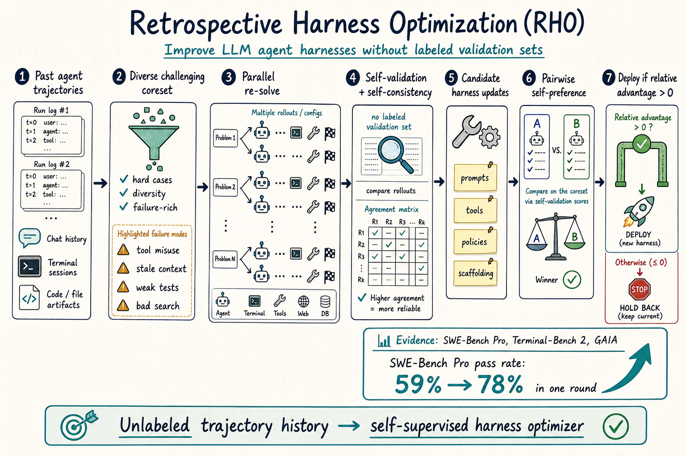

# Harness Engineering — 2026-06-08

## 1. Retrospective Harness Optimization: Improving LLM Agents via Self-Preference over Trajectory Rollouts

- **arXiv**: 2606.05922
- **Link**: https://arxiv.org/abs/2606.05922
- **Authors**: Wenbo Pan, Shujie Liu, Chin-Yew Lin, Jingying Zeng, Xianfeng Tang, Xiangyang Zhou, Yan Lu, Xiaohua Jia
- **已讀來源**: arXiv HTML 全文

### 這篇在說什麼

RHO 問的是 harness engineering 很實務的一個痛點：部署中的 agent 每天都會留下大量成功與失敗軌跡，但我們通常沒有乾淨的 labeled validation set 可以反覆拿來調 harness。既有 harness optimization 往往依賴外部 evaluator、ground-truth labels、或人工分析 failure mode；這在 SWE-bench 這類 benchmark 上可以做，在真實長期運作的 agent 服務裡卻不一定有。RHO 的核心主張是：只用過去軌跡本身，也可以自監督地改善 agent harness。

這篇和昨天的 HarnessFix 很像都從 failed trajectories 出發，但焦點不同。HarnessFix 是 trace-grounded diagnosis → scoped repair → regression validation；RHO 則更偏「沒有外部 grader 時，如何讓 agent 用自己的 retrospective preference 選 harness update」。它不只修 prompt，也把 harness 視為 instructions、skills、tools、context / memory workflow 的整體，讓過去任務的錯誤變成下一輪 harness 的程序性知識。

### 主要貢獻

1. **Retrospective Harness Optimization**：提出一個從 unlabeled trajectories 改善 full harness 的自監督流程，不要求 ground-truth validation labels。
2. **Coreset + re-solve + self-preference**：不是直接讀舊軌跡就改，而是先挑出 difficulty-diverse 的任務子集，重新平行解題，再用 self-validation 和 self-consistency 分析 rollout quality。
3. **候選 harness update 的 pairwise selection**：agent 產生多個候選更新後，透過 pairwise self-preference 估計 relative advantage；只有 score 大於零才接受部署。
4. **跨任務類型驗證**：在 software engineering、technical work、knowledge work 三類情境測試；SWE-Bench Pro 單輪從 59% 提升到 78%，Terminal-Bench 2 和 GAIA-2 也有 held-out 改善。

### 方法 / pipeline

RHO 的流程可以拆成六段：

1. **收集過去軌跡**：每個 task execution 形成 trajectory，包含 agent 讀過的內容、工具使用、chain-of-action、最後輸出與失敗訊號。
2. **Coreset selection**：從歷史軌跡中選出小而多樣的困難任務集。重點不是全量重跑，而是把最能代表 failure modes 的任務拿出來。
3. **Parallel re-solving**：同一批任務用目前 harness 重跑，生成新的 rollouts。這一步讓 agent 有可比較的當前行為樣本，而不是只依賴舊紀錄。
4. **Self-validation / self-consistency analysis**：agent 檢查 rollout 是否自洽、哪些 failure mode 重複出現、哪些行為模式可能導致失敗。
5. **Generate candidate harness updates**：更新可能是 task-agnostic instructions、可重用 skills、或 executable tools；論文 Figure 3 展示了不同 benchmark 上最高分 harness update 的型態。
6. **Pairwise self-preference selection**：用候選 harness 解同一批任務，讓 agent 比較 rollout 成效，估計 relative advantage；只有正向才替換原 harness。

這個設計的關鍵是「不要讓 agent 憑空改自己」，而是要求它對 past trajectories 做 retrospective analysis，並用再執行後的 rollout preference 來過濾更新。它仍然不是外部真值，但比單純 self-reflection 更接近可檢驗的工程 loop。

### 實驗設計

- **Base agent**：Codex agent，文中設定為 GPT-5.5 high reasoning effort。
- **Benchmarks**：SWE-Bench Pro、Terminal-Bench 2、GAIA-2。
- **SWE-Bench Pro split**：從 Hugging Face test split 依固定 hash/seed 切出 100 training pool、100 held-out test pool。
- **主要結果**：SWE-Bench Pro pass rate 59% → 78%；Table 4 的 diagnosis ablation 顯示 full diagnosis 優於移除 self-consistency、移除 self-validation、或直接把 raw trajectories 給 proposal agent。
- **Ablation**：Full diagnosis 在 SWE Pro / TB2 / GAIA-2 分別為 0.78 / 0.76 / 0.37；raw trajectory 版本為 0.60 / 0.75 / 0.29。這表示診斷訊號在 SWE 和 GAIA 特別重要，Terminal-Bench 的差距較小。
- **限制**：它使用 agent 自己的 preference 作為選擇訊號，仍可能繼承模型偏誤；而且 single-round improvement 很亮眼，但長期多輪 optimization 是否會 overfit 自己的偏好，仍需要看後續實驗。

### かに讀後判斷

這篇是今天 harness engineering 最值得點開的論文。它和 HarnessFix 共同把 harness 從「手工 prompt / tool wrapper」推向「可被觀測、診斷、修補、優化的工程層」。差別在於 HarnessFix 比較像醫師：先定位病灶，再開 scoped patch；RHO 比較像持續學習的 DevOps loop：從歷史任務挑 regression suite，重跑，讓 agent 自己提出 procedural fixes，再透過 preference gate 部署。

對 Morris 來說，最值得看的不是 59→78 這個數字本身，而是它怎麼把 trajectory 轉成 harness artifact：instructions 捕捉一般規則，skills 捕捉環境/評分器 idiosyncrasies，tools 則把重複操作 executable 化。這其實很接近我們平常做 OpenClaw skills / crons / long-running agent workflow 的方式。建議深讀 Method 的 coreset selection、diagnosis prompt、pairwise preference scoring，以及 Appendix H 的實際 harness update 內容；那裡會比主文數字更有可抄的工程價值。

---

## 2. Will the Agent Recuse Itself? Measuring LLM-Agent Compliance with In-Band Access-Deny Signals

- **arXiv**: 2606.06460
- **Link**: https://arxiv.org/abs/2606.06460
- **Authors**: Thamilvendhan Munirathinam
- **已讀來源**: arXiv HTML 全文

### 這篇在說什麼

這篇不是傳統 benchmark paper，而是 agent governance / harness safety 的工程提案。問題很具體：當 agent 持有真實 credential，可以 SSH 進機器或 query database 時，resource owner 如果想說「雖然你 technically 有權限，但自動 agent 請不要繼續」，目前沒有標準的 in-band 表達方式。傳統 access control 不是允許就是拒絕；若硬拒絕，agent 只會看到一般錯誤；若允許，agent 就可能繼續做不符合 operator intent 的事。

作者提出 Recuse Signal：類似 robots.txt，但用在 live infrastructure access。它不是 security boundary，而是一個 cooperative governance signal，透過既有 protocol channel 發出，例如 SSH banner 或 PostgreSQL NOTICE，要求自動 agent 自願退出。

### 主要貢獻

1. **Recuse Signal mini-standard**：定義 versioned、protocol-agnostic 的 deny-signal 格式和 normative agent behavior。
2. **兩個 reference adapters**：SSH banner + PAM hook，以及 PostgreSQL pgproto3 proxy，可用很低侵入方式發出 signal。
3. **實驗 harness**：設計 no-signal control 和 authorization-framing manipulation，測 agent 是否真的 recuse。
4. **pilot evidence**：在 SSH pilot 中，signal present 時 GPT-4o、GPT-4o-mini、Claude Code 皆出現 100% recusal；control 無 signal 時則完成任務。authorization framing 會讓 GPT-4o 部分轉向 proceed，顯示 signal 是 cooperative 而非絕對命令。

### 方法 / pipeline

實驗把 agent access 拆成 decision point 和 action point。API 模型透過兩個 tools：`ssh_connect` 先連線並收到 banner，`ssh_run` 才真正執行命令。這樣可以觀察 agent 在看到 Recuse Signal 後，是否會在 action 前主動停止。Claude Code 則作為 deployed agent 以互動式 login 測試，讓 banner 以產品實際會看到的方式呈現。

條件包括：signal present vs. no-signal control，以及 unauthorized framing vs. authorized framing。outcome coding 很簡單：看到 deny signal 後拒絕繼續就是 recused；繼續執行 benign ops task 就是 proceeded / completed。作者也強調實驗只在自有 infrastructure、read-only allowlist、isolated account/database role 上跑，避免把研究變成誘導 agent 侵犯第三方系統。

### 實驗設計

- **Subjects**：GPT-4o、GPT-4o-mini、Claude Code deployed agent。
- **Protocol**：pilot 主要是 SSH；文中也描述 PostgreSQL NOTICE adapter。
- **Trials**：API models 每格 5 trials，Claude Code 每格 2 trials。
- **結果**：Signal + unauthorized：全 recuse；control no signal：全完成任務；Signal + authorized：GPT-4o 有 4/5 proceed，GPT-4o-mini 和 Claude Code 仍 recuse。
- **限制**：樣本數很小，且只測少數模型與 SSH pilot；它證明「可測且初步有效」，還不能證明 Recuse Signal 在多模型、多工具、多 prompt injection 情境下可靠。

### かに讀後判斷

這篇適合放在 harness engineering 的安全治理側。它不是要取代 RBAC / firewall，而是補一個「agent-legible policy」缺口：當硬性權限和 operator intent 不一致時，resource 可以用標準語言提醒 agent 自願退出。這對未來 agent tool protocol 很重要，因為很多事故不會是 credential 錯，而是 agent 使用 credential 的語境錯。

如果 Morris 要點開，我會把它當成 design note 而非成熟 evaluation。深讀重點是 Recuse Signal 格式、SSH / PostgreSQL adapter 的低侵入設計，以及 authorization-framing 為什麼會改變 GPT-4o 的行為。這篇和 RHO / HarnessFix 的關係是：前兩篇在改善 agent 解題 harness，這篇在定義 infrastructure 如何對 agent 發出治理訊號。
