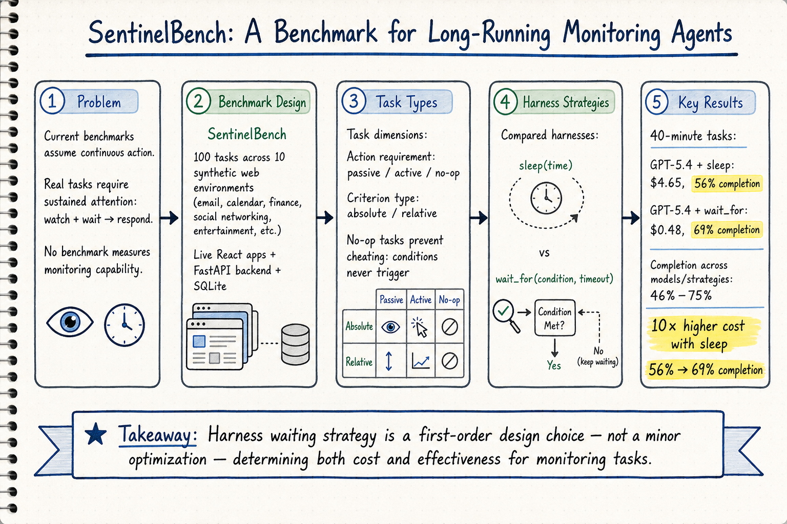

# Harness Engineering — 2026-06-10

## 1. SentinelBench: A Benchmark for Long-Running Monitoring Agents

- **arXiv**: 2606.05342
- **Link**: https://arxiv.org/abs/2606.05342
- **Authors**: Matheus Kunzler Maldaner (U. Florida), Adam Fourney, Amanda Swearngin, Hussein Mozannar, Gagan Bansal, Maya Murad, Rafah Hosn, Saleema Amershi (Microsoft Research, AI Frontiers)
- **類型**: arXiv preprint (cs.AI), 18 pages, 16 figures, v2

### 這篇在說什麼

目前的 agent 評測基準幾乎都假設 agent 應該「持續行動」——不斷打工具、刷新頁面、搜尋替代方案。但很多真實任務需要的是「持續注意」——監控環境，等到外部條件成熟才行動。SentinelBench 直接挑戰這個盲區：它設計了一組需要 agent 「等待然後回應」的監控任務，暴露了當前 agent 在「什麼時候不該行動」這件事上的嚴重缺陷。這對 harness engineering 的意涵非常直接：agent 的 harness 不只需要工具調度能力，還需要等待/輪詢/事件監聽的策略，而這些策略的選擇會戲劇性地影響成本和效果。

### 主要貢獻

1. **首個系統性的「監控型 agent」基準**：100 個任務跨 10 個合成 web 環境（email、calendar、finance、professional networking、entertainment 等），每個環境都是完整可互動的 React 應用。
2. **多維度評測**：不只測任務完成率，還測反應時間和資源使用（token 消耗），揭露了回應速度與成本之間的根本張力。
3. **Harness 設計選擇的巨大影響**：同一個模型搭配不同 harness 策略（sleep vs. wait_for），成本可以差 10 倍（$4.65 vs $0.48），完成率反而更低（56% vs 69%）。這直接證明了 harness engineering 不是錦上添花，而是決定性因素。

### 方法 / pipeline

SentinelBench 的核心設計：

1. **環境**：10 個合成 web 應用（MicroMail、MicroCal、MicroTrade、MicroGram 等），每個都有多頁面 UI、REST API、SQLite 後端。每個環境附帶合成資料目錄（email 有 260 封、chat 有 200 則訊息等），並有 100 個合成用戶 persona，其中 Chris Taylor 是 agent 的主要用戶。
2. **任務設計**：兩個正交維度——action requirement（passive / active / no-op）和 criterion type（absolute / relative）。Passive 任務只需等待條件觸發，active 任務需要定期行動收集資訊，no-op 任務的條件永遠不會觸發（防止作弊）。Absolute 只需單次截圖判斷，relative 需要比對初始和中間狀態。
3. **任務生成**：使用 AI coding agent（Claude Code + Opus 4.6）自動生成場景，然後人工審核。
4. **Harness 比較**：測試了三個模型（GPT-5.4 low reasoning、Qwen 3.5:9b、GPT-4o）搭配兩種 harness 策略——classic `sleep(time)` 和 purpose-built `wait_for(condition, timeout)`。

### 實驗設計

- **主要結果**：預設 speed_factor 下，任務完成率 46%–75%，token 使用 70K–500K+。當任務延長到 40 分鐘，GPT-5.4 用 sleep 的成本是 wait_for 的 10 倍，完成率反而更低。
- **No-op 任務**：防止 agent 透過「9 分 30 秒後自動宣稱完成」來作弊。20 個 no-op 任務只在 agent 持續監控時才算成功。
- **Speed factor**：可調整任務時間尺度，讓研究者在不同時間壓力下測試 agent 策略。
- **評估指標**：task completion、reaction time、resource use（token 消耗）。

全文 HTML 已完整閱讀，方法與實驗細節充分。

### かに讀後判斷

SentinelBench 對 harness engineering 社群有直接且重要的意義。它揭示了一個被忽略的問題：當前 agent harness 幾乎都預設「持續行動」模式，但很多真實任務需要的是「監控等待」模式。論文的結果清楚地顯示，harness 的等待策略選擇（sleep vs wait_for）對效能和成本的影響是數量級的。這和之前 Harness-Bench 的發現（harness 配置影響效能）一脈相承，但更聚焦在「等待策略」這個特定維度。

值得深讀的部分：
- §2.3 任務設計的分類框架（action requirement × criterion type）
- §4 實驗結果中 speed_factor 對不同策略的影響
- §5 與相關工作的比較，特別是和 WebArena、OSWorld 等基準的區別

對 Morris 的研究脈絡：這篇直接呼應了 Harness-Bench 的核心論點——harness 設計是 agent 效能的決定性因素，但從「監控等待」這個新角度切入，補充了 Harness-Bench 未能涵蓋的任務類型。

**→ 今日推薦點開**

## 2. AARRI-Bench: Act As a Real Researcher — Evaluating Frontier LLMs and Agentic Harnesses in Research Lifecycle

- **arXiv**: 2606.07462
- **Link**: https://arxiv.org/abs/2606.07462
- **Authors**: Jiayu Wang, Weijiang Lv, Bowen Fu, Jing Fu, Jiayi Song, et al. (Xi'an Jiaotong University, Xidian University)
- **類型**: arXiv preprint (cs.AI)

### 這篇在說什麼

現有的 agent 基準（SWE-bench、MLE-bench、WebArena 等）主要測量「能不能完成任務」，但忽略了「是不是像個研究者在做事」。AARRI-Bench 直接挑戰這個問題：它設計了 82 個「對人類研究實習生很簡單，但 agent 很容易犯錯」的任務，分四個認知維度（Context、Mindset、Hands-on、Interaction）和四個自主層級（S1-Adaptation 到 S4-Open-ended），測試 agent 是否具備研究者品質——誠信、不確定性意識、細心驗證、負責任的科學判斷。這對 harness engineering 的意義在於：它同時評測了模型能力和 harness 配置的影響。

### 主要貢獻

1. **研究者品質導向的基準設計**：首次把「研究者品質」（integrity、uncertainty awareness、careful verification）作為核心評測維度，而不只是看任務完成率。
2. **「人類簡單但 agent 困難」的任務設計原則**：故意設計人類研究實習生不會出錯的任務，暴露 agent 的系統性弱點。
3. **多 harness 評測**：使用 Harbor 框架標準化任務格式，支持同時評測模型和 harness 的影響。

### 方法 / pipeline

- **任務結構**：每個 task 是一個 Harbor 規範的目錄，包含 instruction.md、task.toml、environment/（Docker 環境）、solution/（參考解法）、tests/（測試腳本）。
- **資料分類**：水平維度——Context（學術脈絡敏感度）、Mindset（學術自主性）、Hands-on（技術執行力）、Interaction（工具使用與協作）；垂直維度——S1 Adaptation（32%）、S2 Integration（28%）、S3 Innovation（27%）、S4 Open-ended（13%）。
- **任務構建**：由研究者團隊手工設計，三階段審核流程。
- **評測**：最佳配置（Mini-SWE-Agent + Claude Opus 4.7）只有 68.3% 成功率，遠低於人類研究實習生的預期表現。

### 實驗設計

- 82 個任務，跨多個模型和 harness 組合測試。
- 最佳配置 68.3% 成功率，顯示即使是頂級模型 + 複雜 harness 也在「研究者品質」方面有明顯不足。
- 論文強調：僅靠更複雜的 scaffolding 不夠，需要更深入地探索「研究行為」本身。

已從全文 HTML 閱讀方法與實驗設計。

### かに讀後判斷

AARRI-Bench 是 harness engineering 領域一個有價值的新基準，但它的核心定位更偏「research agent evaluation」而非「harness 設計效應的系統性測量」。和 Harness-Bench（量測 harness 配置對效能的影響）相比，AARRI-Bench 更像是在問「什麼樣的任務暴露了 agent 的研究者品質缺陷」，而不是「harness 怎麼調才能改善」。它的四維度分類框架（Context / Mindset / Hands-on / Interaction）對設計更好的 harness 有參考價值，但論文本身的貢獻更偏向基準設計而非 harness 工程分析。

不需要深讀全文，但值得注意其 Harbor 框架的任務標準化設計和「研究者品質」這個評測新維度。