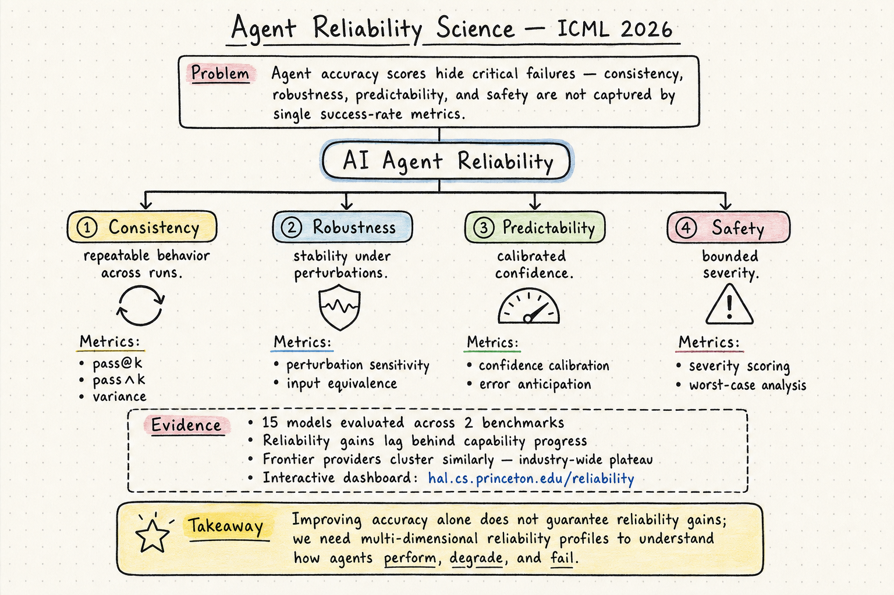

# Harness Engineering — 2026-06-14

## 1. Towards a Science of AI Agent Reliability

- **arXiv**: 2602.16666
- **Link**: https://arxiv.org/abs/2602.16666
- **Venue**: ICML 2026
- **Authors**: Sayash Kapoor, Peter Kirgis, Kangheng Liu, Saiteja Utpala, Arvind Narayanan (Princeton)
- **類型**: Conference paper (ICML 2026), 互動式 dashboard

### 這篇在說什麼

Agent 評測圈有一個大問題：大家只看 accuracy（任務成功率），但 accuracy 掩蓋了太多壞事。一個 80% 成功率的 agent，可能是「80% 的時候穩定完成，20% 的時候小幅失誤」，也可能是「80% 的時候碰巧成功，20% 的時候造成災難性破壞」。這兩種情況在 accuracy 上完全一樣，但在實際部署中是截然不同的。

這篇從安全關鍵工程（航空、核電、汽車）借用可靠性分析的框架，提出 12 個具體指標、4 個維度，系統性地拆解 agent 可靠性。結論很嚴肅：近兩年模型能力大幅提升，但可靠性幾乎沒有改善；所有前沿模型供應商聚類在一起——這是整個產業的問題，不是某一家模型的問題。

### 主要貢獻

1. **四維可靠性框架**：從安全關鍵工程提煉出四個維度——Consistency（一致性：跨 run 的可重複性）、Robustness（魯棒性：對輸入擾動的穩定性）、Predictability（可預測性：模型是否知道自己會失敗）、Safety（安全性：失敗時的嚴重度有界）。每個維度 3 個指標，共 12 個。

2. **12 個具體指標**：不是抽象概念，而是可計算的指標。Consistency 包括 pass@k、pass∧k、變異數；Robustness 包括輸入擾動敏感度、等價輸入一致性；Predictability 包括信心校準、錯誤預期；Safety 包括嚴重度評分、最壞情況分析。

3. **15 模型 × 2 基準的全面評測**：在兩個互補基準上測試 15 個模型，發現可靠性提升滯後於能力提升。Figure 1 最直觀——24 個月的模型發布，accuracy 穩步上升，但 reliability 幾乎是一條平線。

4. **互動式 dashboard**：hal.cs.princeton.edu/reliability，可以視覺化探索每個模型在每個維度上的表現。

### 方法 / pipeline

論文的核心方法論是把安全關鍵工程的可靠性概念翻譯成 ML 可計算的指標：

1. **Consistency**：同一個任務跑多次，結果是否一致？用 pass@k（至少 k 次成功）和 pass∧k（所有 k 次同時成功）來衡量。pass∧k 是最嚴格的一致性指標——跑 5 次全成功才算通過。

2. **Robustness**：對輸入做微小擾動（改寫、重排、同義替換），看結果是否穩定。關鍵發現：很多 agent 對 task description 的微小改寫極度敏感。

3. **Predictability**：模型是否「知道自己不知道」？用信心校準來衡量——模型聲稱高信心時，是否真的更可能成功？大多數模型在這個維度表現很差。

4. **Safety**：當 agent 失敗時，失敗的嚴重度是多少？是格式錯誤（低嚴重度）還是刪除生產資料庫（高嚴重度）？用加權嚴重度分數來量化。

每個維度獨立於 accuracy 計算，確保指標捕捉的是 reliability 而非 capability。

### 實驗設計

- **模型**：15 個模型，跨多個供應商（OpenAI、Anthropic、Google 等）。
- **基準**：兩個互補基準（具體名稱需從全文確認，一個偏程式碼、一個偏通用 agent）。
- **核心發現**：
  - 近兩年 model releases 的 reliability 提升很小，遠落後於 accuracy 提升
  - 所有 frontier providers 聚類在一起——可靠性是產業級問題
  - Consistency 和 Predictability 是最需要研究關注的維度
  - Accuracy 和 Reliability 之間的 gap 在複雜真實任務上更大
- 全文 HTML 已閱讀，方法細節充分。實驗數據的具體數字需對照 dashboard 確認。

### かに讀後判斷

這篇論文對 harness engineering 的意義非常直接。如果可靠性是產業級問題，那 harness engineering 就是回應這個問題的核心手段——harness 的每一層設計（prompts、tools、context policies、hooks、sandboxes、feedback loops、recovery paths）都在某種程度上影響這四個維度：

- Consistency：harness 可以用重試、投票、ensemble 來提升
- Robustness：harness 可以用 input normalization、task decomposition 來提升
- Predictability：harness 可以用 confidence calibration、uncertainty quantification 來提升
- Safety：harness 可以用 guardrails、sandboxing、severity bounds 來限制

這和 Addy Osmani 的 harness engineering 文章形成呼應——「every mistake becomes a rule」的 ratchet 心態，本質上就是在做 Safety 維度的可靠性工程。

值得深讀的部分：
- §2 安全關鍵工程的跨領域 survey
- §3 十二指標的數學定義
- §4 實驗結果，特別是 Figure 1 的 reliability vs accuracy 趨勢
- Dashboard 上的互動式探索

**→ 今日推薦點開**

## 2. Agent Harness Engineering — Addy Osmani Blog

- **類型**: Blog article (addyosmani.com)
- **Link**: https://addyosmani.com/blog/agent-harness-engineering/
- **Authors**: Addy Osmani
- **Published**: June 2026

### 這篇在說什麼

Addy Osmani 寫了一篇實踐導向的 harness engineering 長文，把 Viv Trivedy、Dex Horthy、HumanLayer、Anthropic engineering team、Birgitta Böckeler 等人的觀點和自己的實踐經驗拉在一起。核心論點很簡潔：Agent = Model + Harness，如果你不是模型，你就是 harness。harness 的每一行設計都有具體的工作要做——如果說不出一個 harness 組件要解決什麼行為問題，那它可能不該存在。

### 主要貢獻

1. **Harness 的定義與組成**：System prompts、CLAUDE.md、AGENTS.md、tools、skills、MCP servers、bundled infrastructure、orchestration logic、hooks、middleware、observability——這些全是 harness，而不同 harness 的選擇直接決定了 agent 的行為。

2. **Skill Issue 重新框架**：HumanLayer 的洞察——agent 錯誤通常是 configuration problem 而非 model problem。Viv 的團隊在 Terminal Bench 2.0 上用同一個模型，只換 harness，從 Top 30 移到 Top 5。

3. **Ratchet 心態**：每次 agent 犯錯，就把防範規則加入 harness。AGENTS.md 的每一行都應該可以追溯到一個具體的失敗。這不是一次性工程，是持續的紀律。

4. **Context rot 的三大技術**：Compaction（壓縮舊 context）、Tool-call offloading（大輸出只留頭尾）、Skills with progressive disclosure（按需載入工具和指令）。Anthropic 的 harness 還加了一個：full context reset——直接重建 session。

### 方法 / pipeline

文章按 harness 組件逐一講解：

1. **Filesystem + Git**：最基本的 durable state，讓 agent 有 workspace 可以讀寫、offload、版本控制。
2. **Bash + code execution**：通用工具策略，比預建工具更靈活。Willison 的觀點：agent 已經很擅長 shell commands。
3. **Sandbox**：隔離執行環境，預裝 runtime、Git、test CLI、headless browser，讓 agent 可以自我驗證。
4. **Memory + Search**：AGENTS.md 做持續學習，Context7 / web search 做知識更新。
5. **Context engineering**：壓縮、offloading、progressive disclosure、session reset。
6. **Sub-agent patterns**：planner + executor、TDD loop、reviewer、explorer。

每個組件都附帶具體的 code snippet 和配置範例。

### 實驗設計

這是 blog 而非 paper，沒有正式實驗。但引用了幾個關鍵數據點：

- Terminal Bench 2.0：同一模型換 harness 從 Top 30 → Top 5
- Anthropic 的 harness 設計經驗：long-running apps 的 context management
- HumanLayer 的「skill issue」分析

### かに讀後判斷

這篇文章是目前 harness engineering 領域最完整的實踐導向寫作。它不發明新概念，但把分散在各處的洞察拉成了一條線。對 DailyRead 的 harness engineering 追蹤來說，這篇的價值在於：

1. 它確認了 harness engineering 已經從邊緣實踐成為一個有名字的領域
2. 它提供了具體的 harness 設計 checklist，可以對照 SentinelBench（等待策略）、Harness-Bench（harness 配置影響）等 paper 的發現
3. Ratchet 心態和 Agent Reliability Science 的 Safety 維度形成直接對話

不是 paper，但作為領域實踐的系統性整理，值得收藏和定期回看更新。

**全文已閱讀**（blog HTML）。