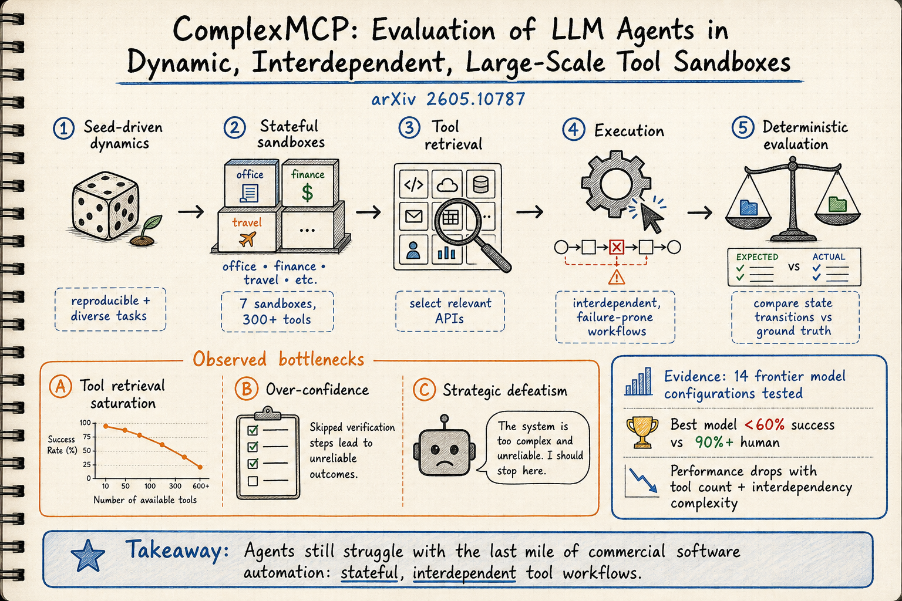

# Harness Engineering — 2026-06-20

## 1. ComplexMCP: Evaluation of LLM Agents in Dynamic, Interdependent, and Large-Scale Tool Sandbox

- **arXiv**: 2605.10787 (ICML 2026)
- **Link**: https://arxiv.org/abs/2605.10787
- **Authors**: Yuanyang Li et al. (Alibaba Group / AIDC-AI)
- **Code**: https://github.com/AIDC-AI/complex-mcp

### 這篇在說什麼

目前 LLM agent 在呼叫孤立 API 上表現不錯，但一到真實商用軟體環境就卡住——因為真實環境的工具不是獨立的：它們之間有狀態依賴、需要依序操作、會有非預期失敗，而且候選工具數量龐大讓檢索飽和。ComplexMCP 這個 benchmark 正是為了測試 agent 在這種「最後一哩」場景下的能力而設計的。它不是再弄一個更多工具的資料集，而是系統性地建構了一個有狀態、有工具間依賴、有環境噪音的評估環境，並且用 seed-driven 架構確保可重複但多樣的評估。結果很清楚：最強模型成功率不到 60%，人類 90%+，而且有三個系統性的失敗模式被辨識出來。

### 主要貢獻

1. **ComplexMCP benchmark**：基於 Model Context Protocol (MCP) 建構的超過 300 個工具、7 個 stateful sandbox 的評估環境。是目前唯一同時具備大規模工具集、MCP 原生架構、有狀態沙盒、環境隨機性、和確定性細粒度評估的 benchmark。
2. **Seed-driven dynamics**：一個 seed 同時控制高熵環境初始化和執行期擾動（如 API 失敗），保證科學可重複性同時不失環境多樣性。
3. **三大瓶頸辨識**：(1) Tool retrieval saturation——隨著 action space 變大，工具檢索效果急劇下降；(2) Over-confidence——agent 跳過必要的環境驗證步驟；(3) Strategic defeatism——agent 遇到錯誤後合理化失敗而不是嘗試恢復。
4. **確定性細粒度評估**：用 rule-based 系統比較環境狀態轉換與 ground truth，取代主觀的 LLM-as-judge 評分。

### 方法 / pipeline

ComplexMCP 的架構設計有以下幾個關鍵：

1. **7 個 stateful sandbox**：Office Suite（文件/試算表/簡報）、Financial System（銀行/投資）、Travel Booking、Customer Service、E-commerce、Smart Home、Health Records。每個 sandbox 有自己的狀態空間和工具間依賴關係。
2. **150+ interdependent tools + 150+ stateless APIs**：工具之間存在狀態傳遞（如先開戶再轉帳）、參數依賴（如訂單 ID 要先建立才能查詢）、和存取控制。
3. **Seed-driven evaluation**：同一個 seed 會產生：(a) 初始環境狀態（如帳戶餘額、航班座位）；(b) 執行期擾動（如隨機 API timeout）。這確保不同 seed 下的測試多樣性，同時同 seed 下完全可重複。
4. **Evaluation pipeline**：每個 task 有明確的 ground truth environment state。Agent 的行為軌跡被記錄，最終環境狀態被拿來跟 ground truth 做 rule-based 比對，給出細粒度的 success/partial/fail 判定。
5. **Full-context vs RAG 模式**：測試了兩種工具檢索模式——full-context（所有工具描述放在 prompt 中）和 RAG（先檢索相關工具再呼叫）。

### 實驗設計

- **模型**：多個 frontier models（包括 Qwen-3-Max、GPT-4o 等），在 full-context 和 RAG 兩種工具檢索模式下測試。
- **主要結果**：最強模型在 full-context 模式下成功率 < 60%，人類 90%+。RAG 模式下更低。
- **三大失敗模式分析**：
  - (1) Tool retrieval saturation：隨工具數增加，無論 full-context 或 RAG，檢索準確率下降。
  - (2) Over-confidence：agent 在應該先檢查環境狀態時直接跳過，導致後續操作失敗。
  - (3) Strategic defeatism：遇到 API 錯誤後，agent 傾向宣告失敗而非嘗試恢復路徑。
- **Ablation**：移除環境隨機性（固定 seed）後成功率提升，但仍然遠低於人類，顯示結構性挑戰不只來自噪音。
- 目前從全文（arXiv HTML）能完整確認：benchmark 設計、所有實驗結果表格、失敗模式分析。Table 1 的 benchmark 比較圖和 Figure 3 的失敗模式示意圖都在。

### かに讀後判斷

ComplexMCP 是 harness engineering 領域近幾個月最重要的新 benchmark 之一。和之前看過的 Harness-Bench（2605.27922，測 harness 對 agent 表現的影響）、WildClawBench（2605.10912，測 native-runtime agent eval）、ORAgentBench（2606.19787，見下方）相比，ComplexMCP 的差異化定位在於：它不測 harness 的「配置差異」，而是測 agent 在「真實複雜工具生態」中的能力。三個系統性失敗模式的辨識（retrieval saturation、over-confidence、strategic defeatism）對 agent 開發者有直接指引價值。推薦 Morris 點開。深讀時優先看 Section 3（benchmark 設計細節）和 Section 5（失敗模式分析和 Figure 3）。

## 2. ORAgentBench: Can LLM Agents Solve Challenging Operations Research Tasks End to End?

- **arXiv / Venue**: 2606.19787
- **Link**: https://arxiv.org/abs/2606.19787
- **Authors**: Jiajun Li et al. (Southeast University, Nanyang Technological University, Huawei Noah's Ark Lab)
- **Code**: https://github.com/ORAgentBench/ORAgentBench

### 這篇在說什麼

OR（作業研究）是一個高價值、高難度的實際應用場景：貨運路線最佳化、排程、能源調度等。現有的 OR agent 評估通常只測公式化或求解階段，不測從真實操作需求到可驗證決策的端到端流程。ORAgentBench 是第一個測試 agent 在真實 OR 工作流程上的端到端能力的 benchmark：107 個人工審核的任務，每個包在一個隔離環境裡，有自然語言任務說明、多檔資料、配置檔案，agent 需要寫程式、執行、提交結果，然後由隱藏的驗證器評分。結果：最強 agent 只通過 35.51% 的任務和 20.59% 的困難任務。

### 主要貢獻

1. **ORAgentBench**：第一個真實端到端 OR agent 評估 benchmark，107 個人工審核任務，涵蓋車輛路線、排程、生產規劃等多元場景。
2. **Execution-grounded evaluation**：不是只看公式或程式碼，而是看 agent 是否能在隔離環境中從頭到尾完成一個真實 OR 流程——讀取資料、建模、求解、驗證、提交。
3. **Skill-enhanced agent 分析**：研究了給 agent OR 領域技能指引（procedural skills）的影響，發現技能指引改變了失敗模式（提高了困難任務的可行性），但沒有可靠地提升通過率或解的品質。
4. **失敗分析**：錯誤主要來自策略性弱點——漏掉操作約束、脆弱的公式化、弱可行解構建、和不夠的解改善。

### 方法 / pipeline

- **Task packaging**：每個任務提供自然語言 brief + 多檔資料 + 配置 artifacts + submission schema。Agent 在隔離 Docker 環境中執行。
- **Evaluation**：三層評分——(1) Schema validity（提交格式正確）、(2) Hard-constraint feasibility（滿足所有硬約束）、(3) Normalized objective quality（目標函數值越接近已知最佳解分數越高）。
- **Skill-enhanced agents**：測試了兩種 skill 注入方式：(1) 給 agent OR domain knowledge 的 prompt 指引；(2) 給 agent 範例程式碼模板。
- **14 個 frontier configurations**：測了多個 model-harness 組合。

### 實驗設計

- 107 個任務分為 easy/medium/hard 三個難度等級。
- Best agent（Claude 3.7 + specific harness）: 35.51% overall pass rate, 20.59% hard task pass rate。
- Skill-enhanced agents：可行性提升但通過率不一定提升，說明「能構建可行解」和「能構建好解」是不同的能力。
- 失敗模式分類：(1) Missed operational rules（漏掉約束），(2) Brittle formulations（公式化脆弱），(3) Weak feasible-solution construction（構建不出可行解），(4) Insufficient solution improvement（不會改善可行解）。

目前從全文（arXiv HTML）能完整確認 benchmark 設計、實驗結果、和失敗分析。

### かに讀後判斷

ORAgentBench 的定位和 ComplexMCP 很不同：ComplexMCP 測的是工具使用的「最後一哩」，ORAgentBench 測的是從需求到決策的完整工程流程。兩者都指向同一個結論：當前 agent 在複雜、有約束的真實任務中表現遠不如人類。ORAgentBench 的 skill-enhanced 分析特別有意思——OR 領域技能指引改變失敗模式但沒有可靠提升通過率，這呼應了之前 DailyRead 看到的 harness 效應：不是能力不夠，而是能力沒有在正確的地方發揮。值得一看但不是今日首推。深讀時優先看 Table 1（和既有 benchmark 的比較）和 Section 5（skill-enhanced 實驗和失敗分析）。