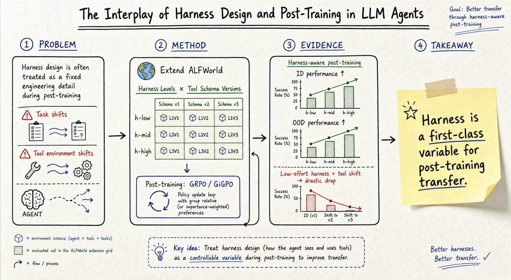

# Harness Engineering — 2026-06-26

## 1. The Interplay of Harness Design and Post-Training in LLM Agents

- **arXiv**: 2606.25447
- **Link**: https://arxiv.org/abs/2606.25447
- **Authors**: Kyungmin Kim, Youngbin Choi, Seoyeon Lee, Suhyeon Jun, Dongwoo Kim, Sangdon Park (POSTECH)

### 這篇在說什麼

Tool-integrated LLM agent 的 harness（決定哪些 tools 被暴露、如何描述它們、每步 observation 附加什麼輔助資訊的 scaffolding）在既有文獻中被當成固定的工程細節。Post-training 演算法（GRPO、GiGPO）假設 static environment，但真實部署面臨 task shift 和 tool environment shift。這篇第一次系統性地問：harness design 如何影響 post-training 的 ID 和 OOD 效果？

這補的是一個關鍵缺口：既有 ALFWorld 上的 post-training 結果看似很強，但其實是建立在「harness 預先提供每步所有 feasible tool calls」這個極度 informative 的假設上。這個成本很少有人明說。

### 主要貢獻

1. **ALFWorld extension**：把 ALFWorld 改造成 tool-integrated agentic benchmark，harness 作為可控設計變數，tool schema 作為可控 OOD shift 變數。這是第一個把 harness 當成可調實驗變數的 post-training benchmark。

2. **三層 harness 設計**：h-low（minimal description, no auxiliary info）、h-mid（加 admissible tools per step）、h-high（rich descriptions + carrying info）。每多一層都代表更多 prior knowledge / design effort。

3. **Harness-aware post-training**：實驗證明 harness-aware post-training 不只改善 ID 效果，也提升 OOD robustness。Low-effort harness + post-training 在 tool environment shift 下 drastic performance drop。

4. **When to apply harness**：Post-training 之後才 apply harness（而非 training 中就 apply）效果更差 → harness design 應該是 post-training 的一環，不是 deployment 後才加的裝飾。

### 方法 / pipeline

- **Harness 定義**：Harness 由 system prompt p 和 state reconstruction function TE 共同決定。p 決定 tool descriptions（short vs. rich），TE 決定 per-step history 包含哪些 auxiliary info（valid tools list、carrying state）。

- **三層 harness**：
  - h-low：每個 tool 只有一行描述，per-step history 只有 raw observation。
  - h-mid：加上 valid tools list（當前步可用哪些 tool）。
  - h-high：rich tool descriptions（preconditions、interactions、role in tasks）+ carrying info。

- **Tool schema shift**：v1.0（base, 13 tools, verb-style names）、v1.1（paraphrased names, e.g. Go → NavigateTo）、v2.0（grouped by structural/functional similarity, 13 → 5 tools, each with discrete action parameter）。

- **Post-training**：GRPO（episode-level advantage）和 GiGPO（step-level + episode-level advantage）。

- **Evaluation setup**：ID = same harness × same schema；OOD-tool = same task, different schema；OOD-task = different task type, same/different schema。

### 實驗設計

- **Environment**：ALFWorld，3827 task instances，6 類 household activities。
- **Models**：Qwen2.5-7B-Instruct, Llama-3.1-8B-Instruct。
- **Main results**：
  - ID：h-high + GiGPO 達 ~97% success；h-low + GRPO 只有 ~25%。
  - OOD-tool shift：h-low post-training 在 v2.0 schema 下 performance collapse（從 ~25% 掉到接近 0%）。
  - OOD-task shift：h-high harness 有更好的 transfer。
  - Harness informativeness 和 OOD robustness 正相關。
  - Post-hoc harness application（先在 h-low 訓練再套 h-high）比 harness-aware training 差。

### かに讀後判斷

這篇是 harness engineering 領域一個里程碑式的工作，因為它第一次把 harness 從「工程細節」提升到「可控實驗變數」的層級。和前幾天的 2606.14249（HarnessX）相比，HarnessX 專注在 harness 的自動生成，這篇則專注在 harness 和 post-training 的交互作用。兩篇互補：HarnessX 說「怎麼生成更好的 harness」，這篇說「harness 設計決策直接影響 post-training 的 ID 和 OOD 效果」。

值得 Morris 深讀的重點：
- Table 1 和 Table 2 是理解 harness 和 schema 變數的關鍵。
- Fig. 3 是核心：不同 harness level × post-training 的 ID 和 OOD 比較。
- §3.2 的 h-low/h-mid/h-high 設計可以直接拿來做自己系統的 harness audit checklist。
- 和 Cochise（下方）對比：Cochise 是 penetration-testing 領域的 minimal reference harness，這篇是 ALFWorld 上的 harness 實驗框架。兩者都在說同一件事：harness 不是附屬品，是決定 agent 效果的一級變數。

---

## 2. Cochise: A Reference Harness for Autonomous Penetration Testing

- **arXiv**: 2605.11671
- **Link**: https://arxiv.org/abs/2605.11671
- **Authors**: Andreas Happe, Jürgen Cito (TU Wien)
- **Code**: https://github.com/andreashappe/cochise

### 這篇在說什麼

Autonomous penetration testing 的既有系統（incalmo、cAI、pentestGPT）把太多 architectural/prompting/tool-integration 選擇混在一起，難以判斷哪些設計決策帶來效果。Cochise 是一個 597 LOC 的 Python reference harness，把 LLM-driven agent 連接到 Linux execution host（over SSH），支持 controlled target environments。它不是 state-of-the-art pentesting agent，而是可重複的實驗基礎設施：固定 execution interface、model abstraction、state handling、trajectory format，讓研究者在同一 protocol 下比較 models 和 architectures。

這補的洞是：既有 pentesting agent 論文只報 performance numbers，但 reusable execution/logging infrastructure 通常缺失，導致無法在共同 protocol 下比較不同模型和架構。

### 主要貢獻

1. **Minimal reference harness**：597 LOC Python，Planner-Executor 架構，long-term state maintained outside LLM context，ReAct-style executor over SSH。比 cAI 小 3–13 倍（以 LoC 計）。

2. **Replay and analysis tools**：cochise-replay（離線視覺化）、cochise-analyze-logs（cost/token/duration/success-rate 分析）、cochise-analyze-graphs（視覺化分析）、JSON trajectory logs corpus。

3. **GOAD evaluation**：在 Game of Active Directory（48–64 GB RAM / 190 GB storage testbed）上評估 Gemini-3-Flash 和 Claude-4.7-Opus。兩者在 3/5 runs 中攻破全部三個 AD domains。Gemini-Flash cost 是 Opus 的 1/12。

4. **Penetration testing as SE problem**：把 pentesting 重新框架為 agentic SE task（partial observability、side-effecting actions、unbounded action space、autonomous error recovery），而非純粹的安全工具。

### 方法 / pipeline

- **Architecture**：Planner（維護 long-term state）+ Executor（ReAct-style，ephemeral periodic state），兩者透過 findings 和 compromised accounts 交換資訊。
- **SSH execution**：Cochise 運行在獨立 host 上，透過 SSH 連接到 Kali Linux execution host，execution host 再連接到 target environment（GOAD）。這個分離設計防止 agent 意外修改自己的 config/logs，也防止 lateral movement 回 agent。
- **Scenario prompts**：可配置的 target environment prompt。
- **LiteLLM backend**：支援任意 LLM provider。

### 實驗設計

- **Target**：GOAD（Game of Active Directory），三個 AD domains 的 live testbed。
- **Models**：Gemini-3-Flash（preview）、Claude-4.7-Opus。
- **Runs**：5 runs per model。
- **Results**：兩者都在所有 runs 中至少攻破一個 domain，3/5 runs 攻破全部三個。Gemini-Flash cost 12x lower than Opus。
- **Limitation**：Cochise 不是 state-of-the-art，而是 reference baseline。5 runs per model 的 sample size 偏小。

### かに讀後判斷

這篇的價值不在攻擊效果，而在基礎設施貢獻：一個極小、可讀、可重現的 harness，讓研究者在同一 protocol 下做 apple-to-apple 比較。和 2606.25447（Interplay of Harness Design and Post-Training）對比，兩篇都在說 harness 是一級變數，但 Cochise 是「最小化 harness」的極端例子，而 Interplay 是「harness informativeness」的系統性實驗。

值得深讀的重點：
- Fig. 1 的 architecture diagram：Planner-Executor 分離 + SSH isolation 是一個乾淨的設計。
- §4.1 的 LoC 比較表（Cochise 597 vs. pentestGPT ~2000 vs. cAI ~7000）：對照 Interplay 的 h-low 設計理念。
- JSON trajectory logs 可以直接拿來做 agent behavior 分析。
- 和前幾天的 2606.14249（HarnessX）形成三篇 harness 工程的核心參考：HarnessX（自動生成 harness）、Interplay（harness × post-training 交互）、Cochise（minimal reference harness for pentesting）。

---

## 3. Layer-Isolated Evaluation

- **類型**: 僅 abstract 層級快速掃描（arXiv 搜尋未找到獨立頁面，可能為 workshop paper 或尚未正式發佈）

### 這篇在說什麼

從搜尋結果推斷，這篇可能主張在評估 agent 時應該把各層（harness、model、tool interface）分開評估，而非只看 end-to-end 效果。這和 2606.25447（Interplay of Harness Design and Post-Training）的精神一致：harness 不是透明背景，它對結果有可量化的影響。

**目前無法取得全文，僅從標題和搜尋結果推斷**。如需完整 domain note，需等正式發佈後補充。