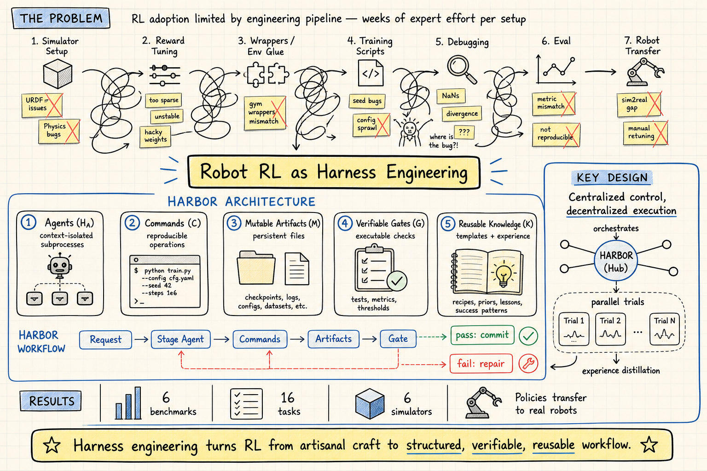

# Harness Engineering — 2026-06-30

## 1. HARBOR: A Harness Framework for Agentic Robot Reinforcement Learning

- **arXiv**: 2606.08610 (2026-06-07)
- **Link**: https://arxiv.org/abs/2606.08610
- **Authors**: Zechu Li, Yufeng Jin, Xiaoyang Liu, Puze Liu, Vignesh Prasad, Carlo D'Eramo, Georgia Chalvatzaki
- **Affiliations**: TU Darmstadt, Honda Research Institute Europe, Columbia University, Tongji University, University of Würzburg, Hessian.AI

### 這篇在說什麼

強化學習（RL）已經是機器人學習的主流方法，特別是在 sim-to-real 設定下。但 RL 的廣泛採用被演算法周圍的工程 pipeline 限制了：建 task、設 reward、調 hyperparameter 都需要大量專家手動操作，讓 RL workflow 昂貴且難以規模化。HARBOR 把 robot RL 自動化框架為一個 **harness engineering 問題**：給定一個 simulator codebase 和一個 task specification，它自動化從環境設定到策略訓練的整個 workflow。

這篇的定位很重要：它把「harness」這個概念從 Terminal-Bench 那種純文字 agent eval harness 擴展到實體機器人 RL 的全流程自動化。Harness 不只是 prompt engineering 的 wrapper，而是一個結構化的執行環境——定義 agent 如何存取工具、保存 artifacts、觀察 feedback、驗證進度。

### 主要貢獻

1. **MDP-to-Harness 的形式化**：把 robot RL pipeline 的 MDP formulation (S, A, P, r, ρ₀, γ, T) 映射到 harness tuple H_RL = (H_A, C, M, G, K)，其中 H_A 是 agents、C 是 commands、M 是 mutable artifacts、G 是 verifiable gates、K 是 reusable knowledge。這讓 RL 的穩定界面（state, action, reward, dynamics, termination）可以直接對應到 harness 的結構化介面。

2. **Gate-Checked Execution Protocol**：每個 stage 完成後通過 executable gates 驗證輸出，驗證通過才 commit artifact 並寫回 knowledge；驗證失敗則回傳 failure summary 給 stage agent 修復。這把常見的 RL engineering failures 變成 observable gate failures，防止低層級錯誤往下游傳播。

3. **Centralized Control + Decentralized Execution**：tuning 階段（reward design, domain randomization, algorithm tuning）使用 parallel sub-agents 在 isolated directories 中跑 trials，避免 context bloat 和 artifact 衝突。每個 trial 的 rollout videos、reward code、logs 都在獨立目錄中。

4. **Experience Learning**：每個 tuning round 結束後，main agent 將跨 trials 的 recurring patterns distill 成 short bullet points（effective reward terms、unstable parameter ranges、common failure modes），供後續 agents 檢索和復用。

5. **Plugin Interface**：所有 commands、artifacts、gates 都用 structured natural language 撰寫，使用者可以 audit、step in、customize，也可以直接調用個別 agents 或 commands 組建自定義 workflow。

### 方法 / pipeline

HARBOR 的五個 harness components：

- **Agents (H_A)**：context-isolated subprocesses，每個 agent 負責一個 bounded stage（dependency setup → task construction → reward design → domain randomization → algorithm integration → hyperparameter tuning）。
- **Commands (C)**：reproducible operations，從 primitive（rl-sweep）到 composed loops（tune-reward），同一 command surface 可被不同 agents 以不同 artifacts 和 gates 調用。
- **Mutable Artifacts (M)**：persistent, inspectable objects 作為 agents 和 commands 之間的通訊基底，減少對 transient LLM context 的依賴。
- **Verifiable Gates (G)**：executable checks，包括 hard interface checks（import, reset）和 softer semantic checks（rollout, reward curve），決定 stage 是否可以前進。
- **Reusable Knowledge (K)**：templates, references, scripts, human heuristics, 和跨 runs 累積的 experience，約束生成、編碼 simulator/algorithm-specific contracts。

Workflow: 用戶提交 natural-language request → main agent 分解為 bounded stages → 每個 stage 由 specialized agent 執行 → gate 驗證 → commit artifact → update knowledge → 進入下一 stage。

### 實驗設計

6 個 benchmarks，16 個 tasks，spanning manipulation, locomotion, bimanual dexterous control：

- **Simulators**: IsaacLab, ManiSkill (Sapien), Genesis, MJLab (Warp), Bi-DexHands (IsaacGym), Loco-Mujoco (MJX)
- **Tasks**: 包括 delta end-effector pose control, object manipulation, legged locomotion, bimanual dexterous control

核心結果：
- HARBOR 自動化 end-to-end simulation RL workflow，從 task specification 到 trained policy
- Reward design 和 algorithm tuning 能 match 或超過 default configurations
- 產生的 policies 可以 transfer 到 real robots（在 Unitree Go1、Franka Emika Panda 等實體平台上驗證）
- Token 和 wall-clock cost 在可接受範圍內

目前從全文 HTML 能確認完整的系統設計（Section 2-3）、五個 harness components 的定義、gate-checked execution protocol、和 end-to-end results。Ablation studies 和 efficiency analyses 需要深讀 PDF 的 Appendix D.3。

### かに讀後判斷

這篇是 harness engineering 領域目前最完整的系統論文之一。它把 harness 從「給 LLM agent 一個 structured prompt」提升到「為長期 autonomous workflow 設計 structured execution environment」，而且是在真實機器人 RL 這種 high-stakes 設定下驗證。

和 Self-Harness（2606.09498，已看過）的關係很有趣：Self-Harness 是讓 agent 自己改善自己的 harness（prompt engineering 層面），HARBOR 是讓 harness 結構化整個 RL engineering pipeline（system engineering 層面）。Self-Harness 在 Terminal-Bench-2.0 上測，HARBOR 在 6 個 simulator × 16 tasks 上測。兩者互補：Self-Harness 關注 harness prompt 的自我改善，HARBOR 關注 harness workflow 的系統化設計。

和 APEX（2606.15363，今天另一篇候選）的關係：APEX 在 Self-Harness 之上加了 L2（behavioral principles）和 L3（workflow topology），是在同一個 agent self-improvement 方向的擴展。HARBOR 則走了不同的路：不是讓 agent 自己改善 harness，而是把 harness 本身設計成可組合、可驗證、可復用的工程結構。

值得深讀的重點：Section 2 的 harness formalization、Section 3 的 gate-checked execution protocol、和 Appendix C 的完整 stage descriptions。對於做 agent evaluation 或 agent engineering 的人來說，五個 harness components 的設計是直接可借鑑的。

🦞 **今日推薦點開**

---

## 2. APEX: Adaptive Principle EXtraction — A Three-Layer Self-Evolution Framework for Production AI Agents

- **arXiv**: 2606.15363 (2026-06-13)
- **Link**: https://arxiv.org/abs/2606.15363
- **Authors**: Ya-Chuan Chen, Tien-Jen Lai, Hsiang-Wei Hu

### 這篇在說什麼

Self-Harness（2606.09498）讓 agent 透過 mining failure clusters 和 patching harness 來改善自己的 prompt harness，在 Terminal-Bench-2.0 上達到 14-21% 的改善。但 Self-Harness 只優化了一個維度——prompt harness——行為原則和 workflow 拓撲都沒動。APEX 提出一個三層共演化框架，同時演化：(L1) harness via failure-mode patching、(L2) behavioral principles via success-trace distillation、(L3) agent workflow topology via structural fitness-based selection。

### 主要貢獻

1. **三層演化框架**：L1 harness patching（繼承 Self-Harness）、L2 principle distillation（從成功 trace 中提取可復用行為原則）、L3 workflow topology selection（透過結構適應度選擇最佳 workflow 拓樸）。

2. **Production-grade 評估**：在 Joe（NVIDIA Nemotron 上的 production-grade super AI Agent）管理 15-node compute fleet，用 114 個 real task traces 收集 18 天的數據。

3. **Health Score**：APEX Health Score 從 baseline 0.300 提升到 0.570（+90%），distilling 6 個 novel reusable principles，選出 research-first workflow topology（0.900, +20%）。

4. **低成本**：每次演化只需 4 個 LLM calls（~270s）在 local qwen2.5-coder:32b 上。

### 方法 / pipeline

- **L1 — Harness Patching**：直接繼承 Self-Harness 的 failure-mode mining 和 patch generation。
- **L2 — Principle Distillation**：從成功 task traces 中提取 behavioral principles（例如「先搜尋再分析」、「驗證前不要假設」），作為未來 task 的 soft constraints。
- **L3 — Workflow Topology Selection**：定義多種 workflow 拓樸（linear, branching, research-first, parallel），透過 fitness-based selection 在 task traces 上選擇最適合的拓樸。

三層共演化：每次 evolution run 同時更新 harness patches、principles、和 topology selection。

### 實驗設計

- **Platform**: Joe, production-grade super AI Agent on NVIDIA Nemotron, managing 15-node compute fleet
- **Data**: 114 real task traces over 18 days
- **Results**: 
  - APEX Health Score: 0.570 (baseline: 0.300, +90%)
  - Distilled 6 novel reusable principles
  - Research-first workflow topology: 0.900 (baseline topology: 0.750, +20%)
  - Cost: 4 LLM calls (~270s) on local qwen2.5-coder:32b

目前只從 abstract 確認到核心結果。全文的詳細方法設計、principles 的具體內容、和 topology 的定義需要深讀 PDF。**此篇為僅 abstract 層級快速掃描。**

### かに讀後判斷

APEX 在 Self-Harness 的基礎上加了两層（principles 和 topology），方向合理但論文規模較小（8 pages, 1 figure, 4 tables）。關鍵問題是：L2 的 principle distillation 和 L3 的 topology selection 在多大程度上是正交的改善？還是大部分 gains 仍然來自 L1 harness patching？論文沒有逐層 ablation（只有 overall APEX Health Score），所以很難判斷三層共演化的邊際效益。

和 HARBOR 的對比：HARBOR 的 harness 是預先設計好的結構化環境，而 APEX 的 harness 是 agent 自己演化出來的。兩者解決的問題層次不同——HARBOR 在系統工程層面（如何結構化整個 RL workflow），APEX 在 agent self-improvement 層面（如何讓 agent 自己改善自己的 operating harness + principles + topology）。

如果 Morris 對 agent self-improvement 方向感興趣，建議和 Self-Harness 一起看。但以今天的推薦優先級，HARBOR 的系統性更強、實驗更完整。