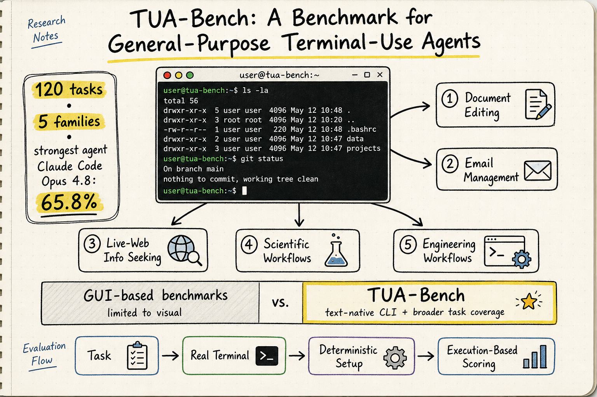

# Harness Engineering — 2026-07-02

## 1. TUA-Bench: A Benchmark for General-Purpose Terminal-Use Agents

- **arXiv**: 2606.28480
- **Link**: https://arxiv.org/abs/2606.28480
- **Website**: https://www.tuabench.ai
- **Authors**: Shoufa Chen, Luyuan Wang, Xuan Yang, Zhiheng Liu, Yuren Cong, Yuanfeng Ji, Feiyan Zhou, Xiaohui Zhang, Fanny Yang, Belinda Zeng (Meta AI, Duke, Stanford)
- **Submitted**: 2026-06-26

### 這篇在說什麼

隨著 LLM 和 harness framework 的進步，terminal agent 已經可以執行超越 coding 的更廣泛的 general computer-use task。但現有 benchmark 有個明顯的缺口：general computer-use benchmark 主要針對 GUI，terminal-based benchmark 則集中在 shell-native 的技術和程式工作流。沒有一個 benchmark 系統性地評估 terminal agent 在日常數位活動和專業科學/工程工作流上的表現。TUA-Bench 填補了這個缺口。

這篇的核心定位很清楚：terminal 不是只有 coding。Terminal 是一個 general-purpose interface to computers，而現有 benchmark 都沒有在這個廣度上評估。這對 harness engineering 有直接意義——如果 harness 只在 SWE-bench 上調優，它很可能在日常數位工作流上表現不佳。

### 主要貢獻

1. **120 個真實世界任務橫跨 5 個 task family**：Document Editing, Email Management, Live-Web Information Seeking, Scientific Workflows, Engineering Workflows。其中 Scientific 和 Engineering workflows 是和 PhD-level domain experts 共同設計的，涵蓋 biology, medical physics, architectural engineering, mechanical engineering。

2. **GUI-to-terminal reformulation**：很多原本需要 GUI 的任務（文書處理、email 管理）被重新表述為 terminal 可以執行的任務。這不是簡單的翻譯，而是需要 agent 理解 CLI 工具的使用方式。

3. **執行式評估**：每個 task 有 deterministic setup script、real terminal 執行環境、和 execution-based scoring protocol。不是看 agent 有沒有「類似」正確答案，而是看它有沒有真的把事情做完。

4. **394 個候選任務的嚴格篩選**：從初始的 394 個候選任務中，經過嚴格篩選（移除模糊指令、過度簡單、或 input-output 不匹配的任務），最終保留 120 個。

### 方法 / pipeline

TUA-Bench 的 benchmark 設計：

- **任務格式**：每個 task 以標準化格式指定，包含：task description、初始環境設定（deterministic setup script）、verifiable oracle（ground truth 或檢查腳本）
- **執行環境**：真實的 terminal sandbox，agent 透過 shell 執行命令
- **Task families**：
  - *Document Editing*：使用 CLI 工具處理文件
  - *Email Management*：透過 CLI 操作 email
  - *Live-Web Information Seeking*：在 terminal 中使用 web search/瀏覽
  - *Scientific Workflows*：和 PhD domain experts 共同設計的專業科學計算流程
  - *Engineering Workflows*：機械工程、建築工程等專業流程
- **Evaluation**：execution-based scoring protocol，不是 LLM-as-judge 或字串匹配

### 實驗設計

- **Baselines/Models**：測試了多個 frontier models 和 agent frameworks，包含 reasoning effort 的 ablation
- **Main result**：最強的 frontier agent（Claude Code with Claude Opus 4.8, max reasoning effort）只達到 65.8% overall performance
- **Gap 分析**：
  - 兩個 track（日常數位 + 專業科學）都有 substantial gaps
  - Long-horizon planning、tool use、execution monitoring、error recovery 是主要失敗模式
  - 推理強度（reasoning effort）有幫助但幫助有限

目前只從 HTML 前段確認了以上資訊。完整的 task 分佈、每個 task family 的具體數字、和 ablation 細節需要看全文的 Table 和 Figure。

### かに讀後判斷

這篇對 harness engineering 有直接且重要的意義。TUA-Bench 把「terminal agent 的能力評估」從 coding-focused 的 Terminal-Bench 推進到 general computer-use。幾個值得注意的點：

1. **Harness 的評估不能只看 coding task**：如果一個 harness 只在 SWE-bench 上調優，它可能在 document editing 或 email management 上表現很差。TUA-Bench 提供了更廣泛的評估維度。

2. **65.8% 的上限說明還有很大進步空間**：最強的模型+harness 組合也只過了三分之二的任務，這意味著 harness 的 error recovery、long-horizon planning、和 tool orchestration 都還有大量改善空間。

3. **和之前讀過的 Harness-Bench (2605.27922) 互補**：Harness-Bench 側重 harness 配置對 agent 表現的影響，TUA-Bench 側重任務廣度和真實性。兩者結合可以更全面地評估 harness。

4. **和之前讀過的 LemonHarness (2606.24311) 的 Terminal-Bench 2.0 結果（84.5–86.5%）形成對比**：LemonHarness 在 Terminal-Bench 2.0 上的高分可能不代表它在 TUA-Bench 的 general-purpose task 上也能達到同樣水準。

**今日推薦點開**。深讀時優先看：Table 的 task family 分佈、各 model 的 breakdown、reasoning effort ablation、和 error analysis。

