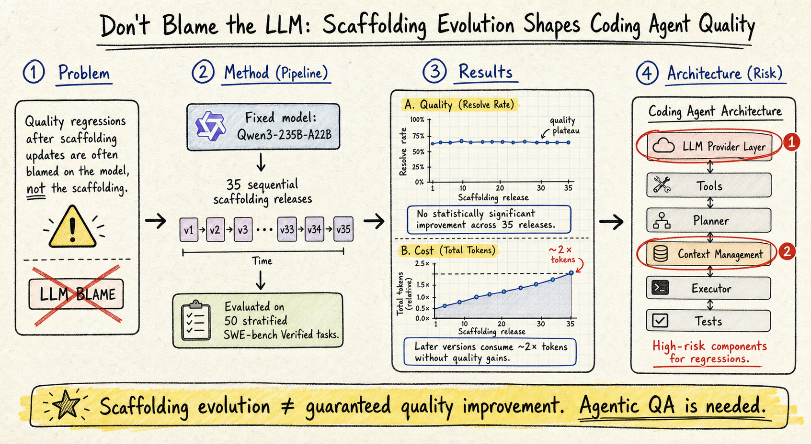

# Harness Engineering — 2026-07-17

## 1. Don't Blame the Large Language Model: How Scaffolding Evolution Shapes Coding Agent Quality

- **arXiv**: 2607.03691
- **Link**: https://arxiv.org/abs/2607.03691
- **Authors**: (詳 arXiv 頁面)
- **Venue**: ACM TOSEM 2026
- **Submitted**: 2026-07

### 這篇在說什麼

Coding agent 的品質到底是由底層 LLM 決定，還是由中間的 agentic scaffolding 決定？實務上，開發者經常在更新 scaffolding 後觀察到品質回歸，但傾向歸咎於模型。這篇做了第一個「固定模型、變動 scaffolding」的受控縱向研究，追蹤 Qwen Code CLI 的 35 個連續版本在 SWE-bench Verified 上的表現。結論非常清楚：scaffolding 的演進對 agent 品質有決定性影響，而且後期版本消耗將近兩倍的 token 和 tool call 卻沒有對應的品質提升。這篇直接挑戰了「模型是 coding agent 品質瓶頸」的主流假設。

### 主要貢獻

1. **量化了「hyper-churn」現象**：五個主要開源 scaffolding（Codex, Qwen Code, Gemini, OpenCode, OpenHands）的發布速度超過每天兩版、幾個月內累積數千 issue。這種演化速度遠超成熟傳統開源專案。
2. **首次受控縱向評估**：固定 Qwen3-235B-A22B 模型，只變動 scaffolding 版本，在 50 個分層抽樣的 SWE-bench Verified 任務上評估 35 個連續版本。結論：scaffolding 的 SWE-bench 解決率在 35 個版本之間沒有統計顯著改善。
3. **定位了架構層面的高風險元件**：LLM Provider layer 和 Context Management 是最常伴隨品質回歸的元件；Extensibility 和 Security 元件的修改則通常是安全或中性的。
4. **提出「Agentic QA」實踐**：現有的 CI/CD 只檢查 functional correctness，無法捕捉 emergent behavioral quality regression（如 token 消耗暴增）。需要新的品質保證機制。

### 方法 / pipeline

- **研究設計**：
  - RQ0：Scaffolding 專案的演化規模與速度？（分析五個開源 scaffolding 的 commit, issue, release）
  - RQ1：固定模型下，scaffolding 版本對 agent effectiveness（resolve rate）和 efficiency（token, tool call）的影響？
  - RQ2：什麼開發模式（feature-heavy, fix-heavy, scattered）對應品質波動？
  - RQ3：哪個架構元件的修改最常伴隨品質回歸？

- **實驗流程**：
  1. 收集 Qwen Code CLI 從 v0.1 到 v0.35 的 35 個連續版本。
  2. 每個版本在 50 個分層抽樣的 SWE-bench Verified 任務上跑完整 evaluation。
  3. 記錄 resolve rate、token consumption、tool call count。
  4. 對每個版本的 commit 進行架構映射（mapping 到 reference architecture 的元件）。
  5. 分析開發模式與品質變化的相關性。

- **架構映射**：將每個 commit 映射到以下元件：LLM Provider Layer、Context Management、Tool Execution、Security/Sandboxing、Extensibility。

### 實驗設計

- **模型**：Qwen3-235B-A22B（固定）。
- **Benchmark**：SWE-bench Verified，50 個分層抽樣任務。
- **Scaffolding**：Qwen Code CLI 的 35 個連續版本。
- **主要結果**：
  - Resolve rate 在 35 個版本間無統計顯著改善趨勢（p-value 不顯著）。
  - 後期版本 token consumption 接近早期的 2 倍。
  - Feature-heavy release 短期提升 effectiveness 但犧牲 efficiency。
  - LLM Provider Layer 和 Context Management 修改最常伴隨品質回歸。
  - 所有記錄到的品質回歸都通過了既有的 CI/CD pipeline——意味著既有測試無法捕捉這類 emergent regression。
- **限制**：只測了 Qwen Code CLI 一個 scaffolding；SWE-bench Verified 只測 bug fixing，不涵蓋其他 coding agent 任務類型。
- 已讀來源：arXiv HTML 全文前段（約 20000 字），涵蓋完整 introduction 和部分 methodology；後段結果和討論需下載 PDF 確認。

### かに讀後判斷

這篇是今年 harness engineering 領域最重要的實證研究之一。它直接回應了一個實務痛點——scaffolding 更新後 agent 品質下降，但大家總怪模型。對照同一期 2607.12227（Rethinking Harness Evolution Evaluation），兩篇形成互補：這篇說「scaffolding 演化不一定帶來品質提升」，那篇說「harness evolution 的評估方法本身有問題」。Morris 如果在做 harness 相關工作，這兩篇必須一起看。深讀優先看 Figure 2（35 版本的 resolve rate 和 token consumption 趨勢）、Table 3（架構元件風險映射）和 Section 5（Agentic QA 提案）。

## 2. Rethinking the Evaluation of Harness Evolution for Agents

- **arXiv**: 2607.12227
- **Link**: https://arxiv.org/abs/2607.12227
- **Authors**: Yike Wang, Huaisheng Zhu, Zhengyu Hu, Yige Yuan, Zhengyu Chen, Shakti Senthil, Hannaneh Hajishirzi, Yulia Tsvetkov, Pradeep Dasigi, Teng Xiao
- **Affiliations**: Allen Institute for AI, University of Washington, Independent
- **Submitted**: 2026-07

### 這篇在說什麼

Harness evolution（自動化地改進 agent 的 scaffolding / harness）是近期熱門研究方向，但現有評估方法有兩個根本問題：（1）harness evolution 本身就是一種搜尋程序——反覆評估和修改候選 harness——這和 test-time scaling（用更多推理運算來改善單次任務表現）在本質上是同一類方法，卻沒有在可比較的 feedback 和 inference budget 下做公平比較；（2）搜尋和最終評估用的是同一組 benchmark tasks，因此報告的改善可能只是 overfit 到那組 tasks，而不是真正改善了 harness 設計。這篇在 Terminal-Bench 2.1 上用 GPT-5.4 和 Claude Opus 4.6 做了系統性實驗，結論是：harness evolution 不穩定地勝過簡單的 test-time scaling，而且在 disjoint task sets 上泛化能力有限。

### 主要貢獻

1. **統一的 budget 視角**：把 harness evolution 和 test-time scaling 放在同一個計算預算框架下比較，明確了每種方法的 feedback 來源、預算分配方式、以及它修改的是 trajectory 還是 harness 本身。
2. **引入 Harness Scaling 作為新 baseline**： Harness Scaling 是 harness 層面的 test-time scaling——對每個任務單獨修改 harness，而不是跨任務學出一個通用 harness。這是一個更公平的 baseline。
3. **實證發現**：在沒有 unit test feedback 的情況下，harness evolution 在平均表現上不如 simple test-time scaling。在有 unit test feedback 時，harness evolution 的改善可能只是 task-specific overfitting，在 disjoint evaluation set 上泛化能力有限。

### 方法 / pipeline

- **四種方法的統一形式化**：
  - **Parallel Sampling**：獨立抽 K 條 trajectory，取最好的。
  - **Sequential Refinement**：根據前一條 trajectory 的 feedback 迭代修改 trajectory。
  - **Harness Evolution**：跨任務學出一個通用 harness，用 verifier feedback 搜尋。
  - **Harness Scaling**：對每個任務單獨迭代修改 harness（task-specific harness adaptation）。

- **Budget 控制**：每種方法在相同的 inference budget K 下運行，明確 feedback 來源（是否有 unit test）。

### 實驗設計

- **Benchmark**：Terminal-Bench 2.1（89 個 terminal tasks，修復了 v2.0 的 28 個問題）。
- **模型**：Claude Opus 4.6、GPT-5.4、GPT-5.4 mini。
- **主要結果**：
  - 沒有 unit test 時，harness evolution 平均表現不如 parallel sampling 和 sequential refinement（Figure 1）。
  - 有 unit test 時，harness evolution 的改善可能來自 task-specific overfitting，而非通用 harness 設計改善。
  - 在 disjoint task set 上，evolved harness 的泛化能力有限。
- **限制**：只在 Terminal-Bench 一個 benchmark 上測試；Harness Evolution 的實現用了 AHE（關閉 explore agent），可能不代表所有 harness evolution 方法。
- 已讀來源：arXiv HTML 全文前段（約 20000 字），涵蓋完整 introduction、method formalization 和部分實驗；後段完整結果需 PDF 確認。

### かに讀後判斷

這篇和 2607.03691（Don't Blame the LLM）是同一期的兩篇 harness engineering 重要論文，形成強烈對話。前者說「scaffolding 演化不一定帶來品質提升」，這篇說「harness evolution 的評估方法本身有問題——你可能只是在 overfit benchmark」。兩篇加在一起，對 harness engineering 領域的啟示是：既要注意 scaffolding 版本回歸，也要注意評估方法的公平性。Morris 做 harness 相關工作時，這兩篇的實驗設計和結論都很值得參考。深讀優先看 Figure 1（三模型平均結果）、Section 3（統一形式化）和 Section 4.4（泛化實驗）。