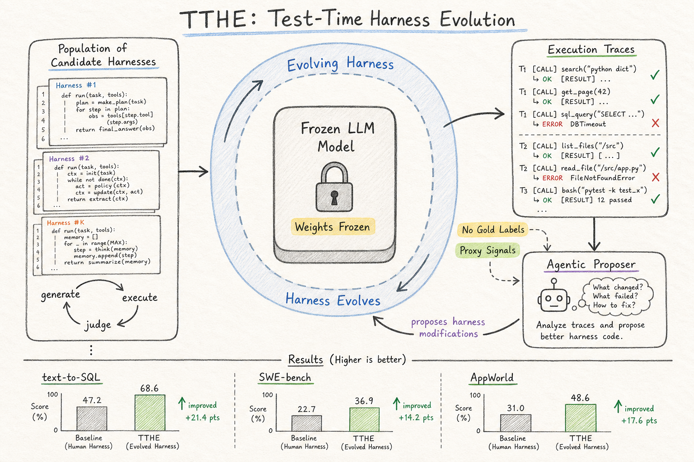
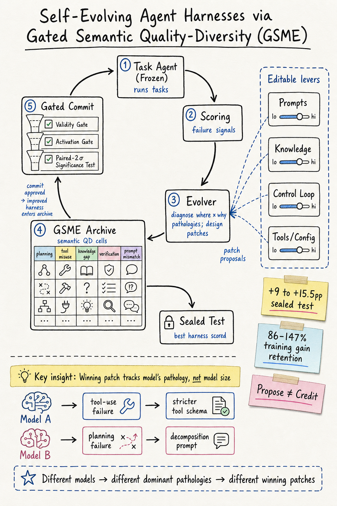

# Harness Engineering — 2026-07-18

## 1. From Prompts to Contracts: Harness Engineering for Auditable Enterprise LLM Agents

- **arXiv**: 2607.08028
- **Link**: https://arxiv.org/abs/2607.08028
- **Authors**: Moonsoo Kim et al. (AI Leadership Research Center / CEO AI)
- **Submitted**: 2026-07

### 這篇在說什麼

企業 LLM 應用通常從 prototype 開始：一個 system prompt、一組檢索文件、一個 UI。這種「prompt-dominant」原型可以展示功能，但不能保證行為可追蹤、可驗證、可稽核。這篇提出 harness engineering 方法，把 prompt-dominant 原型重構為「traceable, auditable LLM-agent architecture」：確定性行為移到 code、manifests、schemas 和 validation artifacts，而 source-backed claims 仍然是 runtime 答案的權威。這不是一個模型改進工作，而是一個工程方法論工作——研究如何把探索性原型變成可交付的產品。

### 主要貢獻

1. **Harness engineering 方法**：將 prompt-dominant 企業原型重構為可追蹤 LLM agent 架構的系統性方法。核心是「replaceable composition boundary」——把確定性控制（routing、validation、trace）從 LLM phrasing 分離。
2. **Source-to-claim knowledge pipeline**：從原始文件到 evidence records、runtime-eligible claims、maintained wiki context、reader-facing answers 的五層 pipeline。這不只是 RAG——它要求每個回答都能追溯到 source manifest 中的具體 claim。
3. **三個 RQ 的系統性驗證**：RQ1 測 harness 是否跨固定 validation set 保持所有 contract（source-grounding、entity-routing、trace、output-hygiene、recommendation-language）；RQ2 測 model substitution 下 contract 是否仍然成立；RQ3 測 code-owned enforcement 是否「load-bearing」——同樣模型只靠 prompt 能否達到同樣效果。
4. **Ablation 發現**：bolt-on external guardrail 能阻止 violation 但 over-refuse（88/120 utility），而 harness 保持 full utility（120/120）。只有 code-owned enforcement 同時保全安全與 utility。

### 方法 / pipeline

- **Source-to-claim pipeline**：Raw documents → Evidence records → Runtime-eligible claims → Maintained wiki context → Reader-facing answers。每層都有明確的 schema 和 validation gate。
- **Replaceable composition boundary**：Harness side（manifests、routing、claim eligibility、answer contracts、traces）vs. model-composed side（LLM phrasing）。兩側之間有明確的介面。
- **Validation artifacts**：Source grounding（每個 claim 可追溯到 source）、entity routing（問題路由到正確實體）、trace completeness（每個答案的完整生成軌跡）、output hygiene（不洩漏內部 trace 到讀者）、recommendation language（不給未經 source 授權的建議）。
- **Instance**：韓國五大企業集團、25 家上市公司、113 條 source-backed runtime claims。

### 實驗設計

- **RQ1（Contract preservation）**：固定 validation set 上，harness 保持所有五個 contract。Fault-injection control 證實 validators 能抓到刻意破壞的 contract。
- **RQ2（Model substitution）**：三個 hosted model 在 270 個 composition-boundary runs 上全部通過 harness 的 checks。失敗只發生在 model-composed side，被 harness 抓到並記錄。
- **RQ3（Load-bearing enforcement）**：固定模型、只變 enforcement layer。Prompt-only instruction 讓 recommendation-language 和 internal-trace-leakage violation 洩漏到讀者端；harness 完全阻擋。Bolt-on guardrail 也阻擋但 over-refuse（utility 從 120/120 掉到 88/120）。
- 已讀來源：arXiv HTML 全文前段約 12000 字，涵蓋完整 introduction、related work 和部分 methodology；後段實驗細節需 PDF 確認。

### かに讀後判斷

這篇跟昨天 2607.03691（Don't Blame the LLM）和 2607.12227（Rethinking Harness Evolution）形成一組很好的對照。那兩篇聚焦在 harness 如何影響 agent 品質和評估方法，這篇則聚焦在企業場景下 harness 如何保證可審計性。核心洞察是「prompt 不是 contract」——你無法用 prompt 保證行為，因為 prompt 是給模型的建議，而 code-owned enforcement 是系統的保證。對 Morris 來說，如果正在思考 agent harness 的工程方法論，這篇提供了「把行為從 prompt 移到 code」的具體路線圖。深讀優先看 Figure 2（architecture diagram）、Section 4（validation design）和 Table 2（RQ3 ablation results）。

## 2. TTHE: Test-Time Harness Evolution

- **arXiv**: 2607.08124
- **Link**: https://arxiv.org/abs/2607.08124
- **Authors**: Jun Nie, Yonggang Zhang, Jun Song, Qianshu Cai, Dahai Yu, Yike Guo, Xinmei Tian, Bo Han (HKBU, USTC, HKGAI, TCL)
- **Submitted**: 2026-07
- **Code**: https://github.com/junnie00/TTHE

### 這篇在說什麼

LLM agent 的行為不只由模型決定，也由它周圍的 harness 決定——prompt、工具呼叫邏輯、錯誤恢復、context 構建。現有方法在部署前搜尋最佳 harness 然後凍結，但測試時的分佈、failure mode、工具互動可能完全不同。TTHE 提出一個根本性問題：harness 能否在評估期間自我演化？答案是肯定的——TTHE 在無標籤測試 batch 上維護一個 candidate harness population，用 agentic proposer 從 execution traces 推理弱點並提議修改，judge 根據 execution-derived proxy signals 選擇更好的 harness，選中的程式碼持續管轄後續輸入。模型權重不更新、不需要 gold labels、不訓練額外模型。

### 主要貢獻

1. **Formulation**：把 test-time adaptation 重新框架為「executable harness 的演化」，而不是模型權重更新、單次 reflection 或部署前搜尋。Solver、proposer、judge 是同一凍結 LLM 的不同 role 和 harness。
2. **五個 domain 的穩定提升**：text-to-SQL（Spider dev）、competitive programming（LiveCodeBench）、software engineering（SWE-bench Lite）、data-science coding（DS-1000）、agentic tool-use（AppWorld）。所有設定都改善固定 ReAct baseline。
3. **可檢視的政策**：演化出的 harness 是可讀的程式碼——修訂的 context construction、multi-sample generation、tool-mediated grounding、deterministic contract checks、conditional recovery branches——不是黑箱。
4. **失敗模式分析**：Performance 不是 search budget 的單調函數；proxy-rewarded harness 可能是錯的（selection regret）；agentic judge 可能 commit 一個看似合理但實際不正確的程式。

### 方法 / pipeline

- **Population-based generate-and-judge loop**：
  1. Solver harness 在測試 batch 上執行，產生 execution traces。
  2. Agentic proposer 讀取 traces，推理失敗模式，提議 harness 修改（程式碼 patch）。
  3. 修改後的 harness 在同一 batch 上執行。
  4. Judge 根據 execution-derived proxy signals（如 test pass rate、runtime error rate、output format compliance）選擇一個 harness。
  5. 選中的 harness 成為下一輪的 solver。
- **關鍵設計**：
  - Gold labels 在演化過程中不可見，只用於最終測量。
  - Proposer 和 judge 是同一凍結 LLM 的不同 harness（不同 role 和 context）。
  - Harness 修改是真正的程式碼修改——修訂 context construction、加 verification step、改 recovery strategy——不是文字 reflection。

### 實驗設計

- **五個 evaluation domains**：Spider dev（text-to-SQL）、LiveCodeBench（competitive programming）、SWE-bench Lite（software engineering）、DS-1000（data-science coding）、AppWorld（agentic tool-use）。
- **Baseline**：固定 ReAct-style harness。
- **主要結果**：TTHE 在所有五個 domain 上改善 baseline，產生可檢查的政策變更（如加 verification step、改 context construction）。
- **Ablation**：
  - Search budget：performance 非單調，過多 candidate 反而可能讓 judge commit 錯誤選擇。
  - Batch size：影響 proxy signal 品質。
  - Cross-model：proposer/judge 可以和 solver 用不同模型。
- **核心挑戰**：Proxy quality 是 central bottleneck——execution trace 中的成功/失敗不是 ground truth，一個 query 可以成功執行但回答錯誤的問題。
- 已讀來源：arXiv HTML 全文約 12000 字，涵蓋完整 introduction、related work 和部分 method；後段實驗細節需 PDF 確認。

### かに讀後判斷

這篇是 harness engineering 領域的重要理論推進。它把「test-time adaptation」從模型層面搬到 harness 層面，核心洞察是：execution traces 本身就是 rich operational evidence，不需要 labels 就能改善 agent 行為。跟昨天 2607.12227（Rethinking Harness Evolution Evaluation）形成直接對話——那篇說 harness evolution 的評估方法有問題，這篇則展示了一個具體的 harness evolution 方法，同時誠實承認 proxy quality 和 judge reliability 是核心限制。跟今天的 2607.13683（GSME）也形成有趣對比：TTHE 用 population-based search，GSME 用 quality-diversity archive；TTHE 用 execution proxy，GSME 用 statistical significance gate。Morris 如果在做 agent 自動化改善，這兩篇必須一起看。深讀優先看 Figure 2（TTHE loop diagram）、Table 2（main results across five domains）和 Section 5（failure mode analysis）。

## 3. Self-Evolving Agent Harnesses via Gated Semantic Quality-Diversity

- **arXiv**: 2607.13683
- **Link**: https://arxiv.org/abs/2607.13683
- **Authors**: (詳 arXiv 頁面)
- **Submitted**: 2026-07

### 這篇在說什麼

Harness self-evolution 的核心困難不在於產生改動，而在於判斷哪個改動真的有幫助。自我生成的 feedback 是 noisy 的——一次評估的隨機波動可以製造出假改善的假象，training-set 上的改善可能只是 overfitting。這篇提出 GSME（Gated Semantic MAP-Elites）架構，核心創新是分離「proposing」和「crediting」：evolver（較強模型）診斷失敗並提議 (where×why) patches，但所有抽樣、測量、顯著性檢定由確定性程式碼持有。Patches 進入一個以病理為 key 的品質多樣性封存，而非以 task 為 key——這是一個 anti-overfitting bias。Sealed test 只在演化結束後評分一次，credited gains 在 sealed test 上 +9 到 +15.5pp，保留 86–147% training gain。

### 主要貢獻

1. **Auditable self-evolution loop**：完全 reproducible 的 git-tracked evolution tree。Evolver 擁有語意，確定性程式碼擁有所有抽樣、測量和顯著性檢定。每個 credited improvement 都是 reproducible 和 attributable 的。
2. **Gated Semantic MAP-Elites (GSME)**：以 (where×why) 病理為 key 的品質多樣性封存，而非以 task 為 key。Anti-overfitting inductive bias：同一個病理在不同 task 上的 fix 會被歸到同一個 cell。Cross-cell recombination 允許不同病理的 patches 組合。在四個 domain 中，最終 credited harness 是跨 cell recombination，而不是單一 cell 的 elite。
3. **Held-out evidence that gains generalize**：Credited sealed-test gains +9 到 +15.5pp，保留 86–147% training gain。在 harness-optimization 文獻普遍記錄 overfitting 的背景下，這是正面結果。
4. **Model-specific patches, transferable loop**：贏的 patch 追蹤模型的 dominant pathology，而非模型的規模或家族。換模型會改變 pathology 和 patch。但「diagnose-and-credit」這個 loop 本身是可轉移的。

### 方法 / pipeline

- **Self-evolution loop**：
  1. Task Agent（凍結模型）在 train tasks 上執行，產生 per-task results 和 failure signals。
  2. Scoring 回報 results 和 failure signals。
  3. Evolver（較強模型）診斷 (where×why) pathologies 並設計 patches。
  4. Preflight prune：丟棄不會 fire 的 inert candidates。
  5. Gated commit：每個 patch 經過 validity gate（重新跑 infrastructure failures）、activation gate（patch 是否真的 fired）、paired-2σ significance test。
  6. GSME archive 更新：以 pathology 為 key，只有通過 gate 的 patch 才能成為 cell elite。
  7. 最終 harness 在 sealed test 上只評分一次。
- **四個 editable levers**：prompts、knowledge injection、control loop、tools/configuration。不只是 prompt optimization。
- **Cross-cell recombination**：最終 harness 可以組合不同 pathology cells 的 patches。

### 實驗設計

- **七個 domains**：Terminal-Bench 2 的三個子集 + EvoAgentBench 的三個子集 + AppWorld。
- **模型**：凍結的 open-weight model（不同設定用不同規模/家族）。
- **主要結果**：
  - Credited sealed-test gains：+9 到 +15.5pp。
  - 保留 86–147% training gain。
  - 在四個 domain 中，最終 credited harness 是 cross-cell recombination。
  - Accepted edits 橫跨所有四個 levers，而非只 collapse 到 prompt edits。
- **Ablation**：
  - 在 AppWorld 上，同一個 harness 演化流程用於三個不同模型（兩個家族），贏的 patch 不同但 pathology-to-patch 的 mapping 有規律：engagement→verify-finalize 在一個模型上，careless→submit-verify 在兩個模型上。
  - 同一個 loop 可以轉移到不同模型，但具體的 harness patch 是 model-specific 的。
- 已讀來源：arXiv HTML 全文約 12000 字，涵蓋完整 abstract、introduction 和 related work；實驗數字和 ablation 細節需 PDF 確認。

### かに讀後判斷

這篇跟 TTHE（2607.08124）是今天 harness engineering 雙主角。TTHE 在 test-time 演化 harness，GSME 在 train-time 演化 harness 但用 sealed test 保證不 overfitting。兩篇的核心差異在於：TTHE 用 execution-derived proxy 做 judge，GSME 用確定性 significance gate 做 credit。GSME 的病理為 key 的封存設計是一個很聰明的 anti-overfitting bias——它不說「這個 patch 在哪些 task 上有效」，而說「這個 patch 解決了什麼病理」。這對 Morris 的工作很有參考價值：如果你要設計自動化 harness 改善系統，GSME 的 diagnose-and-credit loop 是比單純 prompt optimization 更穩健的路線。深讀優先看 Figure 1（evolution loop diagram）、Table 2（sealed-test results）和 Section 4（pathology-to-patch analysis across models）。

