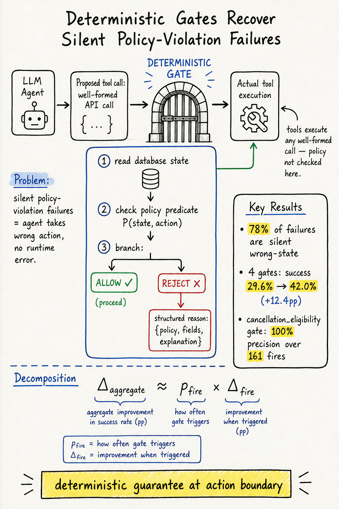

# Harness Engineering — 2026-07-19

## 1. Deterministic Gates Recover a Silent Policy-Violation Failure Mode in Tool-Using LLM Agents

- **arXiv**: 2607.07405
- **Link**: https://arxiv.org/abs/2607.07405
- **Authors**: Vikas Reddy Challaram, Sumanth Reddy Challaram, Abhishek Basu (IIT Kharagpur, MIT)
- **Submitted**: 2026-07-08 (v1), 2026-07-11 (v2)
- **Venue**: KDD 2026 Workshop on Evaluation and Trustworthiness of Agentic AI (KDD-ETAAI '26)

### 這篇在說什麼

Tool-using LLM agent 在 policy-permissive 環境中有一種隱蔽的失敗模式：agent 違反了它應該遵守的政策，但底層工具照常執行了這個違規操作，沒有任何 error signal 回傳。結果是 agent 以為任務完成了，操作者看 transcript 也一切正常，但系統狀態已經錯了——booking 被取消、乘客人數被修改、未驗證的 claim 被處理了。這不是 capability 問題，而是 trust 問題：agent 系統缺少一個可靠信號來標記「模型在 mutate 狀態之前沒有正確應用政策」。

作者在 τ²-bench airline domain 上量化了這個失敗模式：budget agent 上 78% 的失敗是 silent wrong-state failure（工具不報錯，但最終狀態違反政策）。然後提出一個輕量級干預：deterministic, read-only pre-execution gates，在 mutating tool call 執行前檢查 proposed call 和當前 database state。四個 gates 讓 gpt-4o-mini 的成功率從 29.6% 提升到 42.0%（+12.4pp），在 disjoint replication set 上重現（+12.3pp）。更重要的是，gpt-5.2 在 default reasoning 下仍然嘗試 policy-violating writes，同樣的 gate suite 改善 +10.4pp。

### 主要貢獻

1. **Silent policy-violation failure mode 的系統性刻畫**：明確命名並量化了這個失敗模式——78% 的 observed failures 是 silent wrong-state failures，沒有工具錯誤，agent 自己不知道犯錯了。而且這不是採樣噪音：pass₁ = 29.6% 但 pass₅ = 8.0%，表示大部分 task 只在部分 trial 成功，單次運行無法可靠判斷是否合規。
2. **Deterministic pre-execution gates**：在 mutating tool call 和實際執行之間插入一個 thin layer，每個 gate 是一個確定性的、只讀的、可審計的 policy predicate。Gate 不寫狀態、不呼叫另一個模型、不使用 ground-truth evaluator 資訊——它只讀取和 agent 相同的 operational state。
3. **Replicated empirical result**：在 disjoint 15-seed replication set 上重現改善效果（+12.3pp, P=0.0008），而非 seed artifact。Per-gate audit 顯示 lift 幾乎完全由一個高精度 gate（cancellation_eligibility, 100% precision over 161 fires）承擔。
4. **Boundary analysis**：兩個 negative controls——self-enforcing retail domain 和 BFCL——證明 gates 只在 policy-permissive 環境中有用，在工具已經 self-enforce 的環境中幾乎沒有額外貢獻。

### 方法 / pipeline

- **Gate 機制**：在 agent 的 mutating tool call 之前，pre-call dispatcher 攔截每個 proposed tool call。Gate 讀取相關 database state，檢查 proposed call 是否違反 domain policy predicate。如果違反，返回 structured rejection message（不是 error，而是「你試圖做 X，但政策 Y 不允許」）；如果不違反，original tool call 正常執行。
- **Four-gate suite**：
  1. **cancellation_eligibility**：檢查預約是否符合取消資格。
  2. **baggage_allowance**：檢查行李更新是否符合艙等和會員限制。
  3. **passenger_count_change**：檢查是否嘗試修改乘客人數（通常政策禁止）。
  4. **read_before_write**：檢查 agent 是否在讀取記錄後才嘗試寫入。
- **Fail-open design**：如果 gate 本身拋出 exception，harness 記錄錯誤但允許 original call 執行。避免 gate implementation failure 引入新的 false blocks。
- **Evaluation-replay scrub**：被 gate 阻擋的 tool call 從 recorded action history 中移除，避免在 ungated evaluation environment 中 replay 時產生不匹配。

### 實驗設計

- **Benchmark**：τ²-bench airline domain，50 tasks × 5 trials = 250 trials per condition。使用 corrected task set（修正了原 release 的 labeling errors）。
- **Budget tier**：gpt-4o-mini agent + gpt-4.1 user simulator，temperature 0。
- **Frontier tier**：gpt-5.2 at default reasoning + gpt-4.1 user simulator。
- **Main results**：
  - Budget tier：vanilla 29.6% → gated 42.0%（+12.4pp, P=0.0012）。
  - Replication set：+12.3pp, P=0.0008。
  - Firing decomposition：26/50 firing tasks 改善 +19.2pp；24/50 non-firing tasks 改善不顯著。
  - Frontier tier：vanilla 61.2% → gated 71.6%（+10.4pp, P=0.020, n=5, no replication）。
- **Negative controls**：
  - Self-enforcing retail domain：gates 幾乎沒有額外貢獻（工具本身已經 enforce preconditions）。
  - BFCL（general function calling）：gates 無明顯改善。
- **Per-gate audit**：cancellation_eligibility gate 100% precision over 161 fires，承擔了幾乎所有 lift。passenger_count_change gate 只有 5% precision——gates 的精度本身需要 audit。
- 已讀來源：arXiv HTML 全文約 20000 字，涵蓋完整 abstract、introduction、method（gate 機制、four-gate suite、evaluation setup）和部分結果；附錄需 PDF 確認。

### かに讀後判斷

這篇是 harness engineering 領域一個非常精準的貢獻。它不是在說「agent 需要更好的 model」或「需要更多 training」——它在說「即使模型已經被指示遵守政策，policy-permissive 的工具環境仍然會靜默地執行違規操作，而這個失敗模式不能通過 resampling 或更強的模型來解決」。Deterministic gates 的核心洞察是：在 action boundary 上加一個只讀的、可審計的 policy check，可以確定性地阻止一類已知的違規行為。

跟昨天 AgentCheck（2607.11098）的對比很有趣：AgentCheck 是一個 fault injection + reproduce-intervene-confirm loop 的工作台，用來測試 agent 在工具故障下的行為；Deterministic Gates 是一個 runtime enforcement 機制，用來阻止已知的 policy-violating writes。兩者互補：AgentCheck 幫你發現問題，Deterministic Gates 幫你確定性地阻止一類問題。

跟之前 TTHE（2607.08124）和 GSME（2607.13683）的對比：TTHE 和 GSME 是 harness evolution（在測試或訓練時演化 harness），Deterministic Gates 是 harness enforcement（在部署時確定性地執行 policy）。三篇代表了 harness engineering 的三個面向：演化、評估、執行。

對 Morris 來說，這篇的核心 take-away 是：policy-permissive 環境中的 silent violation 是一個被嚴重低估的 failure mode，78% 的失敗屬於這一類。Deterministic gates 是一個低成本、可審計、可複現的干預。深讀優先看 Section 1（failure mode characterization）、Table 2（firing decomposition）和 Section 5.3（frontier-model evidence）。

## 2. AgentCheck: A Reproduce-Intervene-Mitigate Workbench for LLM Agents over MCP

- **arXiv**: 2607.11098
- **Link**: https://arxiv.org/abs/2607.11098
- **Authors**: Aritra Mazumder, Nusrat Jahan Lia (University of Utah, University of Dhaka)
- **Submitted**: 2026-07-13 (v1), updated v3
- **Code**: https://github.com/aritra741/AgentCheck

### 這篇在說什麼

現有 agent benchmark 假設所有工具都正常工作——search API 返回結果、file write 成功、database 回傳正確資料。但真實部署中，工具可能 timeout、返回 week-stale value、或 tool description 被投毒。AgentCheck 把 MCP server 變成一個 intervention surface：先跑一遍正常 agent 獲得所有 tool response 的 baseline，然後 inject fault（12 種類型）到其中一個 response，re-run agent 看它的行為是否 divergence。更重要的是，developer 可以 toggle 一個 mitigation 後對同一個 fault 重跑，確認 fix 是否有效——這是一個完整的 reproduce-intervene-confirm loop。

這篇的核心發現是：agent 的主要弱點不是 crash，而是 silent data-quality fault。Category B（stale、contradictory、irrelevant、empty responses）是所有 five agent configurations 的最弱帶寬。即使是最強的 DeepSeek 在 Category B 也只拿到 29/40。

### 主要貢獻

1. **Reproduce-intervene-confirm loop**：第一個提供閉環 fault injection + mitigation verification 的工作台。Developer reproduce 一個 failure、apply 一個 mitigation、re-run 對 identical fault、確認 fix 是否 closing the failure。
2. **12 種 fault types 的系統性分類**：三大 family——Category A（crash/error：timeout、error、rate-limit）、Category B（data quality：stale、contradictory、irrelevant、empty）、Category C（security：tool-description poisoning、data exfiltration）。56 scenarios 來自現有 benchmark + 64 original scenarios = 120 total。
3. **Deterministic primary pass/fail + LLM judge diagnostic labels**：主要評分是確定性的（agent 是否 propagated false claim、echoed injected instruction、made unsafe outbound call），LLM judge 只是補充的診斷信號。Human annotation 驗證了兩者的一致性。
4. **Cross-agent profiling**：五個 agent 配置（DeepSeek、Claude Sonnet 4、GPT-4.1、Llama、Mistral）的 fault vulnerability profile。最好 105/120，最弱 77/120。Weakness 集中在 silent data-quality faults，不是 crashes。

### 方法 / pipeline

- **AgentCheck architecture**：
  1. **Baseline run**：Agent 對真實工具執行任務，AgentCheck 記錄所有 tool response。
  2. **Fault injection**：選擇一個 tool response，inject 12 種 fault 之一。Matching tool calls 從 cache replay，diverged calls 繼續 live。
  3. **Comparison**：Clean run vs. faulted run 並排比較，標注 divergence point。
  4. **Mitigation**：Developer toggle 一個 mitigation（如 retry、sanitization），對 identical fault 重跑。
  5. **Scoring**：Deterministic pass/fail check + LLM judge diagnostic labels。
- **Fault families**：
  - Category A（crash/error）：timeout、HTTP error、rate-limit。
  - Category B（data quality）：stale data、contradictory data、irrelevant response、empty response。
  - Category C（security）：tool-description poisoning、data exfiltration instruction。
- **MCP integration**：AgentCheck 把 MCP server 變成 intervention surface，developer 可以用自己的 MCP server 和 tool set。

### 實驗設計

- **Five agent configurations**：DeepSeek（最強 105/120）、Claude Sonnet 4、GPT-4.1、Llama（最弱 77/120）、Mistral。
- **Main findings**：
  - Category B 是所有 agent 的最弱帶寬。DeepSeek 在 Category B 只有 29/40，Llama 只有 13/40。
  - Failures 通常是 silent：agent confidently 使用錯誤的 tool output，而不是 crash。
  - Retry mitigation 在 timeout error 上有效（從 30% 提升到 100%），但 stale-data fault 幾乎不受影響（3-4/10 regardless of mitigation）。
- **Scorer reliability**：Re-running 36-scenario subset 得到 identical pass/fail outcomes。Two human annotators 和 LLM judge 的一致性：Cohen's κ 達到 substantial agreement。
- 已讀來源：arXiv HTML 全文約 20000 字，涵蓋完整 abstract、introduction、related work、fault taxonomy、architecture、部分 evaluation；後段完整的 per-fault results 和 mitigation analysis 需 PDF 確認。

### かに讀後判斷

AgentCheck 跟今天的 Deterministic Gates（2607.07405）是互補的：AgentCheck 是測試工具（幫你發現 agent 在 fault 下的行為），Deterministic Gates 是 runtime enforcement（幫你確定性地阻止一類已知問題）。AgentCheck 的 reproduce-intervene-confirm loop 設計非常實用——developer 不只是在 inject fault 後看 agent 掛了，而是可以 toggle mitigation 後對 identical fault 重跑，確認 fix 是否 closing the failure。

但要注意限制：(1) 120 scenarios 涵蓋 12 fault types，但每個 fault type 只有 10 scenarios，覆蓋面有限；(2) 只有 5 個 agent 配置，沒有測 multi-agent 或 agentic framework；(3) LLM judge 只是補充信號，primary scoring 是確定性的，但確定性 scoring 可能 miss nuanced failure modes。

對 Morris 來說，AgentCheck 提供了一個很實用的 harness evaluation 工具——特別是 Category B（silent data quality faults）的發現，跟 Deterministic Gates 的 silent wrong-state failure 完全呼應。如果你在做 agent deployment readiness，AgentCheck + Deterministic Gates 是一個很好的測試-執行組合。深讀優先看 Figure 3（cross-agent profiling heatmap）、Table 2（per-fault results）和 Section 5.2（comparative agent profiling）。