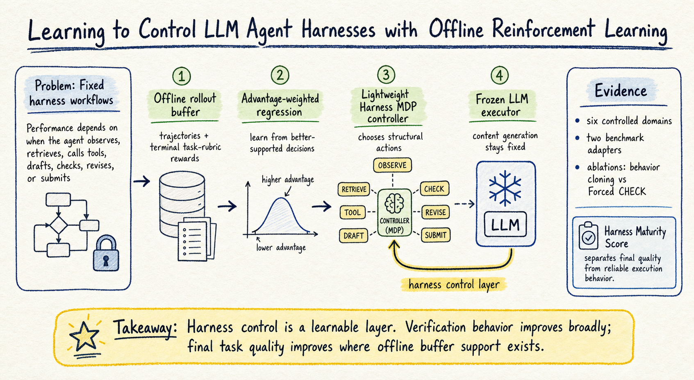

# Harness Engineering — 2026-07-20

## 1. Learning to Control LLM Agent Harnesses with Offline Reinforcement Learning

- **arXiv / Venue / 類型**: arXiv:2607.05458；preprint；agent harness control / offline RL
- **Link**: https://arxiv.org/abs/2607.05458
- **Code**: https://github.com/Hik289/Agentic-RL-harness.git
- **查重**: `check_paper_seen.py 2607.05458` → `NOT_SEEN`
- **今日讀取來源**: arXiv abstract page 與 arXiv HTML v1 全文。

### 這篇在說什麼

這篇的核心問題很像 harness engineering 最近幾篇 paper 的下一步：如果 agent performance 不只是 LLM 能力，而是 LLM 加上 context construction、tool interaction、verification、revision、stopping 等 execution harness 的共同結果，那 harness 是否只能靠工程師手寫？作者的答案是：不一定。它們把 harness 本身視為一個可以學習的 control layer，讓 controller 在執行過程中選擇下一個 structural operation，而不是固定走同一套 hand-written workflow。

作者觀察到，agent harness 裡很多失敗不是模型完全不懂任務，而是流程控制不好：該蒐證時太早寫答案，該檢查時直接提交，工具失敗後沒有 revision，或者簡單任務又浪費太多 check budget。這些問題不一定要改 prompt 或 fine-tune LLM；也可以讓外層控制器學會在不同 trajectory state 下選擇 observe、retrieve、call-tool、draft、check、revise、submit。換句話說，這篇把 harness 從固定腳手架變成 frozen LLM 周圍的一個 learnable policy。

### 主要貢獻

第一個貢獻是 Harness MDP 的形式化。state 包含 trajectory progress、draft status、evidence coverage、tool outputs、verifier feedback、recent failures、remaining budget、last action 等外部資訊；action space 則是七個 structural harness operations：observe、retrieve、call-tool、draft、check、revise、submit。這個設計刻意不動 LLM 參數，也不把 controller 變成自然語言 token policy，而是只學「下一步流程動作」。

第二個貢獻是用 offline advantage-weighted regression 訓練 controller。作者從 base / exploratory harness 收集 finite rollout buffer，每條 trajectory 只有 terminal task-rubric reward，然後提高高 advantage trajectory 中 state-action pair 的 likelihood。這比 online RL 安全也便宜，但作者也很誠實地指出：offline 方法只能重用 buffer 裡已經出現過的好 control pattern，不能憑空發明完全沒 coverage 的新成功軌跡。

第三個貢獻是分離 final task quality 和 Harness Maturity Score（HMS）。HMS 檢查 CheckBeforeSubmit、EvidenceBeforeClaim、TestBeforeSubmit、RevisionAfterFailure、ValidToolUse、StopWhenSufficient、EarlySubmit penalty 等 process events，但不作為訓練 reward。這讓 paper 能分辨「答案品質提升」和「流程更成熟」兩種不同效果，避免把一次剛好答對誤認為 harness 真的變可靠。

### 方法 / pipeline

整個 pipeline 可以想成四層。第一層是 frozen LLM executor，負責真正生成 draft、使用工具或修正答案；它的 prompt 和參數不更新。第二層是 domain adapter，定義各 domain 中七個 action 的語意、invalid action mask、verifier 與 terminal rubric。第三層是 rollout buffer，包含 base / exploratory harness 產生的 execution traces 和終局 task scores。第四層是 lightweight controller：一個小型 MLP，輸入 compact state vector，輸出下一個 structural action。

訓練時，作者用 advantage-weighted regression，把高 return trajectory 中出現的 control decisions 權重拉高。這比較像 weighted behavior cloning，而不是讓 agent 在線上亂試。推論時，controller 會根據目前 trajectory 狀態選擇是否再 retrieve、是否 check、是否 revise 或 submit。這正好對應 harness engineering 裡的核心問題：可靠 agent 不只是「有 check step」，而是要知道什麼時候 check、check 後何時 revise、何時停止。

方法上我覺得最值得注意的是它不直接 reward `check`。作者用 terminal task quality 訓練，再用 HMS 事後診斷 process behavior。這避免一個很常見的 harness bug：把「多做驗證」當成本身目的，結果 agent 過度檢查卻沒有提高 task quality。

### 實驗設計

作者在六個 controlled domains 和兩個 public-benchmark adapters 上評估。controlled domains 涵蓋 coding、research / evidence、multi-tool、long-memory、planning 等類型；public adapters 包含 adapted tau-bench retail 和 adapted AgentBench DB-Bench。所有設定共用 structural action interface，但 verifier 和 task rubric 依 domain 調整。

主要結果不是單一大幅 SOTA，而是比較細緻：AW controller 在所有 evaluation setting 中都提高 verification-before-submission；HMS 在六個 controlled domains 中有五個改善，兩個 adapter 也改善。不過 final task quality 只在部分設定明顯提升，尤其是 offline buffer 裡有足夠 high-return support 的地方，例如 adapted tau-bench retail、adapted AgentBench DB-Bench，以及有 calibrated structural verifier 的 coding。ablation 包含 behavior cloning 和 Forced CHECK，結果用來排除「只是模仿常見行為」或「硬塞 check step」就能解釋全部提升。

這裡有一個限制要記住：adapter-level evaluations 不是官方 upstream benchmark score，coding 的 verifier calibration 也會影響 measured gain。作者有承認這些 calibration choices，所以這篇比較像 proof-of-concept + controlled study，而不是可以直接拿來宣稱某個 agent framework 已經全面超越現有 benchmark。

### かに讀後判斷

我覺得這篇是今天 harness engineering 裡最值得 Morris 點開的。它和 `Stop Comparing LLM Agents Without Disclosing the Harness`、`HarnessFix`、`AgentCheck` 的關係很清楚：前幾篇把 harness 當成必須揭露、診斷、修補的工程層；這篇則把它變成可學習的 control policy。這個方向對 OpenClaw / agent workflow 很有啟發，因為很多可靠性問題其實是「何時查證、何時停止、何時回滾」的控制問題，而不是單純換更強模型。

深讀時建議先看 Section 3 Method 的 state/action/reward 定義，再看 HMS 的七個 process events，最後看 Section 5 的 per-domain result 和 ablation。真正要小心的是不要把它解讀成「offline RL 可以自動發明好 harness」。作者的 finite-buffer analysis 其實說得很保守：process pattern 可以較廣泛改善，但 final answer gain 需要 buffer 裡本來就有高品質軌跡。這對之後設計 agent harness logs 很重要，因為我們不只要記失敗，也要刻意收集多樣的成功控制路徑。
