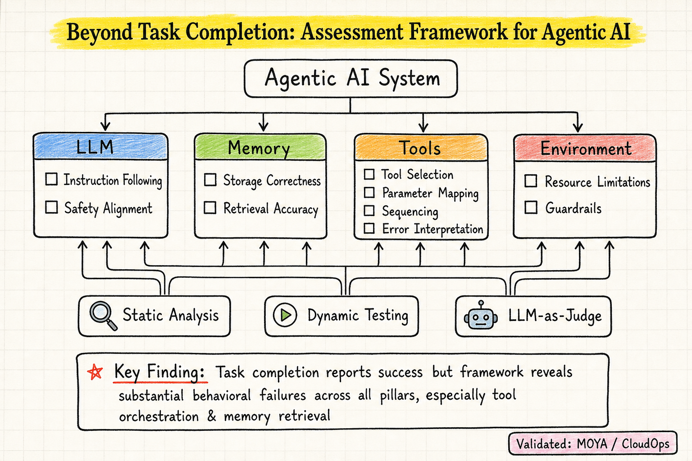

# Harness Engineering — 2026-07-23

## 1. Beyond Task Completion: An Assessment Framework for Evaluating Agentic AI Systems (2512.12791)

- **arXiv**: 2512.12791
- **Link**: https://arxiv.org/abs/2512.12791
- **已讀來源**: arXiv HTML 全文（前 2/3，含框架、方法、部分實驗）

### 這篇在說什麼

這篇直擊 harness / agent 評估的核心痛點：目前的評估只看 task completion（做完了沒），但 agent 在完成任務的過程中可能違反政策、跳過驗證、或做錯決策——這些行為偏離在 binary task-completion metric 下完全不可見。作者從 MontyCloud 的生產環境經驗出發，提出一個四支柱評估框架（LLM, Memory, Tools, Environment），用靜態分析、動態測試、和 LLM-as-judge 三種模式捕捉 runtime behavioral deviations。

### 主要貢獻

1. **四支柱評估框架**：把 agent 評估拆成 LLM（instruction following + safety alignment）、Memory（storage correctness + retrieval accuracy）、Tools（selection + parameter mapping + sequencing + error interpretation）、Environment（resource limitations + guardrails）四個層次，每層有明確的 uncertainty 來源和對應 metric。
2. **Static + Dynamic + Judge 三層評估**：不只是跑一次看結果，而是靜態分析 trajectory（有沒有照政策走）、動態測試（在沙盒環境裡跑真實操作）、和 judge 評估（用 LLM 判斷行為是否合理）。
3. **CloudOps 生產驗證**：在 MontyCloud 的 MOYA 多 agent 框架上驗證，用三個生產級 CloudOps 場景（不同複雜度），證明 task completion 指標報告成功但框架發現了顯著的行為失敗——特別是在 tool orchestration 和 memory retrieval。

### 方法 / pipeline

框架的核心是一個 systematic assessment pipeline：
1. **Static analysis**：解析 agent trajectory，檢查是否遵循 policy（如刪除 EC2 前是否先做診斷）、工具序列是否正確、參數是否語義正確。
2. **Dynamic testing**：在沙盒環境中執行 agent actions，驗證工具是否真的完成任務、錯誤處理是否得當。
3. **Judge evaluation**：用 LLM-as-judge 評估行為的合理性，特別是那些 static 和 dynamic 都不好量化的面向（如 safety alignment、policy compliance）。

每個支柱的具體 metric 見 Table 1，例如：
- LLM：instruction adherence score, safety violation count, judge scores
- Memory：update correctness rate, retrieval precision/recall, coverage ratio
- Tools：tool classification accuracy, parameter accuracy, sequence correctness, recovery success rate
- Environment：guardrail violation count, blocked action attempts, authorization failures

### 實驗設計

三個 CloudOps 場景（低/中/高複雜度），每個場景跑在 MOYA 多 agent 框架上。評估指標包括 task completion rate（baseline）和框架各支柱的 behavioral metrics。

關鍵發現：baseline task completion 率看起來不錯，但：
- Tool pillar：agent 選錯工具（如用 Audit 代替 Monitoring）、參數映射語義錯誤（如用 region name 代替 instance ID）、序列順序顛倒
- Memory pillar：retrieval precision 低，agent 沒有檢索到相關的 policy 或歷史操作
- LLM pillar：instruction adherence 不一致，有時跳過政策限制
- Environment pillar：guardrail violation 多，agent 嘗試未授權操作

具體數字需看全文 Table/Figure 確認，目前從 HTML 前段能確認定性結論。

### かに讀後判斷

**今日推薦點開**。這篇是 harness engineering 領域近期最重要的評估框架論文之一。它不只是在設計 harness，而是在問「怎麼評估 harness 和 agent 的行為是否正確」——這正是目前 harness 工程最缺乏的。跟昨天的 MemoHarness（2607.14159，從 harness 內部做 experience-driven adaptation）互補：MemoHarness 讓 harness 自己學，這篇讓你評估 harness 有沒有學對。和之前讀過的 Harness Handbook（可讀性、可導航性）也不衝突——那些是設計原則，這篇是評估方法論。

深讀建議優先看 §3 的框架細節（特別是 Figure 2 和 Table 1 的 metric 定義）和 §4 的實驗結果（看各支柱的 failure rate 分佈）。如果你在做 agent harness 或 evaluation，這篇的 metric 清單可以直接拿來用。

---

## 2. CL-Bench: Evaluating Frontier AI Systems in Real-World Stateful Environments (2606.05661)

- **arXiv**: 2606.05661
- **Link**: https://arxiv.org/abs/2606.05661
- **已讀來源**: arXiv HTML 全文（前 2/3，含框架、metric、部分實驗）

### 這篇在說什麼

CL-Bench 是一個持續學習（continual learning）benchmark，專門測試 AI 系統能否從連續經驗中真正學習。核心設計原則：每個任務都有可被發現的 latent structure，但這個 structure 不在 pre-training 裡——只有真正利用了先前經驗的系統才能進步。作者引入 gain metric 來分離「因為本來就強」和「因為學了才進步」兩種情況。

### 主要貢獻

1. **首個 expert-validated 持續學習 benchmark**：6 個領域（軟體工程、訊號處理、疾病預測、資料庫查詢、策略遊戲、需求預測），每個都經過 2-3 位領域專家驗證。
2. **Gain metric**：stateful performance - stateless performance，隔離「從經驗學到的改進」vs「模型本身的能力」。這解決了強模型不做學習也能拿高分的混淆問題。
3. **發現：naive ICL 優於專門的 memory 系統**。這是一個令人驚訝的結果——目前最好的持續學習方法就是把歷史直接塞進 context，專門的記憶管理系統反而更差。

### 方法 / pipeline

每個任務設計滿足三個條件：
1. **Headroom**：初始表現遠低於可達上限
2. **Shared latent structure**：跨 instance 有可被發現的共享結構
3. **Learning mechanism**：環境提供回饋讓系統可以學習

CL-Bench 引入兩個核心 metric：
- **Reward**：instance-level 的累積表現
- **Gain**：stateful reward - stateless reward，衡量「因為有先前經驗而獲得的改進」

任務有 concept drift variants，測試系統能否適應環境變化。

### 實驗設計

6 個領域、多個 frontier 模型（GPT-4o, Claude, Gemini 等）、多種 agent 架構（naive ICL, memory-augmented, reflection-based）。

主要發現：
- Naive ICL 在多數領域優於 memory 系統
- Agents 常常 overfit 到最近的觀察，忽略更早但仍然相關的經驗
- Concept drift 發生時，agents 傾向堅持錯誤信念，難以適應
- Gain metric 成功分離了「模型能力」和「學習能力」

### かに讀後判斷

這篇跟 harness engineering 和 agent memory 都有交叉。作為 harness 領域，它提供了一個非常重要的評估視角：你的 agent 到底有沒有從經驗中學到東西？Gain metric 是一個簡潔有力的設計。作為 memory 領域，naive ICL 優於 memory 系統的發現對整個 memory-for-agents 研究方向是個警鐘。但要注意：這裡的「memory 系統」可能只是現有方案的問題，不代表記憶本身不重要。

跟今天的 agent memory papers（Nous, LongMemEval-V2, ALMA, Modular Memory, ProactAgent）交叉閱讀會很有趣——為什麼 CL-Bench 裡的 memory 系統表現不佳？可能的答案是：記憶的設計需要跟任務的 latent structure 匹配，而通用 memory 方案做不到這一點。

深讀建議看 §3 的 task admission criteria、§4 的 gain metric 定義、和 §5 的實驗結果（特別是 ICL vs memory 的對比）。