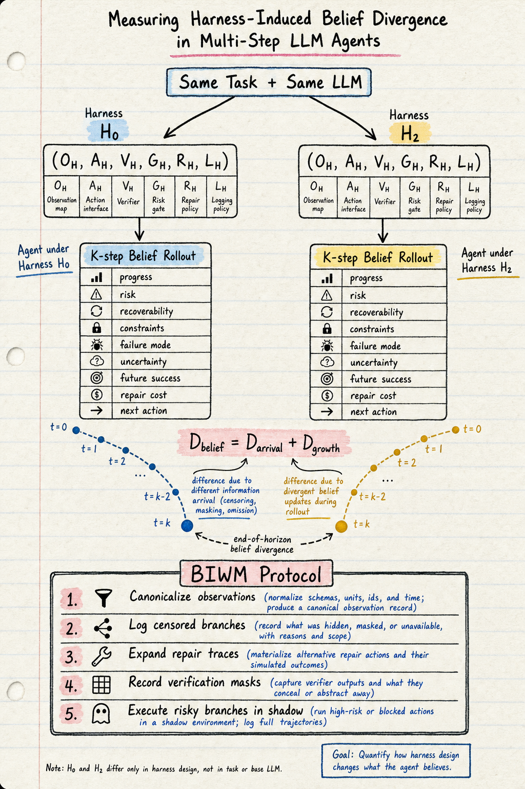

# Harness Engineering — 2026-07-25

## 1. Measuring Harness-Induced Belief Divergence in Multi-Step LLM Agents (2607.04528)

- **arXiv**: 2607.04528
- **Link**: https://arxiv.org/abs/2607.04528
- **已讀來源**: arXiv HTML 全文（含方法、formal definitions、部分實驗）

### 這篇在說什麼

軟體 agent benchmark 通常只報告「agent 有沒有解決 task」，但 agent 是透過 harness 來和 task 互動的——harness 控制 agent 看到什麼、能做什麼、哪些失敗被修復、哪些狀態被驗證、哪些證據被記錄。這篇論文的核心洞察是：**harness 可以改變 agent 的多步信念軌跡，即使 task、environment、和 base LLM 都不變**。同一個 agent、同一個 bug，一個 harness 暴露失敗命令的原始輸出，另一個 harness 阻擋命令並返回 policy violation，第三個 harness 在 agent 觀察到之前就修復了中間失敗。這些干預可能不改變最終的 benchmark label，但它們改變了 agent 的信念軌跡，而這個信念軌跡驅動後續決策。

### 主要貢獻

1. **Harness six-tuple formalization**：把 harness 定義為 (O_H, A_H, V_H, G_H, R_H, L_H)——observation map, action interface, verifier, risk gate, repair policy, logging policy。這使得 harness 的各個組件成為可以獨立變化的實驗變量。
2. **Belief-rollout diagnostic**：定義了 K-step belief rollout，每步記錄 progress, risk, recoverability, constraints, failure mode, uncertainty, future success probability, repair cost, next action。這讓信念軌跡可以被系統性地比較。
3. **Cross-harness belief divergence decomposition**：D_belief = D_arrival + D_growth。Arrival term 捕捉立即的介面偏移（如 action 被阻擋），growth term 捕捉 horizon-dependent 的信念漂移（如 risk state, failure mode 的累積變化）。
4. **BIWM (Belief-Invariant World-Modeling)**：一個無訓練協議，通過 canonicalize observations、log censored branches、expand repair traces、record verification masks、execute risky branches in shadow 來對齊跨 harness 的信念軌跡。

### 方法 / pipeline

**Harness six-tuple** (O_H, A_H, V_H, G_H, R_H, L_H)：
- O_H：observation map，過濾 agent 看到的環境資訊
- A_H：action interface，限制 agent 可以執行的動作
- V_H：verifier，決定哪些狀態需要驗證（⊥ = not checked）
- G_H：risk gate，哪些動作在執行前就被阻擋
- R_H：repair policy，失敗後如何改寫歷史
- L_H：logging policy，哪些歷史被記錄到 audit log

Raw reference harness H_raw 把所有 component 設為 identity（不過濾、不阻擋、不修復、完整記錄）。

**Belief-rollout diagnostic**：固定 (T, E, M)，只變 H。對每個 harness 配置，LLM 生成 K-step belief trajectory（JSON 結構），然後計算 D_belief(H_i, H_j; K)。

**BIWM protocol**：
1. Canonicalize observations across harnesses（用共同 schema embedding）
2. Log censored branches（阻擋的動作也要記錄）
3. Expand repair traces（修復前後都要記錄）
4. Record verification masks（哪些狀態被驗證了）
5. Execute risky branches in shadow（在 sandbox 中執行被阻擋的動作）
6. Align belief trajectories across harness views

### 實驗設計

- Controlled coding tasks + public-benchmark stress tests
- 變量化 harness：blocked actions, compressed repairs, selective verification, cost-aware evidence pruning
- 核心發現：這些 harness 變化通常 preserve terminal success，但改變了 beliefs that drive later decisions
- Arr term 捕捉立即偏移，growth term 捕捉 horizon-dependent drift
- Aggregate divergence 可以看起來穩定，但 planning-relevant 的信念組件持續漂移

### かに讀後判斷

**今日推薦點開**。這篇和昨天讀的「Rethinking the Evaluation of Harness Evolution for Agents」(2607.12227) 直接互補。後者指出 harness evolution 的 evaluation protocol 有問題（用同一個 benchmark 搜尋和評估），前者指出了一個更根本的問題：**即使 terminal outcome 不變，harness 也在改變 agent 的信念軌跡**。這意味著 benchmark 分數相同的兩個 harness 可能產生完全不同的 agent 行為模式——一個可能更 risk-aware，另一個更 risk-blind。

和本週讀的「Don't Blame the LLM」(2607.03691) 的關係也很直接：那篇說 harness 是 coding agent 品質的主要決定因素，這篇量化了 harness 如何改變 agent 的認知狀態。

BIWM 的設計理念和 Harness Handbook (2607.13285) 的 readable/navigable/editable 原則一致：把 harness 從黑箱變成可審計的、可對照的實驗變量。

深讀優先看 §3（formal definitions）、§4-5（controlled experiments 和 divergence decomposition）、§6（BIWM protocol）。

---

## 2. Evaluation and Benchmarking of LLM Agents: A Survey (2507.21504)

- **arXiv**: 2507.21504
- **Link**: https://arxiv.org/abs/2507.21504
- **已讀來源**: arXiv abstract + landing page（僅 abstract 層級快速掃描）

### 這篇在說什麼

LLM agent 評估是一個複雜且不成熟的領域。這篇 survey 提出了一個二維分類法：(1) evaluation objectives——what to evaluate（agent behavior, capabilities, reliability, safety）和 (2) evaluation process——how to evaluate（interaction modes, datasets/benchmarks, metric computation methods, tooling）。特別強調了 enterprise-specific challenges（role-based data access, reliability guarantees, dynamic/long-horizon interactions, compliance）在現有研究中被忽視。

### 主要貢獻

1. **二維分類法**：沿著 evaluation objectives 和 evaluation process 兩個軸組織現有工作，填補了 agent evaluation 領域缺少系統性分類的空白。
2. **Enterprise-specific challenges**：指出 role-based access control、reliability guarantees、dynamic long-horizon interactions、compliance 這四個在現有 benchmark 中被忽視的面向。
3. **Future directions**：holistic evaluation、more realistic scenarios、scalable evaluation。

### 方法 / pipeline

這是一篇 survey，沒有單一方法 pipeline。核心方法是系統性的文獻回顧和分類。

### 實驗設計

Survey paper，沒有原創實驗。目前只能從 abstract 確認分類法和 enterprise challenges 的框架。

### かに讀後判斷

作為 survey，這篇的價值在於系統性地組織了一個散亂的領域。和我們這週連續讀的 harness engineering 論文直接相關——survey 指出的 evaluation process 維度（interaction modes, metrics, tooling）正好是 Belief Divergence 論文要量化的對象。Enterprise-specific challenges 的四個面向也是 harness engineering 需要回應的問題。

目前只讀到 abstract，需要全文確認分類法的完整性和 enterprise challenges 的具體案例。