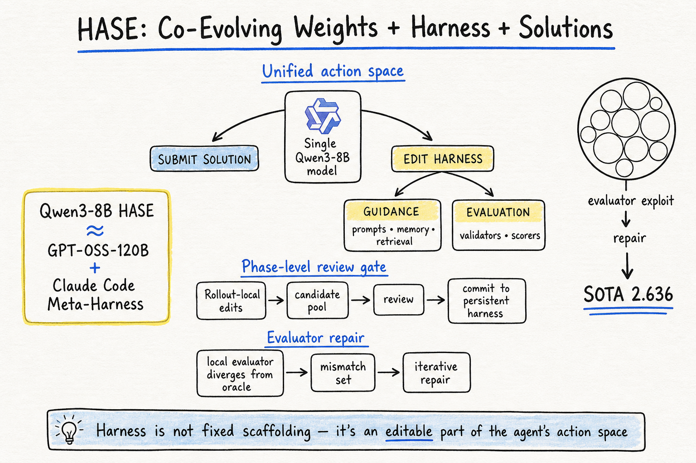

# Harness Engineering — 2026-07-26

## 1. HASE: Harness-Aware Self-Evolving — Co-Evolving Model Weights, Harness, and Task Solutions

- **arXiv**: 2607.03935
- **Link**: https://arxiv.org/abs/2607.03935

### 這篇在說什麼

現有的 self-evolving 系統（如 FunSearch、AlphaEvolve 類方法）專注於優化 task solution，但把周圍的 harness（prompts、memory、retrieval、evaluators）當作固定不變。HASE 指出這有兩個問題：一、人工寫的 evaluator 可能不完整或和環境不對齊，模型會 exploit 這些 gap；二、即使 evaluator 正確，guidance harness（prompts、memory formatting、retrieval）可能提供差的 search prior。HASE 把 harness editing 放進和 task solving 同一個 agentic action space，讓一個模型同時生成解決方案和編輯 harness。

### 主要貢獻

1. **統一 action space**：同一個 Qwen3-8B 模型在同一個 multi-turn RL 環境中，可以選擇提交 task solution 或編輯 harness components。不需要外部強大 coding proposer（如 Meta-Harness 用的 Claude Code）。
2. **Evaluator repair**：不只優化 guidance harness（prompts、memory、retrieval），還修復不完美的 local evaluator。透過 real-world feedback 和 mismatch set 追蹤 evaluator 和 oracle 的不一致，迭代修復。
3. **Phase-level review**：harness 更新不是即時生效，而是在每個 phase 結束時經過 review 才 commit。這避免了 reward hacking——模型不能隨意改 evaluator 來提高自己的分數。
4. **三個領域的實驗**：online text classification（Qwen3-8B 匹配 GPT-OSS-120B + Claude Code 的 Meta-Harness）、alpha factor mining（超越 GPT-OSS-120B baseline）、circle-packing algorithm discovery（修復 broken evaluator 後達到 AlphaEvolve 的 SOTA）。

### 方法 / pipeline

HASE 的核心演算法：

- 維護一個 persistent harness h、model policy πθ、phase candidate pool Cp、mismatch set M（只在 evaluator 可編輯時）
- 每個 phase 有多個 GRPO epochs
- Model 在 multi-turn rollout 中可以：submit solution、inspect files、modify harness files
- Rollout-local harness edits 只影響該 trajectory，不影響其他 rollout
- Phase 結束時：guidance edits 透過 validation performance review；evaluator edits 透過 mismatch set review
- 只有通過 review 的 edits 才 commit 到 persistent harness

兩類 harness：
- **Guidance components**（prompts, memory formatting, retrieval scripts, context selection）：改善 search，不影響 correctness
- **Evaluation components**（validators, scorers）：定義 solution validity 和 metrics。Local evaluator 是可編輯的 proxy，real-world evaluator 是不可編輯的 oracle

Reward 設計的關鍵洞見：不直接獎勵 harness 編輯行為。只有當 solution 在 edited harness 上得到更好分數時，guidance edit 才成為候選。只有當 local evaluator 和 oracle 不一致時，evaluator repair 才有 reward。

### 實驗設計

- **Online text classification**：HASE (Qwen3-8B) vs. Meta-Harness (GPT-OSS-120B + Claude Code)。HASE 達到可比性能。
- **Alpha factor mining**：HASE 超越 GPT-OSS-120B baseline。
- **Circle-packing algorithm discovery**：初始 evaluator 有 bug（缺少 boundary check 和 overlap tolerance 錯誤），HASE 在兩次 exploit 後修復 evaluator，最終達到 2.635983（AlphaEvolve SOTA）。
- **Heilbronn Triangles**：展示 evaluator alignment trajectory——exploit gap（proxy high, oracle zero）在修復後快速收斂。

Ablation：co-evolved policy vs. frozen policy 的差異顯示，co-evolution 讓模型內化 constraints。

### かに讀後判斷

這篇和之前收錄的 MSCE（self-evolving harness via quality-diversity，2607.13683）以及 Rethinking Harness Evolution Evaluation（2607.12227）形成 harness engineering 的重要三角：MSCE 用 QD archive 做 anti-overfitting，HASE 用 RL + phase-level review 做 evaluator repair，Rethinking 質疑整個 harness evolution 的評估方法是否有 overfitting 問題。

HASE 最有趣的洞見是 evaluator repair：大多數 harness engineering 只改 guidance，但 HASE 指出 evaluator 本身可能是錯的，而且模型會 exploit evaluator bug。Circle-packing 實驗很好地展示了這個動態——模型先發現 evaluator 有漏洞，exploit 它，然後在 phase review 時修復 evaluator。

**今日推薦點開**。深讀時優先看 Algorithm 1、Figure 2（circle-packing evaluator repair 過程）、Section 4 的三個實驗、以及和 Meta-Harness 的 direct comparison。

---

## 2. RHI: Recursive Harness Self-Improvement

- **arXiv**: 2607.15524
- **Link**: https://arxiv.org/abs/2607.15524
- **類型**: 僅 abstract 層級快速掃描（HTML 不可用）

### 這篇在說什麼

在 model-harness co-evolution 的框架下，研究是否可以只用 few iterations 就優化 user-constructed harness。RHI 把 harness 表示為 prompt-level 的 agent loop specification，用自身的修訂歷史做 pairwise feedback 來迭代優化。在 30 個 synthetic ML research tasks 上，幾個 RHI iterations 就能大幅提升低 reasoning effort agent 的性能 ceiling，甚至超過 max reasoning effort 設定，同時降低 60% inference cost。作者把這個行為形式化為 information-theoretic hypothesis：RHI 隱含優化的目標是改善 task-specific context management（更有效的 inter-agent information flow），而不是更長的 reasoning traces。

### 主要貢獻

1. RHI 方法：prompt-level harness specification + pairwise feedback over revision history
2. 低 reasoning effort agent 性能提升超過 max reasoning effort baseline
3. 60% inference cost 降低
4. Information-theoretic hypothesis：RHI 優化的是 information flow 而非 reasoning length

### かに讀後判斷

和 HASE 形成對比：HASE 用 RL 做 harness + solution co-evolution，RHI 用 pairwise feedback 做 prompt-level harness optimization。RHI 更輕量但只改 guidance（不改 evaluator）。兩者都指向同一個洞見：harness optimization 的本質是 context management 而非更長推理。和 ACM（2607.21503）的「anticipating」原語也有呼應——都是在改善「什麼 context 在什麼時候出現」。

目前只有 abstract，需要看全文才能確認 pairwise feedback 的具體機制和 information-theoretic hypothesis 的數學形式化。值得深讀。