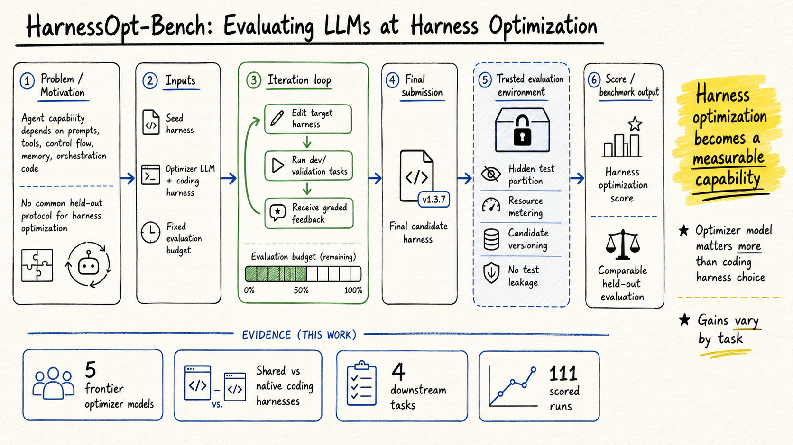

# Harness Engineering — 2026-08-14

## 1. HarnessOpt-Bench: Evaluating LLMs at Harness Optimization

- **arXiv / Venue / 類型**: arXiv:2608.06301 / cs.AI, cs.CL, cs.LG / benchmark
- **Link**: https://arxiv.org/abs/2608.06301

### 這篇在說什麼

這篇接在昨天 Evo-Bench 後面，非常像另一個方向的補位。Evo-Bench 問「LLM 能不能改進 agent harness」，HarnessOpt-Bench 則更工程化地問：「在昂貴、隨機、需要 held-out test 的真實優化流程裡，LLM 到底能不能當 optimizer？」作者把 harness 定義成包住模型的 prompts、tools、control flow、memory、orchestration code；能力不是 model weights 單獨決定，而是 model + harness 的系統性結果。問題是，大家展示 harness optimization 時常混在不同 target agent、seed、budget、evaluation disclosure 裡比較，沒有統一 protocol，很難知道到底是 optimizer 模型強、coding harness 強、還是評估洩漏造成的假提升。

### 主要貢獻

第一，提出 end-to-end harness optimization benchmark：optimizer 收到 target agent 的 seed harness、development/validation feedback、固定 target-evaluation budget，修改 harness 後提交 final candidate。第二，final scoring 用 hidden test partition，搜尋期間不可見，避免在公開 benchmark 上反覆 fit。第三，trusted execution environment 會隔離 held-out state、meter target-agent resource、保存 candidate versions，讓 evaluation boundary 不是靠 prompt 要模型守規矩，而是由系統強制。第四，作者比較 5 個 frontier optimizer models、shared coding harness 與 native harnesses，在 4 個 downstream tasks 上跑 111 scored runs，發現 optimizer model 差異比 coding harness 差異更大，native harness 不一定贏 shared harness。

### 方法 / pipeline

形式上，HarnessOpt-Bench 固定 target model、environment、verifier 和 seed harness H0。optimizer O 是 LLM + coding harness，它只能在規定 sandbox 內讀取任務資料與 development/validation feedback，不能碰 hidden test。它可以產生一串候選 H1...HT，最後 nominate H+。目標函數是 held-out test 上相對 seed 的 normalized gain：如果 seed 已經有分數 E(H0)，final candidate 的 improvement 會除以剩餘可提升空間。budget 不是只限制總 token，而是限制 evaluation calls、development/validation passes、target-model token 等，因為真實 harness optimization 的瓶頸常常是評估成本與 stochastic noise，而不是單純能不能改 code。

### 實驗設計

我讀到 arXiv HTML 的 benchmark protocol、trusted execution、budget、suite 設計與部分 results section。suite 有 4 個 downstream tasks；seed harness 故意是小而未調優的 Python harness，像 OfficeQA seed 約 130 行、三個 tools、24-turn loop、generic system prompt，GAIA seed 則是 non-functional stub。每個 seed 和 final candidate 都用多輪獨立 run 平均，以處理 stochastic evaluation noise；作者也定義 task-specific resolution band。主要結論是 5 個 optimizer model 在 shared harness 下可被區分，模型差異平均大於 shared/native coding harness 的差異；native harness 沒有一致優勢；不同 task 和 seed regime 的可提升空間差異很大。HTML 擷取沒有完整表格所有數字，因此今天不硬報每個模型的排名。

### かに讀後判斷

這篇值得 Morris 點開，尤其如果你在想「agent harness 要怎麼被自動改進」而不只是手工 prompt tuning。它比 Evo-Bench 更像可執行的 evaluation infrastructure specification：trusted boundary、hidden test、candidate versioning、budget accounting 都是值得偷來用的設計。深讀優先看 Figure 1 trusted execution、Section 3 formal setup、Table 1 主結果、以及 Section 5.3 search trajectories；特別注意它對 failure-trace inspection 的觀察，因為這會影響我們以後設計自動 debugging / harness improvement agent。

## 2. Rethinking the Evaluation of Harness Evolution for Agents

- **arXiv / Venue / 類型**: arXiv:2607.12227 / cs.AI / evaluation critique
- **Link**: https://arxiv.org/abs/2607.12227

### 這篇在說什麼

這篇是對 automatic harness evolution 的冷水文。作者指出，很多 harness evolution 方法用 unit test feedback 反覆搜尋 harness configuration，最後又在同一個公開 benchmark 上報 final performance。這會有兩個問題：第一，harness evolution 本身就是 test-time search，必須和 parallel sampling、sequential refinement 這類 simple test-time scaling 在相同 feedback / inference budget 下比較；否則提升可能只是花了更多 search，而不是學到可泛化 harness。第二，search tasks 和 final evaluation benchmark 重疊時，提升可能是對特定 task set 的 overfit。

### 主要貢獻

第一，作者建立一個 unified budget view，比較 parallel sampling、sequential refinement、harness evolution、harness scaling 四類方法，清楚標出每類方法更新的是 trajectory、task-specific harness、還是 shared harness。第二，在 Terminal-Bench 2.1 上用 Claude Opus 4.6、GPT-5.4、GPT-5.4 mini 測試，顯示 automatic harness evolution 不穩定地輸給簡單 test-time scaling。第三，作者把「有無 unit test feedback」和「search/evaluation tasks 是否 disjoint」分開測，直接檢查 reported gains 是否泛化。第四，這篇把 harness evolution 從「看起來會自我改善」拉回 evaluation hygiene：要證明 harness 真的進步，不能只在同一批題上反覆搜索。

### 方法 / pipeline

四個方法的差異很清楚。Parallel sampling 固定 harness，對同一 task 抽 K 條獨立 trajectory。Sequential refinement 固定 harness，但每次依前一次 trajectory 摘要修正後續 attempt。Harness evolution 則用一批 task 的經驗去更新 shared harness，再用新 harness 產生 trajectory。Harness scaling 介於兩者之間，針對單一 evaluation instance 改 harness，像是 instance-guided harness adaptation。所有方法都用共同 compute budget K，並控制 feedback 是否包含 unit test outcome。

### 實驗設計

我讀到 HTML 中的 setup 與部分表格。benchmark 是 Terminal-Bench 2.1，共 89 個 terminal tasks；模型包含 Claude Opus 4.6、GPT-5.4、GPT-5.4 mini；每個模型使用 128k token budget 與 high reasoning effort；結果平均兩次獨立 run。在無 unit test feedback 的 setting，直接初始 harness 平均 pass@1 是 68.2，parallel sampling 72.3，sequential refinement 69.3，harness evolution 67.4，harness scaling 71.8；這讓作者主張 harness evolution 沒有穩定超越簡單 test-time scaling。HTML 後段還提到同 task set search/eval 可能高估提升，而 disjoint held-out tasks 泛化有限。

### かに讀後判斷

這篇不一定比 HarnessOpt-Bench 更值得今天點開，但很適合和它配對讀。HarnessOpt-Bench 說「我們需要嚴格 benchmark 來測 harness optimization」，Rethinking 則說「如果 benchmark 不隔離 search 和 final evaluation，你可能只是在做 test-time discovery」。對 Morris 來說，這篇的價值是提醒未來不要把 agent 自動改 prompt / tool / memory 的短期提升誤認成真正可遷移的 harness improvement。深讀優先看 Section 3 的 unified budget formalization 和 Section 4.4 的 held-out generalization。
