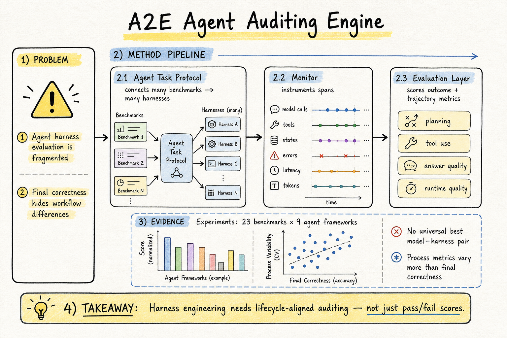

# Harness Engineering — 2026-08-22

## 1. A²E: An End-to-End Agent Auditing Engine

- **arXiv / Venue / 類型**: arXiv:2608.07346v2 / agent harness evaluation engine
- **Link**: https://arxiv.org/abs/2608.07346
- **Code**: https://github.com/datamllab/AE2.git
- **查重**: `check_paper_seen.py 2608.07346` → `NOT_SEEN`
- **已讀來源**: arXiv HTML full text（Abstract、Introduction、Overview、Monitor Layer、Task Layer / Evaluation Layer 前段、Experiments 摘要與 figure 說明）

### 這篇在說什麼

A2E 這篇在解決一個很 harness engineering 的問題：agent 的表現已經不只由 base model 決定，而是由 system prompt、tool interface、context management、execution policy、sandbox、monitoring、error recovery 等整個 harness 決定；可是我們常常還是只拿 final answer correctness 或 benchmark success rate 來比較 agent。作者認為這會漏掉真正重要的差異：兩個 harness 可能成功率接近，但一個更會規劃、工具使用更乾淨、錯誤恢復更好、token / latency 成本更低。

它的定位比單純 observability tool 更完整，也比單純 benchmark runner 更貼近 deployed agent stack。A2E 想把 task composition、trajectory monitoring、lifecycle-aligned evaluation 串成同一個 engine，讓不同 benchmarks 可以和不同 harnesses 系統性配對，同時保留原生執行軌跡，而不是每個 benchmark × harness 都手寫 adapter。

### 主要貢獻

第一，A2E 提出 Agent Task Protocol（ATP），用來 decouple benchmarks and agent harnesses。這讓 benchmark 和 harness 可以獨立整合，避免 m × n 組合都要寫一份 glue code。對 harness eval 來說，這等於把任務描述、sandbox、dataset、experiment config、runtime support 包成可重用 execution-support bundle。

第二，它用 Monitor Layer 自動 instrument agent execution，把 model calls、tool calls、state transitions、errors、latency、token consumption、artifacts 等行為記成 OpenTelemetry-compatible spans。這比單純存文字 log 好，因為 span 有 parent-child relation、start / end time、status 與 context，能保留 agent loop 的因果結構。

第三，Evaluation Layer 做 lifecycle-aligned evaluation，不只看 outcome，也看 trajectory。rule-based metrics 包含 accuracy、task success、tool success、latency、token usage、cost、trajectory steps；LLM-as-judge 則評 reasoning quality、tool-use quality、instruction following、relevance / completeness、safety 等比較難用規則描述的維度。

### 方法 / pipeline

A2E 的 workflow 分三層。Task Layer 管 benchmark tree，按 time、category、difficulty index tasks，並把每個 benchmark 的 sandbox definition、task dataset、experiment configuration、runtime environment 包成 bundle。agent 端則支援 ready-to-run frameworks（如 CrewAI、Agno、Smolagent）與 SDK-based agents（如 LangChain、Claude-Agent-SDK、LangGraph），透過 unified access abstraction 呼叫。

Monitor Layer 是整篇最值得 harness 工程師看的地方。它分 semantic layer、span layer、SDK layer：semantic layer 定義 agent / chain / model call / tool / skill 這些行為的語意；span layer 把每個行為記為 bounded operation；SDK layer 負責把不同 framework 的 model call、tool execution、workflow transition、async operation 映射到共通 trace schema。最後一個 run 不是一串扁平 log，而是 R1→A1→O1→R2… 的 structured trajectory。

Evaluation Layer 從 server 取出 traces 和 final outputs，計算 outcome-level 與 trace-level metrics，再寫回 centralized database。UI 是 read-only，只負責呈現 trajectory、scores、aggregated comparison。這個設計讓 execution、evaluation、visualization 分離，對需要長期追蹤 agent stack regression 的團隊很有用。

### 實驗設計

作者用 A2E 做 large-scale harness–model interaction study。從文中 figure 說明可確認，它把 23 個 benchmarks 和 9 個 agent frameworks 放進 m × n evaluation grid，並在不同 model-harness combinations 上比較 correctness、planning、tool use、answer quality、runtime quality 等 metrics。Introduction 提到，在 GDPVal、MMLU-Pro、τ³-bench 這些不同任務上，success–efficiency frontier 的最佳配置會變，沒有單一 harness–model combination 永遠最好。

更重要的是，Figure 1 的 radar / petal 結果顯示 final correctness 的 harness mean range 相對窄，大約 0.57–0.68；但 planning、tool use、efficiency 等 process metrics 的差距更大。這支持作者的核心論點：只看 final answer correctness 解析度不足，容易把實際執行品質差很多的 harness 看成差不多。

### かに讀後判斷

這篇今天最適合 Morris 點開，因為它和前幾天的 Harness-Bench、Stop Comparing LLM Agents Without Disclosing the Harness、Rethinking Harness Evolution Evaluation 是同一條線，但更偏「可落地 auditing engine」。如果 Harness-Bench 是診斷 harness effects 的 benchmark，A2E 則像是把 benchmark integration、trace capture、metric registry、database / UI 都接起來的 evaluation infrastructure。

我會優先讀 Section 4 的 ATP，以及 Section 3 的 Monitor instrumentation。這兩塊最可能直接啟發自己的 agent workflow：怎麼設計 task protocol 才不會和 harness 綁死，怎麼讓 trace schema 既能跨 framework 又不丟掉原生執行資訊。比較需要保留的是 LLM-as-judge metrics 的穩定性與成本；如果要拿來做 regression testing，rule-based / span-derived metrics 可能比 judge score 更可靠。
