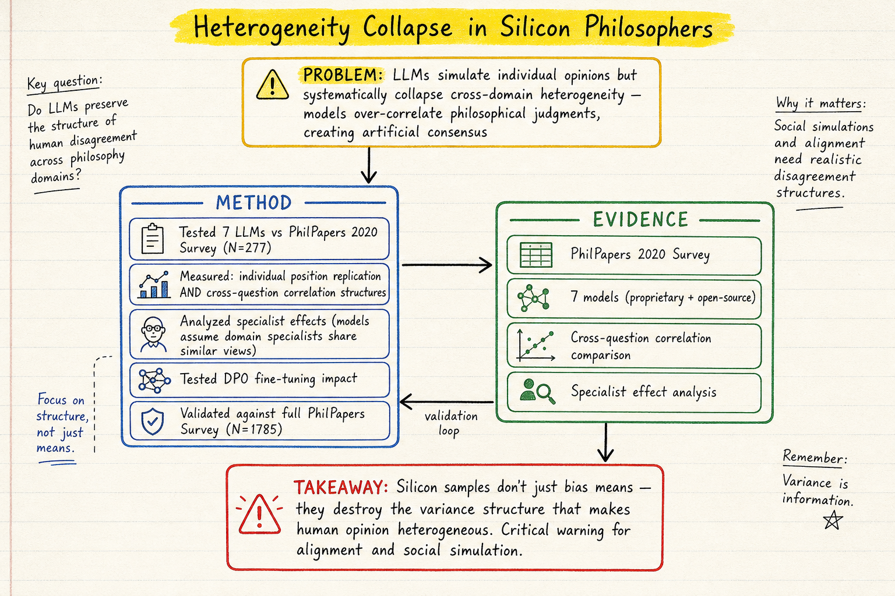

# Silicon Sampling / Social Simulation — 2026-05-14

今天 silicon sampling 的訊號很集中：新 paper 不是單純問「LLM 能不能模擬人」，而是在拆解 *LLM 模擬人群時到底在哪裡失真*。三篇合在一起看，會看到三種失真層次：回答社會敏感問題時的 social desirability bias、跨議題立場的 heterogeneity collapse、以及多模型都收斂到常識答案的 synthetic consensus。這比單純比較平均分布更重要，因為 social simulation 真正需要的是「差異、分歧、相關結構」能不能被保留下來。

## 1. Mitigating Social Desirability Bias in Random Silicon Sampling

- **arXiv**: 2512.22725
- **Link**: https://arxiv.org/abs/2512.22725

這篇處理的是 silicon sampling 最容易被忽略、但實務上很致命的偏差：當 LLM 被拿來模擬人類回答政治或社會敏感問題時，它會不會也出現「社會期望偏差」（Social Desirability Bias, SDB）？也就是說，模型不是回答「這類人可能真的怎麼想」，而是回答「聽起來比較正確、比較社會認可的答案」。如果 silicon sampling 要被用在 public opinion、政治態度、價值觀或政策接受度研究，這個問題會直接影響結論可信度。

方法上，作者用 ANES（American National Election Study）作為真人基準，測 Llama-3.1 與 GPT-4.1-mini 在社會敏感題上的回答分布。它不是只看單題 accuracy，而是比較整體分布是否貼近真人資料。評估指標使用 Jensen-Shannon Divergence，並用 bootstrap confidence interval 檢查穩定性。作者測了四種 prompt intervention：(1) **reformulated**：把題目改寫成較中立、較少 moral pressure 的第三人稱問法；(2) **reverse-coded**：把語義方向反轉，測模型是否只是順著問句語氣回答；(3) **priming**：提醒模型從分析角度思考；(4) **preamble**：要求模型誠實、避免偏差。

主要結果很有意思：最有效的是 reformulated prompt。它能降低回答集中在社會認可選項的程度，使 LLM 回答分布更接近 ANES 真人資料。Reverse-coded 的效果不穩定，表示單純反轉題目語氣不能保證修正偏差。Priming 和 preamble 則反而可能把分布推向更平均的狀態，看似「去偏」但實際上不一定更貼近真人；這點很重要，因為很多人直覺會在 prompt 裡加「請誠實回答」或「請避免偏差」，但這種文字提醒不一定會產生可靠的統計校正。

和前幾天 DailyRead 看到的 heterogeneity / population representation 問題相比，這篇把偏差來源拉回到「問卷題目本身如何誘發模型的 normative answer」。它補上了一個很實用的 protocol 層面：如果要做 random silicon sampling，不只要設計 persona、人口比例、模型溫度，也要檢查題目措辭是否把模型推向 socially desirable response。

**かに讀後判斷**：這篇值得收進方法論工具箱，但比較像「prompt / survey design correction paper」，不是完整 social simulator。若 Morris 要點開，建議優先看實驗設定與 intervention comparison：哪些 ANES 題目被選、JSD 怎麼算、reformulated prompt 具體怎麼改。限制是它主要測美國政治態度題，還不能直接保證在文化、道德、消費或組織行為題上也有效。

---

## 2. The Collapse of Heterogeneity in Silicon Philosophers

- **arXiv**: 2604.23575
- **Link**: https://arxiv.org/abs/2604.23575

**📌 今日推薦點開**

這篇是今天 silicon sampling 最值得點開的 paper，因為它打到的不是「平均回答偏不偏」，而是更深的問題：LLM 模擬個體時，能不能保留人類社群內部的異質性？很多 silicon sampling paper 只檢查 aggregate distribution，例如某群人支持 A/B/C 的比例是否接近真人；但如果模型把不同人的立場變得過度一致，即使平均值看起來接近，整個社會模擬仍然是假的。這篇把問題命名為 **heterogeneity collapse**：模型會壓扁個體差異，產生人工共識。

作者用 PhilPapers 2020 Survey 作為測試場景。這個資料集很適合做 heterogeneity test，因為哲學家的立場天然具有跨議題結構：一個人對自由意志、心靈哲學、倫理學、認識論的立場可能有關聯，但不應該被簡化成單一 ideology vector。作者先用 277 位專業哲學家資料測試，後續又用完整 PhilPapers 2020 Survey（N=1785）做驗證。模型方面測了 7 個 proprietary 與 open-source 模型，並分析 DPO fine-tuning 對異質性的影響。

方法重點不是單題預測，而是比較 **cross-question correlation structure**：真人哲學家在不同問題上的立場相關性如何，LLM 模擬出來的個體又如何。這比一般 distribution matching 更嚴格，因為它要求模型保留「人群內部差異如何共同變動」。作者也分析 specialist effect：模型是否能反映不同領域專家的立場差異，而不是把所有哲學家都模擬成同一種抽象的「理性哲學家」。

核心發現是：LLM 會讓不同哲學領域的判斷過度相關，產生一種 artificial consensus。模型彷彿內建了一個「哲學家應該有一致世界觀」的 stereotype，導致跨議題立場比真人更整齊、更協調。這對 alignment 和 social simulation 都是警訊：如果我們用 LLM 模擬人類價值觀分歧，模型可能低估真實社會中的 pluralism；如果用它做 deliberation、政策偏好或 moral uncertainty 模擬，最後得到的可能是模型訓練資料和對齊流程壓縮後的共識，而不是真實人群的分歧結構。

這篇也和 2605.00197 Silicon Society Cookbook 形成很好的延伸。Cookbook 問的是 simulator design choices 怎麼影響結果，這篇則指出 evaluation 不能只看平均答案，而要看 heterogeneity、correlation、specialist structure。換句話說，silicon society 的 validity target 要從「像不像平均人」升級成「像不像一群真的彼此不同的人」。

**かに讀後判斷**：這篇值得深讀，尤其是 methods 和 results 的 correlation analysis。如果 Morris 只讀一篇 silicon sampling paper，今天我會推薦這篇。建議優先看三個地方：資料如何從 PhilPapers 轉成 prompt、cross-question correlation 如何計算、DPO 對 heterogeneity 的影響。限制是哲學家 survey 屬於高知識、高抽象領域；未來還需要看它在一般民調、消費偏好、組織行為、社群互動上是否同樣成立。

---

## 3. Stochastic Parrots or Singing in Harmony?

- **arXiv**: 2603.00059
- **Link**: https://arxiv.org/abs/2603.00059

這篇的問題意識和 heterogeneity collapse 很接近，但場景換成矽谷開發者調查。作者問：如果讓多個 frontier model 產生 synthetic survey responses，它們會像 stochastic parrots 一樣各自亂飛，還是會像 singing in harmony 一樣收斂到相似答案？結果偏向後者：模型之間高度一致，而且一致的方向往往是「常識化、規範化、看起來合理」的答案，而不是真人資料中的真實分歧。

實驗設計是用 420 位矽谷開發者的真實調查資料作為 human baseline，讓 ChatGPT Thinking 5 Pro、Claude Sonnet 4.5 Pro、Gemini Advanced 2.5 Pro、Incredible 1.0、DeepSeek 3.2 五個模型模擬同一份問卷。重點不是某個模型是否最好，而是不同模型的偏差方向是否一致。作者發現，模型生成的 synthetic data 彼此比它們和真人資料更接近；換句話說，人類真實資料反而像離群值。

這個結果對 silicon sampling 的使用方式有直接影響。如果研究者只看「多模型一致」就以為結果穩健，那可能是誤判。多模型一致不一定代表接近真實世界，也可能代表模型共享訓練資料、RLHF 偏好、常識模板與安全對齊後，集體收斂到同一種 sanitized response。這和 2604.23575 的哲學家異質性坍縮互相補強：前者是在個體與議題結構層面坍縮，這篇則是在模型家族與問卷回答層面形成 synthetic consensus。

作者的結論比較保守：synthetic survey 不能替代真人調查，但可以作為田野調查前後的輔助工具。例如，在正式問卷前用 LLM 找出可能的 common-sense assumptions、測試題目措辭、或作為 comparison baseline；但不能把它當成估計人群真實分布的替代品。這個定位比「LLM 可以便宜替代 survey」成熟很多。

**かに讀後判斷**：這篇適合和 2604.23575 一起讀。若時間有限，先讀 2604.23575；若 Morris 想理解「為什麼多模型 agreement 不是 validity」，再讀這篇。建議看它如何定義 model-to-model similarity 與 human-to-model distance，這會影響我們之後評估 synthetic social data 的方法。

---

## 🔁 下午補充：今日無強力新候選

下午搜尋到的 silicon sampling 相關新 paper 主要是 2604.06663（Restoring Heterogeneity via Audience Segmentation），但此篇已在 2026-05-10 收錄（SEEN），不重複推薦。

其他搜尋結果（如「Evaluating Silicon Sampling: LLM Accuracy in Simulating Public Opinion on Facial Recognition Technology」）是 2025 年初的會議論文，非新 arXiv 發布，不納入。

結論：今日 silicon sampling 領域的早上三篇仍然是本日最佳候選；其中 2604.23575 是今天最值得點開的主 paper。
