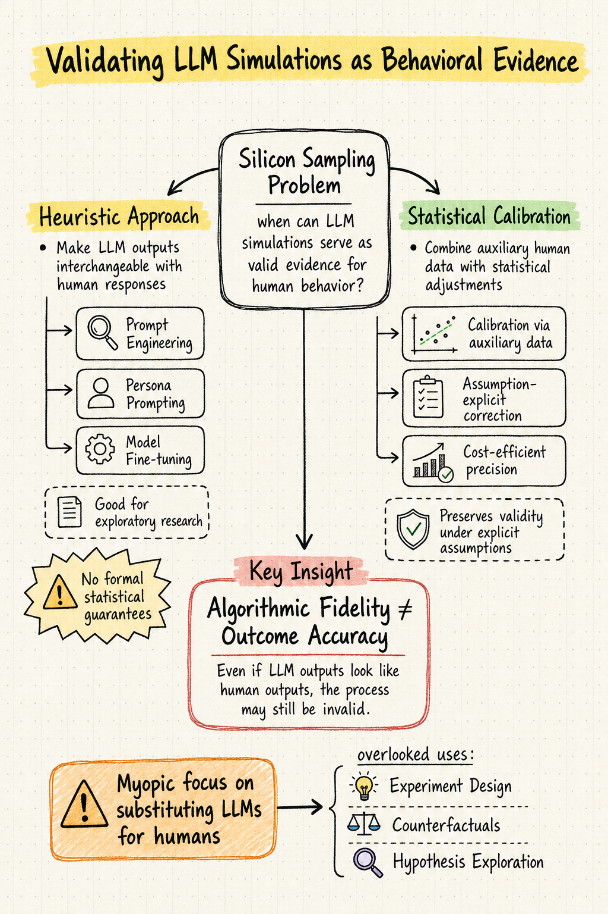

# Silicon Sampling / Social Simulation — 2026-05-16

## 1. This Human Study Did Not Involve Human Subjects: Validating LLM Simulations as Behavioral Evidence

- **arXiv**: 2602.15785
- **Authors**: David Broska (Stanford), Huaman Sun (Northwestern), Aaron Shaw (Northwestern), Jessica Hullman (Stanford)
- **Link**: https://arxiv.org/abs/2602.15785

### 這篇在說什麼

這篇論文的標題本身就是一個挑釁——「這項人類研究沒有人類受試者」。Hullman 團隊（Stanford / Northwestern）直面了一個越來越迫切的問題：當越來越多研究用 LLM 當作「矽樣本」（silicon samples）來替代人類受試者時，到底什麼情況下這些模擬的結果可以算作有效的人類行為證據？目前的文獻幾乎沒有給出明確指引——有人說 LLM 複製了人類問卷的方向和顯著性就夠了，也有人認為這遠遠不夠。這篇論文填補的正是「何時、如何、在什麼假設下可以將 LLM 模擬視為有效推論基礎」這個方法論缺口。

### 主要貢獻

1. **區分兩種驗證策略**：作者系統性地梳理了兩條路徑——「啟發式途徑」（heuristic approach）和「統計校正途徑」（statistical calibration）。前者試圖透過 prompt engineering、模型微調等方式讓 LLM 輸出與人類行為「可互換」，但缺乏正式的統計保證；後者結合少量輔助人類數據，用統計調整來修正模擬與觀察之間的差異，在明確假設下能保留有效性。

2. **釐清探索性 vs. 驗證性研究的適用邊界**：啟發式途徑適合探索性研究（例如先快速檢驗假說方向），但不適合需要統計保證的驗證性研究。統計校正途徑則在特定假設下可以比純人類實驗更精確、更低成本地估計因果效應。

3. **提醒研究者的「近視風險」**：作者指出，目前很多研究過度聚焦在「用 LLM 替代人類受試者」這一條路上，忽略了 LLM 作為研究工具的其他潛力——例如協助實驗設計、生成對照組、探索假說空間等。

### 方法 / pipeline

這是一篇方法論 / 理論定位的論文，沒有單一實驗 pipeline，但它的分析框架非常清晰：

- **啟發式途徑**：研究者透過 persona prompting（給 LLM 一組人口統計特徵）、數位雙胞胎（用個人歷史資料 prompt 模型）、模型微調等手段，試圖讓 LLM 的回應與人類回應「可互換」。驗證方式是比較 LLM 與人類在類似情境下的回應分布是否一致。

- **統計校正途徑**：研究者收集少量真實人類數據作為輔助數據（auxiliary data），用統計方法（例如加權、回歸校正）修正 LLM 模擬與人類觀察之間的系統性差異。關鍵假設包括：LLM 近似目標群體的程度、校正模型的正確指定等。

- 論文用實際文獻中的案例（如信任博弈、問卷調查模擬等）來具體說明兩條途徑的適用條件和限制。

### 實驗設計

這篇不是典型的實驗論文，而是方法論框架論文。目前從 abstract 和 HTML 版本能確認到：

- 作者引用了大量現有 LLM 模擬文獻（Argyle et al. 2023、Cui et al. 2025 等）作為分析對象
- 用 Toubia et al. (2025) 的 Twin-2K-500 數據集作為數位雙胞胎方法的討論基礎
- 系統性地分析每種途徑的統計假設和限制條件

目前從 abstract 和 landing page 能確認到框架的全貌，但具體數值分析、校正方法的技術細節需要看完整論文。作者特別強調：即使啟發式途徑在某些任務上得到「方向一致」的結果，也不代表因果推論有效。

### かに讀後判斷

這篇論文的位置非常關鍵——它不是又一個「LLM 能不能模擬人類」的實證論文，而是一篇方法論定位文，試圖給整個 silicon sampling 領域一個規範框架。如果你在做 silicon sampling 相關研究，這篇是必讀的，因為它直接回答了「我到底能不能這樣用」的問題。

和前幾天讀到的 Mitigating Social Desirability Bias in Random Silicon Sampling（2512.22725）互補——那篇處理的是 LLM 的社會期許偏差問題，而這篇處理的是更根本的「即使去除了偏差，你還需要什麼樣的統計保證」問題。

值得 Morris 點開深讀，優先看 Section 2-3 的啟發式途徑 vs. 統計校正的比較，以及 Section 5 對「近視替代」風險的討論。全文約 16 頁，結構清晰。

---

## 2. Finetuning LLMs for Human Behavior Prediction in Social Science Experiments

- **arXiv**: 2509.05830
- **Authors**: Akaash Kolluri et al. (Stanford HCI)
- **Link**: https://arxiv.org/abs/2509.05830
- **Published**: EMNLP 2025

### 這篇在說什麼

Stanford HCI 團隊（Socrates 專案）做了一件很直接的事：如果你真的要用 LLM 來模擬人類行為，那比起只是改 prompt，不如直接用真實人類實驗數據來微調模型。他們建構了 SocSci210——一個涵蓋 210 個開源社會科學實驗、290 萬筆回應、40 萬參與者的數據集——然後在這個數據集上微調 LLM。結果是：微調後的 Socrates-Qwen-14B 比 base model 提升了 26% 的人類回應分布對齊度，甚至比 GPT-4o 好了 13%。

### 主要貢獻

1. **SocSci210 數據集**：透過自動化 pipeline 從 Open Science Framework 等來源收集 210 個社會科學實驗的個體層級數據，包含 290 萬筆回應和 40 萬參與者的詳細人口統計資訊。這是目前規模最大的此類數據集。

2. **多層次泛化實驗**：作者展示了三個層次的泛化——(a) 完全未見過的研究上，微調模型比 base model 提升 26%、比 GPT-4o 好了 13%；(b) 在一個研究的部分條件上微調後，泛化到未見條件的提升高達 71%；(c) 利用人口統計資訊微調，將 demographic parity difference（偏差指標）降低了 10.6%。

3. **開源釋出**：數據集、模型、微調程式碼全部開源，可直接用於實驗假說篩選。

### 方法 / pipeline

- **數據收集 pipeline**：自動化從 OSF 等開源平台抓取實驗數據，統一格式，提取個體層級回應和人口統計變數
- **微調方法**：在 Qwen2.5-14B 上用 Socratic finetuning pipeline 進行監督式微調，目標是讓模型給定實驗條件和人口統計特徵後，預測人類回應的分布
- **評估方式**：用 alignment score（回應分布的對齊度）和 demographic parity difference 作為指標，在未見研究、未見條件、未見人口群體上做泛化測試

### 實驗設計

- **數據集**：SocSci210，210 個開源社會科學實驗，2.9M responses，400K+ 參與者
- **Baseline**：Qwen2.5-14B（base model）和 GPT-4o（zero-shot）
- **主要結果**：
  - Socrates-Qwen-14B 在未見研究上比 base model 提升 26%、比 GPT-4o 好 13%
  - 部分條件微調 → 未見條件泛化提升 71%
  - 人口統計微調 → demographic parity difference 降低 10.6%
- **限制**：目前從 abstract 能確認數據集規模和主要指標，但微調的具體超參數、跨領域泛化的細節分析需要看完整論文

### かに讀後判斷

這篇論文的重要性在於：它把 silicon sampling 從「改 prompt」推進到「改模型」，而且用了一個規模空前的數據集來證明微調的有效性。和 Hullman et al.（2602.15785，今日推薦）的關係是——Hullman 論文說啟發式方法缺乏統計保證，而 Kolluri 等人正是在嘗試用數據驅動的方式提升啟發式途徑的品質。不過 Hullman 的框架會提醒你：即使微調提升了對齊度，這不等於因果推論有效。

值得收藏但不需要深讀——除非你正在做 silicon sampling 的實證研究，需要 SocSci210 數據集。優先看 Table 1-3 和 Figure 3-5。

---

## 3. LLM Agents as Social Scientists: A Human-AI Collaborative Platform for Social Science Automation

- **arXiv**: 2604.01520
- **Authors**: Lei Wang et al. (Renmin University / YuLan team)
- **Link**: https://arxiv.org/abs/2604.01520

### 這篇在說什麼

這是 YuLan-OneSim 團隊的最新延伸工作。他們從 YuLan-OneSim（一個大規模社會模擬系統）出發，進一步建構了 S-Researcher——一個讓 LLM agent 不僅模擬受試者，還能自己完成整個社會科學研究迴路的平台。從研究主題構想到實驗設計、模擬執行、結果分析、報告生成，再到自我審視和修改報告，全部由 AI 完成，人類研究者保留監督和介入權力。

### 主要貢獻

1. **S-Researcher 平台**：人機協作的社會科學研究自動化平台，將研究流程「矽化」（siliconizing）——不只是受試者用 LLM 模擬，連研究流程本身也由 AI agent 執行。

2. **三種推理模式**：將 LLM 模擬研究範式操作化為歸納（induction）、演繹（deduction）、溯因（abduction）三種推理模式，分別對應不同的研究目標。

3. **三個驗證案例**：
   - 歸納案例：成功重現 Axelrod 文化動態模型的結果
   - 演繹案例：用模擬測試教師注意力假說，與調查數據驗證
   - 溯因案例：在公共財博弈中發現新的合作機制，並用真人實驗確認

### 方法 / pipeline

- **底層系統**：YuLan-OneSim，支援自然語言描述場景 → 自動生成程式碼、50+ 預設場景、10 萬 agent 規模模擬
- **S-Researcher 迴路**：研究者提出主題 → AI 分析 → 構建模擬環境 → 執行模擬 → 彙整結果 → 生成技術報告 → 審視修改報告
- **可演化模擬**：接收外部反饋並自動微調 backbone LLM 以提升模擬品質

### 實驗設計

- 三個系統性案例研究，每個對應一種推理模式
- 歸納案例：文化動態模擬，與 Axelrod 理論比較
- 演繹案例：教師注意力假說，與真實調查數據交叉驗證
- 溯因案例：公共財博弈，發現新機制後用真人實驗確認
- 目前能確認的是案例研究設計和整體架構，但模擬的具體參數設定和統計檢驗的細節需要看完整論文

### かに讀後判斷

這篇是 YuLan-OneSim 的自然延伸，把模擬系統從「受試者替代」推向「全流程研究自動化」。如果你對 silicon sampling 的終極形態感興趣——不只是模擬人，而是讓 AI 做整個研究——這篇值得一看。但要注意：Hullman et al.（2602.15785）會提醒你，全流程「矽化」的驗證挑戰只會更大，不是更小。

適合快速瀏覽架構圖和方法流程，優先看 Figure 1（整體架構）和三個案例研究的驗證邏輯。不需要深讀，除非你正在設計類似的多 agent 社會模擬平台。