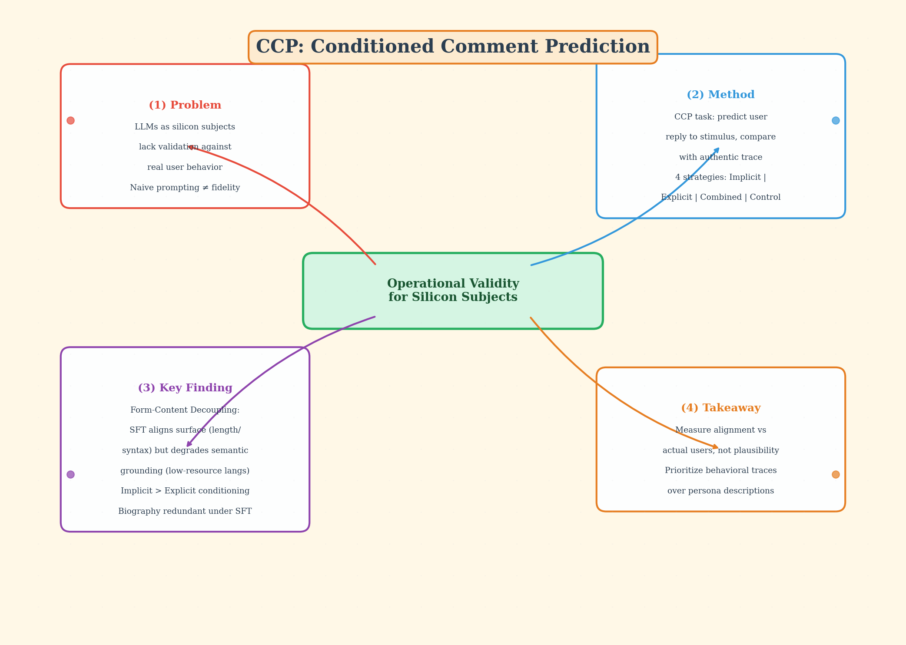

# Silicon Sampling / Social Simulation — 2026-05-23

## 1. Towards Simulating Social Media Users with LLMs: Evaluating the Operational Validity of Conditioned Comment Prediction

- **arXiv**: 2602.22752
- **Link**: https://arxiv.org/abs/2602.22752
- **Venue**: WASSA @ EACL 2026, Rabat, Morocco
- **Authors**: Nils Schwager, Simon Münker, Alistair Plum, Achim Rettinger (Trier University, University of Luxembourg)
- **已讀來源**: arXiv HTML 全文（14 頁 + appendix）

### 這篇在說什麼

這篇論文要解決的問題是：當我們用 LLM 當「silicon subject」來模擬社群媒體使用者的行為時，怎麼驗證模型真的能重現特定使用者的回應模式，而不只是產出「看起來合理」的文字？目前 silicon sampling / social simulation 領域的主流做法是 explicit conditioning——給模型一段 persona 描述（例如「你是保守派選民」），然後讓它模擬回應。但這種做法的假設從未被嚴格檢驗：模型對這些標籤的理解是否真的對應真人的複雜行為模式？

作者提出 Conditioned Comment Prediction（CCP）任務作為 foundational proxy task：給模型一個 stimulus（貼文或新聞），要它預測特定使用者會如何回應，然後拿生成結果跟該使用者的真實回應比較。這是對 silicon sampling 方法論的關鍵補洞——從「看起來像」轉向「真的像」，把 operational validity 當核心評判標準。

### 主要貢獻

1. **提出 CCP 任務框架**：把使用者模擬問題框架化為可量化的 prediction task，以真實數位痕跡為 ground truth，取代過去依賴人類評審打「plausibility」分數的驗證方式。這讓 silicon sampling 的驗證從 qualitative impression 變成 quantitative measurement。

2. **發現 form–content decoupling**：在低資源語言（Luxembourgish）場景下，SFT 能讓輸出的表面結構（長度、語法）與真人對齊，但同時導致語意層面的退化。模型學會了「說話的方式」卻失去了「說話的內容」——這是過去 silicon sampling 文獻沒有系統性揭露的問題。

3. **證明 implicit conditioning > explicit conditioning**：行為歷史（implicit）比生成傳記（explicit）帶來更高保真度的模擬。更重要的是，在 fine-tuning 條件下，explicit conditioning（生成傳記）變得多餘——模型可以直接從行為歷史進行 latent inference，不需要額外的 persona 描述。這直接挑戰了「naive prompting」範式。

4. **提供 operational guidelines**：基於實驗結果，為 computational social science 研究者提供具體操作指南——什麼情況下零樣本 prompting 就夠、什麼情況下會誤導。

### 方法 / pipeline

CCP 的核心設計是四種 conditioning strategy 的系統性比較：

- **Implicit（User History）**：提供最多 30 個 stimulus–response pair，以 chat 結構輸入，不給任何 persona 描述。模型必須從行為範例自行推斷使用者特徵。
- **Explicit（Generated Biography）**：用 Qwen3-235B 從最多 30 則真實留言推斷出四維度 profile（Basics、Language、Worldview、Behavior），然後將此 profile 作為 conditioning。
- **Combined**：同時提供 profile 和行為歷史，測試兩者是否互補、冗餘或干擾。
- **Control**：只給 stimulus 和通用指令，作為 baseline。

模型選擇三個 8B open-weight 模型：Llama-3.1-8B-Instruct、Qwen3-8B、Ministral-8B-Instruct-2410。SFT 使用統一 hyperparameter（1 epoch、max seq 4500 tokens、paged AdamW 8-bit quantization、單張 L40S GPU）。

語言場景涵蓋三個資源等級：English（7.79M tweets）、German（3.38M tweets）、Luxembourgish（1.02M RTL comments，21,427 users）。資料預處理統一：只保留 first-order replies、user-level split 避免洩漏、最多 30 則歷史、至少 4 則互動才保留。每語言 3,800 訓練用戶 + 650 測試用戶。

### 實驗設計

- **Metrics**：Embedding Distance（Qwen3-Embedding-8B cosine distance，語意對齊）、ROUGE-1（lexical overlap）、BLEU（precision-oriented n-gram）、Length Ratio（輸出長度與真實回應的比例）。
- **Generation**：每個 test instance 生成 5 次（temperature 0.75、max 500 tokens），取平均與標準差。
- **主要結果**（從全文 Table 2 及討論）：
  - English 場景下，SFT+History（implicit）顯著優於所有其他策略；Combined 與 History-only 效果相近，表示 biography 在有 history 時冗餘。
  - Luxembourgish 場景出現 form–content decoupling：SFT 後 Length Ratio 改善（表面結構對齊），但 Embedding Distance 反而退化（語意偏離）。
  - 三個模型中 Qwen3 整體表現最佳，Ministral 在低資源語言最吃力。
  - Control baseline 在 English 有不錯的 surface-level 分數（模型本身就能產出「合理」的社群文字），但在語意指標上與 conditioning 版本差距明顯，證明 plausibility ≠ fidelity。
- **已讀來源限制**：全文已讀完 Section 1–4（含完整方法與實驗表格），Appendix 的 extended results 與 alternative embedding model 比較僅快速掃過。

### かに讀後判斷

這篇對 silicon sampling 領域的價值在於它把驗證問題從「看起來合理嗎？」升級為「真的重現了嗎？」。CCP 任務框架和 form–content decoupling 的發現都值得 Morris 注意。跟之前 DailyRead 討論過的 "Mitigating Social Desirability Bias in Random Silicon Sampling"（2512.22725）相比，這篇聚焦在 operational validity 而非 bias mitigation，兩者互補。

值得點開深讀。優先看：Table 2（完整 multilingual results）、Section 4 的 qualitative analysis（Table 1 的例子非常有說服力）、Appendix D（alternative embedding model 的穩定性分析）。如果 Morris 對 low-resource language 的 silicon sampling 可行性有疑慮，Luxembourgish 的 form–content decoupling 結果是最需要細看的部分。

## 2. LLM-Based Social Simulations Require a Boundary

- **arXiv**: 2506.19806
- **Link**: https://arxiv.org/abs/2506.19806
- **已讀來源**: 僅 abstract 層級快速掃描

### 這篇在說什麼

這篇論文主張 LLM-based social simulation 需要明確的邊界界定，才能對社會科學做出有意義的貢獻。作者指出 LLM 輸出具有同質化傾向——模型傾向扮演「average persona」——這限制了它捕捉真實社會動態所需的多樣性行為模式。這是 silicon sampling 文獻中對 validity 問題的另一視角：不是驗證個體層級的 fidelity（如 CCP 論文），而是質疑整個模擬範式能否再現群體層級的多樣性。

### 主要貢獻

1. 明確提出 LLM 模擬的「average persona」問題：模型輸出趨向中間值，無法再現真實社會的極端或少數行為。
2. 呼籲為 LLM social simulation 設立清晰的適用邊界，避免過度宣稱模擬效度。

### 方法 / pipeline

目前僅從 abstract 確認這是一篇 position / analysis paper，具體論證結構和實證基礎尚不清楚。

### 實驗設計

僅 abstract 層級，無法確認是否有正式實驗或 case study 支撐其論點。

### かに讀後判斷

這篇跟 CCP 論文形成有趣的對照：CCP 從個體層級驗證 fidelity，這篇從群體層級質疑 diversity。但目前只讀到 abstract，不足以判斷論證深度。若 Morris 對 silicon sampling 的邊界問題感興趣，值得快速掃過全文確認論證品質，但不列為今日推薦。