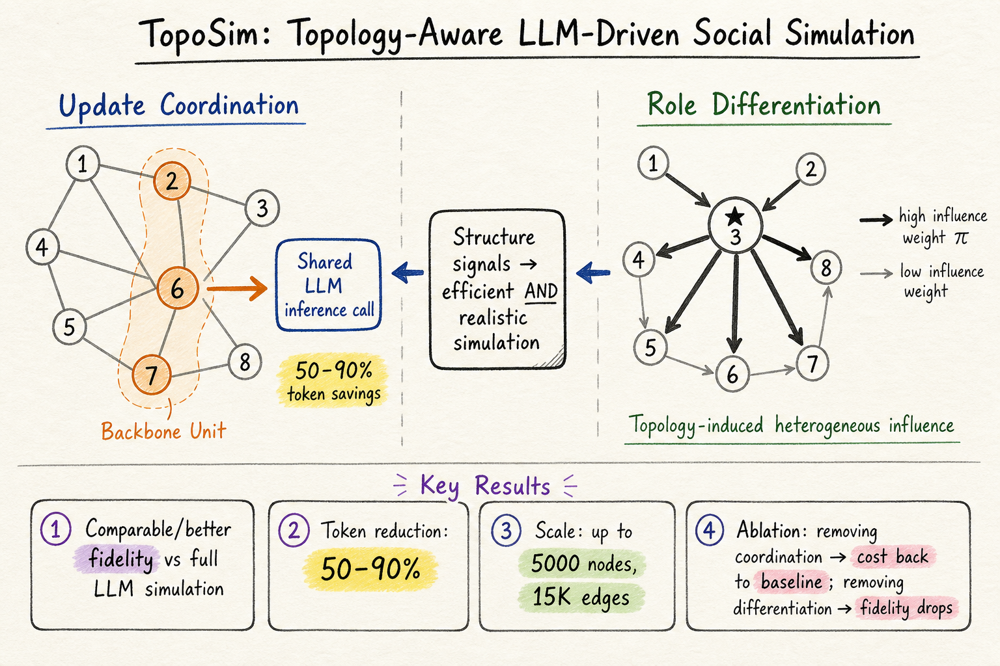

# Silicon Sampling / Social Simulation — 2026-05-24

## 1. TopoSim: Topology-Aware LLM-Driven Social Simulation

- **arXiv**: 2604.18011
- **Link**: https://arxiv.org/abs/2604.18011
- **Authors**: Shulun Zhang, Yingli Zhou, Shipei Zeng, Laks V.S. Lakshmanan, Chenhao Ma (CUHK-Shenzhen, SRIBD, UBC)

### 這篇在說什麼

現有 LLM-based 社會模擬把社交網路當成固定的溝通骨架，agent 之間的互動模式是均勻的——每個鄰居的影響力一視同仁。但真實社會網路有明顯的結構性效應：結構位置相似的個體（例如都是意見領袖的粉絲）會收到高度重疤的訊息、產生趨同更新；而不同結構角色的人（例如大 V vs 普通用戶）對鄰居的影響力截然不同。TopoSim 把這兩種結構信號顯式嵌入 LLM 模擬管線：更新協調（結構相似者共享更新）降低冗餘計算；角色分化（根據網路拓撲推導非均勻影響力）產生更真實的社會動態。

### 主要貢獻

1. **結構感知的更新協調（Update Coordination）**：把結構角色相似的 agent 聚成 backbone unit，共享一次 LLM 推理，減少 token 消耗 50-90%，同時維持模擬保真度。
2. **拓撲驅動的角色分化（Role Differentiation）**：不假設均勻影響力，而是從網路結構推導每個 agent 的影響力權重（π^i_j），讓 hub/authority 節點對鄰居的影響更大。
3. **跨框架泛化**：在三個不同的社會模擬框架（echo chamber、social media opinion exchange、news propagation）和多種資料集上驗證，TopoSim 在保真度可比或更好的同時大幅降低成本。
4. **可擴展性**：在最大 5000 節點、15K 邊的網路上驗證，遠超過去 LLM 模擬通常只到數百節點的規模。

### 方法 / pipeline

TopoSim 的核心是兩個互補模組，嵌入標準的 gather-update-scatter 社會模擬迴圈：

**更新協調模組（Topology-induced Update Coordination）**：
1. 用結構嵌入（如 node2vec 或 graph positional encoding）計算每個 agent 的結構表示 μ_i。
2. 結構相似度閾值 γ 篩選候選配對：cos(μ_i, μ_j) ≥ γ。
3. 在候選配對上計算鄰居訊息分佈相似度（Jensen-Shannon divergence）和內部狀態距離，合併為一致性分數 κ_ij。
4. 一致性分數超過閾值的 agent 聚成 backbone unit，共享一次 LLM 推理，產生更新後再分送回各 agent。

**角色分化模組（Topology-induced Role Differentiation）**：
1. 計算每條邊的結構影響力 π^i_j，基於目標節點的入度中心性、PageRank 或自訂權重。
2. 在 gather 階段，agent 收到鄰居訊息時附帶影響力權重，LLM 根據權重分配注意力。
3. 效果：高影響力鄰居的訊息在 prompt 中被標記為更重要，影響 agent 的狀態更新方向。

### 實驗設計

- **框架**：(1) Echo chamber dynamics（意見極化）；(2) Social media opinion exchange（Twitter-like）；(3) News propagation（資訊擴散）。
- **資料集**：多種真實與合成網路，最大 5000 節點 / 15K 邊。
- **基線**：原始 LLM 模擬（每個 agent 獨立推理）、經典意見動力學模型（DeGroot、Hegselmann-Krause）。
- **指標**：模擬保真度（與真實社會動態的 KL divergence / 地面真值軌跡的 RMSE）、token 消耗量。
- **主要結果**：
  - TopoSim 在保真度上可比或優於原始 LLM 模擬（echo chamber 略好，opinion exchange 相當，news propagation 更好捕捉傳播動態）。
  - Token 消耗減少 50-90%（取決於網路結構和 backbone unit 大小）。
  - 角色分化讓模擬更接近真實的意見極化與傳播模式（大 V 的影響力被正確放大）。
  - Ablation：去除更新協調後 token 消耗回到原始水準；去除角色分化後保真度下降，特別是在 hub 節點明顯的網路上。

### かに讀後判斷

TopoSim 把一個重要的觀察講清楚了：LLM 社會模擬不該無視網路結構。更新協調模組是工程上的聰明設計（結構相似 agent 共享推理），角色分化則讓模擬更真實。這篇和前幾天的 silicon sampling 論文（特別是 WhatIf 互動探索）互補：TopoSim 提高模擬效率與保真度，WhatIf 讓人類決策者互動介入模擬。兩篇合起來描繪了 LLM 社會模擬的下一步——高效能、結構忠實、可互動。

值得 Morris 點開深讀，優先看 Section 3（兩個模組的數學形式化）和 Figure 4（token 節省與保真度的 trade-off 曲線）。若 Morris 對「如何讓 LLM 模擬在大規模網路上跑得起來」有興趣，這篇是目前的最佳切入點。

---

## 2. WhatIf: Interactive Exploration of LLM-Powered Social Simulations for Policy Reasoning

- **arXiv**: 2604.17615
- **Link**: https://arxiv.org/abs/2604.17615
- **Authors**: Yuxuan Li, Kyzyl Monteiro, Hirokazu Shirado, Sauvik Das (CMU HCII)

### 這篇在說什麼

LLM 社會模擬可以產生大量動態行為，但政策制定者如何與這些模擬互動、探索假設情境？現有工具要麼是桌面演習（沒有動態回饋），要麼是離線計算模擬（沒有即時互動）。WhatIf 是一個互動系統，讓使用者即時操控、檢視、比較 LLM agent 模擬，設計需求來自緊急應變規劃人員的深度訪談。

### 主要貢獻

1. **四個設計需求**（從 16 個月的參與式設計過程提煉）：流暢操控（DR1）、即時規模（DR2，支援 12,000+ agent）、協作探索（DR3）、多層可解釋性（DR4）。
2. **WhatIf 系統**：實作了上述四個需求的完整互動模擬系統，支援自然語言和直接操控兩種介入方式、分支情境比較、agent 層級訪談（「這個 agent 為什麼這樣決定？」）。
3. **專家評估**：五位緊急應變專業人員在三個災難疏散情境下使用 WhatIf，發現使用者把模擬當作「反覆分支和比較的空間」而非「評估固定方案的預測工具」。

### 方法 / pipeline

- **Formative Study**：16 個月、6 次設計迭代、3 次半結構化訪談，對象為大學緊急應變團隊。
- **系統架構**：
  - 前端：地圖視覺化 + agent 狀態面板 + 分支比較視圖。
  - 後端：大規模 LLM agent 模擬引擎（12K+ agents），支援即時操控。
  - 互動方式：自然語言 what-if 問句 + 直接拖放（放置障礙物、協調者等）。
  - Agent 可解釋性：點選任何 agent 可查看其決策理由（LLM 產生的自然語言解釋）。

### 實驗設計

- **參與者**：5 位緊急應變專業人員（校園安全、大型活動管理背景）。
- **情境**：戶外畢業典禮疏散，約 12,000 名參與者。
- **發現**：
  - 使用者以「分支比較」而非「方案評估」的方式使用系統。
  - 當 agent 行為違反預期時，使用者會反思隱含假設。
  - 使用者會發現之前未意識到的規劃漏洞。
  - 使用者會從 agent 層級的個案建立論證，而非只看聚合數據。
- **限制**：5 位專業人員的小規模評估、單一領域（緊急疏散）、未測量決策品質改善。

### かに讀後判斷

WhatIf 是 HCI 導向的系統論文，核心貢獻在互動設計而非模擬方法。和 TopoSim 互補：TopoSim 讓模擬更高效更真實，WhatIf 讓人類決策者能即時介入模擬。如果 Morris 對 LLM 社會模擬的「可互動性」有興趣，這篇值得點開看 Section 3（設計需求推導過程）和 Figure 5（系統介面截圖）。但如果主要興趣在模擬方法本身，TopoSim 更值得深讀。

**（全文 HTML 已讀）**

---

## 3. Interactive Exploration of LLM-Powered Social Simulations for Policy Reasoning (WhatIf) — 補充

這篇已在上文完整討論，此處不重複。