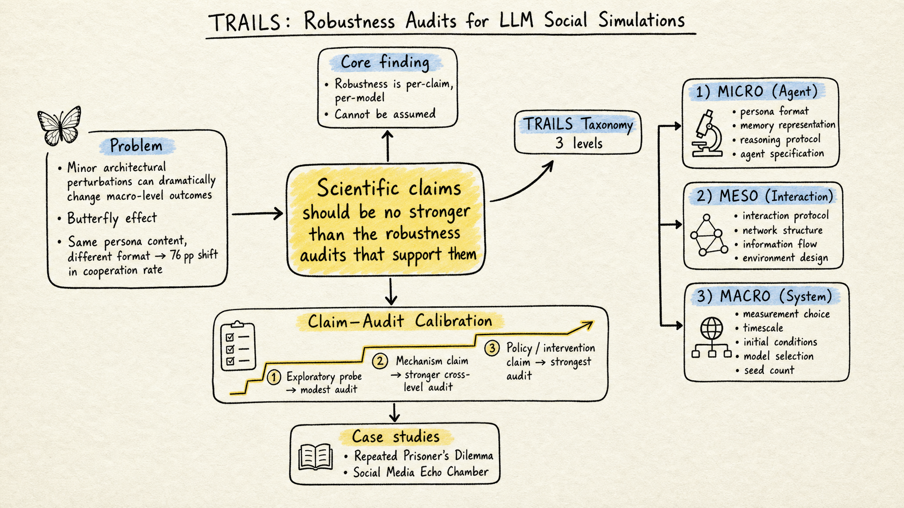

# Silicon Sampling / Social Simulation — 2026-05-25

## 1. TRAILS: Stop Drawing Scientific Claims from LLM Social Simulations Without Robustness Audits

- **arXiv**: 2605.18890
- **Link**: https://arxiv.org/abs/2605.18890
- **Authors**: Jinyi Ye, Lei Cao, Ding Chen, Emilio Ferrara (USC)
- **Venue**: Preprint (May 2026)

### 這篇在說什麼

LLM 社會模擬正在從「探索可能發生什麼」快速升級到「宣稱為什麼會發生、何時發生、我們該怎麼做」。但作者指出，這些模擬的科學宣稱強度遠超過它們的穩健性證據所能支撐的程度。核心問題是「蝴蝶效應」：在 LLM 模擬中，表面上看起來微不足道的設計選擇——persona prompt 的格式、遊戲規則的表述方式、網路初始化方法——可以透過 agent 之間的反覆互動，級聯放大成宏觀結果的劇烈偏移。兩個 persona prompt，內容完全相同，只是格式不同，就可以讓囚徒困境的合作率差 76 個百分點。同一個擾動在不同模型上效果也截然不同：在 GPT-5.2 上造成 76 pp 偏移的擾動，在另一個前沿模型上只造成 1 pp。

這篇論文在補的洞很明確：silicon sampling / LLM 社會模擬社群目前對「驗證」的討論幾乎全集中在「像不像真實世界」（realism），但忽略了「穩不穩健」（robustness）。一個模擬可以看起來很合理，但只要改一個表面格式就完全變成另一個結論——這種結論沒有科學意義。作者提出 TRAILS（Taxonomy for Robustness Audits In LLM Simulations），把穩健性審計結構化為 micro / meso / macro 三個層級，並根據宣稱強度、模擬複雜度、領域風險來決定需要多少審計。

### 主要貢獻

1. **蝴蝶效應的實證展示**：透過兩個控制良好的案例研究（重複囚徒困境 + 社群媒體迴聲室模擬），跨四個 LLM，系統性地展示微觀設計選擇如何級聯為宏觀結果的劇烈偏移。不只是展示效應存在，還展示效應的分布是不均勻的：同一個擾動在不同架構維度上和不同模型家族上效果截然不同。

2. **TRAILS 分類架構**：三層穩健性審計——agent 層（micro：persona 格式、記憶表示、推理 protocol）、interaction 層（meso：互動 protocol、網路結構、資訊流）、system 層（macro：測量選擇、環境設計、時間尺度）。每層都有明確的審計項目和操作化建議。

3. **宣稱-審計校準框架**：三類宣稱（探索性探測、機制宣稱、政策/干預宣稱）需要不同強度的審計。探索性宣稱只需要基本的格式/種子穩健性檢查；機制宣稱需要跨 agent / interaction / system 三層的穩健性驗證；政策宣稱需要最高標準，因為模擬效果可能被誤讀為對真實世界的可靠預測。

4. **兩個案例研究的完整審計**：不只展示問題，還展示了如何做穩健性審計——什麼維度該掃、怎麼掃、結果怎麼判讀。

### 方法 / pipeline

**案例一：重複囚徒困境**
- 10 輪重複 PD，N=30 seeds per condition
- 擾動維度：persona format（敘述式 vs. key-value vs. 對話式）、game instruction framing（合作傾向 vs. 中立 vs. 競爭傾向）、模型選擇（GPT-4o-mini, GPT-5, GPT-5.2, Claude 3.5 Sonnet）
- 主要結果：persona format 擾動在 GPT-5.2 上造成 76 pp 合作率偏移，但在 Claude 上只有 1 pp；同一模型上，format 擾動的效應量也遠大於 seed 變異

**案例二：社群媒體迴聲室模擬**
- 使用真實 Twitter 網路結構（politico 網路）
- 擾動維度：網路同質性參數、hub 節點分配策略、初始意見分佈
- 主要結果：網路初始化選擇對極化指標有一致且顯著的影響，且影響方向因模型而異

**TRAILS 分類**
- Micro-level：persona prompt 格式、記憶表示、推理與決策 protocol、agent specification（人口統計 vs. 特質描述 vs. 角色扮演）
- Meso-level：互動 protocol（輪流 vs. 同步）、網路結構（小世界 vs. 無標度 vs. 隨機）、資訊流（廣播 vs. 定向）、環境設計（規則表述）
- Macro-level：測量選擇（極化指標的定義）、時間尺度、初始條件、模型選擇、種子數量

### 實驗設計

- 兩個案例研究，每個都跨多個模型、多個擾動維度、多個種子
- 囚徒困境：3 persona formats × 3 instruction framings × 4 models × 30 seeds = 1,080 條件
- 迴聲室：3 homophily levels × 2 hub assignment strategies × 4 models × 10 seeds = 240 條件
- 統計檢定：Mann-Whitney U, 兩側檢定
- 效應量指標：百分比點偏移、Cliff's delta
- 關鍵發現：穩健性是 per-claim、per-model 的屬性，不能假設某個模擬在某個模型上穩健就代表在其他模型上也穩健

### かに讀後判斷

這篇和 5/14 的「Collapse of Heterogeneity in Silicon Philosophers」以及 5/20 的「Improving Cross-Cultural Survey Simulation with Calibrated Value Personas」形成一條清晰的對話線：從「silicon sample 異質性崩塌」→「用 calibration 修復異質性」→「即使修好了異質性，你的整個模擬還可能因為一個表面格式選擇而產生完全不同的結論」。TRAILS 的價值在於它不只是診斷問題，還提供了結構化的審計框架，讓研究者在宣稱結論之前可以系統性地檢查結論是否穩健。

對 Morris 來說，如果要做 silicon sampling 相關研究，TRAILS 的三層審計清單可以直接拿來用——不只是當作「未來工作」的建議，而是今天就可以在實驗設計中採用的具體檢查項。深讀時優先看 Section 4（案例研究）和 Section 5（TRAILS 架構），以及 Figure 1 的蝴蝶效應示意圖。

**推薦等級：今日推薦點開**

---

## 2. Mechanism Plausibility in Generative Agent-Based Modeling

- **arXiv**: 2605.12824
- **Link**: https://arxiv.org/abs/2605.12824
- **Authors**: Patrick Zhao et al.
- **Venue**: ACM FAccT 2026

### 這篇在說麼

這篇在解一個跟 TRAILS 互補的問題：LLM-ABM 研究者在展示結果時，經常把「agent 層級的功能性」（agent 能不能產生像人的行為）和「ABM 層級的湧現解釋力」（這個模擬能不能解釋宏觀現象的機制）混在一起。論文引入哲學科學中 phenomenal model vs. mechanism model 的區分：前者只是「能長出目標現象」（generative sufficiency），後者還要「提出這個現象可能是怎麼產生的」（mechanistic plausibility）。

目前 LLM-ABM 評估的主流方式是「believability」——讓人類標注者判斷 agent 對話是否像人。但 believability 只測了 generative sufficiency，不能代表模擬有解釋力。如果一個模擬能長出極化現象，但它是透過 LLM 的某種統計模式而非透過你假設的社會機制長出來的，那這個模擬對「極化為什麼發生」就沒有解釋力。

### 主要貢獻

1. **Mechanism Plausibility Scale**：四級量表——Level 0（phenomenal model，只展示 generative sufficiency）、Level 1（plausible mechanism candidate，有從機制到現象的映射假說但未驗證）、Level 2（empirically grounded mechanism，映射有經驗支持）、Level 3（falsifiably validated mechanism，映射可被反駁且已受測試）。

2. **LLM-ABM 文獻回顧**：系統性地回顧了早期 LLM-ABM 工作，發現許多論文在 Level 0 的 generative sufficiency 之外做了 Level 1-2 的機制宣稱，但評估方法仍然只支持 Level 0 的 believability 判斷。

3. **實用 Checklist**：把量表轉成填寫式的 checklist，讓建模者具體聲明自己的模擬在哪個層級、做了什麼映射假說、有什麼經驗支持，而不是模糊地說「我們的模擬驗證了 X 機制」。

### 方法 / pipeline

論文的方法是概念分析和文獻回顧，不是實驗。核心方法是：
1. 從哲學科學的機制文獻（Machamer, Craver, Glennan）和 ABM 文獻（Epstein 的 generative sufficiency）中提取理論資源
2. 把這些資源操作化為一個四級量表
3. 用量表回顧 LLM-ABM 文獻，展示混淆模式
4. 轉成 checklist 格式

### 實驗設計

無實驗。論文是概念性工作 + 文獻回顧 + 提案。目前從全文 HTML 和 FAccT 接受通知能確認：這是一篇理論 / 位置論文，沒有自己的實驗數據。回顧覆蓋的論文範圍需要在深讀時確認。

### かに讀後判斷

這篇和 TRAILS 是同一波「LLM 社會模擬的驗證標準不夠嚴格」批判的兩面：TRAILS 說「你的結論可能不穩健」，Mechanism Plausibility Scale 說「即使穩健，你也可能把 generative sufficiency 當成了 mechanism explanation」。兩篇合在一起，基本上構成了一個完整的 LLM 社會模擬評估批判框架。

對 Morris 來說，如果已經讀了 TRAILS，這篇的增量價值在於它提供了比 TRAILS 更基礎的概念區分——generative sufficiency vs. mechanistic plausibility——這個區分不只是 LLM-ABM 的問題，也是所有 ABM 的老問題。FAccT 接受也意味著這個論點有經過審查。但這篇是概念論文，沒有實驗，如果時間有限可以先看 TRAILS 再回來看這篇的 checklist。優先看 Section 2.2-2.3（phenomenal model vs. mechanism 的區分）和 Section 4（checklist）。