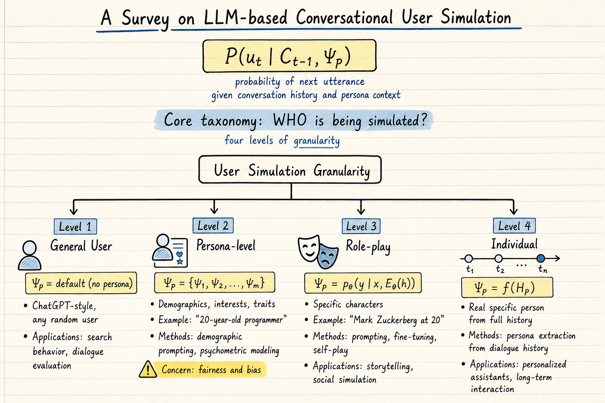

# Silicon Sampling / Social Simulation — 2026-05-27

## 1. A Survey on LLM-based Conversational User Simulation

- **arXiv**: 2604.24977
- **Link**: https://arxiv.org/abs/2604.24977
- **Authors**: Bo Ni, Leyao Wang, Yu Wang, Branislav Kveton, Franck Dernoncourt, Yu Xia, Hongjie Chen, Reuben Leura, Samyadeep Basu, Subhojyoti Mukherjee, Puneet Mathur, Nesreen Ahmed, Junda Wu, Li Li, Huixin Zhang, Ruiyi Zhang, Tong Yu, Sungchul Kim, Jiuxiang Gu, Zhengzhong Tu, Alexa Siu, Zichao Wang, David Seunghyun Yoon, Nedim Lipka, Namyong Park, Zihao Lin, Trung Bui, Yue Zhao, Tyler Derr, Ryan A. Rossi (Vanderbilt, Adobe Research, Yale, Oregon, UCSD, Dolby, UC Berkeley, Cisco AI, USC, Texas A&M, UC Davis)
- **Submitted**: 2026-04-30

### 這篇在說什麼

用 LLM 模擬使用者的對話行為，這件事從 2023 年 Generative Agents 開始爆發，到現在已經累積了大量工作——模擬使用者做搜尋、做推薦、做對話系統評估、做社會模擬——但一直沒有一篇 survey 系統性地整理「誰被模擬」、「被模擬什麼」、「怎麼模擬」這三個基本問題。

這篇 survey 的貢獻是把 LLM-based conversational user simulation 這個領域的散亂工作整理成一個統一的分類法。核心洞察是：模擬目標有一個從粗到細的頻譜——從 general user（任何人）到 persona-level user（特定人口統計特徵的人）到 role-play（特定角色或名人）到 individual user（特定真實個人）——而不同的模擬目標需要完全不同的技術、評估方式和倫理考量。

### 主要貢獻

1. **三維分類法（Who / What / How）**：
   - **Who（模擬誰）**：四層粒度——general user、persona-level、role-play、individual。每一層的 formality 和 grounding 程度不同，從「隨機採樣的使用者」到「基於完整個人歷史的特定個人」。
   - **What（模擬什麼）**：對話行為的不同面向——偏好表達、搜尋行為、點擊行為、多輪交互、任務完成、社會互動。
   - **How（怎麼模擬）**：prompt engineering、fine-tuning、RL-based training、self-play 等技術路線。

2. **形式化框架**：為 conversational simulation 提供了概率模型 P(u_t | C_{t-1}, Ψ_p)——參與者 p 在對話歷史 C_{t-1} 和個人上下文 Ψ_p 的條件下生成下一個 utterance。不同粒度的模擬對應 Ψ_p 的不同精細程度。

3. **系統性分析**：從 Bradley-Terry-Luce 模型到最新的 LLM-based simulation，梳理了使用者模擬從統計模型到生成模型的演進脈絡。

### 方法 / pipeline

這是 survey，不是提出新方法。但它的分類法本身是一個重要的分析框架：

**General User Simulation（§3.1）**
- Ψ_p = default（無特定 persona）
- 典型方法：直接用 ChatGPT 等 LLM 生成「一般使用者」的回應
- 應用：搜尋行為模擬（BASES）、使用者查詢生成（USimAgent）、對話系統評估

**Persona-level User Simulation（§3.2）**
- Ψ_p = {ψ_1, ψ_2, ..., ψ_m}，每個 ψ 是人口統計、興趣或風格特徵
- 方法：demographic prompting、psychometric modeling（大五人格等）、trait-infused architectures、activation-level control
- 應用：公平性測試、偏見檢測、個人化評估

**Role-play Simulation（§3.3）**
- Ψ_p = p_θ(y|x, E_θ(h))，h 是身份描述（如「Mark Zuckerberg at 20」）
- 方法：prompting、fine-tuning、self-play
- 應用：故事生成、社會模擬、記憶建模

**Individual User Simulation（§3.4）**
- Ψ_p = f(H_p)，從完整個人歷史 H_p 推導
- 方法：從使用者歷史對話中提取 persona、動態更新個人上下文
- 應用：個人化助手、長期互動、推薦系統

### 實驗設計

這是 survey paper，沒有自己的實驗。但它系統性地整理了以下內容：
- **評估方法**：內在評估（模擬行為與真實行為的一致性）、外在評估（模擬使用者對下游系統效能的預測能力）、人類評估。
- **開放挑戰**：模擬忠實度（simulation fidelity）、偏見放大、隱私考量、評估標準化。
- **跨領域應用**：搜尋、推薦、對話系統、社會模擬、任務導向對話。

從全文 HTML 已確認分類法的完整結構和各節內容。附錄中的詳細比較表格需要看 PDF。

### かに讀後判斷

這篇 survey 對 DailyRead 追蹤的 silicon sampling / social simulation 領域非常重要，因為它提供了一個統一的框架來理解這個快速發展的領域。四層模擬粒度的分類（general → persona → role-play → individual）特別有用——之前追蹤的很多 paper 可以清楚地放到這個頻譜上：

- **Generative Agents**（Park et al. 2023）是 role-play 層的典型例子
- **Dynamo-K**（2605.18395，5/25 追蹤）是 persona-level 的偏見檢測
- **Can LLMs Revolutionize Survey Research?**（2605.19229，5/26 追蹤）是 general-level 的調查模擬

Survey 中的 individual user simulation 和 agent memory 有直接交叉——模擬特定使用者需要長期記憶，這正是 DailyRead 追蹤的 agent memory 系統的核心場景。

**今日推薦點開。** 對於想快速掌握 LLM-based user simulation 全貌的研究者，這篇 survey 的分類法是很好的起點。值得細讀的部分：§3 的四層模擬分類、§5 的模擬技術分析、§7 的開放挑戰。

---

## 2. Misalignment Propensity in LLMs: Does Model Size Matter?

- **arXiv**: 2506.04018
- **Link**: https://arxiv.org/abs/2506.04018

### 這篇在說什麼

（僅 abstract 層級快速掃描）

這篇研究 LLM 的「不對齊傾向」（misalignment propensity）是否隨模型規模增大而增加。隨著 LLM 變得更大、更強，它們是否也變得更可能產生不對齊的行為？這是一個重要的安全問題，因為如果答案是肯定的，那麼 scaling 就需要搭配更強的對齊努力。

### 主要貢獻

（僅從 abstract 確認）
1. 系統性研究模型規模和 misalignment propensity 的關係
2. 提出測量 misalignment 的方法論
3. 對 scaling 和安全的關係提供實證證據

### 方法 / pipeline

（僅從 abstract 確認）作者設計了一系列 misalignment 測試，在不同規模的模型上評估。

### 實驗設計

目前只能從 abstract 確認研究問題和基本方法，無法確認具體的實驗設計、基準、metric 或詳細結果。

### かに讀後判斷

和 DailyRead 追蹤的 silicon sampling 有關——如果我們要用 LLM 模擬社會行為，模型本身的 misalignment 傾向會直接影響模擬的可靠性。但目前只有 abstract 層級的資訊，無法確認方法論的嚴謹性和結果的可信度。標記為候選，等全文可取得後再深讀。