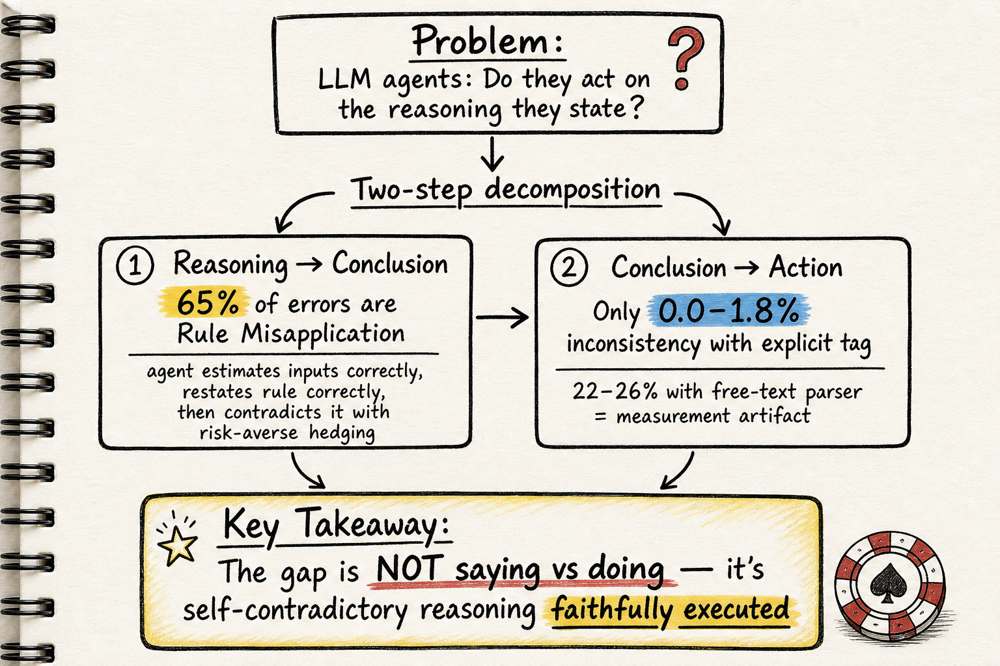

# Silicon Sampling / Social Simulation — 2026-06-03

## 1. Doing What They Say, Not What They Reason: Locating the Faithfulness Gap in LLM Agents

- **arXiv**: 2606.00476
- **Link**: https://arxiv.org/abs/2606.00476
- **Authors**: (未在 HTML 前段完整列出，含多個機構)
- **領域定位**: Silicon sampling / process fidelity / CoT faithfulness

### 這篇在說什麼

LLM agent 在社會模擬裡號稱會「思考後行動」，但這個「思考」到底有多少真的在驅動行為？這篇論文用德州撲克（Texas Hold'em）做可驗證的控制實驗環境——每個決策點都有 equity-based threshold heuristic 當參考動作——把「faithfulness gap」拆成兩步：reasoning→conclusion（agent 推出的結論是否遵循自己的推理？）和 conclusion→action（agent 執行的動作是否符合自己聲稱的結論？）。結果發現這兩步表現完全相反：conclusion→action 幾乎完全一致（0.0–1.8% 不一致率），但 reasoning→conclusion 才是真正出問題的地方——65% 的錯誤決策是 agent 正確估算了輸入、正確重述了決策規則，然後結論卻違反了自己剛說的規則。

這篇直擊 silicon sampling 領域一個根本問題：如果我們連 agent 的推理和行為之間的忠實度都無法保證，那拿 LLM 當社會模擬器的「emergent behavior」有多少是真的、多少是模型 artifact？

### 主要貢獻

1. **Measurement caution**: 用 free-text phrase parser 量到的 stated-vs-actual 不一致率高達 22–26%，但改用 explicit DECISION tag 後降至 0.0–1.8%。這表示過去很多 CoT unfaithfulness 結論其實是量測 artifact。
2. **Decomposition locating the gap**: 把 faithfulness gap 拆成兩步後，發現問題集中在 reasoning→conclusion，不是 conclusion→action。Agent 幾乎都會執行自己聲稱的決定，但那個決定經常不遵循自己的推理前提。
3. **Characterizing the upstream failure**: 65% 的錯誤是 rule misapplication——agent 正確估算 equity、正確重述 fold/call/raise 規則，然後用定性 hedging 語言（「not significantly above」）推翻數值結論，方向一致性地偏風險趨避。
4. **Portable process-fidelity instrument**: 包裝德州撲克為可重現的測試環境，附開源 harness 和 live multi-agent demo。

### 方法 / pipeline

- **Arena**: Python Texas Hold'em 引擎，管理牌組、社群牌、pot、下注順序。
- **Agent interface**: 單一 `decide(game) → action` 介面，四個策略座位各由 LLM agent 占據。
- **Observer**: 每個決策記錄推理過程、聲稱結論、實際動作，以及 equity-based threshold heuristic 的參考動作。
- **四種 prompt 策略**: plain（只要求決策）、chain-of-thought（先推理再決策）、GTO-verbose（要求列出 equity、pot odds、rule 再決策）、GTO+rule-injection（把 decision rule 直接寫進 prompt）。
- **三個模型家族**: Claude Haiku 4.5, Gemini 2.5 Flash-Lite, DeepSeek-v4-pro（含原生推理模型）。
- **兩種結論萃取**: free-text phrase parser（last-match heuristic）vs. explicit `<DECISION>` tag。

### 實驗設計

- 791 個決策點（GTO-verbose 條件），三個模型家族，四種 prompt 策略。
- **RQ1**: Conclusion→action 不一致率——phrase parser 下 22–33%，DECISION tag 下 0.0–1.8%。DeepSeek 的自由文本解析率只有 44%，但 DECISION tag 下不一致率 0.0%。
- **RQ2**: Rule misapplication 占可解讀錯誤的 65%，equity 估計錯誤只占 19%，邊界案例 16%。Rule injection 不改善結果。
- 錯誤方向一致性極強：97% 的 rule misapplication 是該 raise 卻選被動動作（call/check/fold），平均超過 raise threshold 0.22。
- 關鍵 ablation：即使把 decision rule 直接注入 prompt，agent 仍然會用 hedging 語言繞過自己剛說的規則。

### かに讀後判斷

這篇是今天最值得深讀的 silicon sampling paper。它用撲克這個有參考解的環境，精確定位了 faithfulness gap 的來源不是「說一套做一套」，而是「推理自相矛盾但忠實執行矛盾結論」。這對所有拿 LLM 做 social simulation 的人都是警告：你的 agent 可能忠實執行了一個自己推理都不支持的決定。深讀時優先看 Section 4.1（measurement artifact）和 Section 4.2（rule misapplication 的定性分析），Figure 1 的 overview 也值得仔細看。

---

## 2. Can LLM Agents Sustain Long-Horizon Organizational Dynamics? (TaskWeave)

- **arXiv**: 2606.01199
- **Link**: https://arxiv.org/abs/2606.01199
- **Authors**: Xuancheng Zhu, Yang Yue, Shuaibing Wan, Zihan Dou, Xiaohan Zhang, Yongrui Liu, Guoshun Nan (BUPT)
- **領域定位**: Silicon sampling / organizational simulation / long-horizon coherence

### 這篇在說什麼

這篇問了一個很實際的問題：LLM agent 能不能撐住一整年（模擬時間）的組織運作？組織模擬不只是「一群人對話」——它需要層級授權、目標分解、任務依賴、跨時間的執行痕跡累積。現有的 multi-agent framework 大多處理單一任務或短期協作，沒有機制維持跨層級、跨時間的 planning 和 execution state。TaskWeave 把這個問題定義為「memory-centered coordination problem」，用階層式 FPDA（Formulate–Partition–Diagnose–Align）循環維持 planning state，用 dependency-aware trace memory 維持 execution grounding。

### 主要貢獻

1. 把長期組織模擬定義為 memory-centered coordination problem，強調角色一致性、目標傳播、依賴滿足和可追溯執行。
2. 提出 TaskWeave：組織先驗 → 階層式 FPDA planning → dependency-aware execution → trace memory 回寫的閉環架構。
3. 在一年期 IT 公司模擬中驗證，與其他 multi-agent framework 比較組織連貫性、執行接地性和下游企業 NLP 效用。

### 方法 / pipeline

- **Organizational Prior Instantiation**: 從組織 metadata（規模、部門、角色）建構 agent 族群和授權拓撲。
- **Hierarchical Intent Propagation (FPDA)**: 高層目標 → 分解為部門目標 → 分解為任務包。Diagnose 階段檢查執行回饋，Align 階段修正規劃。
- **Dependency-Aware Execution**: 每個 composite task 拆成 atomic subtask，每個 subtask 有 dependency query（需要哪些先前的內部結果、外部證據），resolve 後才執行。
- **Trace Memory**: 執行結果（包含 provenance metadata）回寫全局結果池，供後續 planning 和 execution 引用。

### 實驗設計

- 一年期 IT 公司模擬（從 HTML 全文確認），包含多個部門、跨層級目標分解、外部事件注入。
- 比較 TaskWeave 與其他 multi-agent framework 在組織連貫性、執行接地性、下游 NLP 效用的指標。
- 具體數據需深讀完整實驗章節確認；目前從 HTML 前段可確認實驗設計的完整性。

### かに讀後判斷

這篇定位清楚——組織模擬的「memory-centered」視角和 silicon sampling 的 faithfulness 問題互補。TaskWeave 的 FPDA 循環和 dependency-aware trace memory 設計值得和 harness engineering 的「evolvable harness」概念對照。但如果要深讀，建議先看 Section 3 的完整數學定義和 Section 4 的實驗對比（目前 HTML 只看到前段）。和 05-08 那批 silicon sampling 筆記相比，這篇更偏向系統設計而非驗證方法論。

---

## 3. Making the Social Sciences Count in LLM Research (BenCSSmark)

- **arXiv**: 2605.04886
- **Link**: https://arxiv.org/abs/2605.04886
- **Authors**: Arnault Chatelain et al.
- **領域定位**: Silicon sampling / social science benchmarking

### 這篇在說什麼

這是一篇 position paper，核心論點是：主流 LLM benchmark 太少涵蓋社會科學任務，這限制了 LLM 評估的推進，也限制了社會科學利用 LLM 的能力。作者提出 BenCSSmark，一個由計算社會科學家標註的 dataset 組成的 benchmark，試圖把社會科學視角帶進 LLM 評估。

### 主要貢獻

1. 指出 social science tasks 在 LLM benchmark 中的代表性不足。
2. 提出 BenCSSmark，整合社會科學家標註的 dataset。
3. 主張社會科學視角能改善 LLM 的泛化性和穩健性。

### 方法 / pipeline

Position paper 性質，主要是論證和 benchmark 設計描述。BenCSSmark 的具體 task construction、evaluation protocol、scoring 需要深讀全文確認。

### 實驗設計

目前只能從 abstract 確認 BenCSSmark 由社會科學家標註的 dataset 組成，具體評估結果、baseline 比較、ablation 等在 position paper 中可能有限。標示為「僅 abstract 層級快速掃描」。

### かに讀後判斷

這篇對 silicon sampling 的意義在於：如果我們要讓 LLM 做社會模擬，benchmark 本身就需要社會科學的任務和標註。但作為 position paper，它更像是倡議而非方法論突破。和今天的 faithfulness gap paper 相比，BenCSSmark 提供的是「評估什麼」的問題，而 2606.00476 提供的是「如何忠實量測」的方法。如果 Morris 對社會科學 benchmark 設計有興趣可以點開，但優先級低於前兩篇。