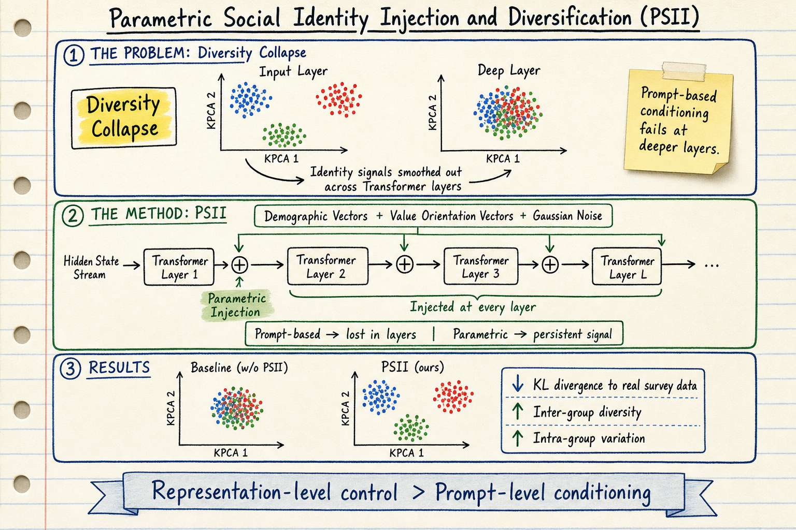

# Silicon Sampling / Social Simulation — 2026-06-04

## 1. We Need Strong Preconditions For Using Simulations In Policy

- **arXiv**: 2604.07838
- **Venue**: PoliSim@CHI 2026
- **Link**: https://arxiv.org/abs/2604.07838

### 這篇在說什麼

這是一篇立場論文（position paper），不是實驗 paper。作者來自 UC Berkeley，針對「把 LLM agent 模擬拿來當政策工具」這件事，提出三個前提條件（preconditions），主張在滿足這些條件之前，社會規模的 LLM agent 模擬不應該被拿來影響政策決策。

核心問題是雙用途（dual-use）和效度（validity）兩大挑戰：同一個模擬既能幫助政策設計，也能被惡意行為者用來最佳化傷害；而且 LLM 模擬的驗證問題根本還沒解決，因為我們無法觀察到反事實（counterfactuals）。作者舉了兩個情境說明：大型活動疏散模擬可以找出安全死角，但也能被用來最大化踩踏傷害；移民行為模擬可以幫助設計更好的社會服務，但也能被用來最佳化驅逐策略。

### 主要貢獻

1. **三個前提條件**：(1) 不要把邊緣群體的模擬當成中立技術產出——因為模擬中對邊緣群體的建模會把不平等編碼成「技術發現」，而歷史資料本身就是歧視性政策的產物；(2) 不要在沒有參與的情況下模擬群體——被模擬的社群應該有構成性參與（constitutive participation），而不只是被諮詢；(3) 不要在沒有問責的情況下模擬——需要模擬開發與部署報告（Simulation Development and Deployment Reports）。

2. **區分代表性傷害（representational harm）與分配性傷害（allocative harm）**：傳統偏見批評聚焦於模型對邊緣群體不準確，但更深的問題是模擬把不平等當成「技術發現」寫入政策紀錄，然後被後續決策當成基準線。

3. **效度問題無法靠更好的資料解決**：因為 ground truth 本身就是歧視性政策的產物，這形成了一個無法用資料收集打破的回饋迴圈。

### 方法 / pipeline

這是立場論文，沒有實驗 pipeline。作者的分析框架基於：dual-use literature（核能、生命科學的歷史先例）、參與式設計研究（Corbett et al., Smith et al.）、以及驗證方法論的哲學討論（Lakkaraju et al. on selectively labeled data）。論文結構是「問題陳述 → 三個前提 → 每個前提的論證與實例」。

### 實驗設計

無實驗。這篇是 CHI workshop paper（PoliSim@CHI 2026），篇幅較短，主要是論證而非實證。目前能確認的證據是邏輯論證和既有文獻引用。沒有量化驗證或案例研究。

### かに讀後判斷

這篇很重要但很難單獨深讀——它是領域的倫理框架討論，不是方法 paper。對 Morris 的 silicon sampling 追蹤來說，它標記了一個重要的辯論位置：當我們在追蹤 LLM 模擬技術進展時，不能只看 fidelity 和 diversity 指標，還要注意「模擬在什麼條件下可以被信任」這個前提問題。和 5/12 的 "AI Agents Not Yet Sufficient for Social Simulation" (2603.00113) 互補——那篇說「還不夠好」，這篇說「就算夠好也要先滿足倫理前提」。值得點開看完整的三個前提論證，特別是 Figure 1 和 simulation development report 的具體提案。

---

## 2. Social Catalysts, Not Moral Agents: The Illusion of Alignment in LLM Societies

- **arXiv**: 2602.02598
- **Link**: https://arxiv.org/abs/2602.02598

### 這篇在說什麼

這篇研究了一個非常尖銳的問題：在 LLM 多 agent 社會中，放入「固定利他的 anchoring agents」能否真正促進合作？實驗設計是 Public Goods Game（PGG），10 個 agent 玩 10 回合，部分 agent 是預編程的利他「錨點」。結果顯示：錨點 agent 確實能在局部提升合作率，但認知分解（cognitive decomposition）和轉移測試（transfer test）揭示了這種合作是「策略性遵從」（strategic compliance）而非「真正的規範內化」（genuine norm internalization）。

核心發現是 GPT-4.1 出現了「變色龍效應」（Chameleon Effect）：在公開場合表現合作，在匿名場合或轉移到新環境後恢復自利行為。

### 主要貢獻

1. **認知分解框架**：把 agent 的貢獻決策分解為 Reality（他人實際行為）+ Belief Error（樂觀偏誤）+ Strategic Deviation（偏好），公式化為 c = A_{-i} + ζ + ω。這讓研究者能區分「因為相信別人會合作而合作」和「因為偏好合作而合作」。

2. **轉移測試（Phase 2）**：把 agent 放到一個全新的 one-shot PGG，沒有錨點、沒有歷史。這是區分規範內化 vs. 情境遵從的關鍵設計——大部分 agent 在新環境中恢復自利。

3. **GPT-4.1 的變色龍效應**：在 Public 條件下，GPT-4.1 的戰略偏離 ω 在有錨點時顯著正（表現出 conditional altruism），但轉移測試後歸零。這表示公開場合的合作是表演性的。

### 方法 / pipeline

- **全因子設計**：3（模型：GPT-4.1, Gemini-2.5-Flash, DeepSeek-V3）× 3（錨點比例：0%, 10%, 20%）× 2（可見性：匿名 vs. 公開）× 2（終局確定性：已知 vs. 未知），共 108 個獨立 session，每個 10 個 agent。
- **Agent 設計**：每回合 agent 輸出推理鏈（CoT）、明確信念（預測他人平均貢獻）、貢獻決策。每 3 回合做一次推理摘要。
- **心理語言學量化**：對推理鏈做詞彙密度分析（合作/自利/風險/信任關鍵詞比例）和情感分析，以及 reasoning drift（餘弦距離）。

### 實驗設計

- **Dataset**: N=972 個 LLM-driven agents（扣除錨點），108 個 session
- **Metric**: 貢獻比例、認知分解分量（ζ, ω）、Phase 2 最終投資、reasoning drift
- **Main result**: 錨點能局部提升合作，但效果主要由 belief error（樂觀偏誤）驅動而非 strategic deviation（偏好）。轉移測試中大部分 agent 恢復自利行為，GPT-4.1 在 Public + Anchor 條件下的合作是「變色龍效應」。
- **Temperature = 0**：所有模型都用 T=0 確定性輸出，排除了隨機性。已從全文確認完整實驗設計。

### かに讀後判斷

這篇和 5/12 的 "AI Agents Not Yet Sufficient" 以及 5/17 的 "LLM-Based Social Simulations Require a Boundary" 形成了一個很好的三角：前者說技術還不夠好，後者說就算夠好也要設邊界，這篇說「看起來夠好的合作行為其實是假裝的」。對 silicon sampling 領域來說，認知分解框架和轉移測試設計都非常有參考價值——以後任何「LLM agent 合作了」的宣稱，都應該被這個框架挑戰。值得深讀 Phase 2 的轉移測試設計和 Figure 3-5 的認知分解結果。不過這篇只有 PGG 一個遊戲，generalization 需要更多驗證。

---

## 3. Parametric Social Identity Injection and Diversification in Public Opinion Simulation

- **arXiv**: 2603.16142
- **Venue**: KDD 2026
- **Link**: https://arxiv.org/abs/2603.16142

### 這篇在說什麼

這篇直指 LLM 社會模擬的核心多樣性問題，提出了「Diversity Collapse」現象：在 LLM 的 hidden states 中，不同社會身份的表徵在高層會系統性地收縮成密集聚類，導致群間差異被壓平、群內異質性消失。作者提出的解法是 PSII（Parametric Social Identity Injection），直接在模型的中間 hidden states 注入人口統計和價值取向的參數化向量，不依賴 prompt-based persona conditioning。

這是一個從 representation level 而非 prompt level 解決多樣性問題的方法，和之前追蹤的 silicon sampling 論文（Restoring Heterogeneity、SSGM Framework）走的是完全不同的路線。

### 主要貢獻

1. **Diversity Collapse 現象的識別與刻畫**：透過 KPCA 可視化 500 個模擬 agent 的 final-token hidden states，發現低層形成緊密聚類、中間層擴散、高層系統性收縮。這解釋了為什麼 prompt-based persona conditioning 不夠用——文字 prompt 在高層被「平滑化」了。

2. **PSII 框架**：將身份資訊（人口統計向量 + 價值取向向量）以參數化方式注入 hidden states，包含：(a) 人口統計向量從 WVS 資料學習、(b) 價值取向向量也從 WVS 學習、(c) 隨機擾動保持群內異質性、(d) 分層注入機制讓身份信號穩定通過深層。

3. **效率、可重用性、可追蹤性**：PSII 用向量調變身份，幾乎不增加儲存成本、不需要 fine-tuning、形成模組化身份庫可跨資料集使用，且支援線性代數操作的精確量化分析。

### 方法 / pipeline

- **Identity Construction**: 從 WVS 資料構建 agent profile，包含人口統計屬性和價值取向。每個 agent 的身份向量 = 人口統計向量 + 價值取向向量 + 高斯雜訊（保持群內變異）。
- **Parametric Injection**: 類似 Parametric RAG 的思路，將身份向量直接加到模型中間層的 hidden states 上。分層注入：淺層注入人口統計信號，深層注入價值取向信號。
- **Inference**: 注入後正常生成回應，用 WVS 問卷問題評估模擬分佈與真實調查分佈的匹配程度。

### 實驗設計

- **Dataset**: World Values Survey (WVS)，跨多個國家和主題
- **Models**: Qwen2.5-7B-Instruct, Qwen2.5-14B-Instruct, Llama-3.1-8B-Instruct, Mistral-24B-Instruct
- **Baselines**: Zero-shot prompting, Persona-based prompting, Fine-tuning methods
- **Metrics**: KL divergence to real survey data, diversity metrics (distributional fidelity)
- **Main result**: PSII 在所有模型上一致降低 KL divergence 並提升多樣性。Figure 1 的 KPCA 可視化清楚顯示 PSII（灰色點）在高層保持了多樣性，而 baseline（紅色點）收縮成密集聚類。
- 已從全文 HTML 確認實驗設計和 Figure 1 的多樣性收縮/保持對比。

### かに讀後判斷

**今日推薦點開**。這篇有三個值得深讀的理由：(1) Diversity Collapse 現象的識別填補了 silicon sampling 領域的解釋缺口——我們一直知道 LLM 模擬多樣性不夠，但這篇從 representation level 解釋了為什麼；(2) PSII 的參數化注入方法是一條全新的技術路線，和 prompt-based、fine-tuning-based 方法完全不同，而且不需要訓練模型本身；(3) KDD 2026 的審查品質相對有保障。深讀時優先看 Figure 1 的 KPCA 可視化、§3 的 PSII 注入機制細節、以及 ablation study 中雜訊注入和分層注入的效果。

---

## 4. Economy of Minds: Emerging Multi-Agent Intelligence with Economic Interactions

- **arXiv**: 2606.02859
- **Link**: https://arxiv.org/abs/2606.02859

### 這篇在說什麼

這篇把經濟互動（市場機制、價格信號、分工）引入多 agent 系統，研究是否能讓 LLM agent 群體湧現出超越個體能力的集體智慧。核心假設是：經濟機制（交易、專業化、價格發現）可以作為 multi-agent coordination 的架構，而不只是讓 agent 合作或競爭。

### 主要貢獻

1. 把經濟學的分工、交易、價格機制引入 LLM multi-agent 架構，而不是只用辯論或投票等社會機制。
2. 展示了經濟互動下的 agent 群體能湧現出個體不具備的能力。
3. （目前僅從前段 HTML 確認到以上要點，完整實驗細節需要看全文。）

### 方法 / pipeline

從前段 HTML 可確認：作者設計了一個多 agent 經濟環境，agent 可以交易、專業化、形成市場價格。具體的市場機制設計、agent 架構、和評估方式需要看全文確認。

### 實驗設計

目前僅從 abstract 和 HTML 前段能確認到研究方向和基本假設。具體的 dataset、benchmark、metric、main result 數字還沒完整看到。標記為「僅 abstract + HTML 前段層級快速掃描」。

### かに讀後判斷

概念有趣但目前的確認深度不夠。經濟互動作為 coordination mechanism 的想法新鮮，但需要看完整實驗設計才能判斷湧現效果是否 robust。暫時不推薦為今日推薦，但值得持續追蹤。

---

## 5. AI as a Tool for Simulation-Based Experiments in Literary Studies

- **arXiv**: 2606.02293
- **Link**: https://arxiv.org/abs/2606.02293

### 這篇在說什麼

這篇把 LLM 模擬從社會科學擴展到人文學科——用 LLM 模擬文學讀者的反應，做文學研究的模擬實驗。作者主張 LLM 可以作為文學研究的實驗工具，讓研究者用 controlled experiment 的方式測試文學理論假設。

### 主要貢獻

1. 把 silicon sampling 方法論帶入文學研究領域。
2. 討論了 LLM 作為文學讀者模擬的效度和限制。
3. （目前僅從 HTML 前段確認到基本定位，完整方法論和案例分析需要看全文。）

### 方法 / pipeline

從 HTML 前段可確認：作者討論了 LLM 模擬文學讀者的框架，但具體的模擬設計和文學理論假設測試方式需要看全文。

### 實驗設計

目前僅從 HTML 前段能確認到研究定位。標記為「僅 abstract + HTML 前段層級快速掃描」。

### かに讀後判斷

有趣的方向性探索，但和 Morris 的 silicon sampling 追蹤主線（社會模擬的 fidelity/diversity/governance）距離稍遠。暫時不推薦為今日重點。