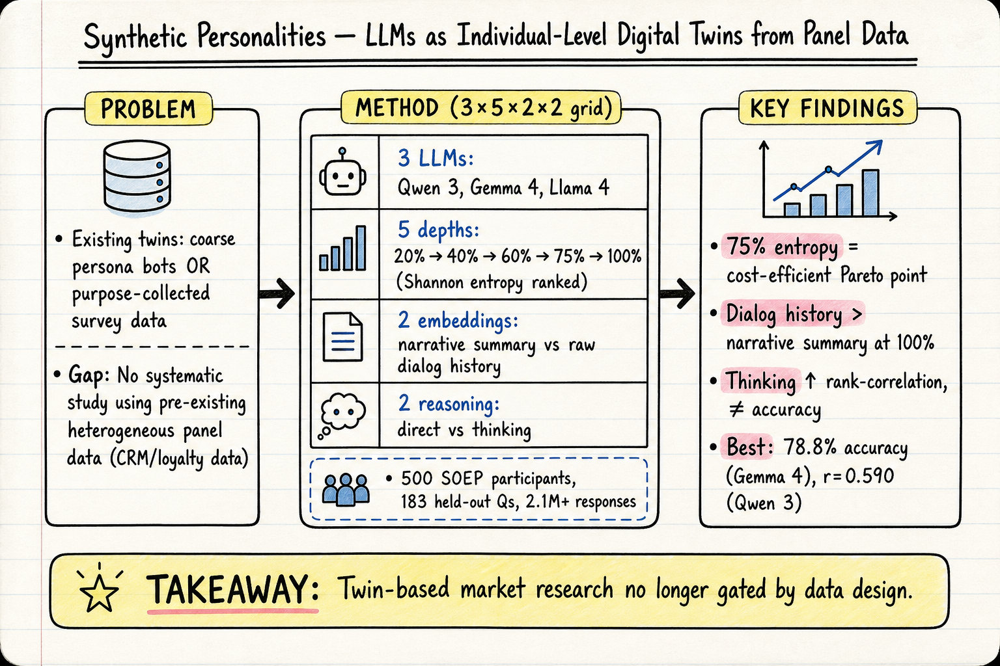

# Silicon Sampling / Social Simulation — 2026-06-06

## 1. Synthetic Personalities: How Well Can LLMs Mimic Individual Respondents Using Socio-Economic Microdata?

- **arXiv**: 2606.04592
- **Link**: https://arxiv.org/abs/2606.04592
- **Authors**: Leonard Kinzinger, Jochen Hartmann, Andres Musalem, ... (TUM School of Management)
- **類型**: arXiv preprint (cs.CY, cs.AI, cs.HC)
- **提交日期**: 2026-06-03

### 這篇在說什麼

這篇論文處理的是 silicon sampling / digital twin 領域一個非常實際但過去文獻很少觸碰的問題：現有的 LLM digital twin 研究要嘛是用幾個人口變項建構的粗略 persona bot（coarse representation），要嘛是用特地為 twin 建構設計的問卷或訪談資料做個體層級 twin（detailed individual representation）。但市場研究實務中最需要的是：從企業已經有的異質性 panel 資料（CRM、忠誠度計畫、反覆調查）建構個體層級 twin。這篇補的就是這個缺口——用德國 Socio-Economic Panel (SOEP) 這種「不是為 twin 設計的」異質性縱貫面板資料，系統性測試不同建構方法的效果。

### 主要貢獻

1. **首次用 pre-existing heterogeneous panel data 建構 individual-level digital twin**：過去所有 detailed twin 文獻（Park et al. 的 AI-conducted interviews、Twin-2K-500、Centaur）都用的是 purpose-collected data。這篇證明你可以用公司本來就有的資料做 twin，不必特地設計新問卷。

2. **3×5×2×2 construction-method grid 的系統性比較**：三個 open-weights LLM（Qwen 3, Gemma 4, Llama 4）、五個資訊深度層級（以 Shannon entropy 排序）、兩種 embedding 方法（narrative persona summary vs. raw dialog history）、兩種 reasoning mode（direct vs. thinking）。這是首次在同一資料集和評估集上系統性比較這些設計維度。

3. **找到 75% entropy quartile 作為 cost-efficient Pareto point**：不需要把所有 item 都塞進 prompt，到 75% 資訊量就有絕大部分效果。100% depth 效果最好但成本高很多。

4. **Dialog history embedding 優於 narrative summary**：在 100% depth 下，把原始過往回應做成 dialog history 塞進 prompt，比先摘要成 narrative 更準。

### 方法 / pipeline

- **資料來源**：德國 SOEP，2023 wave，500 位受訪者，每人 900+ question-answer pairs，183 個 held-out 問題作為評估。
- **建構流程**：
  1. 對每位受訪者，依 Shannon entropy 將所有可見 items 排序，分為 5 個 cumulative depth quartiles (20%, 40%, 60%, 75%, 100%)。
  2. 每個 depth 下，用兩種方式將資料嵌入 prompt：**narrative persona summary**（把 items 整合成一段人物敘述）vs. **raw dialog history**（把問答對直接排進去）。
  3. 兩種 reasoning mode：**direct**（直接回答）vs. **thinking**（先思考再回答）。
  4. 三個模型：Qwen 3, Gemma 4, Llama 4（全部 open-weights）。
  5. 對 500 受訪者 × 183 held-out 問題，產出 2.1M+ twin responses。
- **評估指標**：accuracy（twin 回答與真人回答的接近程度，1-7 量表上的正規化距離）、rank-order correlation（Fisher-z transformed，twin 是否正確重現誰比誰高分）、dispersion ratio（twin 回答的變異程度是否接近人類）。

### 實驗設計

- **資料集**：SOEP 2023 wave，28,000+ 受訪者中取 500，每人 900+ items，held-out 183 questions。
- **Main results**：
  - Best-cell accuracy: 78.8%（Gemma 4, dialog-thinking-100%）
  - Best Fisher-z correlation: r = 0.590（Qwen 3, dialog-thinking-100%）
  - 資訊深度效果：accuracy 和 correlation 都隨深度上升但遞減，75% 是 Pareto point
  - Embedding 方法：dialog history 在 100% depth 全面勝出 narrative summary
  - Thinking mode：提升 rank-order correlation 但不影響 accuracy
  - 模型比較：Qwen 3 整體平均最優；Gemma 4 在單一 accuracy cell 最強
- **Ablation**：3×5×2×2 grid 本身就是一個大型 ablation study，系統性拆解了資訊深度、embedding 方式、推理模式、模型選擇各自對哪個指標有影響。

### かに讀後判斷

這篇是近期 silicon sampling / digital twin 文獻中非常紮實的系統性研究。比起過去那種用幾個 demographic 欄位就能宣稱「silicon sampling works」的粗略研究，這篇真正回答了：如果你手上有一堆不是為了 twin 設計的 panel data，你該怎麼建構 twin？哪些設計決策影響最大？

特別值得 Morris 注意的是：
1. **75% entropy quartile 的 Pareto 發現**：這是一個非常實用的結論——你不需要全量資料，到 75% 就有大部分效果。這對實務應用直接有影響。
2. **Dialog history > narrative summary**：這挑戰了目前 silicon sampling 社群常見的「把人口變項餵成 persona prompt」做法。原始回應序列比摘要敘述更能捕捉個體差異。
3. **和過去 DailyRead 提到的 silicon sampling 文獻（Argyle et al., Bommasani et al. 等）的對話**：這篇直接把那些文獻放在 Section 2，明確說自己的定位是補「pre-existing panel data」這個缺口。

**建議深讀優先看**：Section 3（Method）的 grid 設計、Section 4（Results）中 75% Pareto point 的圖表、以及 Section 5（Discussion）中關於 failure modes 和 bias 的討論。

---

## 2. ScioMind: Cognitively Grounded Multi-Agent Social Simulation with Anchoring-Based Belief Dynamics and Dynamic Profiles

- **arXiv**: 2605.13725
- **Link**: https://arxiv.org/abs/2605.13725
- **Authors**: Yitian Yang, Yiqun Duan, Linghan Huang, Yiqi Zhu, Francesco Bailo, Chunmeizi Su, Huaming Chen (University of Sydney, Meta)
- **類型**: arXiv preprint (cs.AI, cs.SI)
- **提交日期**: 2026-05-13

### 這篇在說什麼

ScioMind 想要解決 LLM-based social simulation 的一個根本張力：傳統 opinion dynamics 模型（DeGroot, bounded confidence）有結構化的信念更新規則但缺乏認知基礎；LLM-based agents（Generative Agents, S3, OASIS 等）能產生可解釋的理由但信念更新是「無約束的 emergent 行為」，容易過度平滑（over-smoothing）到共識。ScioMind 的核心主張是：你可以把這兩者結合——用認知心理學中的 anchoring effect（錨定效應）來調節信念更新的阻力，同時保留 LLM 的推理能力。

### 主要貢獻

1. **Anchoring-based belief update rule**：借鑑政治心理學中的錨定效應，把信念更新建模為「社會影響力 × 開放性 + 錨定拉力」，anchoring strength 由 Big Five 人格特質映射而來（低 Openness + 高 Conscientiousness → 高錨定 → 不容易改變信念）。

2. **四層認知記憶架構**：episodic（短期滑動窗口）→ semantic（FAISS 向量索引的語義記憶，初始從語料庫 seeded）→ procedural（前置條件 + 優先級 + 情緒調節的例行程序）→ reflection（每 tick 自省，計算 confidence 並回饋給錨定模組）。

3. **Dynamic agent profiles**：不使用固定的人口統計描述，而是從社群媒體語料庫檢索生成的敘事身份（narrative identity），搭配 OCEAN 人格先驗和 rationale clusters，讓 agent 有異質性且會演變的內在狀態。

4. **Human-in-the-loop 模擬設計**：引入領域專家回饋來校正錨定強度和 bounded confidence 參數。

### 方法 / pipeline

- **信念更新公式**：b_i^{k,t+1} = (1-ρ_i)[(1-λ_i)b_i^{k,t} + λ_i S_i^{k,t}] + ρ_i m_i^{k,t}，其中 ρ_i 是錨定強度（從 Big Five 映射），m_i^{k,t} 是記憶錨定，λ_i 是 susceptibility。
- **社會影響力**：信任加權 + 信念同質性（bounded confidence）過濾，只在信念差距小於閾值時才接受影響。
- **記憶架構**：四層，episodic 是 FIFO deque；semantic 用 FAISS 做向量檢索（top-k=4），初始從語料庫 seeded；procedural 定義例行程序（前置條件 + 優先級 + 情緒調節）；reflection 是每 tick 自省。
- **錨定更新策略**：EMA（指數平滑）、Retrieval（從長期記憶計算）、Hybrid（兩者線性結合）。
- **Agent profile 生成**：LLM 生成 + 確定性正規化減少重複，OCEAN 從 group-specific 先驗取樣，interest overlap ≤ κ。

### 實驗設計

- **場景**：real-world policy debate（具體議題在全文中說明，目前從 abstract 和前幾節能確認是政策辯論情境）。
- **指標**：polarisation、diversity、extremization、trajectory stability。
- **主要發現**：
  - Dynamic profiles 增加 opinion diversity
  - Memory + reflection 減少不穩定振盪
  - Anchoring 產生持久信念軌跡，更符合政治心理學文獻的觀察
- **目前能確認的**：有 component ablation（分別開關 dynamic profiles、memory/reflection、anchoring），有跨指標的比較。從 HTML 前幾節能看到完整的 method 描述，但實驗細節（樣本數、模擬 tick 數、具體政策議題、LLM 使用的模型）需要看後半部分。

### かに讀後判斷

ScioMind 的定位很清楚：它是「認知心理學 + LLM 推理」的橋接嘗試，不是單純的 ABM 也不是單純的 LLM chat。anchoring-based update 是它最獨特的貢獻——比起 Generative Agents 那種「讓 LLM 自由發揮」，ScioMind 把信念改變的阻力建模為一個人格特質映射的參數，這比固定 stubbornness 更有心理學基礎。

和之前 DailyRead 看過的文獻關係：
- 和 2603.00113（AI Agents Alone Are Not Yet Sufficient for Social Simulation）互補：那篇指出 LLM agents 的限制，這篇直接提出一個結構化方案來應對。
- 和 AgentSociety / S3 / OASIS 的比較表格很清楚，ScioMind 是目前唯一同時有 structured belief + memory + dynamic profiles + reflection + configurable topology + KOL-network + scenario sampling + balanced cohort 的系統。

**建議深讀優先看**：Figure 1（架構總覽）、Section 3.1 的信念更新公式和人格映射、以及實驗部分的 ablation 結果（各 component 開關對四個指標的影響）。

---

## 3. MOSAIC: Modeling Social AI for Content Dissemination and Regulation in Multi-Agent Simulations

- **Venue**: EMNLP 2025 (Main)
- **Link**: https://aclanthology.org/2025.emnlp-main.325/
- **Authors**: Genglin Liu, Vivian T. Le, Salman Rahman, Elisa Kreiss, Marzyeh Ghassemi, Saadia Gabriel
- **類型**: Conference paper (EMNLP 2025 Main)

### 這篇在說什麼

MOSAIC 是一個開源的社群網路模擬框架，用 generative language agents 預測使用者的按讚、分享、檢舉等行為，並結合有向社交圖來分析欺騙行為的湧現特性。核心研究問題是：在模擬的社群網路中，LLM agents 如何判斷內容真偽，以及內容審核策略如何影響不實資訊的傳播和互動行為。

### 主要貢獻

1. **開源社群網路模擬框架**：結合 LLM agents 與有向社交圖，可以在規模上模擬內容傳播和互動動態。
2. **Fine-grained personas**：從多元細緻的人物描述建構 user representations，而非粗略的 demographic 條件。
3. **Misinformation dissemination 的評估**：在框架內測試三種內容審核策略，發現不僅能減少非事實內容的傳播，還增加了使用者互動。
4. **Reasoning 與行為一致性分析**：探討 agents 的推論理由是否真的與其集體互動模式一致。

### 方法 / pipeline

- **架構**：LLM agents + directed social graph + fine-grained persona construction
- **模擬流程**：agents 接收內容 → 產生按讚/分享/檢舉行為 → 透過社交網路傳播 → 三種審核策略介入
- **評估**：misinformation spread metrics + user engagement metrics + reasoning-behavior alignment analysis
- **目前只從 abstract 和 EMNLP 頁面能確認到以上資訊**；完整方法細節、模型選擇、模擬參數、ablation 需要看 PDF 全文。

### 實驗設計

- 三種內容審核策略的比較（具體策略名稱和參數需要看全文）
- 量化指標：misinformation spread rate、user engagement、reasoning-behavior alignment
- 主要發現：審核策略不僅抑制非事實內容，還增加互動（這反直覺但有意思）
- 目前能確認的證據只有 abstract 層級；ablation、敏感性分析、與其他框架的定量比較需要全文確認。

### かに讀後判斷

MOSAIC 作為 EMNLP 2025 Main paper，品質應該有一定水準。它和 ScioMind 互補：ScioMind 聚焦在信念動態和錨定效應，MOSAIC 聚焦在內容傳播和審核。兩者的交集在「LLM agents 在社群模擬中的行為真實性」，但切入角度不同。

和 DailyRead 過去文獻的關係：MOSAIC 在 ScioMind 的 comparison table 中有出現（有 Memory ✓, Dynamic Profiles ✓, 但沒有 Structured Belief / Reflection / Topology / KOL-Net / Scenario Sampling / Balanced Cohort）。MOSAIC 更偏應用（misinformation 審核），ScioMind 更偏認知機制建模。

**建議深讀優先看**：Section 3（framework design）、三種審核策略的具體設計、以及 reasoning-behavior alignment 的分析結果。

（僅 abstract 層級快速掃描，未能取得 PDF 全文）