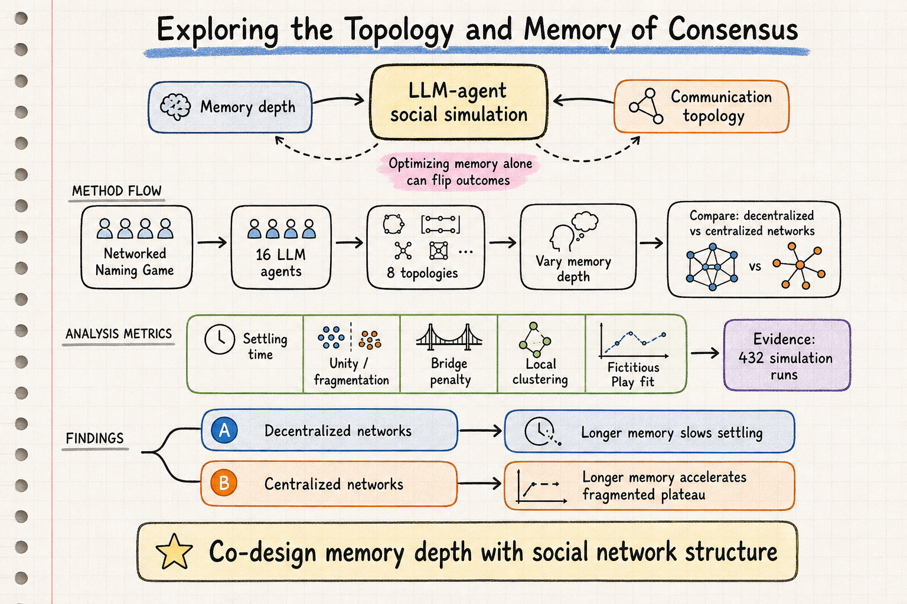

# Silicon Sampling / Social Simulation — 2026-06-08

## 1. Exploring the Topology and Memory of Consensus: How LLM Agents Agree, Fragment, or Settle When Forming Conventions

- **arXiv**: 2606.04197
- **Link**: https://arxiv.org/abs/2606.04197
- **Authors**: Aliakbar Mehdizadeh, Martin Hilbert
- **已讀來源**: arXiv HTML 全文

### 這篇在說什麼

這篇問的是 social simulation 裡一個很容易被拆開調參、但其實不能拆開看的問題：LLM agent 的「記憶深度」和「互動網路拓樸」到底如何共同影響共識形成？很多 silicon society / agent-based social simulation 會把 memory window 當成單純的能力參數：記得越多，理論上越能穩定互動、越能避免短視。但作者用 Naming Game 的 convention formation 場景指出，memory 的效果不是單調好壞，而是會被網路結構反轉。

核心結果很直覺也很危險：在去中心化網路中，較長記憶會讓系統比較慢進入穩態；但在中心化或局部聚集較強的網路中，較長記憶反而讓系統更快 settled。不過這裡的「更快」不是達成全域共識，而是更快鎖進 fragmented plateau，也就是多個 convention 並存、局部區塊各自穩定的狀態。換句話說，若研究者只看 settling speed，很可能把「快速固定分裂」誤讀成「快速達成協調」。

### 主要貢獻

1. **把記憶深度和網路拓樸做交互分析**：不是單獨比較 memory length，而是在八種固定 16-agent topology 上跑 432 次模擬，檢查同一個 memory 參數在不同社會結構中的符號是否改變。
2. **提出 speed–unity trade-off**：中心化網路比較能保留多個 competing conventions，但 settling speed 對 memory 非常敏感；去中心化網路則比較不容易快速鎖死在分裂狀態。
3. **把 agent-level network position 納入分析**：高 betweenness 的 bridge agents 反而承受 brokerage penalty；局部 clustered neighborhood 裡的 agent 有較高 coordination success。
4. **用行為模型解釋 LLM choice**：作者比較 Fictitious Play 和 Reinforcement Learning，發現 LLM agent 的 convention choice 比較接近 belief-based Fictitious Play，而不是單純 reward-based adaptation。

### 方法 / pipeline

研究場景是網路化 Naming Game：16 個 LLM agents 被放在八種固定網路拓樸中，拓樸分成 decentralized networks 和 centralized / locally clustered networks。每個 agent 在互動中選擇 convention，並根據自己可見的鄰居互動歷史更新下一步選擇。作者操弄 memory depth，觀察它如何改變全體系統到達 steady state 的速度、最後是否達成單一 convention、以及是否保留多個 convention。

pipeline 大致是：先定義八種 network structures → 針對每個拓樸和 memory 條件執行多輪 Naming Game simulation → 記錄 settling time、unity / fragmentation、agent-level success → 再用 network measures（例如 betweenness、local clustering）解釋個別 agent 的協調結果。最後，作者把 observed choices 對照兩種 canonical behavioral baselines：Fictitious Play 用過去對手選擇形成 belief，再選最大效用 convention；Reinforcement Learning 則用過去 reward 更新 action utility。這個比較讓論文不只是「LLM 模擬跑出某現象」，而是能回到社會學 / 行為賽局的可解釋機制。

### 實驗設計

- **模擬規模**：432 simulation runs。
- **agent / network**：每次 16 個 agent，八種固定 topology；上排偏 decentralized，下排偏 centralized 或有強 local clustering。
- **操弄變項**：memory depth × network topology。
- **主要指標**：time to steady state、是否達成 system-wide consensus、保留多少 competing conventions、agent-level coordination success。
- **行為模型比較**：Fictitious Play vs. Reinforcement Learning，使用 softmax / quantal response 形式把 utility 轉成 choice probability。
- **限制**：全文可確認 simulation design、主要結果與 baseline fitting，但 dataset/code 在文中寫的是 publication 後上 Zenodo / GitHub，目前還不是可以立即複現的 artifact。深讀時要特別檢查 prompt、模型版本、temperature、以及 memory depth 的具體設定是否足以支撐跨模型泛化。

### かに讀後判斷

這篇值得 Morris 點開，因為它把 silicon sampling / social simulation 裡常被忽略的「社會結構 × agent 記憶」交互作用講得很清楚。昨天的 Think-Before-Speak 是在 micro-level 補「沉默期間的內部評估」；今天這篇則在 meso-level 補「網路拓樸如何改變記憶效果」。兩者合起來看，會得到一個更完整的設計原則：不要只問 persona 是否真實、memory 是否更長、prompt 是否更像人；還要問互動結構會不會把這些 agent-level 設定放大成完全不同的 macro outcome。

如果要深讀，我會先看 Methods 裡八個拓樸的定義與 memory manipulation，再看 Results 裡 decentralized / centralized 的反向效果。尤其要注意作者對「faster settling」的重新詮釋：快不等於好，可能只是快一點進入分裂穩態。這對用 LLM agents 模擬輿論極化、規範形成或組織共識的人很重要，因為同樣一套 agent memory 設定，換一個互動網路就可能把結論翻轉。
