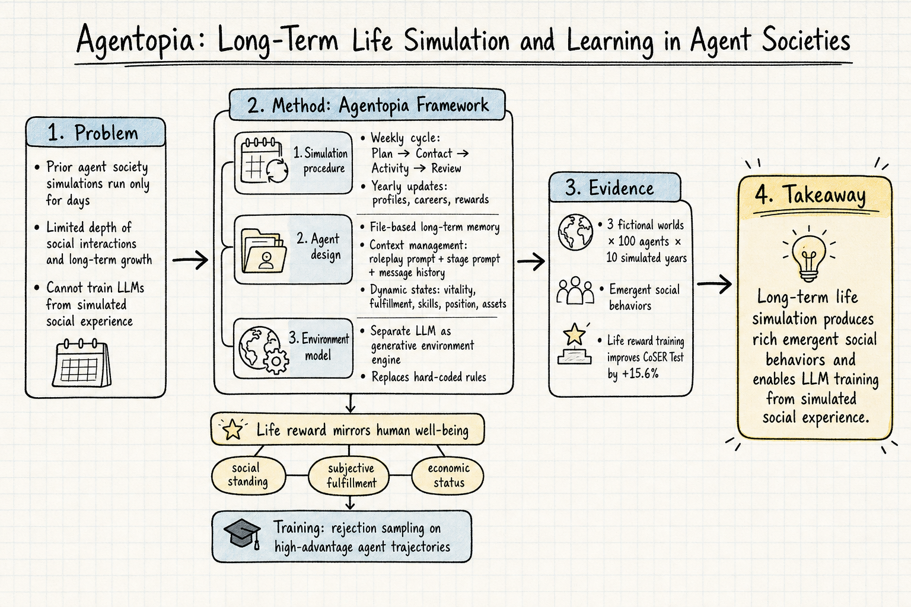

# Silicon Sampling / Social Simulation — 2026-06-10

## 1. Agentopia: Long-Term Life Simulation and Learning in Agent Societies

- **arXiv**: 2606.07513
- **Link**: https://arxiv.org/abs/2606.07513
- **Authors**: Xintao Wang, Sirui Zheng, Hongqiu Wu, Weiyuan Li, Jen-tse Huang, et al.
- **類型**: arXiv preprint (cs.CL), 79 pages, 19 figures

### 這篇在說什麼

人類從社會生活中學習——這是社會科學的基本洞見。Agentopia 問了一個直接但深遠的問題：LLM agent 能不能也從模擬的社會經驗中學到東西？之前的 agent society 模擬（Generative Agents、Aivilization 等）大多只跑到「天」的尺度，agent 的社會互動深度受限，更別提從中訓練模型。Agentopia 把模擬時間拉到 **10 個模擬年**，讓 100 個 agent 在三個虛構世界中經歷長期的職業發展、關係建立、經濟活動，並用這些經驗產生的 life reward 透過 rejection sampling 來訓練 LLM，讓模型在角色扮演基準上獲得 +15.6% 的提升。這篇填補了「短期社會模擬→長期生命模擬」的空白，也把 silicon sampling 的討論從「能不能模擬意見」推進到「能不能從模擬的社會生活中學到人類般的行為模式」。

### 主要貢獻

1. **首個年到十年尺度的 agent society 模擬框架**：Agentopia 把模擬時間從 Generative Agents 的兩天拉到十年，讓 agent 有時間發展職業、建立深層關係、經歷經濟起伏。這是時間規模上的數量級突破。
2. **Life reward 定義與 life reward training**：把人類幸福感的多維度概念（社會地位、主觀滿足、經濟狀態）轉化為可計算的 reward，然後用 rejection sampling 訓練 LLM。不需人類標注資料，模擬本身既是環境也是資料來源。
3. **Environment model 取代硬編碼規則**：用一個獨立的 LLM 當環境引擎，驗證 agent 行為、提供反饋、生成事件，避免了 Aivilization 那種大量硬編碼的低階操作。

### 方法 / pipeline

Agentopia 的設計圍繞三個核心：

1. **模擬程序**：以「週」為基本時間單位，每週四個階段——Plan（規劃本週目標）、Contact（聯絡他人安排行程）、Activity（執行個人或群體活動）、Review（回顧本週經歷）。以「年」為大循環，每年結束時更新 agent profile、開放職業申請、計算 life reward。
2. **Agent 設計**：每個 agent 有 profile（背景故事、人格特質、天賦）、social relationships（完全透過 inter-character memory 表示，不另存關係圖）、dynamic states（vitality、fulfillment、skills、position、assets）。Context management 分三層：roleplay prompt（角色基底 + 短期日記 + 長期記憶摘要）、stage prompt（各階段特定指令）、message history（多輪對話累積）。Memory files 是檔案系統形式的長期記憶，agent 自主決定讀、寫、刪除，分為 general.txt、characters/、others/ 三類。
3. **Environment model**：一個獨立 LLM 作為環境引擎，負責驗證 agent 回應是否符合角色設定、提供活動反饋、生成和排程事件。這取代了硬編碼的規則系統，使模擬更具彈性。

Life reward 的設計參考 Maslow 需求層次和享樂適應理論，由社會地位、主觀滿足、經濟狀態三個維度組成。訓練時，從模擬中收集 high-advantage 的 agent 軌跡，用 rejection sampling 微調底層 LLM。

### 實驗設計

- **三個虛構世界**，每個 100 個 agent，模擬 10 年。
- **行為分析**：觀察到豐富的湧現社會行為——職業流動、收入不平等、社交網絡演化、親密關係形成。
- **模型比較**：在 Agentopia 競技場中比較不同 LLM 的表現。
- **Life reward training**：在 CoSER Test 上獲得 +15.6% 的角色扮演性能提升，在模擬中 well-being 指標也有改善。
- **Case studies**：多個表格記錄了具體的湧現行為案例，如「agent 自發組織互助小組」「低收入 agent 在第七年突然找到高薪工作」等。

目前從全文 HTML 能確認方法與實驗的完整細節；case study 部分有 19 個附錄表格。reward 設計的細節（fulfillment 具體計算方式、environment model 的 prompt 細節）在附錄 B 中。

### かに讀後判斷

Agentopia 是目前 silicon sampling / social simulation 領域最具野心的工作之一。它直接回答了「長期社會模擬能產生什麼」這個基本問題，而且答案是正面的：agent 確實能在十年模擬中展現豐富的社會行為，而這些行為可以用來訓練更好的模型。和之前的 Generative Agents（25 agent、2 天）或 Aivilization（低階操作為主）相比，Agentopia 在時間尺度、社會互動深度、和「學以致用」三個維度上都跨了一大步。

值得深讀的部分：
- §3.2 模擬程序的週/年結構設計
- §4 life reward 的具體公式與 rejection sampling 流程
- 附錄中的 case study 表格（Tables 22–34），看湧現行為的質性描述
- 和 CoSER baseline 的比較細節

潛在疑慮：life reward 是否真的捕捉到人類幸福感的關鍵維度？rejection sampling 的資料效率如何？十年模擬的計算成本是多少？這些需要深讀附錄才能判斷。

**→ 今日推薦點開**

