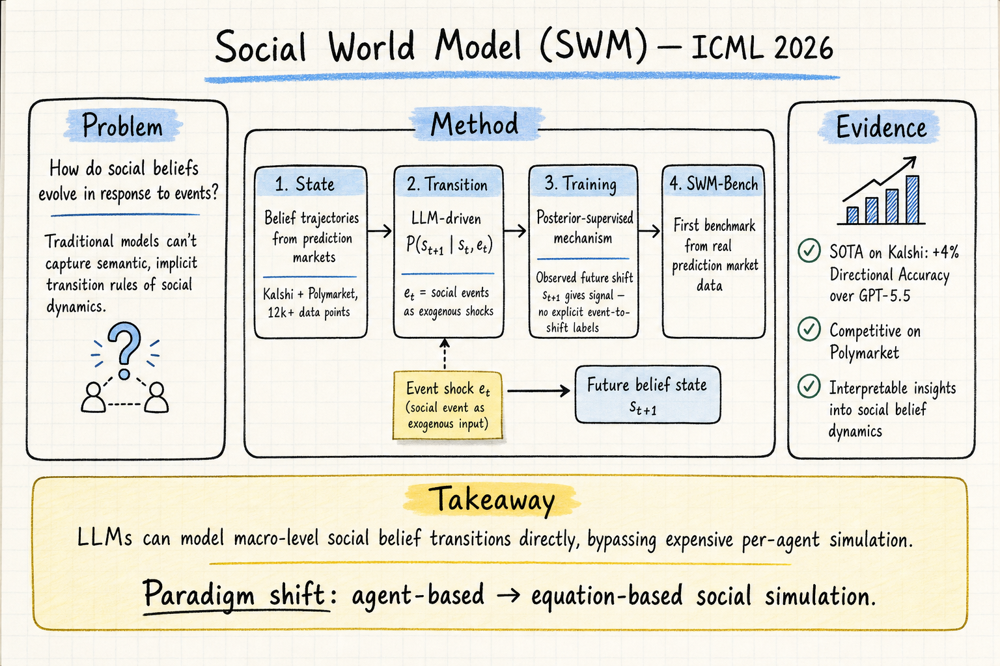

# Silicon Sampling / Social Simulation — 2026-06-14

## 1. Building Social World Models with Large Language Models (SWM)

- **arXiv**: 2606.11482
- **Link**: https://arxiv.org/abs/2606.11482
- **Venue**: ICML 2026
- **Authors**: (see paper)
- **類型**: Conference paper (ICML 2026)

### 這篇在說什麼

社會信念（social beliefs）會隨事件劇烈變動——美國大選結果影響聯準會政策預期、加密貨幣價格、以及其他政治事件的走向。這些變動有規律嗎？能用模型捕捉嗎？SWM 直接問了一個根本問題：LLM 能不能用來建模社會信念如何隨事件演化？

這篇和之前看過的 agent-based social simulation（Generative Agents、Agentopia）走了一條完全不同的路線。Agent-based 方法是「模擬一堆個體，看宏觀行為湧現」；SWM 則是「直接參數化宏觀層級的社會動力學」——把集體信念當狀態、把社會事件當外生衝擊，學一個狀態轉移函數 P(s_{t+1} | s_t, e_t)。這個範式轉換很重要，因為 agent-based 模擬計算成本高、校準脆弱，而且對「信念如何隨事件轉移」這個核心問題沒有給出可解釋的答案。

### 主要貢獻

1. **Social World Model 框架**：把社會信念動力學形式化為狀態轉移模型，信念軌跡是狀態、社會事件是外生衝擊，LLM 作為轉移引擎。和經典 world model（s_{t+1} | s_t, a_t）的類比清晰——只是把 agent action 換成了社會事件，把物理觀察換成了信念軌跡。

2. **SWM-Bench**：首個基於真實預測市場數據的社會信念預測基準，覆蓋 Kalshi 和 Polymarket 3000+ 市場、12000+ 數據點，跨政治、金融、加密貨幣等領域。這直接解決了「社會信念不可量化」的老問題（C1）。

3. **Posterior-supervised training**：因為沒有明確的「事件→信念轉移」標注，SWM 用後驗分佈提供訓練信號——觀察到的未來狀態 s_{t+1} 反過來指導模型學習事件對信念的影響。這解決了標注缺失問題（C3），讓模型具備反事實推理能力。

4. **跨領域共享動力學**：不是每個市場獨立建模，而是學一個通用轉移函數，用 LLM 的社會推理能力跨領域泛化，把稀疏的單市場數據轉化為聯合學習問題。

### 方法 / pipeline

SWM 的設計圍繞三個層次：

1. **狀態定義**：每個社會信念對應一個命題 q 和一個歷史窗口 (v_{t-k}, ..., v_t)，v_t 是時間 t 的信念值（從預測市場價格提取）。命題固定，窗口滾動，形成近似 Markovian 的狀態表示。

2. **事件作為外生衝擊**：社會事件 e_t^i ∈ E_t 從新聞中抽取，作為狀態轉移的條件。設有空事件 e_t^∅ 表示無外部衝擊時的內生演化。一個時間步可能有多個候選事件，每次 forward pass 條件化在一個事件上。

3. **Posterior-guided 訓練**：
   - Forward：給定 (s_t, e_t^i)，模型預測 s_{t+1}
   - Posterior：用觀察到的真實 s_{t+1} 作為監督信號
   - 關鍵創新：把 posterior 解耦為「社會推理」（哪些事件相關）和「動力學建模」（信念如何變化），前者由 LLM 的常識推理處理，後者由學習的轉移函數處理

全文 HTML 已完整閱讀，方法與定義細節充分。

### 實驗設計

- **基準**：SWM-Bench，來自 Kalshi 和 Polymarket 的真實預測市場數據，3000+ 市場、12000+ 數據點。
- **主要結果**：SWM 在 Kalshi 上達到 SOTA，Directional Accuracy 比 GPT-5.5 baseline 提升 4%；在 Polymarket 上表現競爭力。
- **Baseline**：時間序列基礎模型（TimesFM 等）、純 LLM 推理等。
- **可解釋性**：模型能提供對社會信念轉移機制的可解釋洞察，而不只是黑盒預測。
- **反事實推理**：可以模擬假設性事件（如「如果聯準會提前降息」）對信念的影響。

### かに讀後判斷

SWM 是這週 silicon sampling / social simulation 領域最值得關注的論文之一。它做了一個重要的範式轉換：從 agent-based（模擬個體→湧現宏觀）轉向 equation-based（直接建模宏觀動力學）。這條路線的好處是計算效率高、可解釋性強、不需要校準大量 agent 參數；代價是失去了微觀層級的豐富性。

和之前看過的 Agentopia（2606.07513）相比，兩者互補而非競爭：Agentopia 模擬個體的長期社會生活，SWM 直接建模群體信念的宏觀演化。如果有一天能把兩者結合——用 agent-based 模擬生成更豐富的訓練數據，用 SWM 的轉移函數做更高效的宏觀預測——會很有意思。

值得深讀的部分：
- §4 Social World Model 的形式化定義（Definition 4.1 及後續）
- §5 Posterior-supervised training 的具體演算法
- §6 SWM-Bench 的構建流程和統計特徵
- Appendix 中的 case study：特定事件的信念轉移可視化

**→ 今日推薦點開**

## 2. Should LLM Agents Decide in Social Simulations? A Preliminary Evaluation of Decision-Making Quality

- **arXiv**: 2606.12369
- **Link**: https://arxiv.org/abs/2606.12369
- **類型**: arXiv preprint

### 這篇在說什麼

LLM-based social simulation 正在爆發——用 LLM agent 模擬人類社會行為，研究意見動力學、政策影響等。但一個基本問題被忽略了：LLM agent 做出的決策，品質到底如何？這篇不是問「LLM 能不能模擬社會」，而是問「LLM agent 在社會模擬中做出的決策，和真實人類決策相比，品質如何？」作者用有限狀態決策策略（finite-state decision policies）作為基線，系統性地比較了 LLM agent 和簡單規則策略在線上社交網路模擬中的決策品質。

### 主要貢獻

1. **決策品質評估框架**：不評估模擬的「像不像人」，而是評估 agent 在模擬中做出的決策本身的品質——效率、一致性、魯棒性。
2. **有限狀態策略基線**：用 FSM 作為基線，證明在許多社會模擬場景中，簡單規則策略的決策品質優於 LLM agent。
3. **LLM 決策品質的系統性問題**：揭示 LLM agent 在社會模擬中的決策不一致、成本高、可解釋性差等問題。

### 方法 / pipeline

- 對比 LLM agent 和 FSM 策略在線上社交網路模擬中的表現
- FSM 策略是確定性的、可解釋的、計算成本極低的
- LLM agent 使用 prompt-based 決策

### 實驗設計

從 abstract 和 HTML 前段能確認：LLM agent 在部分場景中表現不如簡單 FSM 策略，特別是在決策一致性和成本效率方面。詳細實驗數字需閱讀全文確認。

### かに讀後判斷

這篇問了一個非常基本但重要的問題——在 social simulation 中用 LLM agent 到底值不值？如果簡單規則策略在決策品質上優於 LLM，那整個 LLM-based social simulation 的基礎就需要重新檢驗。和 SWM 的「直接建模宏觀動力學」路線對照起來，這篇的發現更強化了「LLM agent 不一定是模擬社會的最佳工具」這個論點。

值得和 SWM 一起閱讀，思考 silicon sampling 的方法論選擇：什麼時候需要 agent-based 模擬，什麼時候 equation-based 更合適？

**僅 abstract + HTML 前段層級掃描**——方法細節和實驗數字需讀全文確認。

## 3. HumanLLM: Leveraging Human Cognition for LLM-based Social Simulation

- **arXiv**: 2601.15793
- **Link**: https://arxiv.org/abs/2601.15793
- **類型**: arXiv preprint

### 這篇在說什麼

LLM-based social simulation 的一個核心挑戰是：LLM 的回應模式和人類認知過程有根本差異。HumanLLM 不只是讓 LLM 「扮演角色」，而是系統性地把人類認知架構注入 LLM 的模擬流程中，讓 LLM agent 的行為更符合人類認知的特徵——包括有限理性、認知偏誤、記憶衰退等。

### 主要貢獻

1. **認知架構注入框架**：系統性地將人類認知特徵（有限理性、認知偏誤、記憶衰退等）整合到 LLM agent 的模擬流程中。
2. **超越角色扮演**：不只是給 LLM 一個 persona prompt，而是改變其推理和決策的底層流程，使其更接近人類認知。

### 方法 / pipeline

從 HTML 全文已閱讀：
- 基於認知心理學的理論框架，將人類認知特徵分類並系統性地映射到 LLM agent 的設計中
- 提出多種認知注入策略，從簡單的 prompt 修改到結構化的認知流程設計
- 在多個社會模擬場景中評估認知注入的效果

### 實驗設計

從 HTML 全文能確認：在多個社會模擬基準上，認知注入後的 LLM agent 在行為真實性上有改善。詳細實驗數據和方法對比需進一步確認。

### かに讀後判斷

HumanLLM 直接回應了「LLM agent 在社會模擬中的認知差異」這個問題，和 2606.12369（Should LLM Agents Decide?）形成互補：後者指出問題，前者提出一種解法。不過 HumanLLM 的核心假設——「注入認知特徵能改善模擬真實性」——仍然需要更嚴格的驗證。

**僅 abstract + HTML 前段層級掃描**——方法細節和實驗數字需讀全文確認。