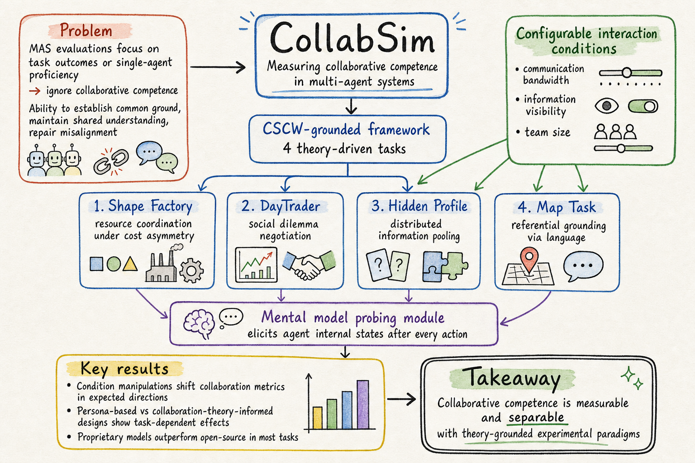

# Silicon Sampling / Social Simulation — 2026-06-15

## 1. EduMirror: Modeling Educational Social Dynamics with Value-driven Multi-agent Simulation

- **arXiv**: 2606.07948
- **Link**: https://arxiv.org/abs/2606.07948
- **Venue**: arXiv preprint (ICML 2026 submission track)
- **Authors**: Jiaju Chen, Bo Sun, Yuxuan Lu, Yun Wang, Dakuo Wang, Bingsheng Yao (Northeastern University, Microsoft Research Asia)
- **類型**: arXiv preprint, 20+ pages, 有開源代碼

### 這篇在說什麼

教育場域的社會動力學——校園霸凌、同伴合作、師生互動——長期以來只能用問卷調查和觀察法研究，而隨機對照試驗在學校場景中又受到嚴重的倫理限制。EduMirror 的核心洞察是：這些動態本質上是多 agent 系統的湧現行為，但傳統 ABM（agent-based modeling）用死板規則刻畫不出人類心理的細膩度，而單純 LLM agent 又缺乏心理學理論的約束——前者有結構沒靈活，後者有靈活沒結構。

EduMirror 的解法是把心理學理論（Social Value Orientation、心理需求理論）直接注入 LLM agent 的認知架構，讓模擬的 agent 不只是「扮演某個角色」，而是被內在心理需求驅動。這樣產生的社會動態更貼近現實，而且可以通過雙軌測量協議量化——既看得到可觀察行為，也量得到隱藏的心理狀態（自尊、同儕壓力等）。作者用校園霸凌和群體合作兩個案例驗證，證明 EduMirror 可以產生理論一致、可量化、可做反事實干預的教育社會動態。

### 主要貢獻

1. **Value-driven Agent 架構**：把 Social Value Orientation（SVO）和心理需求理論整合進 LLM agent，讓 agent 的行為由內在心理需求驅動，而不是只靠 persona prompt 外部規定。SVO 分配（合作型/競爭型/個人主義型）和心理需求（歸屬感、勝任感、自主性）一起決定 agent 的決策邏輯。

2. **雙軌測量協議**：同時量化可觀察行為（行動、對話、社會網路指標）和隱藏心理狀態（自尊、同儕壓力、歸屬感），後者通過 LLM Rater 和 Surveyor 在每個時間步 probe agent 的內在狀態。這解決了 social simulation 長期以來的「黑箱問題」——只知道 agent 做了什麼，不知道為什麼。

3. **可配置教育場景庫**：20+ 預建教育場景，涵蓋教室、宿舍、家庭等環境，每個場景都從理論出發設計（Social Comparison Theory 等），五步場景建構流程確保理論可追溯。

4. **反事實干預引擎**：支持平行模擬分支，可以做「如果引入反霸凌干預會怎樣」之類的對照實驗，這在教育研究中是倫理上不可能用真人做的。

### 方法 / pipeline

EduMirror 建構在 Concordia（Google DeepMind 的 agent simulation 框架）之上，整體架構四個模組：

**Agent Model Repository**：核心是 Value-driven Social Agent，認知架構包含：
- 心理需求層（歸屬感、勝任感、自主性）——這是行為的內在驅動力
- SVO 層（合作型/競爭型/個人主義型）——決定 agent 在利益衝突時的傾向
- 基線架構（iterative reasoning agent、context-conditioned agent）做對照

**Scenario Design**：五步流程——(1) 選擇理論基礎（如 Social Comparison Theory）→ (2) 解構核心構念 → (3) 配置 agent persona → (4) 用量表操作化 → (5) 建立雙軌測量協議。

**Simulation Engine**：Concordia 的 Game Master 管理場景設定、時間推進、敘事和規則執行。自然語言是主要互動媒介，這提供了靈活性和可擴展性。

**User Toolkits**：雙軌測量、比較視覺化、干預分支的平行時間線、log-to-comic 視覺化模組。

### 實驗設計

- **案例研究**：校園霸凌（旁觀者效應、干預策略）和群體合作（社會困境、獎勵結構）
- **系統級評估**：驗證 EduMirror 產生的社會動態是否理論一致、可測量、可做反事實對照
- **反事實分析**：在霸凌案例中引入不同干預策略（教師介入、同伴支持），比較結果差異
- 全文 HTML 已閱讀前半部分；實驗數字細節需讀 PDF 完整確認

### かに讀後判斷

EduMirror 是 EduMirror 和 CollabSim 兩篇一起出現在本週，都在把 social simulation 從「LLM 角色扮演」推向「理論驅動的可控實驗」。EduMirror 的核心差異化在於：

- **vs. Generative Agents / SOTOPIA**：後者讓 LLM agent 自由扮演角色，EduMirror 把心理學理論硬編碼進 agent 的決策流程。好處是理論可追溯、結果可對照；風險是理論約束可能限制湧現行為。
- **vs. CollabSim（今天的另一篇）**：CollabSim 關注的是 agent 的「協作能力」（能否建立共識、維護共享理解），EduMirror 關注的是「教育場域的社會動態」（霸凌、合作、身份認同）。兩者互補——CollabSim 是方法論導向，EduMirror 是應用場景導向。

對 Morris 來說，EduMirror 的價值在於它把「silicon sampling」這個想法從社會模擬的一般框架，具體落到了教育場域，並且提供了心理學理論的硬連結。如果你對教育研究中的 in silico 干預實驗有興趣，這篇值得深讀。

深讀時優先看：§3 Value-driven Agent 架構（心理需求和 SVO 如何注入）、§4 雙軌測量協議的具體實作、Appendix 的霸凌案例反事實分析。

## 2. CollabSim: A CSCW-Grounded Methodology for Investigating Collaborative Competence of LLM Agents through Controlled Multi-Agent Experiments

- **arXiv**: 2606.06399
- **Link**: https://arxiv.org/abs/2606.06399
- **Authors**: Jiaju Chen, Bo Sun, Yuxuan Lu, Yun Wang, Dakuo Wang, Bingsheng Yao (Northeastern University, Microsoft Research Asia)
- **類型**: arXiv preprint, 有開源代碼（https://github.com/neuhai/CollabSim）

### 這篇在說什麼

Multi-agent systems（MAS）的失敗，往往不是因為個別 agent 不夠聰明，而是因為 agent 之間協作出了問題——無法建立共識、丟失共享理解、無法修復對齊失敗。但現有的 MAS 評估只看任務結果或單一 agent 的推理/規劃/工具使用能力，完全忽略了「協作能力」這個過程層面的問題。

CollabSim 的核心洞察來自 CSCW（Computer-Supported Cooperative Work）研究：人類團隊在受限溝通條件下的協作問題，已經有幾十年的研究積累了。Bos et al. 的 Shape Factory、DayTrader，Stasser & Titus 的 Hidden Profile，Anderson et al. 的 Map Task——這些經典實驗設計精確地分離了協作能力的不同維度。CollabSim 把這些經典實驗移植到 LLM agent 上，建立了一套可配置、可控、可 probe 的模擬框架。

### 主要貢獻

1. **CSCW 理論接地的協作能力定義**：從 CSCW 文獻提煉出三個核心協作能力維度——建立共同理解（common ground）、維護共享任務理解（shared task understanding）、修復對齊失敗（misalignment repair）。這不是隨意定義的，而是有幾十年人機互動研究支撐的。

2. **四個理論接地的協作任務**：Shape Factory（資源協調與成本不對稱）、DayTrader（社會困境與個體/集體誘因衝突）、Hidden Profile（分散資訊整合與資訊不對稱）、Map Task（語言參照定位）。每個任務都精確控制了特定的協作挑戰。

3. **Mental Model Probing 模組**：在每個 agent 行動後，probe 其心理模型——對任務狀態的理解、對夥伴意圖的推測、對自己推理的報告。這讓研究不只看得到外顯行為，還看得到 agent 的內在狀態。

4. **可配置的互動條件**：溝通頻寬、資訊可見度、團隊規模等都可以系統性地操弄，讓研究者做真正的控制實驗。

### 方法 / pipeline

CollabSim 的架構分兩層：

**Interaction Layer**：定義 agent 如何感知任務環境。Agent Context Protocol 把共享任務狀態和私有狀態分開，通過資訊可見度規則控制每個 agent 能看到什麼。

**Control Layer**：實驗控制器管理配置、執行、評估。YAML 配置文件指定 agent 角色和 LLM 後端、互動條件、任務參數和 probing 問題。每個時間步，控制器構造觀察、獲取行動、驗證行動合法性、更新狀態、probe 心理模型。

四個任務的設計都來自 CSCW 經典實驗：
- **Shape Factory**（Bos et al., 2004）：玩家需要交換形狀來完成目標，但溝通受限，成本不對稱。測的是資源協調和共同理解的建立。
- **DayTrader**（Bos et al., 2002）：多人投資博弈，個體誘因和集體誘因衝突。測的是社會困境中的協商和信任。
- **Hidden Profile**（Stasser & Titus, 1985）：每個 agent 只有一部分資訊，需要整合才能做出最優決策。測的是資訊整合和共享理解的維護。
- **Map Task**（Anderson et al., 1991）：通過純語言溝通描述路線。測的是參照定位和溝通效率。

### 實驗設計

- **模型**：Qwen3.6-35B-A3B、Llama-4-Maverick-17B-128E-Instruct-FP8、GPT-5.5、Claude 4.6 Sonnet
- **Agent 設計**：Persona-based vs. Collaboration-Theory-Informed
- **核心發現**：
  - 條件操弄（溝通頻寬、資訊可見度）會如預期方向影響協作指標
  - 不同模型在協作能力上有系統性差異，Proprietary model 在大部分任務上優於開源模型
  - Agent 設計（persona vs. theory-informed）的效果取決於任務類型
  - Mental model probing 能有效捕捉 agent 的內在狀態
- 全文 HTML 已閱讀前半部分；實驗數據的完整 breakdown 需讀 PDF 確認

### かに讀後判斷

**→ 今日推薦點開**

CollabSim 做了一件很重要的事：把 social simulation 的方法論從「看結果」推向「看過程」。它的 CSCW 理論基礎讓它不是又一個隨意設計的 benchmark，而是有深厚學術傳統支撐的實驗框架。

和 EduMirror 的對照很有意思——同一個團隊的兩篇論文，一篇做教育場域的應用（EduMirror），一篇做協作能力的通用方法論（CollabSim）。如果 Morris 對 agent 協作的過程層面有興趣，CollabSim 的 probing 方法論值得深讀。

和之前看過的 SWM（2606.11482）的對照也很有價值：SWM 走 equation-based 路線直接建模宏觀信念動力學，CollabSim 走 agent-based 路線但加入了嚴格的實驗控制。兩條路線各有所長——SWM 擅長預測宏觀趨勢，CollabSim 擅長診斷協作失敗的微觀機制。

深讀時優先看：§3.3 Mental Model Probing 的具體設計、§4 四個任務的實驗結果、§5 Agent 設計的 cross-task 效應分析。

## 3. MASS: Deep Research for Social Sciences with Memory-Augmented Social Simulation

- **arXiv**: 2606.09198
- **Link**: https://arxiv.org/abs/2606.09198
- **Authors**: Yongrui Liu, Deyi Xiong (Tianjin University)
- **類型**: arXiv preprint, 有開源代碼（https://github.com/tjunlp-lab/MASS_DeepResearch）

### 這篇在說什麼

Deep Research agents（如 ChatGPT 的 Deep Research）在做社會科學研究時有一個根本問題：它們只能「檢索和綜合」已有的文獻，不能產生原創的經驗數據。社會科學的洞察來自理論和實踐的交互——光重新組合既有文本，產生不了真正的學術創新。

MASS 的解法很直接：既然社會科學需要經驗數據，那就先用 social simulation 產生「第一手」模擬數據，再把模擬結果當成經驗基礎來寫論文。這把 Deep Research 從「retrieve-and-generate」模式推進到「simulate-and-generate」模式。

### 主要貢獻

1. **MASS 範式**：把 Deep Research 的流程從「檢索→綜合→寫作」改為「規劃→模擬→分析→寫作」，社會模擬是核心創新模組。

2. **多學科行為數據集 + Ebbinghaus 遺忘曲線**：用多學科知識做 agent 記憶冷啟動，用 Ebbinghaus 遺忘曲線做結構性遺忘，確保模擬的認知連續性和真實性。

3. **動態目標規劃 + 社會規範約束**：多層社會規範約束 agent 的行為，讓模擬有研究導向而不是隨機漫遊。

4. **Stepwise Best-of-N (SW-BoN) 規劃策略**：在每個規劃步驟生成多個候選，用多 agent 投票機制選最優路徑，避免單路徑推理的誤差累積。

### 方法 / pipeline

MASS 的四個模組：
1. **Task Planning & Deep Reasoning**：SW-BoN 策略，每步生成 n 個候選、過濾低分候選、多 agent 投票選最優
2. **COT Execution & Tool Dispatching**：把規劃路徑轉為可執行步驟，包括檢索工具和社會模擬實驗
3. **Social Simulation Experiment**：核心創新——用 OOD protocol（Grimm et al., 2020）標準化實驗設計，動態目標規劃 + 社會規範約束 + Ebbinghaus 遺忘的記憶系統
4. **Structured Writing**：學術寫作模板和體裁規範

### 實驗設計

- 整體生成品質比基礎 LLM 提升 6.81%
- Insight 維度比強基線提升 17.19%
- 僅 abstract + HTML 前段層級快速掃描，具體實驗對比和消融分析需讀全文確認

### かに讀後判斷

MASS 是一個有趣的範式嘗試，但需要謹慎看待。把 social simulation 當成 Deep Research 的「經驗數據來源」這個想法有吸引力，但也有根本性問題：模擬數據不是真實數據，用模擬數據做社會科學的經驗基礎，等於把 LLM 的先驗假設又餵回給 LLM 自己——這是一個潛在的 echo chamber。

和 EduMirror、CollabSim 比起來，MASS 的理論基礎相對薄弱——EduMirror 有心理學理論約束、CollabSim 有 CSCW 實驗設計傳統，MASS 的社會模擬更多是工程化的（ODD protocol + 動態目標規劃），但對模擬結果和真實社會動態之間的對應關係論證不足。

不過作為「silicon sampling 用於自動化研究流程」的探索，MASS 提出了一個值得思考的方向：如果社會模擬可以產生有洞察力的假說，那 Deep Research 的流程確實不應該只依賴文獻檢索。

**僅 abstract + HTML 前段層級快速掃描**——方法細節、模擬真實性驗證、和 17.19% Insight 提升的具體分解需讀全文確認。