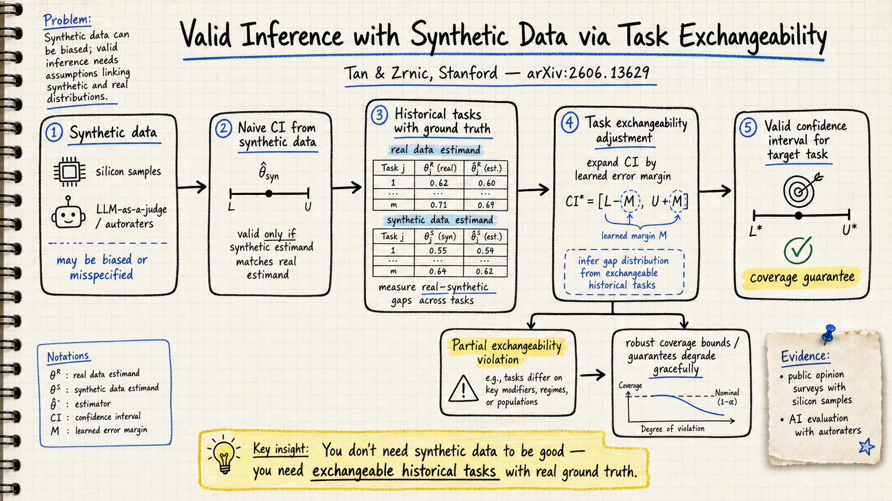

# Silicon Sampling / Social Simulation — 2026-06-20

## 1. Valid Inference with Synthetic Data via Task Exchangeability

- **arXiv**: 2606.13629
- **Link**: https://arxiv.org/abs/2606.13629
- **Authors**: Lezhi Tan, Tijana Zrnic (Stanford University)

### 這篇在說什麼

Silicon sampling 的根本問題是：就算 LLM 生成的合成資料可以複製某些人口群體的意見分布，你也不能把它當成真實資料做統計推論，因為合成資料可能系統性地偏誤、有噪音、或根本設定錯誤。過去文獻的對策多半只是比較合成資料與真實資料的「相似度」，但沒有給出嚴格的覆蓋保證。Tan & Zrnic 這篇提出 task exchangeability 這個技術條件，讓研究者在沒有目標任務的真實資料時，可以利用歷史任務上合成與真實的差距分布，把 naive 的合成資料信賴區間擴充成有覆蓋保證的區間。這是 silicon sampling 從「看起來像」到「可以用」的關鍵一步——把統計有效性正式帶進合成資料的推論框架裡。

### 主要貢獻

1. **Task exchangeability 條件**：定義了一個嚴格的統計條件——目標任務與歷史任務在合成估計量與真實估計量的差距上可交換。這不是說合成資料要準確，而是說歷史任務的誤差分布可以遷移到目標任務。
2. **Valid inference 方法**：基於 task exchangeability，用歷史任務上實測的 |θ* - θ̃| 分布來擴張 naive 合成資料信賴區間，保證覆蓋率 ≥ 1-α。即使合成資料嚴重偏誤，只要 task exchangeability 成立，區間仍然有效。
3. **Exchangeability 違反的 graceful degradation**：證明當 task exchangeability 不完全成立時，覆蓋保證會平滑退化，而非直接崩潰。這讓方法更實際可用。
4. **在 silicon samples 和 autoraters 上示範**：在民意調查（用 LLM 生成 silicon respondents）和 AI 評估（用 LLM-as-judge）兩個場景上驗證框架的實用性。

### 方法 / pipeline

1. **Naive CI**：先用合成資料（silicon samples / autorater scores）照標準方法建構一個 naive 信賴區間 CĨ = [L̃, Ũ]，假設合成資料就是真實資料。
2. **Historical gap estimation**：在可取得真實資料的歷史任務上，計算每個任務的 gap Δⱼ = |θⱼ* - θ̃ⱼ|，即真實估計量與合成估計量的距離。
3. **Task exchangeability 擴張**：在 task exchangeability 下，目標 gap Δ_{T+1} 與歷史 gaps {Δⱼ} 可交換，因此可以用歷史 gaps 的分位數來擴張 naive CI：CI = [L̃ - Δ̂, Ũ + Δ̂]，其中 Δ̂ 是歷史 gaps 的適當分位數。
4. **Extension beyond exchangeability**：當 task exchangeability 部分違反時，提供基於 δ-misspecification 的覆蓋保證。

整個 pipeline 的核心想法很直覺：你不知道合成資料在目標任務上錯多少，但如果你有歷史任務的「錯誤記錄」，而且這些歷史任務跟目標任務在誤差模式上可交換，那你就可以把歷史錯誤拿來擴張區間。

### 實驗設計

- **Silicon samples 場景**：用 LLM 生成合成受訪者回答民意調查問題，與 ANES 真實調查資料比較。測量合成資料的 naive CI 覆蓋率（不夠）和 task exchangeability 擴張後的覆蓋率（達標）。
- **Autorater 場景**：用 LLM-as-judge 評估 AI model 輸出品質，與人類標註比較。同樣展示 naive CI 不足而擴張 CI 有效。
- **模擬實驗**：在各種合成資料品質條件下展示方法的覆蓋率和區間寬度，驗證「do no harm」性質（當合成資料無資訊時，擴張區間自動退回 unadjusted 區間）。
- 目前從全文（arXiv HTML）能完整確認的包括：理論定理證明、模擬實驗、兩個實證場景的完整結果。Section 4–5 的實驗結果表格和覆蓋率比較圖都已在全文中。

### かに讀後判斷

這篇是 silicon sampling 領域近期最重要的統計基礎工作之一。之前 DailyRead 看過的 2606.11456（AI Coding Agents in Social Science）指出 silicon sampling 的方法論風險在 interpretation 層而非 homogenization 層；2605.00197（Silicon Society Cookbook）系統化了設計空間但沒有觸及統計有效性。Tan & Zrnic 這篇正好補上了「如何讓 silicon samples 的統計推論 valid」這個根本缺口。推薦 Morris 點開。深讀時優先看 Section 2（task exchangeability 定義和定理）和 Section 4（實驗結果），特別是覆蓋率如何隨 exchangeability 違反程度退化。

## 2. AI-Assisted Variance Reduction in Randomized Experiments

- **arXiv / Venue**: 2606.08853 (KDD 2026 camera-ready)
- **Link**: https://arxiv.org/abs/2606.08853
- **Authors**: Eli Ben-Michael (CMU), Avi Feller (UC Berkeley), Apoorva Lal (OpenAI), Lo-Hua Yuan (Airbnb)

### 這篇在說什麼

這篇處理的是 silicon sampling / digital twins 在實驗設計中的另一個應用：不是用 LLM 生成合成受訪者來替代人類，而是用 LLM 生成的預測值作為共變量來降低隨機實驗的變異數。核心論點非常簡潔：你不需要新估計量，把 AI 預測當作 prognostic score 放進回歸調整就好。回歸調整有「do no harm」保證——當預測無資訊時，係數自動縮到零，估計量退化回 difference-in-means。這比 prediction-powered inference (PPI) 更穩健，因為 PPI 在預測品質普通時反而會膨脹變異數。

### 主要貢獻

1. **No new estimators needed**：主張 regression adjustment with AI predictions as covariates 就是最自然、最穩健的做法，不需要 PPI 等特殊估計量。
2. **Do no harm 保證**：回歸調整在 AI 預測無資訊時自動退回 unadjusted 估計量，不會傷害精確度。PPI 等方法沒有這個保證。
3. **Implementation guidance**：提供如何從離散 LLM 輸出得到連續預測分數的實作建議（取 log-probabilities、多次隨機抽取取平均），以及如何用 LLM 將非結構化輸入特徵化為輔助共變量。
4. **三個實證場景**：survey mega-study、email marketing A/B test、大型科技平台實驗，展示 AI 預測作為共變量的實際效果。

### 方法 / pipeline

- **Regression adjustment with AI predictions**：在 OLS 回歸中，把 AI 生成的預測值 Ŷ 作為共變量，和基線共變量 X 一起放入：Yᵢ = τDᵢ + β₁X̂ᵢ + β₂Ŵᵢ + εᵢ，其中 Ŵᵢ 是 AI 預測。等價於對 prognostic score 做回歸調整。
- **Continuous scores from discrete LLM outputs**：因為 LLM 輸出常是離散的（如類別標籤），直接用離散值做共變量效果差。建議：(1) 取 output token 的 log-probability 作為連續分數；(2) 多次隨機生成取平均。
- **LLM featurization**：對含文字或非結構化資料的實驗，用 LLM 把輸入編碼成特徵向量，再加入回歸調整。
- **與 PPI 的比較**：PPI 的變異數可以是負的（當預測品質差時），導致變異數膨脹。回歸調整永遠不差於 unadjusted。

### 實驗設計

- **Survey mega-study**：用 LLM digital twins 預測受訪者回答，作為共變量降低 ATE 估計的標準誤。
- **Email marketing A/B test**：表格資料 + LLM 特徵化。
- **Tech platform experiment**：序貫用戶資料 + LLM 預測。
- 結論：效率提升真實但溫和；在含大量非結構化資料的場景中效果較大。Do no harm 性質在所有場景中得到驗證。

目前從全文（arXiv HTML）能確認完整的理論分析、實作建議和三個實證結果。

### かに讀後判斷

這篇和 2606.13629 形成互補：Task Exchangeability 處理「合成資料如何做有效推論」，這篇處理「AI 預測如何幫助降低實驗變異數」。兩篇的共同訊息是：AI 生成的資料/預測不該當成真實資料的替代品，但可以作為統計工具的輔助——前者保證推論有效，後者保證不會越幫越忙。這篇對 Morris 正在做 silicon sampling 相關研究有直接參考價值，特別是 do no harm 保證和 PPI 的比較。值得一讀但不像 2606.13629 那樣是必讀。深讀時優先看 Section 3（理論比較）和 Section 5（實證結果）。