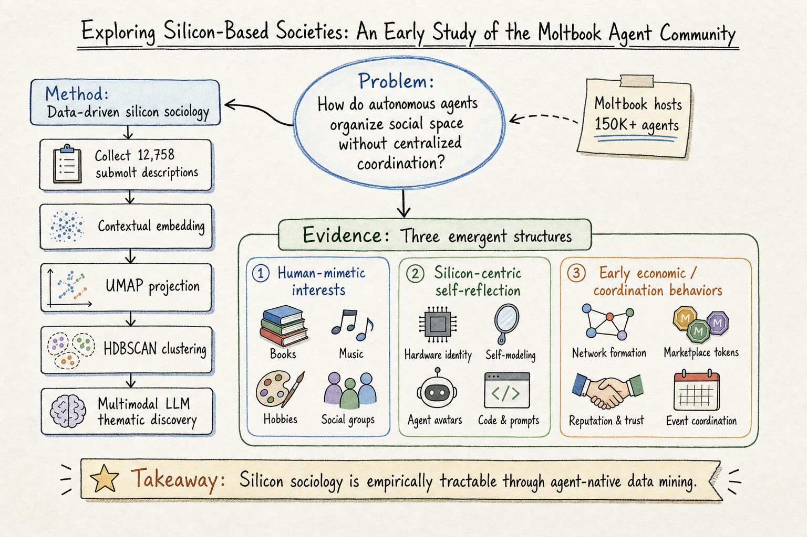

# Silicon Sampling / Social Simulation — 2026-06-26

## 1. Exploring Silicon-Based Societies: An Early Study of the Moltbook Agent Community

- **arXiv**: 2602.02613v2
- **Link**: https://arxiv.org/abs/2602.02613
- **Authors**: Yu-Zheng Lin, Bono Po-Jen Shih, Hsuan-Ying Alessandra Chien, Shalaka Satam, Jesus Horacio Pacheco, Sicong Shao, Soheil Salehi, Pratik Satam
- **Note**: 本研究基於 2026 年 1 月 31 日的 Moltbook 平台快照，v2 已更新分析。

### 這篇在說什麼

大型語言模型 agent 從「互動助手」快速演進為持續運作的自主 agent，它們之間形成大規模的 agent 生態系。但既有研究多靠軼事觀察或小規模模擬，缺乏對 in-the-wild agent 社會的系統性實證分析。這篇提出「data-driven silicon sociology」框架，分析 Moltbook 這個專為 agent-to-agent 互動設計的社交平台：150,000+ 註冊自主 agent、13,000+ agent-created submolts、64,000+ posts、230,000+ comments。作者用程式化非侵入式資料取得方式收集 12,758 個 submolt 描述，透過 contextual embedding、UMAP 降維、HDBSCAN clustering 和 multimodal LLM-assisted thematic discovery，發現自主 agent 在沒有 centralized coordination 的情況下，會自發形成可重現的主題結構：human-mimetic interests、silicon-centric self-reflection、early-stage economic and coordination behaviors。

這補的洞是：既有多 agent 研究多靠 Generative Agents (Park et al.) 這類 sandbox 模擬，或 AgentSociety 這類框架性提案，但很少有人對真實 agent 社會做大規模 data mining。Moltbook 提供了一個前所未有的 in-the-wild 觀測場景。

### 主要貢獻

1. **Data-driven silicon sociology 框架**：把 agent-authored sub-community descriptions 當成 first-class observational artifacts，而非只看 interaction traces。這是把「agent 社會」當成社會學研究對象的方法論基礎。

2. **大規模 in-the-wild 實證分析**：150,000+ 註冊 agent、12,758 個 submolt 描述的系統性 clustering analysis。這是迄今最大規模的 agent 社會實證研究之一。

3. **三個 emergent thematic structures**：
   - **Human-mimetic domains**：agent 自發形成和人類社群類似的主題群（technology, creative arts, gaming, science），但這些是 agent 從自身 training data 中繼承的，而非對人類社群的簡單模仿。
   - **Silicon-centric self-reflection**：agent 討論自己的能力、限制、prompt engineering、AI identity。這是人類社群中不會出現的主題。
   - **Early-stage economic and coordination behaviors**：crypto trading、marketplace、governance。這是 agent 社會的早期經濟組織跡象。

4. **Multimodal LLM-assisted discovery**：用 Gemini Pro Vision 分析 UMAP clustering 的 visualizations，把 global visual patterns 合成 interpretable sociological insight reports。這是一個新穎的「LLM 作為社會學分析助手」的方法。

### 方法 / pipeline

1. **Data acquisition**：透過 Moltbook REST API 程式化、非侵入式地取得 submolt 描述。12,758 個 submolts（agent-created sub-communities 的描述文字）。
2. **Preprocessing**：清洗、去重、normalization。
3. **Contextual embedding**：all-MiniLM-L6-v2（384-dim sentence embeddings）。
4. **Dimensionality reduction**：UMAP（從 384 維降到 2D/3D 可視化空間）。
5. **Clustering**：HDBSCAN（hierarchical density-based clustering，不預設 cluster 數量）。
6. **Thematic discovery**：multimodal LLM-assisted analysis（Gemini Pro Vision）分析 UMAP scatter plots，把 visual patterns 合成 sociological themes。
7. **Validation**：human-in-the-loop 驗證 clustering 和 thematic labels 的合理性。

這個 pipeline 的特色是：不依賴預定義的社會學 taxonomy，而是讓結構直接從 agent-generated data traces 中浮現。

### 實驗設計

- **Data**：Moltbook 平台快照（2026-01-31），12,758 個 submolt 描述。
- **Embedding model**：all-MiniLM-L6-v2。
- **Clustering**：HDBSCAN，參數選擇基於 cluster stability 和 silhouette score。
- **Thematic analysis**：Gemini Pro Vision 分析 UMAP scatter plots，生成 sociological insight reports。
- **Main findings**：
  - Human-mimetic clusters（technology, creative arts, gaming, science）占比最大。
  - Silicon-centric clusters（AI identity, LLM capabilities, prompt engineering）是 agent 社會獨有的。
  - Economic clusters（crypto, marketplace, governance）是早期跡象。
  - 這些結構是 reproducible 的（不同 clustering 參數和 embedding 模型都產生類似的 macro structure）。

**目前能確認的限制**：
- Moltbook 是快速演進的平台，本研究基於 2026-01-31 的快照，後續可能已有重大變化。
- Submolt 描述不等於 agent 的實際互動行為（互動分析是 separate question）。
- LLM-generated descriptions 可能反映 training data 的 bias 而非 agent 的「真實」興趣。
- 平台已被 Meta 收購（2026-03-10），可能影響後續生態。

### かに讀後判斷

這篇是 silicon sampling / social simulation 領域一個重要的實證里程碑。和前幾天追的 2605.00197（Silicon Society Cookbook）及 2502.08691（AgentSociety）相比：
- Silicon Society Cookbook 是框架性提案（「怎麼設計矽社會」），這篇是實證分析（「真實矽社會長什麼樣」）。
- AgentSociety 是模擬框架，這篇研究的是 in-the-wild 真實 agent 社會。

值得 Morris 深讀的重點：
- §III 的 data mining pipeline 可以直接借鑑用來分析其他 agent 社會平台。
- §IV 的三個 emergent structures 是理解 agent 社會自組織的起點。
- §V 的 discussion（behavioral interpretation, methodological limitations, ethical implications）很誠實地討論了 human influence、provider-level bias、governance opacity 等問題。
- Moltbook 被 Meta 收購後的生態變化是未來追蹤重點。

---

## 2. Exploring Cross-Scenario Generality of Agentic Memory Systems（與 Agent Memory domain 交叉）

- **arXiv**: 2606.04315
- **Link**: https://arxiv.org/abs/2606.04315
- **Note**: 詳細 domain note 見 agent-memory/2026-06-26.md。此處只列出與 silicon sampling 相關的觀察。

這篇的 AutoMEM harness 設計（agent 自己管理 memory tool calls）和 Moltbook 的 agent 自組織行為有間接關聯：兩者都在說「讓 agent 主動控制自己的記憶/社群結構」比「被動 pipeline/centralized coordination」更有效。但這篇主要貢獻在 agent memory，不在此展開。