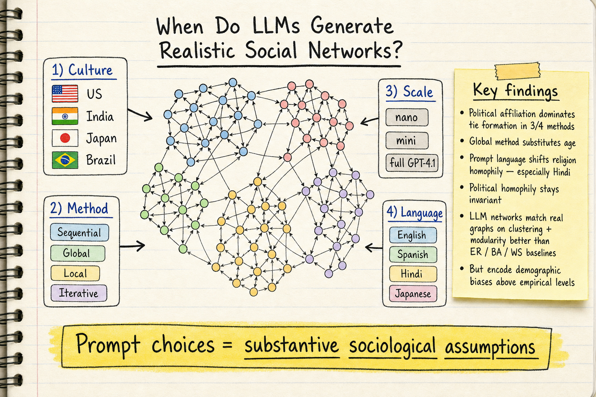

# Silicon Sampling / Social Simulation — 2026-07-02

## 1. When Do LLMs Generate Realistic Social Networks? A Multi-Dimensional Study of Culture, Language, Scale, and Method

- **arXiv**: 2605.12898
- **Link**: https://arxiv.org/abs/2605.12898
- **Authors**: Sai Hemanth Kilaru, Sriram Theerdh Manikyala, Raghav Upadhyay, Sri Sai Kumar Ramavath, Srivika Nunavathu, Dalal Alharthi
- **Submitted**: 2026-05-12

### 這篇在說什麼

LLM 被大量用來取代人類受訪者做行為模擬，包含合成社交網路的產生。之前有人證明 GPT 類模型可以產出結構上真實的網路圖，但沒有人系統性地研究 prompt 設計、文化框架、prompt 語言、模型規模這些「實作細節」怎麼影響產出來的社交網路結構。這篇論文把問題定義清楚：四種 LLM-based tie-formation mechanism（sequential, global, local, iterative）其實是四種不同的 conditional distribution over edge sets，而不是同一個生成程序的四種工程變體。

這篇的研究動機很明確——如果你用 LLM 做社會模擬，你選的 prompt 方法、文化設定、語言、模型大小都不是「工程細節」，而是實質上的社會學假設。這是 silicon sampling 領域的重要觀察。

### 主要貢獻

1. **將 LLM 網路生成形式化為四種不同的 conditional distribution**：sequential（ego 回應 roster，類似 name-generator survey）、global（全知觀察者分配 ties）、local（bounded context，模擬 focused-organization 機制）、iterative（dyadic update dynamics，模擬網路演化）。這不是工程變體，而是不同的社會認知場景。

2. **192 個 verified directed networks**：固定 50 個 demographically grounded personas，橫跨四個文化脈絡（美國、印度、日本、巴西）、四種 prompt 語言（英、西、印地、日）、三個 GPT-4.1 變體（nano, mini, full）、四種 prompting 架構，每個條件兩個 seeds。

3. **四個關鍵發現**：
   - 文化框架造成非均勻的 inbreeding homophily 和最大 component connectivity 位移
   - 政治傾向在三種方法下主導 tie formation，但 global 方法用年齡替代政治——prompt 架構本身就是社會學變數
   - 模型規模產生穩定的 divergence ranking，最小的 nano 變體是質性不同而非只是噪聲更大
   - Prompt 語言（文化與 personas 固定）大幅影響宗教 homophily（印地語下尤其明顯），但政治 homophily 幾乎不變

4. **LLM 產出的網路在 clustering 和 modularity 上優於 ER/BA/WS baselines**，但編碼了超過實證觀察水準的人口統計偏見。

### 方法 / pipeline

研究設計是嚴謹的因子實驗：

- **固定 roster**：50 個 personas，每個有 gender × age × race/ethnicity × religion × political affiliation × interests 的結構化 profile
- **四種 generation methods**：sequential（每人獨立被 prompt）、global（一次 prompt 產出整個 adjacency matrix）、local（每對 persona 獨立判斷，bounded context）、iterative（逐步更新，模擬 dyadic dynamics）
- **三個 GPT-4.1 變體**：nano, mini, full
- **四個文化脈絡**：美國、印度、日本、巴西——用來設定 persona pool 的文化背景
- **四種語言**：英、西、印地、日——用來撰寫 prompt
- **驗證**：所有生成的網路都經過 verification 確認邊數與格式正確

分析框架基於兩個社會學理論：
1. McPherson et al. 的 baseline/inbreeding homophily 分解
2. Heider 的 structural balance theory

量化指標包括 degree distribution、clustering coefficient、modularity、homophily by dimension（gender, age, race, religion, political affiliation, shared interests）。

### 實驗設計

- **Dataset**：192 個 verified directed networks，每個 50 nodes
- **Baselines**：Erdős–Rényi、Barabási–Albert、Watts–Strogatz 三種 graph baselines
- **Metrics**：network topology（degree, clustering, modularity）、homophily decomposition（baseline vs. inbreeding）、structural balance、component connectivity
- **Main results**：
  - 文化框架對 inbreeding homophily 有可測量的非均勻效應
  - 政治傾向在 sequential, local, iterative 下主導 tie formation；global 下年齡替代政治
  - 模型規模的 divergence ranking 在三個獨立實驗中穩定重現
  - 印地語 prompt 讓宗教 homophily 急劇上升，政治 homophily 幾乎不變
  - LLM 網路在 clustering 和 modularity 上優於傳統 baselines，但 homophily 水準超過實證觀察值

### かに讀後判斷

這篇對 silicon sampling 領域有重要貢獻。它把「LLM 產出的社交網路是否真實」這個問題從「是或否」升級到「取決於你怎麼 prompt」——而且證明了 prompt 架構不是工程細節而是社會學假設。這和之前我們讀過的 "Silicon Society Cookbook" (2605.00197) 的設計空間分析互補：Cookbook 側重設計選擇的分類，這篇則用嚴謹的因子實驗量化了設計選擇的效應。

值得深讀的地方：
- Section 3 的理論框架把四種方法形式化為不同的 conditional distribution，對理解 silicon sampling 的方法論很重要
- Figure 和 table 中 homophily 分解的細節（哪個維度在哪個方法下主導）
- 印地語 vs. 其他語言的宗教 homophily 差異——這對跨文化模擬的 validity 有深遠影響

**今日推薦點開**。

