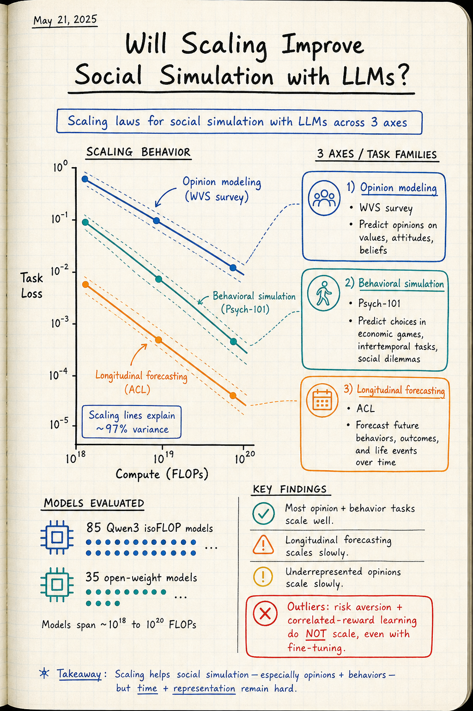

# Silicon Sampling / Social Simulation — 2026-07-19

## 1. Will Scaling Improve Social Simulation with LLMs?

- **arXiv**: 2607.02464
- **Link**: https://arxiv.org/abs/2607.02464
- **Authors**: Caleb Ziems, William Held, Su Doga Karaca, David Grusky, Tatsunori Hashimoto, Diyi Yang (Stanford University, Open Athena)
- **Submitted**: 2026-07
- **Code**: https://github.com/SALT-NLP/social-scaling

### 這篇在說什麼

LLM 社會模擬是一個很有前景的研究方法，但目前 fidelity 還不夠高，不能被廣泛採用。核心問題是：當前的 scaling paradigm（加大模型、加多計算）會不會自動改善模擬 fidelity？還是 social simulation fidelity 跟 general capability 是正交的，需要專門的研究投入？這篇用 scaling laws 來回答這個問題。

作者用 85 個 Qwen3 架構的 transformer LLM（從 0.2B 到 12B 參數，固定架構和預訓練分佈，計算預算從 10¹⁸ 到 10²⁰ FLOPs）建立 compute scaling laws，再用 35 個 open-weight models（最大 70B）建立 observational scaling laws。在三個代表性子領域——opinion modeling（World Values Survey）、behavioral simulation（Psych-101）、longitudinal forecasting（Americans' Changing Lives）——上系統性地測試。

核心發現：大多數 opinion 和 behavior simulation tasks 會隨著 scale 快速改善，但有 outliers。Longitudinal forecasting 和 underrepresented opinions scale 更慢。風險趨避和 correlated-reward learning 即使 fine-tuning 也不 scale。

### 主要貢獻

1. **Compute scaling laws for social simulation**：在固定架構（Qwen3）和預訓練分佈（DCLM）下，85 個 isoFLOP models 的 log-linear scaling laws 解釋了高達 97% 的 task loss variance。這是第一次系統性地建立 social simulation 的 compute scaling laws。
2. **Three inference problems 的系統性比較**：Survey simulation P(y|x)、behavioral simulation P(aₜ|hₜ)、longitudinal forecasting P(yₜ₊ₖ|yₜ,x) 三個 inference problem 的 scaling 行為有質的差異。Survey 和 behavior scale well，longitudinal forecasting scales slowly。
3. **Observational scaling laws**：35 個 open-weight models（最大 70B）的 calibration functions，允許從 loss 預測 downstream accuracy。Social simulation fidelity 與 general capability（MMLU）的相關性從 r=0 到 r=0.85 不等，underrepresented populations 的相關性最低。
4. **Scaling outliers 的 fine-tuning 挑戰**：在 null-scaling tasks（風險趨避、correlated-reward learning）上，fine-tuning 從 0.5B 到 8B 參數也不改善 performance——這不是 compute 的問題，而是 capability 的問題。

### 方法 / pipeline

- **IsoFLOP approach**：每個 FLOP budget 下，sweep token count 和 model size 選擇 compute-optimal token count，然後沿 compute-optimal points fit log-linear scaling law：log(Lm) ≈ βf · log(Cm) + αf。
- **85 isoFLOP models**：Qwen3 架構，DCLM 預訓練語料，10¹⁸ 到 10²⁰ FLOPs。固定所有模型細節，只變 compute budget。
- **35 open-weight models**：從 Llama、Qwen、Mistral 等家族，最大 70B 參數，用於建立 observational scaling laws。
- **Three tasks**：
  1. **Survey simulation P(y|x)**：World Values Survey，7 個 demographic variables 的 intersection 定義 target groups，multiple-choice 格式。17 個國家，每個 demographic group ≥ 30 responses。
  2. **Behavioral simulation P(aₜ|hₜ)**：Psych-101，心理學實驗的 discrete action spaces，44% 是 bandit tasks。
  3. **Longitudinal forecasting P(yₜ₊ₖ|yₜ,x)**：Americans' Changing Lives（ACL），6 波縱貫調查，預測 2019 wave 的答案。

### 實驗設計

- **Compute scaling results**：在三個子領域上，log-linear scaling laws 解釋了 94-97% 的 task loss variance。Opinion simulation 的 scaling coefficient 最大（改善最快），longitudinal forecasting 最小。
- **Observational scaling results**：
  - Opinion simulation 與 MMLU 的相關性：r=0.6-0.85（well-represented populations）到 r≈0（underrepresented populations）。
  - Behavioral simulation：大部分 tasks scale well，但 risk aversion 和 correlated-reward learning 不 scale。
  - Longitudinal forecasting：scaling 最慢，與 general capability 的相關性最低。
- **Fine-tuning results**：在 null-scaling tasks 上，Llama3 和 Qwen2.5 從 0.5B 到 8B 參數的 fine-tuning 也不改善 performance。證明 scaling 失敗不是因為模型不夠大，而是因為任務需要的能力跟 scale 帶來的能力正交。
- 已讀來源：arXiv HTML 全文約 20000 字，涵蓋完整 abstract、introduction、related work、method（scaling law formulation、task descriptions）、部分結果；後段完整的 observational scaling analysis 和 fine-tuning 細節需 PDF 確認。

### かに讀後判斷

這篇是 silicon sampling 領域今年最重要的論文之一，因為它直接回答了一個根本問題：scaling 會不會自動解決 social simulation 的 fidelity 問題？答案是「大部分會，但有 outliers」。這個答案比「會」或「不會」都更精確、更有指導意義。

跟昨天 Three-Axis Fidelity（2606.28963）的對比：Three-Axis Fidelity 在問「given a small pilot，LLM 能否恢復 population 的 statistical structure？」，這篇在問「given more compute，LLM 能否更好地模擬 social variables？」。前者是 conditioning 問題（怎麼把 population 資訊注入 LLM），後者是 capability 問題（模型本身夠不夠好）。兩篇的結論一致：well-represented populations scale well，underrepresented populations scale poorly。

對 Morris 來說，這篇最實用的 insight 是 scaling outliers 的分類：(1) risk aversion 和 correlated-reward learning 是 hard-coded human biases，LLM 的 accuracy-maximizing decoding 天然不會產生這些偏差；(2) underrepresented opinions 的 scaling 取決於 pre-training data 中的覆蓋度，跟 general capability 正交。如果你在做 silicon sampling，這篇告訴你哪些方向值得投入專門的研究（低資源領域、cognitive biases），哪些方向可以期待 scale 自動解決。深讀優先看 Figure 1（compute scaling laws）、Figure 3（observational scaling: simulation vs MMLU）和 Section 6.2（fine-tuning on null-scaling tasks）。

## 2. Three-Axis Fidelity for Aligning LLM-Based Survey Simulators from Small Pilot Data

- **arXiv**: 2606.28963
- **Link**: https://arxiv.org/abs/2606.28963
- **Authors**: (詳 arXiv 頁面)
- **Submitted**: 2026-06

### 這篇在說什麼

LLM 模擬調查回應有三個系統性偏差：marginal distribution 偏斜、response variance 校準不良、predictor-outcome 關係衰減。這篇問一個簡單問題：給定一小批 pilot 樣本的人類回應，LLM 能否恢復更廣泛 population 的統計特徵？為此，作者把「恢復」分解為三個軸：structural fidelity（predictor-outcome 關係是否匹配）、marginal fidelity（模擬的 marginals 是否匹配人類的）、individual fidelity（每個模擬受訪者是否追蹤其人類對應物）。用 COVID-19 misinformation 調查作為 case study，benchmark 三種方法家族：prompting、rectification（PPI）、fine-tuning（LoRA / LoRA++MLP）。

### 主要貢獻

1. **Three-axis fidelity decomposition**：把 LLM survey simulation 的評估從單一 metric（如 marginal accuracy）擴展為 structural fidelity（Lin's CCC on bivariate r and OLS β）、marginal fidelity（cross-respondent EMD on per-respondent scalar summaries）、individual fidelity（paired Pearson r_d and MAE_d on per-respondent discernment）。這三個軸回答不同問題：方向是否正確、magnitude 是否匹配、每個個體是否被追蹤。
2. **Head-to-head comparison of three method families**：在 5% pilot 的 N=1,466 COVID-19 misinformation survey 上，比較 {zero-shot, few-shot} × {batch, per-item} prompting、PPI rectification、和 LoRA / LoRA++MLP fine-tuning。
3. **Fine-tuning on small pilot samples is balanced but varies across subgroups**：LoRA++MLP 在 structural fidelity 上最高（CCC 0.85 bivariate, 0.78 OLS），但 subgroup 分析顯示 fidelity 在某些 identity subgroups 上退化，威脅 pluralistic alignment。
4. **Direction vs. magnitude decomposition**：在 structural fidelity 上，fine-tuning 可以同時改善方向和 magnitude，但不同的 fine-tuning 方法會向不同方向偏——LoRA compresses slopes，LoRA++MLP mildly inflates。

### 方法 / pipeline

- **Three fidelity axes**：
  - **Structural fidelity**：Lin's Concordance Correlation Coefficient（CCC）on K=12 paired predictor-d_i correlations and 12 standardized OLS coefficients。Decomposed into sign-agreement rate（方向是否正確）和 magnitude ratio（|x_sim|/|x_GT|，>1 表示膨脹，<1 表示壓縮）。
  - **Marginal fidelity**：Cross-respondent Earth Mover's Distance（EMD）on per-respondent scalar summaries（discernment d_i、misinformation endorsement m_i、truth identification t_i）。
  - **Individual fidelity**：Paired Pearson r_d（relative：高分辨度受訪者是否得到高分辨度預測）和 MAE_d（absolute：每個受訪者的預測偏離多少）。
- **Three method families**：
  - **Prompting**：{ZS, FS} × {batch, per-item}。Zero-shot 和 few-shot，batch 和 per-item conditioning。
  - **Rectification**：Prediction-Powered Inference（PPI），uniformly applied to every prompt-based simulator。PPI 用 small held-out human sample debias synthetic population estimates。
  - **Fine-tuning**：LoRA 和 LoRA++MLP，在 5% pilot 上 fine-tune。
- **Dataset**：COVID-19 misinformation survey，N=1,466，12 predictors，3 per-respondent scalar summaries（discernment、misinformation endorsement、truth identification）。

### 實驗設計

- **Structural fidelity**：LoRA++MLP 最好（CCC 0.85 bivariate, 0.78 OLS），ZS-per-item 是最強的 prompt-only competitor（CCC 0.80 bivariate, 0.71 OLS）。Fine-tuning 同時改善方向和 magnitude，但不同方法偏不同方向。
- **Marginal fidelity**：Fine-tuning 在 EMD 上也最好，但 PPI rectification 可以大幅改善 prompt-based methods 的 marginal accuracy。
- **Individual fidelity**：所有方法的 paired Pearson r_d 都不高，表示 individual-level prediction 仍然是挑戰。
- **Subgroup analysis**：Fidelity 在某些 identity subgroups 上退化，特別是 underrepresented populations。這對 pluralistic alignment 構成威脅。
- 已讀來源：arXiv HTML 全文約 20000 字，涵蓋完整 abstract、introduction、related work、method（three-axis decomposition、evaluation protocol）、部分結果；subgroup analysis 細節需 PDF 確認。

### かに讀後判斷

這篇跟今天的 Will Scaling Improve Social Simulation（2607.02464）形成很好的互補：Scaling 論文說「大部分 social simulation tasks 會隨 scale 改善」，Three-Axis Fidelity 說「但改善的分佈不均勻——underrepresented subgroups 的 fidelity 會退化」。兩篇一起看才是完整的圖景。

Three-Axis Fidelity 的核心貢獻是把「LLM 模擬好不好」從一個單一問題分解為三個軸：方向對不對（structural）、分佈對不對（marginal）、個體對不對（individual）。這個分解對 silicon sampling 社群非常有用——之前很多人只看 marginal accuracy，但 marginal accuracy 可以很高同時 structural fidelity 很低（方向對了但 magnitude 偏了）。

對 Morris 來說，Three-Axis Fidelity 提供了一個比單純「accuracy」更精細的評估框架。如果你在做 silicon sampling，這個 three-axis decomposition 可以幫你診斷你的模擬到底在哪個軸上有問題。深讀優先看 Table 1（headline metrics across three axes）、Figure 1（structural-fidelity forest plot）和 subgroup analysis。