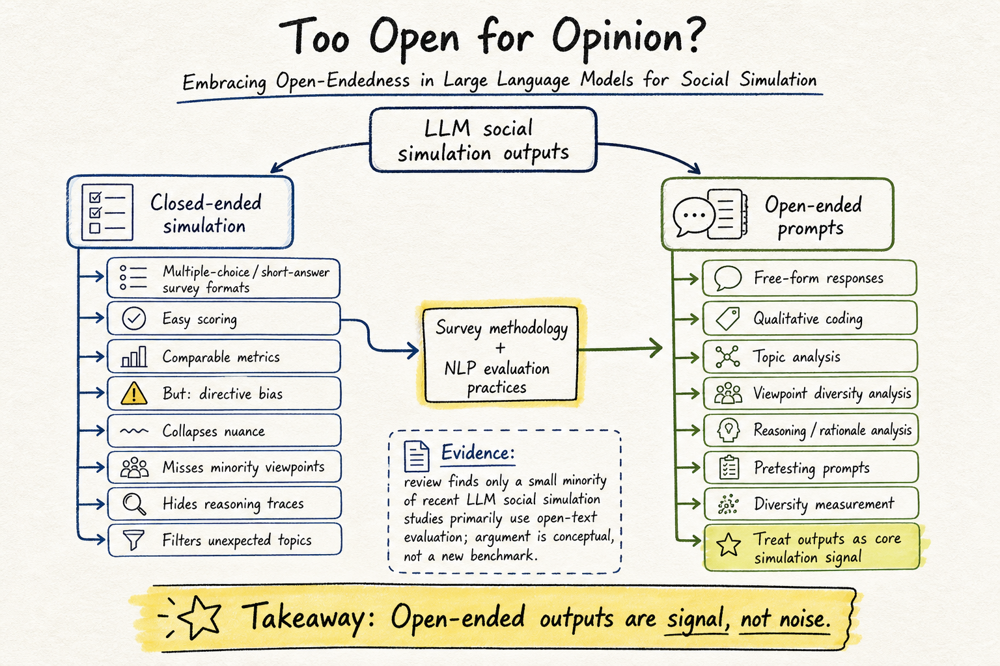

# Silicon Sampling / Social Simulation — 2026-07-20

## 1. Too Open for Opinion? Embracing Open-Endedness in Large Language Models for Social Simulation

- **arXiv / Venue / 類型**: arXiv:2510.13884；EACL 2026；position paper
- **Link**: https://arxiv.org/abs/2510.13884
- **查重**: `check_paper_seen.py 2510.13884` → `NOT_SEEN`
- **今日讀取來源**: arXiv abstract page 與 arXiv HTML v2 全文。

### 這篇在說什麼

這篇不是在做新的 generative-agent sandbox，也不是提出一個新的 silicon sampling benchmark，而是在問一個更上游的測量問題：如果 LLM social simulation 的目標是近似 public opinion、社會態度或人群反應，為什麼我們幾乎總是把 simulated agents 放進 multiple-choice 或短答格式？作者認為，這種 close-ended design 很方便，因為它讓比較、聚合與量化評分都變簡單；但它也會把 LLM 的 generative diversity 壓扁成研究者預先定義的選項，讓少數觀點、意外主題、推理過程、語氣差異與個體表達都消失。

作者把 social simulation 和 survey methodology 接起來。人類問卷研究長期知道 open-ended questions 有它的價值：它可以測量受訪者真正知道什麼、暴露研究者沒想到的分類、降低選項設計造成的 directive bias，也能用來 pretest 問題是否被誤解。這篇的主張是，LLM social simulation 不該只借用問卷的封閉題形式，也應該借用 open-ended survey 的分析方法，把自由文本當成社會模擬的核心訊號，而不是麻煩的雜訊。

### 主要貢獻

第一個貢獻是把「open-endedness」重新定位成 social simulation 的方法論問題。作者明確區分了 LLM 自回歸生成本身和任務設計上的開放性：即使模型都是生成 token，如果 prompt 要求它在 A/B/C/D 裡選一個，研究者仍然是在用封閉測量介面。真正的 open-ended simulation 是讓模型產生不被固定選項約束的自由文本，然後再分析其中的 topics、viewpoints 與 reasoning patterns。

第二個貢獻是整理 open-ended questions 在 survey methodology 中的八類價值，並映射到 LLM social simulation：measurement、exploration、design、directive bias、pretesting、engagement / expressiveness、individuality、methodological utility。這個 mapping 很有用，因為它讓「為什麼不要只做 multiple choice」不只是直覺抱怨，而是有社會科學測量傳統支撐。

第三個貢獻是把 NLP 和 social science 的工作流連起來。作者不是說開放文本就自然比較真實，而是指出需要新的 coding、topic modeling、qualitative analysis、reasoning analysis 與 evaluation practice，才能把自由文本的多樣性轉成可檢查的 social simulation evidence。

### 方法 / pipeline

這是一篇 position paper，所以 pipeline 不是模型訓練或 benchmark，而是一套研究設計建議。作者先描述目前 LLM social simulation 的典型流程：研究者建立 persona 或根據受訪者 profile conditioning 模型，讓它回答 survey-like questions，最後把輸出聚合成群體態度或行為預測。問題出在大多數流程把輸出限制在 closed-ended responses，或在生成後把回答 map 回預設 label。

作者提出的替代方向是把 open-ended prompts 放進 simulation loop。研究者可以讓 agent 用自然語言回答、解釋、敘事或補充理由，再用 social-science coding 與 NLP 方法把 free responses 轉成可分析資料。這裡的重要控制點不是「完全不量化」，而是先保留生成內容，再從內容中抽取 categories、主題、理由與少數觀點；這和先指定類別再逼 agent 選一個，對 simulation fidelity 的含義完全不同。

如果把它放回 silicon sampling 脈絡，這篇等於提醒我們：fidelity 不只在模型端，也在 measurement interface。前幾天的 scaling / cross-survey transfer / heterogeneity collapse 主要問模型是否能預測人類分布；這篇則問分布本身是否被題型設計壓縮過。兩者其實互補：如果輸出介面過度封閉，再大的模型也可能只是在學一個研究者預設的 opinion grid。

### 實驗設計

這篇沒有新的 controlled experiment，也沒有報一組模型在 benchmark 上的 main result。它的證據主要來自兩類材料：第一，對既有 LLM social simulation practice 的觀察與文獻整理；第二，survey methodology 與 NLP 中關於 open-ended question / free-form generation / qualitative coding 的方法論論證。

全文有提到對既有研究的 review：從相關 social simulation studies 中，只有少數包含 open-text component，更少數以 free-form output 作為主要 evaluation；這支持作者說目前社群仍偏好封閉題設計。不過，因為這不是實驗 paper，Morris 深讀時要注意它沒有直接證明「open-ended simulation 一定更準」。它比較像是在定義下一步應該如何設計 benchmark：要讓模型生成更開放的回答，同時建立可靠的 coding、比較與 validity check。

### かに讀後判斷

我覺得這篇值得 Morris 點開，尤其適合接在 `Will Scaling Improve Social Simulation with LLMs?` 和 `Silicon Sampling via Cross-Survey Transfer` 後面讀。前者問 scale 能不能提高 fidelity，後者問 cross-survey prediction 能不能變成更嚴格的 silicon sampling test；這篇則提醒：如果我們只用封閉題評估，可能永遠看不到模型在少數觀點、語境化理由與非預期議題上的 failure mode。

深讀時我會優先看 Introduction、Section 3 的 current practice limitation、Section 4 的 eight-dimension mapping，以及後面對 evaluation framework 的建議。它的限制也很明確：目前是 position paper，不是可直接拿來比較模型的 benchmark；因此最有價值的讀法不是找實驗數字，而是把它轉成 DailyRead 之後可用的 screening question：一篇 social simulation paper 的 output interface 是開放還是封閉？它如何處理 open-text diversity？它是否把個體差異當成訊號，而不是當成噪音清掉？
