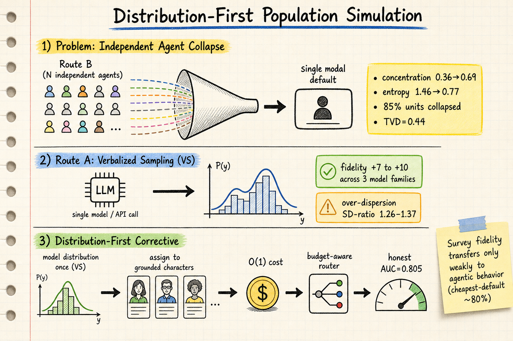

# Silicon Sampling / Social Simulation — 2026-07-25

## 1. Distribution-First Population Simulation: Collapse, Calibration, and Recall in Non-WEIRD LLM Persona Modeling (2607.18310)

- **arXiv**: 2607.18310
- **Link**: https://arxiv.org/abs/2607.18310
- **已讀來源**: arXiv HTML 全文（含方法、四個 Result sections、部分 ablation 和校正）

### 這篇在說什麼

Synthetic-population 工具越來越多地把每個人跑成獨立的 LLM agent，但這篇論文用 World Values Survey 的真實微數據（2,414 位土耳其受訪者）證明了這個範式有一個基本失敗模式：**獨立 agent 的選擇會崩塌到 modal default**。四個情境 × 五個 seeds 下，concentration 從 0.36 升到 0.69，entropy 從 1.46 降到 0.77，85% 的單位崩塌，TVD=0.44。崩塌不是隨機的——它是可預測的，嚴重度與情境結構相關（r=0.55 與 single-rational structure）。Verbalized Sampling (VS) 修正了 under-dispersion（fidelity +7 到 +10），但結構性地 over-disperse（SD-ratio 0.4-0.56 → 1.26-1.37）。論文的核心主張是 distribution-first：先建模分佈（用 VS），然後把分佈分配給 grounded characters，成本 O(1)。

### 主要貢獻

1. **獨立 agent 崩塌的量化證明**：用 WVS-7 土耳其數據，4 scenarios × 5 seeds，85% 單位崩塌，TVD=0.44。崩塌嚴重度與情境結構相關（r=0.55 與 single-rational）。這是 silicon sampling 文獻中對 independent-agent paradigm 最系統性的反證。
2. **Verbalized Sampling 的結構性 over-dispersion**：VS 在三個 model families（Qwen, GLM-5.2, Gemma-4-26B）上修正 under-dispersion，但 universal over-disperse（SD-ratio 1.26-1.37）。這是 VS 的結構性質，不是單一模型的怪癖。
3. **Survey fidelity 只弱轉移到 agentic behavior**：在 booking task 中，survey-calibrated persona 被 cheapest-default 主導（~80%），persona income 只作為弱調節（comfort choice 0%→7%→32% across income bands）。這質疑了「survey fidelity → agentic fidelity」的假設。
4. **Distribution-first corrective**：建模分佈一次（VS），分配給 grounded characters，O(1) 成本，budget-aware router 的 honest AUC=0.805。

### 方法 / pipeline

**PersonBench-TR**：從 WVS-7 土耳其 wave 的 2,414 位真實受訪者，為每人生成 deterministic character card（demographics, real value responses, computed features, first-person description）。77% 的 pool 有 unique value profile，繞過了 LLM-generated pools 的 mode-collapse。

**Deterministic verifier**：persona_verify 分數是確定性的（no seed），計算 TVD, KL, JS, Wasserstein-1 和 SD-ratio。Headline fidelity_score = 100·(1-TVD)。SD-ratio 從不混入單一數字——因為把 variance 埋進一個數字正是作者要批評的 masking。

**Construct validity**：用 LLM-free corruption suite 注入參數化扭曲到已知人類分佈，驗證 ruler 行為如 fidelity measure 預期（monotonic decrease across five corruption families）。

**Route A vs Route B**：
- Route A (VS)：一次 call 問模型整個分佈的機率，O(1) 成本
- Route B (Independent agents)：每個 grounded character 獨立做一次選擇，O(N) 成本

### 實驗設計

四個 Result sections：

1. **Result 1: Independent-Agent Populations Collapse, Predictably**：20 units (4 scenarios × 5 seeds)，Route B 的 concentration 顯著高於 Route A，entropy 顯著低於 Route A。崩塌嚴重度與 single-rational structure 相關（r=0.55），而非 binary collapse（r=0.26）。

2. **Result 2: VS Calibrates Across Three Families, But Over-Disperses Universally**：三個 model families 上 VS fidelity +6.8 到 +10.1，但 SD-ratio 從 0.40-0.56 跳到 1.26-1.37。KL-projection mean-preserving tilt 可以把 SD 拉到 1.11 同時提升 fidelity 2.1 points。

3. **Result 3: Survey Fidelity Transfers Only Weakly to Agentic Behavior**：booking task 中 cheapest-default ~80%，但 income 調節方向正確（0%→7%→32%）。一個 metric trap（flight duration confounded with price）差點讓兩個模型看起來 "context-blind"，但修正後兩個模型都能讀取 duration context。

4. **Result 4: Memorization and Recall**：placebo-controlled memorization attack 和 anonymized national-election backtest 顯示 VS 保持 aggregate strength，但 subgroup 和 individual claims 被 recall 和 underdetermination 污染。

### かに讀後判斷

**今日推薦點開**。這篇對 silicon sampling 領域有根本性的影響。核心發現不需要 realism claim——它量化的不是「silicon sampling 不像真人」，而是「獨立 agent 路線的內部不一致性」。這和之前讀的「LLM-Based Social Simulations Require a Boundary」(2506.19806) 直接互補：後者提出邊界條件，前者量化了邊界在哪裡。

VS 的結構性 over-dispersion 是一個重要發現：它意味著你不能只用 VS 來解決 under-dispersion，你需要一個校正步驟。Distribution-first corrective（先建模分佈再分配）是一個 elegant 的替代方案，但 honest AUC=0.805 意味著它不是萬能的。

和之前讀的「Mitigating Social Desirability Bias in Random Silicon Sampling」(2512.22725) 相比，這篇更根本：前者在修正 silicon sampling 的特定偏見，後者在質疑獨立 agent 範式本身是否可行。

深讀優先看 §4（collapse 的結構性分析）、§5（VS over-dispersion 的三個 model families 結果）、§8（distribution-first corrective）。

---

## 2. Formal Mechanisms for Market Stability in Self-Interested Agent Societies: A Marketplace Simulation Study (2607.08652)

- **arXiv**: 2607.08652
- **Link**: https://arxiv.org/abs/2607.08652
- **已讀來源**: arXiv abstract + landing page（僅 abstract 層級快速掃描）

### 這篇在說什麼

自利 agent 在不受約束下傾向於背叛，導致合作收益崩塌。這篇用 18 個 DeepSeek-V3 LLM agent 的市場模擬，探討什麼樣的正式機制可以在自利 agent 社會中維持市場穩定。兩個實驗階段：(1) 8 種機制條件下的比較（200 rounds），Mediation 表現最佳；(2) 對 Mediation 做 adversarial red-team，最強攻擊（v6）只讓 honest agent utility 降 13.3%，無法崩塌市場。Mediation 在持續對抗壓力下可以恢復——可以被彎曲但不能被打斷。

### 主要貢獻

1. **機制比較**：8 種條件下 progressive troll injection，Mediation 是最佳機制。
2. **Adversarial robustness**：對 Mediation 做迭代的 LLM-driven prompt-optimised troll 攻擊，最強攻擊只降 honest utility 13.3%。
3. **Adversarial robustness 定義**：機制在 optimized attack 下維持 positive honest-agent utility 的能力。

### 方法 / pipeline

18 個 LLM agent（DeepSeek-V3），互補的生產專長，在受限社交網路中交易。Troll agent 用迭代 prompt optimization 注入。

### 實驗設計

200 rounds，8 conditions，progressive troll injection。Adversarial red-team 使用 iteratively prompt-optimised LLM-driven trolls。目前只能從 abstract 確認核心發現。

### かに讀後判斷

這篇在 silicon sampling 領域的定位更偏向「multi-agent social simulation with formal mechanisms」。和之前讀的 PolicySim（市場模擬 + 政策優化）有相似的研究設計，但這篇更聚焦在機制的 robustness 而非優化。和 Distribution-First 論文互補：後者問的是「獨立 agent 能不能再現人口分佈」，前者問的是「自利 agent 社會能否維持穩定」——兩者都在質疑 LLM agent 模擬的基本假設，但從不同角度。

目前只讀到 abstract，需要全文確認機制設計的細節和 troll injection 的具體方式。