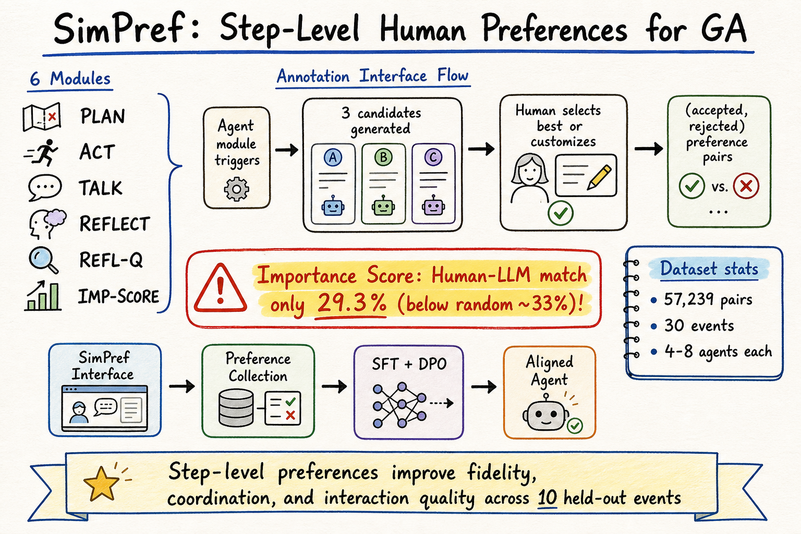

# Silicon Sampling / Social Simulation — 2026-07-26

## 1. SimPref: Step-Level Preference Learning for Generative Agents in Social Simulations

- **arXiv**: 2607.14485
- **Link**: https://arxiv.org/abs/2607.14485

### 這篇在說什麼

現有的 generative agent 社會模擬（如 Generative Agents、Project Sid）主要靠 architectural variants（加 needs、加 desires、加 values）來改善行為品質，但對 agent 中間決策步驟（planning、memory retrieval、reflection、action selection）的人類偏好監督非常稀缺，而且幾乎都是 trajectory-level 的粗粒度判斷。SimPref 提供了一個互動介面讓人類標註者在模擬過程中直接監督 agent 的每個 module output，收集了 57K 筆步級偏好對，並用 SFT + DPO 訓練 open-weight models。

### 主要貢獻

1. **SimPref 互動介面**：標註者控制 2-3 個 agent，在每個 module trigger 時看到完整的 decision context（observations、goal、retrieved memories、local state），然後從 3 個候選中選擇最佳或自訂回答。這是目前第一個 GA-style 的步級人類偏好收集系統。
2. **57K preference pairs 數據集**：橫跨 6 個 agent module（plan、act、talk、reflect、reflection question、importance score）、30 個社交事件。數據集將開源。
3. **步級偏好學習實驗**：SFT + DPO 在 open-weight LLMs 上，在 10 個 held-out 社交事件上持續改善 whole-trajectory metrics（simulation fidelity、coordination、interaction quality）。
4. **Human-LLM preference alignment 分析**：Reflection 和 Reflection Question 模組的人類-LLM 一致率最高（~50%），但 Importance Score 最低（29.3%），比隨機基線還低。這暗示 LLM 的「重要性判斷」和人類直覺有系統性偏差。

### 方法 / pipeline

SimPref 的框架有三部分：

1. **模擬介面**：標註者控制 2-3 個 agent，每個 module trigger 時看到和 LLM 一樣的 decision context。LLM 生成 3 個候選輸出，標註者選擇最佳或自訂。標註者判斷的標準是決策可行性、資訊一致性、時空適當性、是否推進 agent 的明確目標——而不是主觀社交品味。

2. **偏好收集 pipeline**：30 個社交事件，每個 4-8 個 agent，目標不同、partial observability。8 位軟體工程師標註 4 週。每個 trigger 的 decision context = (observations, goal, retrieved memories, local state)。候選排序隨機化防止位置偏差。

3. **偏好學習**：SFT on human-accepted outputs → DPO on (accepted, rejected) pairs。Module-conditioned backbone：πθ(y|x, k)，其中 k 是觸發的 module。

### 實驗設計

- 10 個 held-out 社交事件做 evaluation
- Metrics：simulation fidelity（和人類行為的相似度）、coordination（多 agent 協調）、interaction quality、time allocation
- 比較：base model vs. SFT vs. SFT+DPO
- 偏好學習後的 agent 在 time allocation 上更合理（不會過度集中在單一活動）
- Importance Score 模組的 human-LLM 一致率只有 29.3%，比隨機（~33%）還低——這是一個重要的發現

### かに讀後判斷

SimPref 填補了 silicon sampling 領域的一個重要缺口：我們有很多 trajectory-level 的評估，但幾乎沒有 step-level 的人類偏好數據。57K pairs 是目前最大的 GA-style 步級偏好數據集。

和前幾天收錄的 cross-survey transfer（2607.03091）和 scaling social simulation（2607.02464）的對照：cross-survey transfer 測的是 LLM 預測人類問卷答案的能力，SimPref 測的是 LLM 在模擬中做中間決策的能力。兩者都是 silicon sampling 的核心問題——LLM 能否忠實模擬人類行為——但切入點不同：前者看最終答案，後者看決策過程。

Importance Score 模組的 29.3% 一致率是一個值得深挖的發現：如果 LLM 連「什麼重要」都判斷不好，那整個 GA 架構的 memory retrieval 就是建立在有系統偏差的基礎上。深讀時看 Table 1 的 module 分佈、Appendix C 的事件設計原則、以及 preference learning 的 training details。