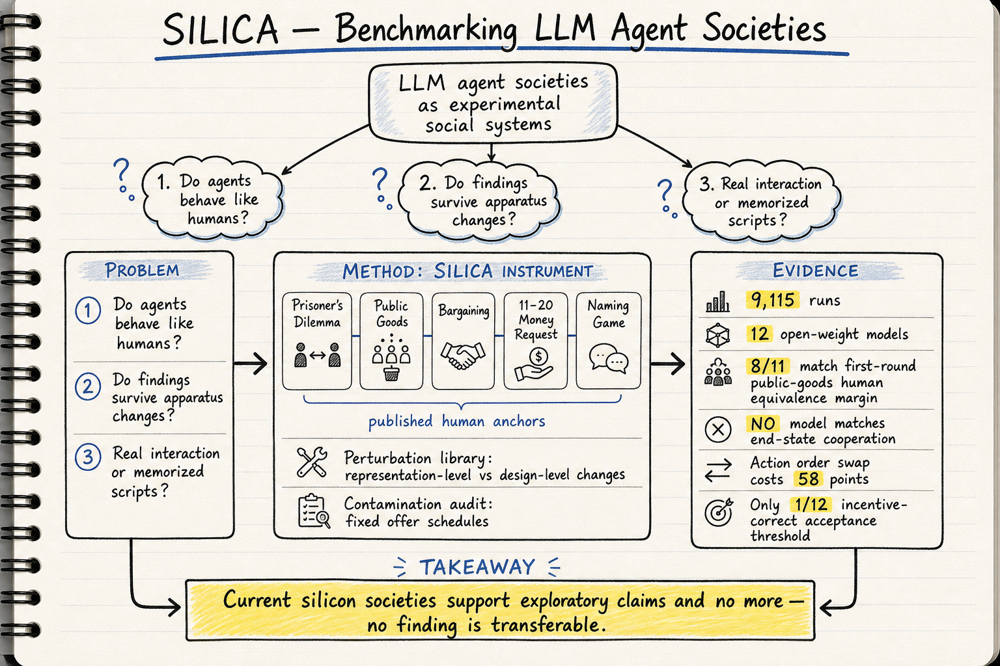

# Silicon Sampling / Social Simulation — 2026-09-01

## 1. Benchmarking Large Language Model Agent Societies Against Human Behavioural Distributions

- **arXiv**: 2608.28182
- **Link**: https://arxiv.org/abs/2608.28182
- **Authors**: Raad Bin Tareaf (XU Exponential University of Applied Sciences, Potsdam)
- **Submitted**: 2026-08-28

### 這篇在說什麼

這篇是 silicon sampling / social simulation 領域近期最重要的一篇實證基礎建設論文。問題很直接：目前用 LLM agent 群體做社會模擬的研究，到底有多少可信？三個疑問一直懸而未決——(1) 這些 agent 的行為和真人有多像？(2) 如果只改變實驗呈現方式但不改遊戲規則，結果會不會劇烈變化？(3) 看到的「社會動力學」到底是 agent 之間的互動，還是 LLM 只是在重現訓練資料裡背過的實驗劇本？之前這些質疑都停留在 position paper 層次，沒有可執行的測量工具。SILICA 就是作者建出來的那把尺。

### 主要貢獻

1. **SILICA 儀器**：一個開源、可重現的互動式多 agent 實驗框架，內建五個有人類基準資料的環境（重複囚徒困境、公共財與懲罰、議價電池、11–20 金錢請求遊戲、命名遊戲與少數派臨界點），每個都附有已發表的人類錨點數據，且這些錨點的來源作為資料公開而非僅斷言常數。

2. **擾動庫**：區分「重新呈現相同資訊」的改變（representation-level）和「改變內容」的改變（design-level）。design-level 改變在 111 個可比對比中有 56 個移動了行為；representation-level 在 71 個中有 8 個——大部分脆弱性來自內容變動，但少數不是：把 persona 從句子改成表格就能終止一個模型的慣例形成，單純調換兩個 action 的列出順序就讓另一個模型掉了 58 點合作率。

3. **污染稽核**：用固定出價排程辨識每個模型的接受函數，獨立於自身提議者剛好出什麼價。12 個模型中只有 1 個（唯一受過推理訓練的）把接受門檻放在激勵結構要求的位置；2 個部分移動、2 個移錯方向、3 個從未建立門檻。光看整體拒絕率分不出這些差異。

4. **自身機制宣稱的推翻**：命名遊戲裡慣例看起來是透過談判形成的——直到每個 agent 被展示自己亂序排列的同一名字池，之後協調雖然存活但耗時增為 1.5–2.5 倍，一個模型甚至直接停止可靠形成。這個發現是真的，但作者原本的解釋是錯的，而分離它們的操作來自 transcript 事後稽核，一開始不在擾動庫裡。

5. **分層認證協議**：在 9,115 次運行、12 個模型、跨越家族/規模/世代/推理訓練軸線後，結論是：目前 silicon society 只能支持探索性宣稱（exploratory claims），不能支持可轉移的發現。慣例形成是唯一 robust 的結果。

### 方法 / pipeline

SILICA 的設計圍繞四個研究問題（RQ1–RQ4）：

- **RQ1（忠實度）**：用等價檢定（equivalence test）對已發表人類錨點判斷 LLM agent 群體是否再現人類行為的水平和方向。注意這不是視覺相似性判斷，是統計等價。
- **RQ2（穩健性）**：對每個環境做系統性擾動，區分「重新呈現相同資訊」和「改變給 agent 的內容」兩類。大部分脆弱性是 content-driven，但 representation 層面的少數效應也值得注意。
- **RQ3（溯源/污染）**：改變已知實驗的支付結構，讓背過的答案不再是最佳選擇，看 agent 跟隨支付、跟隨記憶劇本、還是根本不反應。這用 fixed schedule of offers 做稽核。
- **RQ4（認證）**：綜合以上，定義分層認證標準（exploratory → robust → transferable），目前所有模型只到 exploratory。

五個環境涵蓋合作/衝突/慣例形成三大社會行為類型。12 個開放權重模型在單張消費級 GPU 上跑完。

### 實驗設計

- **環境**：5 個互動多 agent 環境，每個附有已發表人類基準資料。
- **模型**：12 個開放權重 LLM，涵蓋不同家族、規模、世代、推理訓練。
- **總運行數**：9,115 次。
- **核心發現**：
  - 首輪公共財貢獻：11 個模型中 8 個落入人類等價區間——但沒有任何模型匹配終態貢獻或人類合作走廊。
  - 命名遊戲：慣例透過名字的共享先驗形成而非談判，打亂先驗後談判才出現。
  - 議價：只有 1/12 模型（推理訓練型）正確建立接受門檻；5/12 從未建立或有誤。
  - 污染稽核：fixed offer schedule 揭露大多數模型並未依據激勵結構行動。
- **統計方法**：等價檢定而非視覺相似性比對；擾動庫做 sensitivity analysis。
- **缺失資訊**：目前從 HTML 全文已讀到 Section 2（Related Work）及 Section 1 的完整貢獻列表；Section 3（儀器規格與統計協議）和 Section 4（完整發現報告）的細節需進一步閱讀 PDF 確認具體 effect size 與信心區間。

### かに讀後判斷

**今日推薦點開**。這篇填補了 silicon sampling / social simulation 領域最關鍵的空白：之前大家質疑 LLM 社會模擬的有效性，但沒有可執行的驗證工具；SILICA 把三個質疑（fidelity、robustness、contamination）同時具體化為可重現的測量協議。和之前的「AI Agents Alone Are Not (Yet) Sufficient for Social Simulation」(2603.00113) 相比，SILICA 不是 position paper，而是實際跑出了 9,115 次實驗的實證結論——而且結論比 position paper 更嚴厲：不只「還不夠好」，而是「目前只配做探索性宣稱」。

深讀時優先看：
- Section 3：SILICA 儀器的完整規格與統計協議
- Section 4：五個環境的完整實驗結果，特別是每個模型在各 RQ 下的具體表現
- Table S7：和最接近的基準定位比較
- Fixed schedule of offers 的稽核設計：這是 contamination audit 的核心，值得仔細看它怎麼把「看起來合理但實際是背答案」和「真正依據激勵結構行動」區分開

另外值得注意的是作者推翻了自己最初的機制宣稱——這在模擬社會科學論文裡很少見，代表這個儀器的擾動設計有真實的糾錯能力。

---

## 2. UserHarness: Harnessing User Minds for Stronger Agent Theory-of-Mind

- **arXiv**: 2605.27721
- **Link**: https://arxiv.org/abs/2605.27721
- **Authors**: Cheng Qian, Jiayu Liu, Heng Ji (UIUC)
- **Submitted**: 2026-05-26

### 這篇在說什麼

這篇雖然主要歸在 harness engineering，但它的核心問題——agent 能不能理解使用者的心智狀態——是 silicon sampling 能否忠實模擬人類行為的前提。目前多數 ToM 方法要麼用更強的 prompting，要麼建複雜 pipeline 來間接建模行為，但都沒有顯式重建使用者心智狀態。UserHarness 把 ToM 推理重新框架為「使用者心智重建」問題，這和 SILICA 的 fidelity 質疑形成有趣的呼應：如果連單一使用者的信念/意圖都重建不好，整個社會模擬的忠實度可想而知。

### 主要貢獻

1. 把 ToM 解題從「直接預測答案」重框架為「顯式重建使用者心智」：追蹤使用者觀察到什麼、相信什麼、想做什麼、做了什麼。
2. 形式化使用者推理為 perception–belief–action loop，分離環境、觀察、信念、意圖、行動五個層次。
3. 跨五個 ToM 基準達 95.94% macro accuracy，相對改善超過 15%；且把不同模型家族的表現差距從 26.75 點壓到 3.65 點。

### 方法 / pipeline

UserHarness 是 inference-time 框架，不需訓練或修改底層模型。核心是 E_t → O_t^u → B_t^u → A_t^u → E_{t+1} 的迴圈：
- 使用者只看到環境的子集（觀察函數 Ω）
- 信念更新遵循規則約束（只有觀察到的才更新）
- 行動由信念+目標決定
- 社會場景需追蹤巢狀信念

### 實驗設計

- **基準**：5 個 ToM benchmark 涵蓋 false belief、nested belief、action prediction、goal inference、communication、social intention。
- **結果**：95.94% macro accuracy（主設定），相對 prompt baseline 改善 >15%，相對最強 prompt-only harness 改善 ~20%。
- **跨模型**：不同 backend 的表現差距從 26.75 降到 3.65 點，每個都 >92%。
- **限制**：目前只在 ToM benchmark 上驗證，尚未測試互動式多 agent 社會模擬場景。

### かに讀後判斷

值得收藏但非今日推薦。UserHarness 的貢獻在於證明了「顯式心智重建」比更強的 prompting 有效，但它的場景是靜態故事理解，不是互動社會模擬。對 silicon sampling 的意義是概念性的：它提示了未來若要讓 agent 群體忠實模擬人類，可能需要在每個 agent 內建類似的 belief-tracking。但這會大幅增加計算成本和實作複雜度，目前沒有人這麼做。